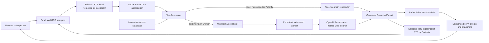

# Architecture

This document describes the implemented v0.1 runtime. The reviewed development
plan records how the design evolved; this page is the stable current-state
reference.

## Runtime ownership

| Lifetime | Owner | Responsibilities |
| --- | --- | --- |
| Python process | `SessionHost` | Authoritative session state, connection arbiter, worker registry, coordinator, result history, and one `WorkerRunner` |
| Python process | `WorkerRegistry` and registered `ContextWorker` instances | Stable worker identities, immutable per-turn catalogues, topic context, one causal mailbox per worker, and no automatic eviction |
| Python process | `WorkItemCoordinator` | Bounded dispatch, pending clarification, timeout and late-result ownership, local cancellation, and orderly shutdown |
| Browser connection | `ConnectionPipeline` | Accepted epoch, STT/TTS adapters, observer/publisher, speech scheduler, and transport references |
| Browser connection | `PipelineWorker.run()` task | Small WebRTC input/output, VAD, Smart Turn aggregation, transcript dispatch, bus bridge, TTS, and RTVI |
| Browser | Plain JavaScript RTVI client | Microphone controls, remote audio, and rendering validated server projections |

Pipecat 1.6.0 does not provide the originally planned
`LLMContextWorker` module. Durable application workers therefore subclass the
available `BaseWorker`, participate in the process-lifetime `WorkerRunner`, and
serialize accepted work through their own mailboxes. Validated router decisions
are dispatched directly by `WorkItemCoordinator`; the connection
`BusBridgeProcessor` remains the Pipecat worker-bus boundary for frames.

### `server/` module layout

Post-decomposition (SessionHost Decomposition, P2), `server/pipeline.py` holds
`SessionHost` and connection/turn orchestration only; extracted collaborators
live in their own modules, imported by `SessionHost` with no re-export shim:
`pipeline.py` adds no compatibility alias for a moved name, and every importer
reaches the owning module directly (`from server.connection_pipeline import
ConnectionPipeline`, not `from server.pipeline import ...`). A name
`pipeline.py` imports for its own use stays incidentally reachable through that
module — Python has no way to hide it — but is not a supported import path.

- `server/connection_pipeline.py` — `ConnectionPipeline` (per-connection state:
  epoch, observer/publisher, speech scheduler, transport references).
- `server/turn_ack_ledger.py` — `TurnAckLedger` (turn-id sequencing, the ack
  latch, and the ack-admission retry chain).
- `server/turn_epilogue.py` — the turn handlers' shared epilogue steps, in two
  entry points: `finalize_single_child_turn` (single-intent and
  pending-dialogue) and `finalize_fan_out_turn` plus its sibling
  `release_fan_out_turn_work_items` (multi-intent). Per-handler variance is
  passed in, not branched on internally — including `derive_status`, the
  terminal-status derivation policy the single-child callers differ on
  (single-intent emits nothing for a retained, uncancelled child;
  pending-dialogue re-derives it through
  `work_status_publisher.child_work_status_after_dispatch`).
- `server/task_retention.py` — `retain_until_done`, the one fire-and-forget
  task/future retention helper; a leaf module with no server imports, used by
  `pipeline.py`, `turn_ack_ledger.py`, `observers.py`, `turns.py`,
  `work_item_coordinator.py`, `speech_lifecycle.py`, and
  `speech_scheduler.py`.
- `server/speech_scheduler.py`, `server/speech_lifecycle.py`,
  `server/observers.py` — speech queueing/scheduling, generation/lifecycle
  tracking, and canonical runtime-event projection.
- `server/work_item_coordinator.py` — the `Coordinator` boundary
  (`OptionalCoordinator`, `CoordinatorDefaults`, `CoordinatorView`,
  `coordinator_view`); `SessionHost` reaches the coordinator only through
  `self._coordinator_view` / `coordinator_view()`, never by direct attribute
  access, so duck-typed test coordinators stay supported.
- `server/work_task_ledger.py`, `server/work_status_publisher.py`,
  `server/worker_projection.py`, `server/runner_supervisor.py`,
  `server/handshake_gate.py`, `server/recorder_factory.py`,
  `server/connection_arbiter.py` — the remaining single-purpose collaborators
  `SessionHost` composes rather than re-implements.

`SessionHost` itself keeps a small set of intentional thin forwarders onto
these collaborators (`runner`, `runner_factory`, `validate_handshake_token`,
`validate_patch_handshake`, `on_ack_terminal`) where the method is part of an
existing external or test-pinned contract, plus three more kept for other
reasons: `_emit_work_status` and `_terminalize_child_work_statuses` delegate
to `self._work_status_publisher.emit` / `.terminalize_children` respectively
and are kept as `SessionHost` methods for call-site volume (dozens of
sites); `_dispatch` is a near-forwarder onto `coordinator.dispatch` that
branches on `catalogue is None` and is kept because it is passed as a bound
method to `asyncio.to_thread`. Every other ledger-facing pass-through
wrapper found in the Facade collapse phase was removed, with call sites
updated to reach the collaborator directly (e.g.
`self._turn_ack_ledger.<method>`).

### Bus bridge frame exclusions

`CONNECTION_LOCAL_FRAMES` (`server/speech_lifecycle.py`) is the single
declaration site for frame types that must stay on the local connection
pipeline instead of crossing `WorkerBus`; `framework_bridge()`
(`server/pipeline.py`) is its sole consumer, feeding it into
`exclude_frames`. `BusBridgeProcessor.process_frame` (Pipecat) forwards a
frame downstream locally only if it is a lifecycle frame
(`StartFrame`/`EndFrame`/`CancelFrame`/`StopFrame`), an
`OutputTransportMessageUrgentFrame`, or explicitly listed in
`exclude_frames`; every other frame type is diverted to the bus and never
reaches the rest of the connection pipeline unless another worker echoes it
back. Any new connection-local frame type introduced downstream of the
bridge — not just `TTSSpeakFrame` — must be added to `CONNECTION_LOCAL_FRAMES`
at its definition site, or it is silently dropped from the local pipeline
with no error. Connection-local frames with no speech semantics are defined
in `server/frames.py` (currently `SnapshotBarrierFlushFrame`) so that
`server/observers.py` can reference them without importing the speech
vocabulary; they are still registered in `CONNECTION_LOCAL_FRAMES`. `test_framework_bridge_keeps_speech_on_connection_pipeline`
and `test_connection_local_frames_covers_every_private_speech_frame`
(`tests/test_pipeline.py`) enforce this. `CONNECTION_LOCAL_FRAMES` was
originally a hand-maintained tuple built inline in `framework_bridge()`
itself; it was moved to `server/speech_lifecycle.py` — next to the frame
classes it governs — specifically because that separation is what let the
2026-07-30/07-31 incident below happen undetected.

This was missed once in practice: `SpeechGenerationMarkerFrame` and
`SpeechGenerationFlushAckFrame` (introduced 2026-07-30, `6124040`) were never
added to `exclude_frames` after `TTSSpeakFrame` had been excluded there a
week earlier (2026-07-23, `82941e8`). The marker frame that
`TransportSpeechLifecycleProcessor` needs to bind a TTS context to its
coordinator token was silently diverted to the bus on every turn instead of
reaching that processor. With no bound context, every real
`TTSStartedFrame`/`TTSAudioRawFrame`/`TTSStoppedFrame` was treated as
belonging to an unbound generation and dropped by the coordinator's
fail-closed path (see Design boundaries): TTS synthesized correctly and the
WebRTC audio track stayed live throughout, so nothing in transport state,
logs, or the browser signalled failure — the assistant was simply never
audible. Fixed 2026-07-31 by adding both marker frame types to
`exclude_frames`.

**Open question — `InterruptionFrame`:** `stop_speech` (`server/pipeline.py`)
queues an `InterruptionFrame` onto the connection worker, but it is not
listed in `CONNECTION_LOCAL_FRAMES`, so per the rule above `BusBridgeProcessor`
diverts it to `WorkerBus` instead of forwarding it locally. It is not yet
confirmed whether this is a live instance of the same class of bug (an
interruption signal not reaching whatever locally listens for it) or
benign (e.g. because Pipecat delivers interruption handling to the
connection pipeline through some other, non-`exclude_frames` path). Needs
verification before either adding it to `CONNECTION_LOCAL_FRAMES` or
closing this out — adding it without confirming the need would be an
unreviewed behavior change to interruption routing, not a refactor.

## Voice turn and result flow

VAD may produce several acoustic STT segments. Smart Turn and the application
grace timers combine them into one semantic user turn before routing. The
router receives an immutable catalogue and returns an internal
`RoutingDecision`; Python validates it against that same catalogue before any
dispatch. Only a reduced `RoutingState` is projected to the browser.

Every accepted answer becomes one canonical `GroundedResult`. Its complete
`text`, concise `spoken_text`, result identity, and normalized citations are
committed together. The browser shows `spoken_text` as the assistant turn and
the complete structured result in a disclosure and Result Log; only
`spoken_text` reaches TTS.

## Connection lifecycle and reconnect fencing

The process state outlives browser connections. Session discovery proposes a
new non-negative origin epoch. `SessionHost` atomically promotes an accepted
connection and fences the previous epoch before the replacement snapshot is
sent.

Each accepted connection owns a real `PipelineWorker.run()` task. Replacement
or shutdown disconnects its transport, cancels and awaits that task, and closes
connection-local speech resources. Every asynchronous callback checks its
origin epoch before mutating active state or emitting RTVI messages.

An older search may still complete as an immutable, UI-only canonical result.
It cannot regain dialogue ownership, replace active pointers, or autoplay
speech after a newer epoch has accepted work. Reconnect rebuilds browser state
from the process-lifetime snapshot and then resumes sequenced incremental
messages.

## Progressive work status (v0.1.3 Phase 3)

Capability negotiation is carried by `SnapshotHandshake.capabilities`: one
URL-encoded JSON array of capability names on both the `POST /api/rtc` offer
and the `PATCH /api/rtc` ICE-candidate request, normalized (deduplicated,
lexically sorted) and bound immutably to the promoted `Connection`/
`ConnectionPipeline` for the life of that epoch. `SessionHost
.validate_patch_handshake()` enforces that a PATCH either omits the field
(inheriting the POST-bound set) or repeats it exactly; a mismatch is
rejected without mutating entitlement.

`SessionState` owns a `WorkStatusKey`-indexed ledger (`(origin_epoch,
turn_id, parent work item)`) separate from its global emission sequence.
Only delegated (`existing_worker`/`new_worker`) children participate;
`SessionHost._emit_work_status()` records each child transition
(`routing`/`searching`/`background`/`result_ready`/`failed`/`cancelled`),
and `SessionState._reaggregate_parent()` recomputes the one client-visible
parent record per the exhaustive aggregation rule described in
`shared/protocol.md`. Terminal records carry their original `origin_epoch`
and are pruned lazily (TTL check at projection time), never by a timer.

`RuntimeObserver` is the sole owner of per-connection entitlement filtering
and the projected incremental envelope sequence, seeded from the snapshot
watermark at subscribe time; it emits typed dicts, never framework frames.
`server/app.py`'s `emit_frame` adapter hands each typed event to
`RTVIMessagePublisher.incremental()`, which validates and serializes the
supplied sequence without allocating a second counter, then wraps the result
in `RTVIServerMessageFrame`. Non-capable connections never receive
`work_status` frames and their runtime snapshots omit the `work_status` key
entirely (field absent, not an empty array), preserving compatibility with
the pinned pre-Phase-3 `runtime-snapshot` schema fixture in
`tests/fixtures/runtime-snapshot-v1.0-as-shipped.json`. The
`enable_background_status` `FeaturePolicy` switch (default on) gates
emission server-side regardless of client capability; when off, the legacy
foreground-timeout notice applies universally.

## Provider boundaries

- Local speech uses the configured Nemotron websocket STT service and Pocket
  TTS service. These services are machine-owned and are not started by this
  repository.
- Hosted speech can independently select Deepgram STT and Cartesia TTS.
- The main router has no external tools. A web-search worker alone receives the
  OpenAI hosted `web_search` tool, uses `store=False`, and normalizes provider
  output before it enters application state.
- Credentials stay in environment variables. The checked-in configuration
  contains provider choices, model names, endpoints, timeouts, and non-secret
  voice labels only.
- Small WebRTC is the local transport. A future cloud deployment may add Daily
  behind the same session and browser protocol contracts.

## Performance observability boundary

`server/perf_metrics.py` owns one console-only `PERF_METRIC` contract with a
closed event registry, safe formatting, and an injectable `MeasurementSink`.
`SessionHost` holds one sink instance for its process lifetime
(`ConsoleMeasurementSink` in production, `CollectingMeasurementSink` in tests
and the smoke harness) and hands it to both framework observers and
application recorders — there is no latest-value compatibility cache.

Two independent producers share that one contract:

- **Pipecat owns media timing.** Each browser connection's `PipelineWorker`
  gets one `StartupTimingObserver`, one `UserBotLatencyObserver`, and handlers
  registered on the worker's own default `turn_tracking_observer` (never a
  second `TurnTrackingObserver`). `PipelineParams(enable_metrics=True)` lets
  `UserBotLatencyObserver` emit a per-service breakdown for whatever
  processors actually produced a `MetricsFrame`; missing values are omitted,
  never zero-filled. Observer callback closures capture only an immutable
  `PerfConnectionContext` (`session_id`, `origin_epoch`, `connection_worker`),
  the sink, and the logger — never the host, runtime, worker, or RTVI
  publisher — so a replaced connection's stale callbacks stay console-only and
  collectible.
- **The application owns semantic timing.** Routing, worker dispatch,
  acknowledgement, commit, and retained background completion are not all
  metric-emitting Pipecat service processors, so they get explicit monotonic
  timers around the parent semantic turn (`app_turn_foreground`) and its child
  work items (`work_item_foreground`, `work_item_background`). A provisional
  `RetainedRecorder` is created at work-dispatch time, before the coordinator
  callback that could claim it is registered; `SessionHost` owns a
  process-lifetime registry of these recorders that survives connection
  replacement and is telemetry-only — the existing `_known_work_items`/
  `_cancelled_work_items` sets remain the sole behavioral authority for
  cancellation and duplicate detection. A synchronous, telemetry-only
  `on_late_terminal` hook on the coordinator classifies each retained task's
  terminal kind (`completed`/`failed`/`cancelled`) before the coordinator's
  shutdown guard can suppress its normal completion callback, so
  `SessionHost.shutdown` can finalize any still-open recorder from its
  claimed terminal kind and reached commit/speech stage after
  `coordinator.shutdown()` settles outstanding work.

Pipecat turn numbers (`pipecat_turn`) and application turn IDs (`turn_id`) are
deliberately separate identifiers; a framework event omits `turn_id` rather
than guess a mapping that overlap, interruption, or late background speech
could make wrong. This stays console-only in v0.1.2: no RTVI projection,
browser state, or persistence is added.

## Design boundaries

- Server state is authoritative; browser SDK transcript callbacks and raw logs
  are not product state.
- Worker lifetime and connection lifetime are intentionally separate.
- Capability classification remains server-side. The browser receives only the
  reduced routing projection required for observability.
- Work completion, TTS synthesis, transport delivery, browser playout, and
  human audibility are distinct claims.
- Capability-aware backend cancellation acknowledgements, emitted
  `WorkItemEvent`/`InterruptionEvent` streams, worker eviction, Electron
  packaging, and Daily deployment are deferred beyond v0.1.

See [Browser protocol v1](../shared/protocol.md) for wire contracts,
[the implementation plan](dev_plans/20260711-feature-websearch-subagent-electron.md)
for decisions and acceptance evidence, and
[the speech benchmark](benchmarks/20260724-speech-latency.md) for the current
local-versus-hosted latency snapshot.
