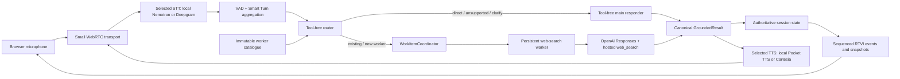

# Architecture

This document describes the implemented v0.1 runtime. The reviewed development
plan records how the design evolved; this page is the stable current-state
reference.

## Runtime ownership

| Lifetime | Owner | Responsibilities |
| --- | --- | --- |
| Python process | `SessionHost` | Authoritative session state, connection arbiter, worker registry, coordinator, result history, and one `WorkerRunner` |
| Python process | `WorkerRegistry` and registered `ContextWorker` instances | Stable worker identities, immutable per-turn catalogues, topic context, one causal mailbox per worker, and no automatic eviction |
| Python process | `WorkItemCoordinator` | Bounded dispatch, pending clarification, timeout and late-result ownership, local cancellation, and orderly shutdown |
| Browser connection | `ConnectionPipeline` | Accepted epoch, STT/TTS adapters, observer/publisher, speech scheduler, and transport references |
| Browser connection | `PipelineWorker.run()` task | Small WebRTC input/output, VAD, Smart Turn aggregation, transcript dispatch, bus bridge, TTS, and RTVI |
| Browser | Plain JavaScript RTVI client | Microphone controls, remote audio, and rendering validated server projections |

Pipecat 1.6.0 does not provide the originally planned
`LLMContextWorker` module. Durable application workers therefore subclass the
available `BaseWorker`, participate in the process-lifetime `WorkerRunner`, and
serialize accepted work through their own mailboxes. Validated router decisions
are dispatched directly by `WorkItemCoordinator`; the connection
`BusBridgeProcessor` remains the Pipecat worker-bus boundary for frames.

## Voice turn and result flow

VAD may produce several acoustic STT segments. Smart Turn and the application
grace timers combine them into one semantic user turn before routing. The
router receives an immutable catalogue and returns an internal
`RoutingDecision`; Python validates it against that same catalogue before any
dispatch. Only a reduced `RoutingState` is projected to the browser.

Every accepted answer becomes one canonical `GroundedResult`. Its complete
`text`, concise `spoken_text`, result identity, and normalized citations are
committed together. The browser shows `spoken_text` as the assistant turn and
the complete structured result in a disclosure and Result Log; only
`spoken_text` reaches TTS.

## Connection lifecycle and reconnect fencing

The process state outlives browser connections. Session discovery proposes a
new non-negative origin epoch. `SessionHost` atomically promotes an accepted
connection and fences the previous epoch before the replacement snapshot is
sent.

Each accepted connection owns a real `PipelineWorker.run()` task. Replacement
or shutdown disconnects its transport, cancels and awaits that task, and closes
connection-local speech resources. Every asynchronous callback checks its
origin epoch before mutating active state or emitting RTVI messages.

An older search may still complete as an immutable, UI-only canonical result.
It cannot regain dialogue ownership, replace active pointers, or autoplay
speech after a newer epoch has accepted work. Reconnect rebuilds browser state
from the process-lifetime snapshot and then resumes sequenced incremental
messages.

## Provider boundaries

- Local speech uses the configured Nemotron websocket STT service and Pocket
  TTS service. These services are machine-owned and are not started by this
  repository.
- Hosted speech can independently select Deepgram STT and Cartesia TTS.
- The main router has no external tools. A web-search worker alone receives the
  OpenAI hosted `web_search` tool, uses `store=False`, and normalizes provider
  output before it enters application state.
- Credentials stay in environment variables. The checked-in configuration
  contains provider choices, model names, endpoints, timeouts, and non-secret
  voice labels only.
- Small WebRTC is the local transport. A future cloud deployment may add Daily
  behind the same session and browser protocol contracts.

## Performance observability boundary

`server/perf_metrics.py` owns one console-only `PERF_METRIC` contract with a
closed event registry, safe formatting, and an injectable `MeasurementSink`.
`SessionHost` holds one sink instance for its process lifetime
(`ConsoleMeasurementSink` in production, `CollectingMeasurementSink` in tests
and the smoke harness) and hands it to both framework observers and
application recorders — there is no latest-value compatibility cache.

Two independent producers share that one contract:

- **Pipecat owns media timing.** Each browser connection's `PipelineWorker`
  gets one `StartupTimingObserver`, one `UserBotLatencyObserver`, and handlers
  registered on the worker's own default `turn_tracking_observer` (never a
  second `TurnTrackingObserver`). `PipelineParams(enable_metrics=True)` lets
  `UserBotLatencyObserver` emit a per-service breakdown for whatever
  processors actually produced a `MetricsFrame`; missing values are omitted,
  never zero-filled. Observer callback closures capture only an immutable
  `PerfConnectionContext` (`session_id`, `origin_epoch`, `connection_worker`),
  the sink, and the logger — never the host, runtime, worker, or RTVI
  publisher — so a replaced connection's stale callbacks stay console-only and
  collectible.
- **The application owns semantic timing.** Routing, worker dispatch,
  acknowledgement, commit, and retained background completion are not all
  metric-emitting Pipecat service processors, so they get explicit monotonic
  timers around the parent semantic turn (`app_turn_foreground`) and its child
  work items (`work_item_foreground`, `work_item_background`).

Pipecat turn numbers (`pipecat_turn`) and application turn IDs (`turn_id`) are
deliberately separate identifiers; a framework event omits `turn_id` rather
than guess a mapping that overlap, interruption, or late background speech
could make wrong. This stays console-only in v0.1.2: no RTVI projection,
browser state, or persistence is added.

## Design boundaries

- Server state is authoritative; browser SDK transcript callbacks and raw logs
  are not product state.
- Worker lifetime and connection lifetime are intentionally separate.
- Capability classification remains server-side. The browser receives only the
  reduced routing projection required for observability.
- Work completion, TTS synthesis, transport delivery, browser playout, and
  human audibility are distinct claims.
- Capability-aware backend cancellation acknowledgements, emitted
  `WorkItemEvent`/`InterruptionEvent` streams, worker eviction, Electron
  packaging, and Daily deployment are deferred beyond v0.1.

See [Browser protocol v1](../shared/protocol.md) for wire contracts,
[the implementation plan](dev_plans/20260711-feature-websearch-subagent-electron.md)
for decisions and acceptance evidence, and
[the speech benchmark](benchmarks/20260724-speech-latency.md) for the current
local-versus-hosted latency snapshot.
