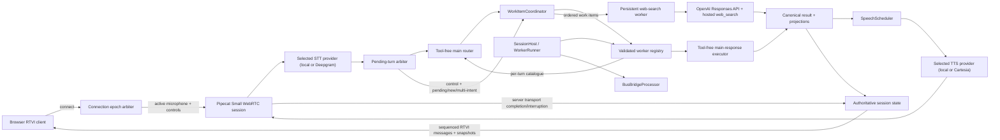

# Task: Pipecat Web-Search Subagent and Browser RTVI Lab

**Status**: Complete
**Component**: Pipecat subagents
**Assigned to**: Codex
**Priority**: Medium
**Branch**: feature/websearch-subagent-electron
**Created**: 2026-07-11
**Completed**: 2026-07-24
**Review Gates**: full

## Objective

Build a small Pipecat-native voice-assistant lab whose fast, tool-free main model classifies each utterance, selects or creates a context-owning specialist worker, and delegates web-capable requests to a worker with OpenAI hosted web search. Use a plain browser RTVI client for microphone input, synthesized audio, worker visibility, grounded search results, and explicit observation of text-versus-speech behavior during interruption. Defer Electron packaging and desktop lifecycle concerns to a separate follow-up plan.

## Context

This repository is an experimental home for future specialist-subagent types. The first experiment is intended to reveal good routing, model-selection, topic-affinity, and interruption policies rather than hard-code them prematurely.

The main model is a fast OpenAI routing model with no directly registered external tools. It decides whether the request is answerable directly, unavailable to the current system (for example, private calendar data), needs clarification, or belongs with a specialist. A persistent web-search worker may use a more capable configurable model and the OpenAI Responses API hosted `web_search` tool. The worker owns search-query refinement, clarification when required, search execution, grounded answer generation, and its topic context.

A browser client is the smallest useful RTVI surface for this experiment. It avoids Electron navigation and process-lifecycle concerns while retaining browser microphone capture, Small WebRTC media, controls, structured messages, source links, and reconnect-to-known-server behavior. A later Electron plan can package the proven protocol and UI rather than co-designing packaging with the experiment.

## Requirements

- Keep the main assistant generally helpful and free of directly registered external tools.
- Make routing an explicit structured decision: `direct`, `unsupported`, `clarify`, `existing_worker`, or `new_worker`.
- Have the router choose a stable existing worker identifier or a proposed new worker type/topic; Python validates every decision before dispatch.
- Give the router an immutable per-turn catalogue of allowlisted worker IDs, types, topic summaries, statuses, approved domain-capability labels/availability, and model-policy labels; validate its decision against that exact catalogue snapshot.
- Treat capability availability separately from topical similarity. A request for private calendar data must not become a web search merely because it asks for current information.
- Preserve one context per worker/topic and keep workers addressable for the Python process lifetime in the first slice.
- Keep lifecycle/eviction behind a registry policy seam; automatic reaping is out of scope until the lab produces evidence for a policy.
- Treat worker capabilities/skills as server-configured policy bundles. A router may select an approved capability label for a task, but no model may load arbitrary files, invoke undeclared tools, or choose unrestricted skill code.
- Support one active browser RTVI client at a known local server address; a replacement client may reconnect to the same Python process and workers.
- Fence browser connections with a server-issued connection epoch. A replacement atomically becomes active; prior transports are disconnected or ignored for microphone/control input, snapshots, and incremental state.
- Stamp every accepted turn, bounded work item, and in-flight operation with its originating connection epoch. On replacement, cancel old-epoch speech and mark each affected utterance `interrupted_by_reconnect`; router/search work may finish and commit its canonical result, but it cannot autoplay and only the active epoch receives it through the current stream or snapshot.
- Use Pipecat Small WebRTC for browser microphone input and synthesized audio output.
- Provide explicit Connect/Disconnect and microphone controls through the Pipecat client API; do not start microphone capture before a user action.
- Produce one canonical grounded result record and derive both a concise spoken projection and a structured UI projection from it.
- Show transcript, router state, worker identity/status, worker list, structured results, and sources in the browser.
- Persist and surface a timestamped history of each worker's finalized canonical results across the session — not merely the latest — retained for the process lifetime (no eviction, consistent with the plan's existing no-eviction stance on worker lifecycle) and rebuilt from the snapshot on reconnect like other worker-projected state.
- Show each assistant result's complete display text immediately when available, while distinguishing text whose audio reached server-side transport completion from text whose delivery was interrupted/incomplete (normal versus grey/italic presentation). Do not label this as verified audible browser playout.
- Treat Pipecat logs as the authoritative diagnostic record. The browser state is a product/debug projection and must not claim to be a complete execution trace.
- On reconnect, request a fresh runtime snapshot and replace the browser's worker/result projection with server-authoritative state while retaining only clearly marked local connection diagnostics.
- Open search-result links in a new browser tab with safe link attributes.
- Treat provider citations as untrusted input and render only normalized absolute `http` or `https` URLs.
- Default to the already-running local STT and TTS servers, following their verified client contracts rather than copying application-specific orchestration; allow independently selected Deepgram STT and Cartesia TTS alternatives for hosted deployments.
- Load required credentials from environment variables sourced from `~/.secrets/ai.env`; never copy values into source, tests, plans, logs, or commits.
- Treat live STT/TTS endpoint forms and OpenAI credential availability as preflight-verified environment assumptions, not defaults inferred from reference adapters or file existence.
- Keep router, worker, and model-selection policy configurable. Pin concrete inexpensive/current OpenAI model defaults only after verifying OpenAI and Pipecat compatibility during implementation.
- Use Python with `uv`; use Bun, plain JavaScript, HTML, and CSS for the browser client.
- Defer Electron packaging, preload/IPC, navigation policy, and desktop process ownership to a separate plan.

## Review Focus

- Whether structured routing separates capability classification, topic affinity, worker selection, and model policy without giving the main model external tools.
- Whether an invalid or hallucinated worker/model selection is rejected by deterministic Python validation.
- Whether the worker, rather than the router, owns search sanitization/refinement and domain clarification after delegation.
- Whether topic affinity is explicit enough to preserve follow-up context without leaking unrelated topics.
- Whether one canonical grounded result deterministically produces the spoken and UI projections.
- Whether displayed, queued-for-speech, started, completed, and interrupted states can be correlated without pretending text/audio alignment is exact.
- Whether RTVI readiness, interruption, reconnection, state snapshots, and message ordering are handled at the correct Pipecat seams.
- Lifecycle behavior across browser microphone capture, Small WebRTC/RTVI, local STT/TTS, main-model turns, and worker turns.

## Implementation Checklist

### Phase 1: Contracts and runtime foundation

**Impl files:** `pyproject.toml`, `web/package.json`, `bun.lock`, `server/config.py`, `server/preflight.py`, `server/contracts.py`, `shared/protocol.md`, `shared/schemas/*.json`
**Test files:** `tests/test_config.py`, `tests/test_preflight.py`, `tests/test_contracts.py`
**Test command:** `uv run pytest tests/test_config.py tests/test_preflight.py tests/test_contracts.py`
**Validation cmd:** `uv run ruff format --check . && uv run ruff check .`
**Goal:** Version and validate routing, worker-state, grounded-result, speech-progress, and snapshot contracts before either runtime consumes them.

- Initialize the Python project and pin a verified Pipecat version with the verified `openai`, `webrtc`, and `local` extras; RTVI is built in rather than installed as a separate extra.
- Pin and record the compatible Pipecat JavaScript client version alongside the Python Pipecat version pin, and verify RTVI/Small WebRTC wire compatibility between the two before Phase 4 depends on it.
- Create the minimal Bun manifest and lockfile needed for that client-version pin and compatibility probe; do not add browser application code in this phase.
- Verify `LLMContextWorker`'s actual context-retention and bus-edge (`active`, `bridged`) API, and `RTVIServerMessageFrame`'s actual payload semantics, directly against the pinned Pipecat version rather than relying on the Context Hub's 2026-07-05 index description.
- Verify the pinned `WorkerRunner(auto_end=False)`, worker registration/removal, `PipelineWorker` lifecycle, `BusBridgeProcessor` construction/attach/detach, programmatic activation, and per-connection bus topic/epoch filtering APIs. Record a fallback topology if any seam is unavailable; do not make durable-host or bridge behavior an acceptance invariant before this probe passes.
- Probe actual pinned worker/provider capabilities for steering and cancellation. Real adapters default to `unconfirmed` until they emit a backend acknowledgement; local task cancellation alone cannot produce confirmed `cancelled`.
- Define strict Python models and matching JSON Schemas for all versioned Python-to-browser messages.
- Define the reconnect handshake contract (`session_id`, resume token/known-process identity, proposed epoch, and snapshot sequence) before Phase 3 transport wiring; a fresh Small WebRTC transport must attach to durable state through this contract.
- Define an internal evented work-item contract with stable `work_item_id` (one bounded item in a parent turn), distinct `run_id` (one execution/retry), stable `worker_id`/topic identity (context owner), parent turn/aggregate IDs, event IDs/sequences, and capability flags for streaming/progress, steering, cancellation, and session continuation. Normalize `started`, `progress`, `completed`, `failed`, `cancellation_requested`, `cancelled`, `paused`, `resumed`, and late-completion events before they reach session state or UI.
- Define the interruption event schema and producer seam with stage enum (`result_pending`, `voice_llm_accepted`, `speech_active`), policy, template-used flag, resume outcome (`resumed`, `declined`, `stale`), and linked `work_item_id`/`run_id`/`utterance_id`; these are session/utterance fields, not implicit prose-only telemetry.
- Reserve a nullable `origin_epoch` field (default `null`/unset pre-arbiter) on turn, work-item, run, event, result, utterance, pending-dialogue, and control contract models so Phase 3's connection-epoch arbiter can populate it without reopening this Phase 1 contract; after acceptance, epoch-less callbacks are invalid.
- Define configurable router/worker model policy without embedding credentials or treating model names emitted by an LLM as trusted.
- Define and validate `max_work_items_per_turn` as an operator configuration (default `2`) so bounded multi-intent decomposition can be raised to `3` or `4` without changing the cross-runtime protocol.
- Define and validate `multi_intent_wait_timeout_ms` as an operator configuration for synthesis readiness (default `10_000` ms). On timeout, synthesize completed results and explicitly mark unfinished work as still running; do not block or discard completed results.
- Define and validate configuration precedence for the OpenAI credential variable name, STT/TTS endpoint transport and address, server bind/known client URL, and router/worker model-policy mappings.
- Add a values-redacted preflight that verifies required variable names, detects each local service endpoint form, checks protocol/health compatibility, persists the discovered endpoint transport/address into the config surface for Phase 3 adapters to read (rather than re-discovering), and reports actionable failures without printing secrets. This preflight probe stays standalone — it must not import Phase 3 adapter code, so Phase 1 completes and commits independently of Phase 3.
- Make successful redacted configuration/service preflight a Phase 1 exit gate. Verify configured model IDs and Responses/hosted-search compatibility when credentials permit; otherwise record authenticated capability as explicitly unavailable and keep the paid smoke path opt-in rather than silently solidifying defaults.
- Freeze separate conservative work-item/result and utterance-delivery state sets in the versioned contract: work-item/result (`started`, `progress`, `cancellation_requested`, `cancelled`, `completed`, `failed`) and delivery (`displayed`, `queued`, `started`, `synthesis_ended`, `delivery_completed`, `delivery_unknown`, `interrupted`, `interrupted_by_reconnect`, `paused`, `resumed`). Define cross-entity terminal precedence and mark finer word-level progress as a forward-compatible, Phase-3-gated extension rather than speculatively schema'd now.
- Document identifiers, ordering fields, timestamps, nullable fields, and forward-compatibility behavior in `shared/protocol.md`.

### Phase 2: Persistent routing and web-search workers

**Impl files:** `server/router.py`, `server/main_responder.py`, `server/registry.py`, `server/work_item_coordinator.py`, `server/workers/base.py`, `server/workers/web_search.py`, `server/results.py`
**Test files:** `tests/test_router.py`, `tests/test_main_responder.py`, `tests/test_registry.py`, `tests/test_work_item_coordinator.py`, `tests/test_web_search_worker.py`, `tests/test_results.py`
**Test command:** `uv run pytest tests/test_router.py tests/test_main_responder.py tests/test_registry.py tests/test_work_item_coordinator.py tests/test_web_search_worker.py tests/test_results.py`
**Validation cmd:** `uv run ruff format --check . && uv run ruff check .`
**Goal:** Validated routing decisions select one or a bounded set of persistent context owners, and canonical grounded results remain the sole source for speech and UI output.

- Build an immutable per-turn worker catalogue from registry state, pass it into the tool-free router prompt, and validate the result against the same snapshot before dispatch.
- Validate action, worker ID, worker type, topic label, domain capability, and configured model policy before dispatch.
- Implement one tool-free structured-output envelope: the model returns the routing decision and optional prose together; Python validates the entire envelope against the catalogue before any side effect, then emits the validated prose for `direct`, `unsupported`, and router-owned `clarify` outcomes. Worker-delegated `existing_worker`/`new_worker` outcomes remain a distinct dispatch since they hand off to a different context-owning component entirely.
- Implement a process-lifetime worker registry whose workers are Pipecat `LLMContextWorker` instances (or a thin subclass), with stable IDs, topic metadata, status, an explicit no-eviction first-slice policy, and one causal mailbox per worker built on top of `LLMContextWorker`'s own `active`/`bridged` scheduling rather than a fully parallel activation model.
- Serialize each worker's operations in accepted-turn order through its mailbox. A later same-worker turn waits for earlier work and therefore reads the context after earlier immutable commits; different workers remain independently concurrent.
- Implement a context-owning web-search worker using OpenAI hosted `web_search`; let it clarify or decline requests that search cannot satisfy.
- Configure OpenAI Responses calls with `store=False` unless a later reviewed decision explicitly requires provider retention. Document which transcript/query/context fields leave the process, verify the pinned Pipecat adapter preserves the setting across worker calls, and note that `store=False` is treated as a backend-semantics assumption (its exact provider-side retention guarantee is not independently verifiable from this repo) rather than a settled fact.
- When a worker asks a clarification, record a pending-dialogue candidate by session with owner kind/worker ID, originating turn/result ID, and expiry, using an injectable/fake clock so expiry timing is deterministic in tests rather than wall-clock dependent.
- Arbitrate every final transcript before dispatch. Run deterministic control-intent checks first; classify explicit pause/resume/cancel/consent controls with a target `work_item_id` when present. Then, when pending candidates exist, a narrow tool-free classifier labels intents as `continue_pending`, `steer_same_topic`, `new_topic`, or `multi_intent`. With no pending candidates and no control intent, skip that classifier and route directly to the main router. Preserve the user's untouched wording for normal routing, and cap `multi_intent` decomposition at the validated `max_work_items_per_turn` setting.
- Normalize provider output into a canonical grounded-result record with citations before deriving spoken/UI projections. Treat the real OpenAI Responses hosted-search citation output shape (field path, nullability, URL encoding) as an assumption until a captured real response confirms it — the Phase 1 compatibility gate verifies model/tool availability, not output schema, so this normalizer must not be written against mocked shapes alone.
- Request one strict hosted-search response envelope containing a complete `display_text` answer and a concise, speech-safe `spoken_text` projection. The worker instructions bound the spoken form to plain speech without URLs, citation markers, Markdown, or source lists; Python validates the envelope and attaches one normalized citation set and canonical result ID to both projections.
- Normalize citation titles and URLs at the server trust boundary. Accept only absolute `http`/`https` URLs; reject or omit unsupported schemes, relative/malformed/missing URLs, and deterministic duplicates before any browser message is emitted.
- Cover ambiguous follow-ups, unsupported private-data requests, new/existing topic selection, hallucinated IDs, search failure, worker-level decline (search cannot satisfy the request, distinct from routing-level `unsupported`), a `store=False` assertion on outbound Responses requests, and citation/result validation.
- Keep provider-shape verification as a Phase 1 gate: capture one authenticated hosted-search response or pin an official fixture; if neither is available, mark the normalizer/provider-shape acceptance blocked and run only clearly labelled mocked contract tests.

### Phase 3: Pipecat pipeline, local speech, and observable interruption state

**Impl files:** `server/app.py`, `server/pipeline.py`, `server/speech_scheduler.py`, `server/services/stt.py`, `server/services/tts.py`, `server/observers.py`, `server/session_state.py`, `server/connection_arbiter.py`
**Test files:** `tests/test_pipeline.py`, `tests/test_session_host.py`, `tests/test_speech_scheduler.py`, `tests/test_session_state.py`, `tests/test_rtvi_messages.py`, `tests/test_interruptions.py`, `tests/test_connection_arbiter.py`
**Test command:** `uv run pytest tests/test_pipeline.py tests/test_session_host.py tests/test_speech_scheduler.py tests/test_session_state.py tests/test_rtvi_messages.py tests/test_interruptions.py tests/test_connection_arbiter.py`
**Validation cmd:** `uv run ruff format --check . && uv run ruff check .`
**Goal:** The runtime remains authoritative for worker/result state and emits monotonic speech-progress evidence that lets the UI show what was displayed, started, completed, or interrupted.

- Start one process-lifetime `WorkerRunner(auto_end=False)` that owns the local worker bus and persistent `LLMContextWorker` registry. For each promoted browser connection, add one connection-lifetime Pipecat `PipelineWorker` whose main pipeline contains the framework `BusBridgeProcessor`; remove/deactivate that connection worker on replacement without rebuilding persistent workers or their contexts. `LLMContextWorker` `bridged` edges wrap the worker-side exchange, but do not by themselves attach it to the transport pipeline.
- Implement and test the `SessionHost` lifecycle as startup → runner registration → worker/bridge topic attach → active connection → replacement detach/fence → clean shutdown. If the Phase 1 probe rejects a seam, use the documented fallback topology and downgrade the affected acceptance criterion rather than silently emulating it.
- Keep the main router tool-free: validate its structured worker-selection output in application policy code, then programmatically activate the selected Pipecat worker. The bridge admits only validated canonical-result/control frames through a canonical-result adapter before TTS or UI projection; raw worker LLM text cannot bypass normalization.
- Add a thin, connection-scoped RTVI state publisher/observer beside the bridge. It projects canonical results, worker status, speech progress, and snapshots as versioned RTVI messages; it neither owns browser state nor performs LLM work.
- Assign monotonic session sequence numbers plus stable turn/result/`work_item_id`/`run_id`/utterance IDs to state-bearing messages and control responses.
- Persist an ordered, unbounded (process-lifetime) history of each worker's canonical results — not only a latest-result pointer — so the browser can render a full timestamped result log and rebuild it from a snapshot after reconnect.
- Emit full result/UI data independently of slower speech playback.
- Track synthesis and server-side transport delivery separately. TTS stop means `synthesis_ended`, not `delivery_completed`; Phase 1/3 must identify and probe the exact downstream transport-output event and utterance-correlation seam. If no reliable seam exists, emit `delivery_unknown` and retain synthesis-only styling rather than claiming server transport completion; neither state proves browser decode, playout, or audibility.
- Do not claim word-accurate spoken progress unless implementation evidence proves an available timing/alignment seam; the initial UI may conservatively mark the whole utterance as spoken only on completion and otherwise mark it incomplete.
- On barge-in or explicit `stop`, route through `SpeechScheduler`, which emits Pipecat's interruption path for only the currently leased utterance. Preserve completed results and the other work items' computation/state; do not globally cancel unrelated workers. The active work item records a task-local interruption outcome and retains any resumable speech projection according to the configured interruption policy. Residual audio already buffered in the browser is unverified in this slice.
- Start with a task-local `pause_current_work_item` policy as the default: stop current audio, let unrelated work continue, and allow an explicit later `resume`/replay request for that work item. Keep `resume_after_soft_interrupt`, `cancel_current_work_item`, and `discard_remaining_speech` as instrumented policy variants; telemetry must establish evidence before changing the default.
- Keep `resume_after_soft_interrupt` as a separate measured variant with stage-aware behavior. If a worker result is ready but has not yet been accepted by the main voice-loop LLM, retain it as canonical pending state and let the normal voice loop consume it after the current turn; do not emit a bridge template. If the voice-loop LLM has already generated speech and Pipecat interrupts that active utterance, the voice loop may give a short bridge acknowledgement (for example, “I’ll triage that, then return to what I was saying”) and requeue the paused work item's remaining speech while the new work continues only when a verified segment/offset boundary exists. Without that seam, use whole-utterance replay or decline replay explicitly; never guess a remainder boundary. This is never used after an explicit pause/cancel request, and retained speech is held outside the discarded Pipecat frame queue with its original work-item/utterance ID.
- The soft-interruption bridge acknowledgement is a fixed, configurable template only for the post-LLM-speech case; it is not another LLM call. Record the stage (`result_pending`, `voice_llm_accepted`, or `speech_active`), whether a template was used, and whether the retained remainder resumed, was declined, or became stale.
- Treat the interruption policy as deliberately provisional lab configuration. Record the selected strategy, work-item IDs, interruption cause, resume/decline outcome, and resulting speech/result state so observed usage can change the default without changing the versioned RTVI contracts or Pipecat transport seam.
- Implement snapshot request/response after client readiness or reconnection.
- Resolve delivery races with a monotonic state machine: `completed`, `interrupted`, `interrupted_by_reconnect`, `cancelled`, and `delivery_unknown` are terminal outcomes with explicit precedence; duplicate, late, and stale events cannot change a terminal utterance. `cancellation_requested`, `paused`, and `resumed` are non-terminal until a backend-confirmed terminal event or policy expiry.
- Issue a connection epoch on activation. Atomically promote a replacement client and disconnect or ignore every older epoch across audio/control input, snapshot requests, outbound state, and sequence streams.
- On replacement, cancel old-epoch speech delivery and record `interrupted_by_reconnect`. Require a session identity/resume handshake when a fresh transport attaches to the durable Python process; reject stale epoch callbacks at the bus and session-state boundaries. Allow already-running router/provider work to commit a canonical result without speech; route every asynchronous callback through epoch-aware session state so only the active epoch receives incremental state.
- Bound late old-epoch commits to append-only immutable result/context records tied to the origin turn. They cannot change active routing/status, pending-dialogue ownership, latest-result pointers, or speech scheduling unless the origin turn is still current; same-worker completions retain accepted-turn order and newer active turns supersede late interactive side effects.

### Phase 4: Plain browser RTVI client

**Impl files:** `web/index.html`, `web/src/app.js`, `web/src/state.js`, `web/src/render.js`, `web/src/styles.css`
**Test files:** `web/test/state.test.js`, `web/test/render.test.js`, `web/test/protocol.test.js`
**Test command:** `cd web && bun test`
**Validation cmd:** `cd web && bun run lint`
**Goal:** The browser renders the server-authoritative lab state and makes text-versus-speech divergence visible without becoming a second diagnostic authority.

**Wireframe reference:** `docs/dev_plans/assets/20260711-feature-websearch-subagent-electron/wireframe.html` — a static, non-interactive HTML/CSS mockup (no JS logic, self-contained) covering disconnected/idle, connected mid-turn, barge-in interruption, reconnect, and multi-worker states, plus the full-width cross-worker Result Log described below. This is a design-review artifact, not implementation code; Phase 4's actual `web/` client is built from the requirements below, informed by this mockup's layout/interaction reasoning (inline HTML comments annotate which requirement each region demonstrates).

- Build Connect/Disconnect and microphone controls with the Pipecat JavaScript client and Small WebRTC transport.
- Own received remote audio explicitly in plain JavaScript: create and retain an `HTMLAudioElement`, attach/remove the remote `MediaStream` across connect, replacement, and disconnect, start playback on a user-gesture-safe path, and render an actionable autoplay-failure state.
- Test that page initialization and connection do not acquire/publish microphone media before the explicit user gesture, and that disconnect disables capture.
- Render transcript with compact server-authored timestamps, current routing state, persistent worker list, per-result worker identity, structured answer, and sources. For assistant results, present the exact `spoken_text` projection as the primary turn and place complete non-TTS structured output (`ui_text`, worker/turn metadata, delivery state, and citations) under a `Subagent output` disclosure. Do not label this structured result as hidden model reasoning.
- Apply RTVI messages in session-sequence order; ignore duplicates, detect gaps, and request a snapshot when state may be incomplete. Discard any incremental message whose sequence number is older than the last-applied snapshot's sequence, so a snapshot arriving while older increments are still in flight cannot be superseded by them.
- Render completed spoken text normally and incomplete/unspoken text grey and italic using the conservative utterance-level status from Phase 3.
- Keep worker inspection limited to identity, topic, model policy label, status, and the worker's history of finalized canonical results (timestamped, unbounded for the process lifetime); full private prompts/context and raw logs remain server-side.
- Render a persistent, timestamped result log as a full-width row below the live two-column transcript/inspector layout, distinct from the live per-turn view. Each entry shows worker identity, turn, timestamp, and a one-line summary with source count; entries expand to the full structured answer and sources. This is a session-spanning historical view, not a duplicate of the live result already shown inline in the transcript for the current turn.
- Keep structured worker output from dominating the transcript: the closed disclosure shows only the concise spoken projection; expansion exposes the complete result without truncating canonical state.
- Open source URLs in new tabs using `target="_blank"` and `rel="noopener noreferrer"`.
- Assert every rendered source-link path includes `target="_blank"` plus both `noopener` and `noreferrer` tokens.
- Reconnect to the known server endpoint and replace runtime projections from the returned snapshot.
- Preserve only explicitly labelled local connection diagnostics across snapshot replacement; stale server projections are replaced and local diagnostics cannot be rendered as server-authored state.

### Phase 5: Integrated verification and documentation

**Impl files:** `README.md`
**Test files:** `tests/integration/test_browser_session.py`
**Test command:** `uv run pytest && (cd web && bun test)`
**Validation cmd:** `uv run ruff format --check . && uv run ruff check . && (cd web && bun run lint) && git diff --check`
**Goal:** Demonstrate routing, persistence, grounding, reconnect, and interruption invariants end to end before designing Electron packaging.

- Add a local runbook covering server, browser client, existing STT/TTS services, environment loading, and known endpoint configuration.
- Keep Phase 5 protocol work prose-only. Any semantic contract change discovered during integration returns to Phases 1, 3, and 4 and lands JSON Schemas, Python models/emission, browser reducers, protocol prose, and affected tests together before final verification.
- Verify direct, unsupported, clarify, new-worker, and existing-worker routing paths.
- Verify one worker retains same-topic context and unrelated topics remain isolated.
- Verify UI results can precede speech, interruption stops audio without deleting the result, and the UI visibly reports incomplete speech.
- Verify closing/reopening the page reconnects to the same Python process and rebuilds the worker/result projection from a snapshot.
- Verify replacement-client fencing: the new epoch becomes authoritative and an old still-live client cannot send accepted audio/controls or mutate/receive the new sequence stream.
- Run a required credential-safe local media acceptance procedure that proves Small WebRTC connection, user-initiated microphone capture, live local STT/TTS interaction, and audible browser output. Keep the paid authenticated OpenAI web-search smoke test separate and opt-in.
- Run formatting, linting, full tests, a staged secret scan, documentation review, code review, and security review before any push.
- Use the evidence from this lab to create a separate Electron plan covering packaging, preload/IPC boundaries, external navigation, and process ownership.

## Technical Specifications

### Verified Starting Facts

- The repository was initialized at `/Users/vr000m/Code/pipecat-ai/pipecat-subagents-lab`; no implementation manifest exists yet.
- The Pipecat Context Hub snapshot refreshed 2026-07-05 indexes `LLMContextWorker` as a self-contained context-owning LLM worker and `RTVIServerMessageFrame` as the arbitrary server-message frame.
- Pipecat documents `pipecat-ai[webrtc]` for the server-side Small WebRTC transport.
- RTVI defines `client-ready` after media channels connect; state snapshots must be sent after this readiness boundary rather than assumed to arrive during page initialization.
- OpenAI's Responses API exposes hosted `web_search` through the request `tools` configuration; this is API capability and billing, not inherited ChatGPT/Codex product access.
- The reference local STT adapter uses `SegmentedSTTService` and the `pipecat-local-stt-server` client over a Unix-domain socket.
- The reference local TTS adapter subclasses Pipecat `TTSService` and uses the `pipecat-local-tts-server` client over a Unix-domain socket.
- Current Pipecat packaging exposes `openai`, `webrtc`, and `local` extras; RTVI is part of the core package rather than a separate extra.
- `~/.secrets/ai.env` exists; its contents and values have not been read into this plan.

### Environment Assumptions Requiring Preflight

- The live STT and TTS services may use different endpoint transports and addresses than the reference UDS adapters. Implementation must discover and health-check each configured endpoint before choosing defaults.
- `~/.secrets/ai.env` existence does not establish that an OpenAI API credential variable is present, authorized, or funded. Preflight checks variable presence without printing its value; the authenticated hosted-search smoke test remains opt-in.
- The live STT service's final-transcript/segmentation behavior compatible with `SegmentedSTTService` is assumed, not preflighted — endpoint reachability and health are distinct from transcript semantics. The required local media acceptance procedure (Phase 5) must include a smoke assertion that a final transcript is actually produced, separate from the endpoint-form/health preflight.
- The pinned local TTS adapter emitting an observable `synthesis_ended` frame is assumed, not verified in-repo. Confirm the adapter produces this signal before relying on it for delivery-state styling; if it doesn't, the coarse completion/incomplete styling needs a different seam.
- The OpenAI Responses hosted `web_search` output/citation shape (field path, nullability, URL encoding) is assumed from documentation, not pinned against a real response. The Phase 1 compatibility gate verifies model/tool availability, not output schema — capture one real response (when credentials permit) to pin the shape before the normalizer is finalized; otherwise keep the normalizer's mocked-shape assumption explicitly flagged as unverified.
- The exact hosted `web_search` tool-type string and request `tools` shape is assumed from a documentation snapshot; tool naming has drifted historically (e.g. `web_search` vs `web_search_preview`). Pin the exact string/shape during the Phase 1 compatibility gate rather than assuming it from the snapshot description.
- Small WebRTC ICE-reconnection and post-disconnect session behaviour are assumed until verified against the pinned JavaScript client with a controlled disconnect/reconnect probe. Keep a fresh-session reconnect fallback if transport-level recovery is unavailable.
- `LLMContextWorker`'s context-retention/bus-edge (`active`, `bridged`) behavior and `RTVIServerMessageFrame`'s payload semantics are asserted from the Context Hub's 2026-07-05 index description, not verified against the pinned Pipecat version. Phase 1 adds an explicit verification step against the pinned version itself.

Corrections to verified paths, patterns, or dependencies above alter the immutable contract and require a fresh plan review.

### Files to Modify

- `README.md` — replace the placeholder description with the verified browser-first runbook and experiment boundaries.
- `docs/dev_plans/20260711-feature-websearch-subagent-electron.md` — retain this original path for continuity while explicitly documenting the browser-first scope and deferred Electron follow-up.

### New Files to Create

- `pyproject.toml` — Python dependencies, scripts, Ruff, and pytest configuration.
- `config.toml` — checked-in local defaults and provider/model policy.
- `server/` — configuration, versioned contracts, router, worker registry, web-search worker, canonical result projection, Pipecat pipeline, speech services, observers, and session state.
- `scripts/benchmark_speech.py` — opt-in identical-fixture latency benchmark for local and hosted speech providers.
- `tests/` — unit and integration coverage for contracts, routing, persistence, projections, RTVI ordering, interruption, and reconnect.
- `shared/protocol.md` and `shared/schemas/*.json` — versioned cross-runtime contracts.
- `web/` — Bun-managed plain HTML, JavaScript, and CSS RTVI client plus tests.
- `docs/benchmarks/20260724-speech-latency.md` — development-machine benchmark snapshot and interpretation.

### Architecture Decisions

- **Browser before Electron:** prove the voice, routing, state, and interruption contracts in a normal browser; package them in a separately reviewed Electron plan later.
- **Tool-free main router:** the main model receives no external tools. It returns a validated routing decision and remains the user-turn coordinator.
- **Capability before topic:** routing first distinguishes direct/unsupported/clarify/specialist capability, then selects an existing topic worker or proposes a new one.
- **Snapshot-bound routing:** the registry supplies an immutable worker catalogue for each routing turn; the router can select only entries from that snapshot, and dispatch validates against the identical snapshot to prevent stale or hallucinated IDs.
- **Collapsed main response generation:** one tool-free model call returns a structured routing/prose envelope; Python validates the entire envelope before any side effect, then emits validated prose for `direct`, `unsupported`, and main-owned `clarify` actions. Worker-delegated outcomes (`existing_worker`/`new_worker`) remain a separate dispatch since they hand off to a different context-owning component. All results then enter the same canonical result/delivery path.
- **Worker-owned search judgment:** once delegated, the web worker refines/sanitizes queries, decides whether web search is sufficient, asks domain clarification, and returns a grounded result.
- **Thin durable host:** a small application `SessionHost` keeps one `WorkerRunner(auto_end=False)` alive. The runner, not custom application scheduling, owns the local worker bus and persistent `LLMContextWorker` registry; application policy retains only worker selection, epochs, pending dialogue, and canonical result history.
- **Runner/registry source of truth:** `SessionHost` owns the authoritative mapping from stable `worker_id` to the Pipecat runner handle and metadata registry. Add/activate/deactivate/status updates are one transaction at the host boundary; per-turn catalogues are immutable snapshots of that source, never an independent worker registry.
- **Process-lifetime vs connection-lifetime boundary:** persistent workers, their contexts, canonical results, pending-dialogue state, and the session sequence counter outlive any single connection. Each promoted browser connection receives one connection-lifetime `PipelineWorker` containing Small WebRTC, STT/TTS, `BusBridgeProcessor`, canonical-result adapter, and RTVI state publisher; replacement removes/deactivates that worker and builds a fresh one without rebuilding the durable runner or worker contexts.
- **Worker identity and frame path:** registry workers are Pipecat `LLMContextWorker` instances (or a thin subclass), so Pipecat owns their bus participation and active-worker scheduling. The connection `PipelineWorker`'s `BusBridgeProcessor` is the required transport-side endpoint; worker `bridged` edges alone do not attach frames to a browser pipeline. Application policy programmatically activates the router-selected worker after structured-output validation, preserving a tool-free router.
- **Per-turn LLM call count is documented, not implicit:** the hot `direct` path issues at most two sequential LLM calls (the pending-intent classifier runs only when pending candidates exist; the collapsed router+response call). A delegated-worker path adds the worker's own hosted-search call. This is stated explicitly so the latency profile is visible to implementers and the lab's interruption/UX findings.
- **Pending dialogue is a routing candidate, not an exclusive owner:** a worker clarification remains available as context for the next turn, but the main router always sees the new final transcript together with pending candidates and active-topic summaries. Explicit cancellation or expiry removes the candidate.
- **Pending-turn arbitration:** deterministic cancellation/expiry checks run first, followed by a narrow tool-free classifier that labels each detected intent as `continue_pending`, `steer_same_topic`, `new_topic`, or `multi_intent`. The first two return to the asking worker; `new_topic` routes normally; `multi_intent` decomposes the utterance into bounded ordered work items, preserving user order and allowing independent workers to proceed concurrently where safe.
- The first slice uses a validated `max_work_items_per_turn` configuration (default `2`; setting it to `3` or `4` requires no schema change). It records decomposition decisions and does not attempt unrestricted autonomous project planning or merge arbitrary specialist outputs; independent work-item concurrency and provider/resource budgets remain separate operational limits. The main router produces a user-visible synthesis turn after selected work items complete or one needs clarification.
- Phase 2's `WorkItemCoordinator` targets a narrow `SpeechScheduler` protocol stub for unit tests; Phase 3 supplies the concrete Pipecat scheduler/transport implementation and its frame-ownership tests, so Phase 2 does not depend on an unbuilt media seam.
- For a multi-intent turn, each completed canonical worker result is emitted to the browser immediately for inspection. After the selected work items complete (or one needs clarification), the fast main model receives their ordered summaries and produces one synthesis result for the spoken projection; the synthesis does not gain web-search tools or replace the underlying worker result records.
- Synthesis waits only until all selected work items finish, one needs clarification, or `multi_intent_wait_timeout_ms` expires. A timeout produces a partial synthesis with explicit pending-work status; late worker results remain valid and are emitted independently. If a late result arrives while the session is idle, the assistant may issue a short consent prompt (for example, “A long-running task just returned. Would you like to hear the result?”) rather than speaking the full answer; if the user is speaking or another turn is active, show the offer in the UI and defer speech. Record per-item and aggregate wait durations, timeout counts, partial-synthesis counts, consent-prompt outcomes, and late-result latency so the default can be tuned from lab evidence.
- On affirmative consent, synthesize and speak a concise late-result summary; keep the complete structured result and citations in the browser Result Log for inspection or a later explicit request.
- A declined or unanswered late-result offer expires after one prompt, remains visible in the UI/Result Log, and is not automatically repeated. A later explicit user request may retrieve or replay it.
- A consent response is a control intent, not a conversation lock. A compound reply such as “yes, and also search for…” acknowledges the pending late result and sends the additional utterance through bounded multi-intent routing in the same acceptance order.
- Late-result offers are server-authoritative session records with stable offer/result IDs, origin turn/epoch, one-shot status (`pending`, `prompted`, `deferred`, `accepted`, `declined`, `expired`), and expiry. The browser renders the offer and submits consent; reconnect snapshots restore the authoritative offer state. Offers are separate per late result in the first slice; a later experiment may add an LLM batch-synthesis offer without changing the underlying result records.
- Only one late-result consent offer may be spoken at a time. Additional pending offers remain queued in server order and visible in the UI; the next offer becomes eligible after the active offer is accepted, declined, or expires.
- A new active user turn pauses spoken late-result offers. The turn routes normally; queued offers remain server-authoritative and visible, and offer prompting resumes only after the session returns to idle.
- A current user turn has priority over a pending worker result that has not entered speech. Commit the pending result and expose it in the UI, but schedule its voice projection only after the current turn reaches a terminal state and the configured interruption policy permits delivery.
- Semantic control separates delivery from computation: “stop/pause, let me think” pauses or defers speech while the work item continues; explicit “cancel/forget it” language or a cancel control requests work-item cancellation. The UI shows these as distinct outcomes.
- Cancellation is capability-aware: when a backend cannot confirm preemption, record `cancellation_requested`, tell the user cancellation is unconfirmed, keep the work item visible, suppress autoplay, and accept a later completion as a late result subject to the normal offer policy. Local request/task cancellation must never be presented as confirmed backend cancellation.
- For offer scheduling, `idle` means no active user turn, no active TTS/synthesis utterance, and no higher-priority control prompt; a queued offer is eligible only after the current transport utterance reaches a terminal state.
- If a user interrupts a consent prompt, mark the offer `deferred` and never replay it immediately; it may be eligible for a later idle prompt before normal expiry.
- If some work items complete while another requests clarification, the synthesis acknowledges the completed result(s) first, then asks the clarification question for the unresolved item. A combined user reply is treated as a fresh bounded routing turn: it may answer the pending question while also steering, starting a new topic, or adding another configured number of work items.
- **Registry-controlled persistence:** Python owns stable worker IDs and contexts. Router output is advisory and cannot instantiate arbitrary classes or models.
- **Per-worker causal mailbox:** each worker executes one accepted turn at a time in acceptance order. This makes context visibility and commit order deterministic across reconnects while preserving concurrency between different workers.
- **Policy-labelled model selection:** routing may select only a configured policy label such as `fast`, `balanced`, or `deep`; Python maps labels to verified model IDs and budgets.
- **Server-owned capabilities:** a worker's optional skills are selected from a Python registry of approved capability bundles (prompt fragments, schemas, and explicitly declared tools). The model can request only a configured label; dynamic skill discovery/loading is deferred until a later security-reviewed experiment.
- **Evented work-item seam:** keep voice/media orchestration independent from worker execution details. Each work item exposes a normalized run handle and capability declaration; backend-specific cancellation or steering is reported honestly instead of being inferred from local task cancellation.
- **Work-item coordinator:** `WorkItemCoordinator` owns parent-turn decomposition, ordered work items, bounded wait/timeout, synthesis lifecycle, clarification, late-result offers, and control-intent transitions. It emits normalized work-item events to session state and delegates speech to `SpeechScheduler`.
- **Speech scheduler:** `SpeechScheduler` owns one active utterance lease and per-work-item speech queues. Every TTS/transport frame is tagged with `work_item_id`, `run_id`, and `utterance_id`; only the scheduler can pause, resume, cancel, discard, or requeue speech after a Pipecat interruption.
- **Canonical result, two projections:** provider output becomes one strict validated envelope containing the full display answer and concise spoken form. Python binds both to one grounded result ID and citation set; factual equivalence remains an explicit provider instruction and evaluation target rather than a claim that string validation can prove semantics.
- **Multi-intent projection:** worker results are independently visible as they arrive, while one ordered main-model synthesis supplies the conversational spoken response. A synthesis interruption never deletes the underlying worker results. Late results use a short, interrupt-safe consent prompt instead of unsolicited full-result TTS.
- **Partial completion with clarification:** completed work is never hidden behind an unresolved item. The spoken/UI synthesis labels what is complete and what needs clarification; the next transcript is reclassified rather than assumed to be only an answer to the pending worker.
- **Result and delivery are separate:** complete UI text may appear before TTS finishes. Result state survives interruption; speech-delivery state records whether its audio completed.
- **Separate lifecycle state machines:** work-item/result outcomes (`completed`, `cancelled`, `failed`) are linked to, but not conflated with, utterance-delivery outcomes (`delivery_completed`, `delivery_unknown`, `interrupted`, `interrupted_by_reconnect`). A replay always receives a new utterance ID.
- **Transport completion is not audibility:** TTS completion only closes synthesis. The initial UI may style server-side `delivery_completed` versus incomplete delivery, but labels it precisely and never claims browser receipt or audible completion. Per-utterance browser playout acknowledgement is deferred until a verifiable client seam exists.
- **Coarse first-slice speech evidence:** only claim the granularity supported by observed Pipecat frames. Word-level black/grey splitting is conditional on verified alignment; otherwise mark complete versus incomplete utterances conservatively.
- **Server-authoritative snapshot:** Pipecat logs are diagnostic authority and Python runtime state is projection authority. Reconnected browsers rebuild from a versioned snapshot.
- **Single-client fencing:** a connection arbiter owns monotonically increasing epochs, atomically promotes replacements, and rejects all traffic from stale transports.
- **Task-local interruption over a shared audio path:** Pipecat's `InterruptionFrame` and TTS reset operate on the currently active pipeline/audio utterance. Application session state scopes the semantic effect by work-item and utterance ID: task 1's spoken delivery may pause while tasks 2 and 3 continue computing and producing UI results. A canonical result pending before voice-loop LLM acceptance is retained and re-offered through normal loop state rather than trusted to survive the discarded frame queue. A global worker cancel is reserved for connection shutdown/replacement, not ordinary barge-in.
- **Interruption policy is an experiment seam:** `pause_current_work_item`, `resume_after_soft_interrupt`, `cancel_current_work_item`, and `discard_remaining_speech` remain selectable policy variants. Findings may change the default; no variant is treated as an inherent Pipecat behavior. A bridge acknowledgement and resumed remainder are application-level frames/state, not claims about Pipecat's discarded-frame queue.
- **Epoch-owned in-flight work:** turns, bounded work items, router/search tasks, results, and utterances carry their origin epoch. Replacement cancels old speech, permits canonical result completion without autoplay, and exposes committed state only to the active epoch.
- **Causal late-commit policy:** an old-origin completion may append its immutable turn/result/context record, but cannot regain dialogue ownership, replace active/latest pointers, alter current worker/routing status, or schedule speech after a newer epoch accepts work. Same-worker results retain accepted-turn order.
- **Provider minimization:** OpenAI Responses use `store=False` by default and the runbook names data leaving the process plus any account-level retention limitation.
- **No `UIWorker` initially:** a connection-scoped RTVI state publisher/observer projects versioned server state, while the plain-JavaScript browser renders it. This keeps UI delivery explicit without a second agent, browser-state owner, or UI framework.
- **Unbounded per-worker result history, not latest-only:** each worker's finalized canonical results are retained and exposed for the full process lifetime (no eviction), mirroring the plan's existing no-eviction stance on worker lifecycle. This supersedes the earlier "latest result only" worker-inspection limit. The browser renders this as a persistent, timestamped Result Log distinct from the live transcript view, and reconnect rebuilds it from the snapshot like other worker-projected state.

### Integration Seams

| Producer | Contract | Consumer | Verification |
|---|---|---|---|
| Selected STT adapter (local or Deepgram) | Final user transcript with turn ID | Main router | Contract tests, local-server integration smoke test, and opt-in hosted benchmark |
| Worker registry | Immutable per-turn worker catalogue | Main router and dispatch validator | Same-snapshot selection, stale-ID, and mutation tests |
| Main router | Validated routing decision and policy label | Worker registry/dispatcher | Schema tests, allowlist rejection, and routing matrix |
| Main router | Validated direct/unsupported/clarify intent | Tool-free main-response executor | Outcome matrix and no-tools assertion |
| SessionHost | Runner handle + metadata transaction for worker add/activate/deactivate/status | Registry catalogue, bridge topics, connection arbiter | Startup/replacement/shutdown lifecycle and half-applied snapshot race tests |
| Worker registry | Stable worker identity, topic, context owner, status | Dispatcher and UI snapshot | Persistence/isolation tests |
| Per-worker causal mailbox | Ordered accepted turns and post-prior-turn context | Context-owning worker | Same-worker serialization/order and cross-worker concurrency tests |
| Pending dialogue state | Session-scoped clarification owner and expiry | Transcript dispatcher | Continuation, cancellation, task-change, and expiry tests |
| Pending-turn arbiter | `continue_pending`/`steer_same_topic`/`new_topic`/`multi_intent` plus candidate IDs | Prior worker, bounded dispatcher, or main router | Deterministic expiry, classification, decomposition, and ordering tests |
| Control-intent classifier | `pause`/`resume`/`cancel`/`consent` plus target `work_item_id` | WorkItemCoordinator and SpeechScheduler | Active-control tests with and without pending dialogue |
| WorkItemCoordinator | Parent turn, ordered work items, timeout, synthesis, clarification, late offers | Session state and SpeechScheduler | Atomic timeout/late-result/consent/clarification transitions |
| Web worker | OpenAI hosted-search response | Canonical result normalizer | Mocked provider shapes, missing citations, and failure tests |
| Worker runtime handle | `work_item_id`, `run_id`, capabilities, ordered events, cancellation acknowledgement | WorkItemCoordinator | Backend capability and event-order tests |
| Context-owning worker (`LLMContextWorker`) | Validated canonical-result/control frames through its bridged edges | Connection `PipelineWorker`'s `BusBridgeProcessor` | Runner/bus ownership and bridge delivery test; verify against pinned Pipecat version |
| Result normalizer | Versioned grounded result | Speech projector and UI projector | Projection equivalence/invariant test |
| Speech projector/selected TTS adapter (local or Cartesia) | `work_item_id`/`run_id`/utterance ID, audio frames, synthesis lifecycle | SpeechScheduler and Small WebRTC output | Frame-tag propagation, provider lifecycle, and synthesis/transport distinction tests |
| Interruption controller | Pipecat interruption frame plus work-item/utterance policy | Session delivery state and worker-task policy | Task-local pause/cancel/discard matrix and race tests |
| SpeechScheduler | One active utterance lease plus per-work-item speech queues | Selected TTS adapter and transport output | Frame ownership, interruption, replay, and cross-work-item isolation tests |
| Downstream transport observer | Utterance/work-item-correlated transport completion/interruption or unknown | Session delivery state | Precise completion/unknown labeling and race tests |
| RTVI state publisher | Versioned state projections and full snapshot | Browser state reducer | Contract, duplicate, gap, stale-session, and reconnect tests |
| Session state | Ordered per-worker canonical-result history (timestamped, unbounded, process-lifetime) | Browser Result Log panel | Reconnect-rebuild, ordering, and no-silent-eviction tests |
| Browser controls | RTVI connect/disconnect, microphone state, snapshot request | Pipecat session | Readiness and lifecycle integration test |
| Connection arbiter | Active/origin connection epochs and fencing decision | Pipecat sessions, async callbacks, and state emitter | Replacement, stale-client, and in-flight race tests |

## Architecture & Call Flow



```mermaid
sequenceDiagram
    participant B as Browser
    participant A as Connection epoch arbiter
    participant P as Pipecat session
    participant S as Selected STT provider
    participant D as Pending-dialogue dispatcher
    participant R as Main router
    participant W as Worker registry/search worker
    participant M as Tool-free main responder
    participant O as OpenAI web_search
    participant T as Selected TTS provider

    B->>A: Connect and request activation
    A->>P: Promote epoch; fence prior transport
    P-->>B: client-ready for active epoch
    P-->>B: Runtime snapshot
    B->>P: Microphone audio
    P->>S: Audio frames
    S-->>D: Final transcript + turn ID
    alt Arbiter outcome is continue_pending or steer_same_topic
        D->>W: Continue/steer with selected worker
    else Arbiter outcome is new_topic or multi_intent, or no pending candidate
        W-->>R: Immutable worker catalogue snapshot
        D->>R: Transcript + catalogue reference
        R->>W: Route validated against same snapshot
    alt Direct, unsupported, or main clarification
        W->>M: Validated response intent
        M-->>P: Canonical direct result
    else Existing/new worker
    opt Web-capable worker needs current information
        W->>O: Responses request with hosted web_search
        O-->>W: Search output and citations
    end
    W-->>P: Canonical grounded result
    end
    end
    P-->>B: Complete UI result + worker metadata
    P->>T: Concise spoken projection + utterance ID
    T-->>B: Audio via Small WebRTC
    P-->>B: Speech queued/started events
    P-->>B: Server delivery_completed after transport evidence
    alt User barges in
        B->>P: New microphone speech
        P-->>B: Previous utterance interrupted
        P->>D: New final transcript
    end
```

| Step | Trigger | Enters context | Cleared/persisted | Turn boundary |
|---|---|---|---|---|
| 1 | Browser connects and becomes ready | Connection epoch and client/session identity | New epoch fences the prior transport; Python process state persists | No |
| 2 | Server sends snapshot | Worker/result/delivery projection enters browser state | Replaced by newer sequenced state or next snapshot | No |
| 3 | Local STT emits final transcript | User utterance enters pending-dialogue dispatcher | Routed to pending owner if valid; otherwise enters main router | Yes: user turn begins |
| 4 | Registry snapshots workers and router returns decision | Catalogue plus capability, topic, worker, and policy label enter routing state | Snapshot and decision are retained with the turn | No |
| 5 | Existing/new worker accepts task | Utterance and relevant routing metadata enter exactly one worker context | Worker context persists until explicit future eviction | No |
| 6 | Worker searches/clarifies/responds | Search queries, results, citations, and worker response enter worker context | Persist in that worker; clarification records temporary dialogue ownership | Yes: worker sub-turn completes |
| 7 | Canonical result is accepted | Grounded result enters server session state | Persists for reconnect and later delivery inspection | No |
| 8 | UI projection is emitted | Full result enters browser state | Persists until snapshot/session replacement | No |
| 9 | Spoken projection is synthesized | Utterance enters TTS/delivery state | Audio queue may be cleared on interruption; result persists | No |
| 10 | Server transport delivery completes or is interrupted | Precisely labelled delivery outcome enters server/browser projection | Outcome persists with result/utterance ID; audibility remains unclaimed | Yes: assistant delivery boundary |
| 11 | New speech interrupts playback | New audio enters STT while prior delivery closes as interrupted | Prior unplayed audio is discarded; prior result remains | Yes: next user turn begins |

## Testing Notes

- Unit tests use fake router/provider/local-service boundaries; they must not call paid APIs or require running STT/TTS servers.
- Contract tests validate JSON Schema and Python model agreement, version rejection, monotonic sequence handling, and unknown-field policy.
- Preflight tests cover missing credentials, every configured endpoint transport, precedence, unreachable services, health/protocol mismatch, model/tool compatibility reporting, and captured-output/exception redaction of supplied secret values.
- Routing tests cover direct knowledge, current public facts, private calendar requests, underspecified weather/location requests, ambiguous topic follow-ups, and hallucinated worker/model choices.
- Boundary tests reject/ignore router-emitted search-query refinement fields and prove only the delegated web worker sanitizes/refines queries or asks domain clarification before hosted search.
- Invariant tests prove every spoken and UI projection shares the canonical result ID and citation set, the UI preserves the complete canonical text, and only the bounded speech field reaches TTS. Provider evaluation separately checks that the concise speech projection adds no facts absent from the display answer and sources.
- Interruption tests distinguish result availability from audio completion and prove that barge-in preserves UI/result state while closing the utterance as interrupted.
- Delivery-race tests cover interruption before start, interruption after start, late completion after interruption, duplicate terminal events, and stale events from an earlier utterance; exactly one terminal outcome wins per utterance.
- Task-local interruption tests cover three work items with task 1 speaking: barge-in/`stop` changes only task 1's utterance, tasks 2 and 3 continue, and the configured pause/cancel/discard policy is reflected in state and telemetry. Explicit `resume` targets only the paused work-item ID.
- Speech-scheduler tests prove one active utterance lease, per-work-item queue isolation, frame ownership tags, no duplicate/lost replay at the verified segment boundary, and deterministic cross-work-item ordering.
- Soft-interruption tests cover task 1 speech interrupted by task 2: the bridge acknowledgement is concise, task 2 remains active, task 1's retained remainder resumes only when policy-eligible, explicit pause prevents resumption, and a stale/invalid remainder is not spoken.
- Stage-aware interruption tests cover a worker result arriving before voice-loop LLM acceptance (canonical state is consumed later without a bridge template) versus after speech has started (bridge template is eligible), plus interruption during each stage.
- State-machine and browser reducer/render tests cover `displayed`, `queued`, `started`, `synthesis_ended`, `delivery_completed`, `delivery_unknown`, `interrupted`, `interrupted_by_reconnect`, `paused`, `resumed`, `cancellation_requested`, `cancelled`, and `completed`; assert legal monotonic transitions, terminal precedence, exact labels/styles, and that `synthesis_ended` never produces completed styling.
- Cross-entity lifecycle tests keep work-item/result terminal states separate from utterance-delivery terminal states, prove `interrupted` → replay creates a new utterance ID, and verify stage/template/resume outcomes round-trip through the versioned event and RTVI schemas.
- Replacement-race tests cover replacement during routing, hosted search, synthesis, and transport delivery. Old-epoch speech becomes `interrupted_by_reconnect`; canonical results may commit without autoplay; stale callbacks cannot emit to or mutate the active epoch except through epoch-checked authoritative state.
- Stale work-item/run/event tests prove old-epoch callbacks cannot mutate WorkItemCoordinator, SessionHost metadata, SpeechScheduler queues, or RTVI state after replacement.
- Repeated-replacement tests exercise A -> B -> C while A-origin work completes: one immutable canonical commit, no A/B delivery, exactly-once C visibility by incremental event or snapshot, no autoplay, and a terminal old utterance. A second race has a new-epoch turn precede an old result/clarification and proves the late completion cannot seize dialogue ownership, latest pointers, or active status.
- Same-worker causal tests accept turns A then B across replacement, hold A in flight, and prove B does not execute until A commits; B observes A's committed context, history remains A-before-B, each result commits/appears exactly once, and A cannot regain interactive ownership or autoplay. A separate test proves different workers remain concurrent.
- Reconnect tests prove a new page/client instance can reconstruct workers, results, and delivery outcomes from the same Python process.
- Reconnect reducer/render tests seed stale runtime state plus local diagnostics, then prove snapshots replace only runtime projections while retaining diagnostics with an explicit local label.
- Citation tests cover `javascript:`, `data:`, relative, malformed, duplicate, missing, and valid absolute HTTP(S) URLs before rendering.
- Browser tests prove media acquisition/publication waits for an explicit user action, disconnect disables capture, and every external source link carries safe new-tab attributes.
- Browser render tests prove user and assistant turns expose server-authored timestamps, committed assistant turns show the exact concise spoken projection, matching full structured output is available under a disclosure, and unmatched/transient turns do not claim a TTS projection.
- Local STT/TTS and Small WebRTC media acceptance is required and credential-safe; the authenticated OpenAI `web_search` smoke test remains opt-in and never exposes secret values.
- Web-worker test asserting outbound OpenAI Responses request kwargs include `store=False`, and that the pinned adapter does not drop it across successive same-worker calls.
- Web-worker test for the decline path: the mocked classifier decides web search cannot satisfy the request, and the worker returns a decline/clarify result without calling hosted search — distinct from a routing-level `unsupported` outcome and from a hosted-search failure.
- Session/readiness test asserting the first runtime snapshot is gated on the `client-ready` boundary and is not emitted during page initialization, complementing the existing reconnect-snapshot tests.
- No-tools assertion extended to the pending-intent classifier (currently only asserted for the main router/main-response call), proving continuation/steering/new-topic/decomposition detection runs without registered tools.
- Reducer test seeding a snapshot at sequence N, then delivering a stale increment with sequence < N, asserting the stale increment is discarded rather than applied.
- Gap-recovery reducer/protocol test injecting a sequence gap, asserting exactly one snapshot request while recovery is pending, no unsafe incremental state is treated as complete, and ordered application resumes only after the replacement snapshot arrives.
- Pending-dialogue tests cover follow-up versus steering versus new-topic classification, configured decomposition/order at limits `2`, `3`, and `4`, invalid-limit rejection, and expiry using an injected/fake clock rather than wall-clock elapsed time.
- Multi-intent tests cover ordered partial completion, clarification alongside completed results, timeout synthesis, and late-result emission after timeout.
- Control-intent tests cover pause/resume/cancel/consent with and without pending dialogue, explicit target work-item IDs, unsupported backend cancellation, and late completion without autoplay.
- Late-result offer reducer tests cover one-shot statuses, queue ordering, compound consent plus new task, reconnect restoration, stale/duplicate consent, and expiry.
- Multi-intent telemetry tests cover duration/timeout fields, late-result consent-prompt outcomes, and idle-versus-active notification behavior without exposing prompts, raw provider payloads, or credentials.
- Result-log tests prove the per-worker result history persists across reconnect (rebuilt from snapshot), preserves timestamp/turn ordering, and never silently truncates or evicts entries within the process lifetime.

## Acceptance Criteria

- The main model has no external tools registered and all router output passes deterministic Python validation.
- Every routing turn selects against an immutable registry catalogue, and stale or hallucinated IDs fail validation against that same snapshot.
- Every routing turn validates domain-capability labels and availability against that same catalogue; unavailable private-data capabilities cannot route to a merely topical web worker.
- The router can choose direct, unsupported, clarify, existing-worker, and new-worker paths without turning unavailable private-data requests into web searches.
- At least two topic workers can coexist, same-topic follow-ups return to the chosen worker, and unrelated worker contexts remain unchanged.
- Web-search workers use OpenAI hosted `web_search` and return validated citations through one canonical grounded-result record. Provider request/tool/citation shape is accepted only after a captured authenticated response or pinned official fixture; otherwise the adapter remains explicitly provider-shape-unverified and the paid acceptance is blocked, not silently satisfied by mocked shapes.
- Hosted Responses calls request `store=False` by default and never send a router-created refined query; the plan makes no stronger zero-retention claim without an official provider retention source. Citation URLs reaching the browser are normalized absolute HTTP(S) URLs.
- Spoken and UI projections share a canonical result ID and cannot diverge in grounded facts or sources.
- One browser client can connect through Small WebRTC, explicitly control microphone state, receive TTS audio, and render transcript, routing, workers, results, and links.
- UI results may render before delivery completion; when the transport seam is verified, server transport-completed versus interrupted/incomplete delivery is visibly distinguishable, otherwise `delivery_unknown`/synthesis-only styling is accepted. Neither path claims verified browser playout.
- Barge-in interrupts only the currently spoken work item, records a task-local policy outcome, preserves the prior result and unrelated work, and routes the new turn; configured pause, soft-interrupt/resume, cancel, and discard variants are observable and testable. Residual browser-buffered playout is explicitly unverified.
- The speech scheduler proves one active utterance lease and isolates task 1 interruption from task 2/3 queues; any replay boundary is verified or falls back to whole-utterance replay/decline.
- A worker clarification becomes a pending routing candidate; follow-ups, steering, new topics, and bounded multi-intent utterances are classified deterministically before dispatch, with no unrelated topic being captured accidentally. The decomposition limit is configurable through `max_work_items_per_turn`.
- Closing and reopening the browser reconnects to the known Python instance and rebuilds state from a fresh snapshot.
- A fresh transport must present the durable session identity/resume token; the server fences the new epoch before sending the snapshot and rejects stale bus/session callbacks.
- Reconnection preserves only clearly labelled local connection diagnostics, and a replacement connection epoch fences all stale-client traffic.
- Browser state schema excludes raw logs and full prompts/context. Worker cards are limited to identity, topic, model-policy label, status, and an optional latest-result pointer; the separate Result Log carries the required timestamped finalized-result history. Pipecat logs remain the authoritative diagnostic trail.
- The `direct`, `unsupported`, and main-owned `clarify` outcomes are produced by a single structured-output call; Python validates the returned envelope before emitting prose or causing side effects. The pending-intent classifier runs only when pending candidates exist, and bounded multi-intent decomposition preserves user order.
- Backend cancellation outcomes distinguish `cancellation_requested`, confirmed `cancelled`, and unconfirmed/late completion; local request cancellation never implies backend preemption.
- Full Python and browser test suites, formatting, linting, secret scan, documentation review, code review, and security review pass before push.
- Required local acceptance evidence demonstrates user-initiated microphone capture, Small WebRTC media, live local STT/TTS, and audible output; paid OpenAI smoke verification is reported separately when credentials are available.
- Normal-versus-grey styling is backed by server transport completion rather than TTS synthesis completion and is labelled as delivery state, not verified audible speech.
- If no reliable transport-completion seam is verified, the UI uses `delivery_unknown`/synthesis-only styling rather than claiming `delivery_completed`.
- Each worker's finalized results accumulate in a persistent, timestamped log surviving reconnect (not just a "latest result" pointer), rendered separately from the live transcript view.
- No Electron code is implemented under this plan; a follow-up plan is created only after the browser lab establishes stable contracts.

<!-- reviewed: 2026-07-17 @ 421c39cbaa5cf4b31346d609c80eea58fb49c6b7 -->

## Progress

- [x] Python and client product questions answered
- [x] Browser-first architecture drafted
- [x] Plan reviewed and findings addressed
- [x] User confirmed implementation may begin
- [x] Implementation completed and verified

## Findings

- A plain browser is the correct first client because it exercises the Pipecat JavaScript client, Small WebRTC, RTVI controls/messages, microphone, audio, reconnect, and links without Electron-specific lifecycle or security work.
- Worker visibility is useful for the interruption experiment, but raw prompts, full contexts, and logs should remain server-side; the UI needs worker identity/status, results, and delivery state.
- Full result text and speech delivery are distinct timelines. The protocol must correlate them using stable IDs and must not infer word-level progress without a verified timing seam.
- Task-local interruption strategies (pause/resume, cancel, discard) are an explicit lab experiment. The first slice instruments their outcomes rather than assuming that the single-pipeline Pipecat interruption primitive is a complete multi-worker policy.

## Issues & Solutions

- **Electron increased first-slice scope:** defer it to a separate plan after the browser protocol and interruption UX are proven.
- **Requested word-level spoken styling may exceed available evidence:** start with conservative utterance-level completion/interruption styling and promote to finer progress only if Pipecat events provide verifiable alignment.
- **A negotiated microphone track did not produce STT turns:** Pipecat 1.6's `SegmentedSTTService` requires VAD start/stop frames and defaults to WAV-wrapped segments. Insert a connection-local Silero `VADProcessor` before `LocalSTT` and override the adapter's segment format to raw 16 kHz mono PCM16, matching the local server wire contract.
- **Short VAD pauses were routed as complete application turns:** retain VAD as the commit boundary required by the local segmented STT service, pass its audio and finalized fragments through Pipecat's `LocalSmartTurnAnalyzerV3`, and route the accumulated transcript only when `UserTurnProcessor` emits the semantic `UserStoppedSpeakingFrame`.
- **Unstructured incomplete turns need a bounded fallback:** expose Pipecat's user-turn stop watchdog as `[turn].smart_turn_timeout_seconds` / `WEBSEARCH_SMART_TURN_TIMEOUT_SECONDS`, defaulting to five seconds. New speech resets the watchdog; silence after an `INCOMPLETE` decision eventually emits the semantic stop instead of retaining fragments indefinitely.
- **Smart Turn `COMPLETE` could still fire before a natural pause ended:** add a separate application-owned completion grace, configured as `[turn].smart_turn_complete_grace_seconds` / `WEBSEARCH_SMART_TURN_COMPLETE_GRACE_SECONDS` and defaulting to 1.5 seconds. New speech cancels the pending completion, raw STT fragments remain internal, and one combined transcript is routed after the grace expires.
- **The empty catalogue produced a contradictory `unsupported` envelope:** make the router prompt's action policy explicit, reserve `unsupported` for genuinely unavailable capabilities, map public factual/current/historical requests to a `new_worker` web-search bootstrap, wrap semantic schema failures at the provider boundary, and return a safe canonical result if routing still fails. Verified defaults are `gpt-5-mini` for routing and `gpt-5` for hosted web search, with TOML/environment overrides.
- **The browser showed raw fragments and no worker despite backend work:** project the semantic transcript, validated routing decision, and real worker running/idle state through authoritative session events and snapshots. Browser SDK transcript callbacks no longer mutate product state directly.
- **Speech-provider latency needed an evidence-based deployment choice:** add explicit `[stt].provider = "local" | "deepgram"` and `[tts].provider = "local" | "cartesia"` policy, keep hosted credentials environment-only, preserve one connection-local service instance per browser epoch, and add an opt-in identical-fixture benchmark. On the 2026-07-24 development-machine sample, local TTS reached first audio in 25.0 ms median versus Cartesia's 92.2 ms, while local STT finalized 71.5 ms after speech end versus Deepgram's 240.5 ms. Local remains the latency default; hosted providers are deployment alternatives.

## Final Results

Transport selection is now explicit for the browser slice: local development
uses Pipecat Small WebRTC, with `/api/session`, `/api/rtc`, and ICE PATCH
signaling served by the FastAPI host. The browser obtains the durable session
identity and proposed epoch before connecting, and the connection callback
attaches a Pipecat `SmallWebRTCTransport`/`PipelineWorker` to the process-lifetime
runner. Daily transport remains a deployment adapter to add only if this lab is
deployed to a cloud runtime; it is not an alternate local transport path.

The configured local STT/TTS adapters now have a real websocket client path for
UDS, TCP, WS, and WSS endpoints, while retaining an injectable factory seam for
verified sibling-service clients. The live Small WebRTC worker and RTVI event
path are wired and fenced. The credential-safe local media acceptance procedure
proved browser microphone capture, live local STT/TTS, and audible browser
output.

Runtime hardening now also covers fail-closed same-origin discovery, expiring
per-epoch signaling tokens with no-store responses, strict canonical-result
normalization, nested runtime-snapshot validation, immutable catalogue-bound
dispatch, unique concurrent turn IDs, connection-local STT/TTS clients, TTS
EOF failure recovery, and generation-fenced browser callbacks. The browser
check command now runs a real ESLint pass in addition to the build.

The local speech/routing repair now adds a 1.5-second completion debounce on top
of Pipecat's five-second incomplete-turn fallback. A regression test feeds the
historical-capitals request as multiple STT fragments separated by a premature
semantic stop and proves one combined application turn, one router call, one web
worker call, and authoritative transcript/routing/worker projections. A live
credentialed router probe returned `new_worker` with `web_search`, `public_web`,
and the `deep` policy for that same query. A required-tool `gpt-5` worker smoke
returned a sourced answer with four normalized citations. The operator-run
microphone-to-audible-output check completed successfully with the local
STT/TTS processes.

Speech provider selection is now independent for STT and TTS. The checked-in
configuration remains local, while Deepgram `nova-3-general` and Cartesia
`sonic-3.5` can be selected without putting credentials or the Cartesia voice
UUID in TOML. Provider construction fails closed when required environment
values are absent. Hosted services are cloned per browser connection, and a
provider-neutral TTS lifecycle adapter releases Cartesia speech leases without
double-processing the callback used by local TTS. The repeatable benchmark and
2026-07-24 measurements live under `scripts/benchmark_speech.py` and
`docs/benchmarks/20260724-speech-latency.md`.

Post-completion hardening on 2026-07-25 closed a gap in the pending-dialogue
requirement: `WorkItemCoordinator.add_pending()`/`PendingDialogue` were only
ever populated by tests, so the already-implemented `continue_pending`
arbitration branch was unreachable in production — a worker's clarifying
question had no live path back into the pending-dialogue queue. `WebSearchWorker`
now raises a `WorkerClarify` exception for bounded production ambiguity checks
(checked after `decline()`, so capability-unavailable still wins), and all
three pipeline dispatch sites record the original request, question, worker,
and expiry. Natural answers resume the same worker with the clarification
context through a typed continuation object rendered only at the worker
provider boundary. Steering remains same-topic, explicit and polite unrelated
requests route normally without consuming the pending candidate, and compound
replies carry the pending owner through decomposition. Weather time,
temperature-unit, and multi-token temporal modifiers no longer masquerade as
locations.
The operator-configurable `[turn].pending_dialogue_timeout_seconds` /
`WEBSEARCH_PENDING_DIALOGUE_TIMEOUT_SECONDS` defaults to 30 seconds and rejects
non-finite values.

The same hardening pass keeps router prompts, decisions, and prose request-local
across concurrent turns. Timed-out searches are retained in a bounded
coordinator-owned set for late UI delivery without autoplay; callback-delivered
results do not also accumulate in the polling queue. Session shutdown fences,
cancels, and awaits retained searches, callback tasks, active submissions, and
provider children, including cancellation-resistant work until it reaches a
terminal state. Caller cancellation also cancels and awaits its child search.
Pause, cancel, and stop wait for Pipecat's interruption path before speaking a
confirmation, and late provider failures are logged with fixed correlation
fields rather than untrusted exception text. Regression tests cover each
lifecycle invariant, including ambiguous weather request -> spoken
clarification -> `Riga` -> the same worker receiving the original request plus
the answer.
