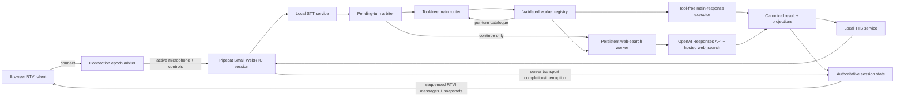

# Task: Pipecat Web-Search Subagent and Browser RTVI Lab

**Status**: Not Started
**Component**: Pipecat subagents
**Assigned to**: Codex
**Priority**: Medium
**Branch**: feature/websearch-subagent-electron
**Created**: 2026-07-11
**Completed**:
**Review Gates**: full

## Objective

Build a small Pipecat-native voice-assistant lab whose fast, tool-free main model classifies each utterance, selects or creates a context-owning specialist worker, and delegates web-capable requests to a worker with OpenAI hosted web search. Use a plain browser RTVI client for microphone input, synthesized audio, worker visibility, grounded search results, and explicit observation of text-versus-speech behavior during interruption. Defer Electron packaging and desktop lifecycle concerns to a separate follow-up plan.

## Context

This repository is an experimental home for future specialist-subagent types. The first experiment is intended to reveal good routing, model-selection, topic-affinity, and interruption policies rather than hard-code them prematurely.

The main model is a fast OpenAI routing model with no directly registered external tools. It decides whether the request is answerable directly, unavailable to the current system (for example, private calendar data), needs clarification, or belongs with a specialist. A persistent web-search worker may use a more capable configurable model and the OpenAI Responses API hosted `web_search` tool. The worker owns search-query refinement, clarification when required, search execution, grounded answer generation, and its topic context.

A browser client is the smallest useful RTVI surface for this experiment. It avoids Electron navigation and process-lifecycle concerns while retaining browser microphone capture, Small WebRTC media, controls, structured messages, source links, and reconnect-to-known-server behavior. A later Electron plan can package the proven protocol and UI rather than co-designing packaging with the experiment.

## Requirements

- Keep the main assistant generally helpful and free of directly registered external tools.
- Make routing an explicit structured decision: `direct`, `unsupported`, `clarify`, `existing_worker`, or `new_worker`.
- Have the router choose a stable existing worker identifier or a proposed new worker type/topic; Python validates every decision before dispatch.
- Give the router an immutable per-turn catalogue of allowlisted worker IDs, types, topic summaries, statuses, and model-policy labels; validate its decision against that exact catalogue snapshot.
- Treat capability availability separately from topical similarity. A request for private calendar data must not become a web search merely because it asks for current information.
- Preserve one context per worker/topic and keep workers addressable for the Python process lifetime in the first slice.
- Keep lifecycle/eviction behind a registry policy seam; automatic reaping is out of scope until the lab produces evidence for a policy.
- Support one active browser RTVI client at a known local server address; a replacement client may reconnect to the same Python process and workers.
- Fence browser connections with a server-issued connection epoch. A replacement atomically becomes active; prior transports are disconnected or ignored for microphone/control input, snapshots, and incremental state.
- Stamp every accepted turn and in-flight operation with its originating connection epoch. On replacement, cancel old-epoch speech and mark it `interrupted_by_reconnect`; router/search work may finish and commit its canonical result, but it cannot autoplay and only the active epoch receives it through the current stream or snapshot.
- Use Pipecat Small WebRTC for browser microphone input and synthesized audio output.
- Provide explicit Connect/Disconnect and microphone controls through the Pipecat client API; do not start microphone capture before a user action.
- Produce one canonical grounded result record and derive both a concise spoken projection and a structured UI projection from it.
- Show transcript, router state, worker identity/status, worker list, structured results, and sources in the browser.
- Persist and surface a timestamped history of each worker's finalized canonical results across the session — not merely the latest — retained for the process lifetime (no eviction, consistent with the plan's existing no-eviction stance on worker lifecycle) and rebuilt from the snapshot on reconnect like other worker-projected state.
- Show each assistant result's complete display text immediately when available, while distinguishing text whose audio reached server-side transport completion from text whose delivery was interrupted/incomplete (normal versus grey/italic presentation). Do not label this as verified audible browser playout.
- Treat Pipecat logs as the authoritative diagnostic record. The browser state is a product/debug projection and must not claim to be a complete execution trace.
- On reconnect, request a fresh runtime snapshot and replace the browser's worker/result projection with server-authoritative state while retaining only clearly marked local connection diagnostics.
- Open search-result links in a new browser tab with safe link attributes.
- Treat provider citations as untrusted input and render only normalized absolute `http` or `https` URLs.
- Use the already-running local STT and TTS servers, following their verified client contracts rather than copying application-specific orchestration.
- Load required credentials from environment variables sourced from `~/.secrets/ai.env`; never copy values into source, tests, plans, logs, or commits.
- Treat live STT/TTS endpoint forms and OpenAI credential availability as preflight-verified environment assumptions, not defaults inferred from reference adapters or file existence.
- Keep router, worker, and model-selection policy configurable. Pin concrete inexpensive/current OpenAI model defaults only after verifying OpenAI and Pipecat compatibility during implementation.
- Use Python with `uv`; use Bun, plain JavaScript, HTML, and CSS for the browser client.
- Defer Electron packaging, preload/IPC, navigation policy, and desktop process ownership to a separate plan.

## Review Focus

- Whether structured routing separates capability classification, topic affinity, worker selection, and model policy without giving the main model external tools.
- Whether an invalid or hallucinated worker/model selection is rejected by deterministic Python validation.
- Whether the worker, rather than the router, owns search sanitization/refinement and domain clarification after delegation.
- Whether topic affinity is explicit enough to preserve follow-up context without leaking unrelated topics.
- Whether one canonical grounded result deterministically produces the spoken and UI projections.
- Whether displayed, queued-for-speech, started, completed, and interrupted states can be correlated without pretending text/audio alignment is exact.
- Whether RTVI readiness, interruption, reconnection, state snapshots, and message ordering are handled at the correct Pipecat seams.
- Lifecycle behavior across browser microphone capture, Small WebRTC/RTVI, local STT/TTS, main-model turns, and worker turns.

## Implementation Checklist

### Phase 1: Contracts and runtime foundation

**Impl files:** `pyproject.toml`, `server/config.py`, `server/preflight.py`, `server/contracts.py`, `shared/protocol.md`, `shared/schemas/*.json`
**Test files:** `tests/test_config.py`, `tests/test_preflight.py`, `tests/test_contracts.py`
**Test command:** `uv run pytest tests/test_config.py tests/test_preflight.py tests/test_contracts.py`
**Validation cmd:** `uv run ruff format --check . && uv run ruff check .`
**Goal:** Version and validate routing, worker-state, grounded-result, speech-progress, and snapshot contracts before either runtime consumes them.

- Initialize the Python project and pin a verified Pipecat version with the verified `openai`, `webrtc`, and `local` extras; RTVI is built in rather than installed as a separate extra.
- Pin and record the compatible Pipecat JavaScript client version alongside the Python Pipecat version pin, and verify RTVI/Small WebRTC wire compatibility between the two before Phase 4 depends on it.
- Verify `LLMContextWorker`'s actual context-retention and bus-edge (`active`, `bridged`) API, and `RTVIServerMessageFrame`'s actual payload semantics, directly against the pinned Pipecat version rather than relying on the Context Hub's 2026-07-05 index description.
- Define strict Python models and matching JSON Schemas for all versioned Python-to-browser messages.
- Reserve a nullable `origin_epoch` field (default `null`/unset pre-arbiter) on turn, result, utterance, and pending-dialogue contract models so Phase 3's connection-epoch arbiter can populate it without reopening this Phase 1 contract.
- Define configurable router/worker model policy without embedding credentials or treating model names emitted by an LLM as trusted.
- Define and validate configuration precedence for the OpenAI credential variable name, STT/TTS endpoint transport and address, server bind/known client URL, and router/worker model-policy mappings.
- Add a values-redacted preflight that verifies required variable names, detects each local service endpoint form, checks protocol/health compatibility, persists the discovered endpoint transport/address into the config surface for Phase 3 adapters to read (rather than re-discovering), and reports actionable failures without printing secrets. This preflight probe stays standalone — it must not import Phase 3 adapter code, so Phase 1 completes and commits independently of Phase 3.
- Make successful redacted configuration/service preflight a Phase 1 exit gate. Verify configured model IDs and Responses/hosted-search compatibility when credentials permit; otherwise record authenticated capability as explicitly unavailable and keep the paid smoke path opt-in rather than silently solidifying defaults.
- Freeze only the conservative utterance-level speech-progress state set (`displayed`, `queued`, `started`, `synthesis_ended`, `delivery_completed`, `interrupted`, `interrupted_by_reconnect`) in the versioned contract; mark finer word-level progress as a forward-compatible, Phase-3-gated extension rather than speculatively schema'd now.
- Document identifiers, ordering fields, timestamps, nullable fields, and forward-compatibility behavior in `shared/protocol.md`.

### Phase 2: Persistent routing and web-search workers

**Impl files:** `server/router.py`, `server/main_responder.py`, `server/registry.py`, `server/workers/base.py`, `server/workers/web_search.py`, `server/results.py`
**Test files:** `tests/test_router.py`, `tests/test_main_responder.py`, `tests/test_registry.py`, `tests/test_web_search_worker.py`, `tests/test_results.py`
**Test command:** `uv run pytest tests/test_router.py tests/test_main_responder.py tests/test_registry.py tests/test_web_search_worker.py tests/test_results.py`
**Validation cmd:** `uv run ruff format --check . && uv run ruff check .`
**Goal:** A validated routing decision selects one persistent context owner, and one canonical grounded result is the sole source for speech and UI output.

- Build an immutable per-turn worker catalogue from registry state, pass it into the tool-free router prompt, and validate the result against the same snapshot before dispatch.
- Validate action, worker ID, worker type, topic label, and configured model policy before dispatch.
- Implement a single tool-free structured-output call that both consumes the validated routing decision and generates user-facing prose for `direct`, `unsupported`, and router-owned `clarify` outcomes (collapsing the previously separate routing/response calls for these three outcomes to cut common-path latency; worker-delegated `existing_worker`/`new_worker` outcomes remain a distinct dispatch since they hand off to a different context-owning component entirely).
- Implement a process-lifetime worker registry whose workers are Pipecat `LLMContextWorker` instances (or a thin subclass), with stable IDs, topic metadata, status, an explicit no-eviction first-slice policy, and one causal mailbox per worker built on top of `LLMContextWorker`'s own `active`/`bridged` scheduling rather than a fully parallel activation model.
- Serialize each worker's operations in accepted-turn order through its mailbox. A later same-worker turn waits for earlier work and therefore reads the context after earlier immutable commits; different workers remain independently concurrent.
- Implement a context-owning web-search worker using OpenAI hosted `web_search`; let it clarify or decline requests that search cannot satisfy.
- Configure OpenAI Responses calls with `store=False` unless a later reviewed decision explicitly requires provider retention. Document which transcript/query/context fields leave the process, verify the pinned Pipecat adapter preserves the setting across worker calls, and note that `store=False` is treated as a backend-semantics assumption (its exact provider-side retention guarantee is not independently verifiable from this repo) rather than a settled fact.
- When a worker asks a clarification, record pending dialogue ownership by session with owner kind/worker ID, originating turn/result ID, and expiry, using an injectable/fake clock so expiry timing is deterministic in tests rather than wall-clock dependent.
- Arbitrate the next final transcript before dispatch using `continue`, `cancel`, `expired`, or `task_change`. Run a deterministic no-pending-owner check first: if no pending-dialogue ownership exists for the session, skip the arbiter classifier call entirely and route directly to the main router. Only when a pending owner exists does a narrow tool-free classifier see the pending question plus new transcript for semantic continuation/task-change detection. Only `continue` bypasses normal routing; `task_change` clears ownership and re-enters the main router.
- Normalize provider output into a canonical grounded-result record with citations before deriving spoken/UI projections. Treat the real OpenAI Responses hosted-search citation output shape (field path, nullability, URL encoding) as an assumption until a captured real response confirms it — the Phase 1 compatibility gate verifies model/tool availability, not output schema, so this normalizer must not be written against mocked shapes alone.
- Normalize citation titles and URLs at the server trust boundary. Accept only absolute `http`/`https` URLs; reject or omit unsupported schemes, relative/malformed/missing URLs, and deterministic duplicates before any browser message is emitted.
- Cover ambiguous follow-ups, unsupported private-data requests, new/existing topic selection, hallucinated IDs, search failure, worker-level decline (search cannot satisfy the request, distinct from routing-level `unsupported`), a `store=False` assertion on outbound Responses requests, and citation/result validation.

### Phase 3: Pipecat pipeline, local speech, and observable interruption state

**Impl files:** `server/app.py`, `server/pipeline.py`, `server/services/stt.py`, `server/services/tts.py`, `server/observers.py`, `server/session_state.py`, `server/connection_arbiter.py`
**Test files:** `tests/test_pipeline.py`, `tests/test_session_state.py`, `tests/test_rtvi_messages.py`, `tests/test_interruptions.py`, `tests/test_connection_arbiter.py`
**Test command:** `uv run pytest tests/test_pipeline.py tests/test_session_state.py tests/test_rtvi_messages.py tests/test_interruptions.py tests/test_connection_arbiter.py`
**Validation cmd:** `uv run ruff format --check . && uv run ruff check .`
**Goal:** The runtime remains authoritative for worker/result state and emits monotonic speech-progress evidence that lets the UI show what was displayed, started, completed, or interrupted.

- Wire Small WebRTC input, the verified local STT client, router/worker dispatch, the verified local TTS client, and transport output using Pipecat-native workers, frames, and observers. Route a context-owning worker's canonical result into the active connection's transport pipeline via `LLMContextWorker`'s `bridged` bus edges (the framework-native cross-worker frame-exchange mechanism), rather than an ad hoc queue or direct call — this is the named worker-to-transport frame path referenced in Integration Seams.
- Assign monotonic session sequence numbers plus stable turn/result/utterance IDs to state-bearing messages.
- Persist an ordered, unbounded (process-lifetime) history of each worker's canonical results — not only a latest-result pointer — so the browser can render a full timestamped result log and rebuild it from a snapshot after reconnect.
- Emit full result/UI data independently of slower speech playback.
- Track synthesis and server-side transport delivery separately. TTS stop means `synthesis_ended`, not `delivery_completed`; a downstream transport-output seam may mark `delivery_completed`, but the protocol must state that this is not proof of browser decode, playout, or audibility.
- Do not claim word-accurate spoken progress unless implementation evidence proves an available timing/alignment seam; the initial UI may conservatively mark the whole utterance as spoken only on completion and otherwise mark it incomplete.
- On barge-in, cancel current server-side transport output through Pipecat's interruption path, preserve the completed grounded result, route the new user turn, and do not automatically resume discarded audio. Residual audio already buffered in the browser is unverified in this slice.
- Preserve enough state for a later policy experiment to offer resume/replay, without implementing autonomous relevance judgment in this slice.
- Implement snapshot request/response after client readiness or reconnection.
- Resolve delivery races with a monotonic state machine: `completed` and `interrupted` are terminal, first-terminal-wins outcomes; duplicate, late, and stale events cannot change a terminal utterance.
- Issue a connection epoch on activation. Atomically promote a replacement client and disconnect or ignore every older epoch across audio/control input, snapshot requests, outbound state, and sequence streams.
- On replacement, cancel old-epoch speech delivery and record `interrupted_by_reconnect`. Allow already-running router/provider work to commit a canonical result without speech; route every asynchronous callback through epoch-aware session state so only the active epoch receives incremental state.
- Bound late old-epoch commits to append-only immutable result/context records tied to the origin turn. They cannot change active routing/status, pending-dialogue ownership, latest-result pointers, or speech scheduling unless the origin turn is still current; same-worker completions retain accepted-turn order and newer active turns supersede late interactive side effects.

### Phase 4: Plain browser RTVI client

**Impl files:** `web/package.json`, `web/index.html`, `web/src/app.js`, `web/src/state.js`, `web/src/render.js`, `web/src/styles.css`
**Test files:** `web/test/state.test.js`, `web/test/render.test.js`, `web/test/protocol.test.js`
**Test command:** `cd web && bun test`
**Validation cmd:** `cd web && bun run lint`
**Goal:** The browser renders the server-authoritative lab state and makes text-versus-speech divergence visible without becoming a second diagnostic authority.

- Build Connect/Disconnect and microphone controls with the Pipecat JavaScript client and Small WebRTC transport.
- Test that page initialization and connection do not acquire/publish microphone media before the explicit user gesture, and that disconnect disables capture.
- Render transcript, current routing state, persistent worker list, per-result worker identity, structured answer, and sources.
- Apply RTVI messages in session-sequence order; ignore duplicates, detect gaps, and request a snapshot when state may be incomplete. Discard any incremental message whose sequence number is older than the last-applied snapshot's sequence, so a snapshot arriving while older increments are still in flight cannot be superseded by them.
- Render completed spoken text normally and incomplete/unspoken text grey and italic using the conservative utterance-level status from Phase 3.
- Keep worker inspection limited to identity, topic, model policy label, status, and the worker's history of finalized canonical results (timestamped, unbounded for the process lifetime); full private prompts/context and raw logs remain server-side.
- Render a persistent, timestamped result log as a full-width row below the live two-column transcript/inspector layout, distinct from the live per-turn view. Each entry shows worker identity, turn, timestamp, and a one-line summary with source count; entries expand to the full structured answer and sources. This is a session-spanning historical view, not a duplicate of the live result already shown inline in the transcript for the current turn.
- Open source URLs in new tabs using `target="_blank"` and `rel="noopener noreferrer"`.
- Assert every rendered source-link path includes `target="_blank"` plus both `noopener` and `noreferrer` tokens.
- Reconnect to the known server endpoint and replace runtime projections from the returned snapshot.
- Preserve only explicitly labelled local connection diagnostics across snapshot replacement; stale server projections are replaced and local diagnostics cannot be rendered as server-authored state.

### Phase 5: Integrated verification and documentation

**Impl files:** `README.md`
**Test files:** `tests/integration/test_browser_session.py`
**Test command:** `uv run pytest && (cd web && bun test)`
**Validation cmd:** `uv run ruff format --check . && uv run ruff check . && (cd web && bun run lint) && git diff --check`
**Goal:** Demonstrate routing, persistence, grounding, reconnect, and interruption invariants end to end before designing Electron packaging.

- Add a local runbook covering server, browser client, existing STT/TTS services, environment loading, and known endpoint configuration.
- Keep Phase 5 protocol work prose-only. Any semantic contract change discovered during integration returns to Phases 1, 3, and 4 and lands JSON Schemas, Python models/emission, browser reducers, protocol prose, and affected tests together before final verification.
- Verify direct, unsupported, clarify, new-worker, and existing-worker routing paths.
- Verify one worker retains same-topic context and unrelated topics remain isolated.
- Verify UI results can precede speech, interruption stops audio without deleting the result, and the UI visibly reports incomplete speech.
- Verify closing/reopening the page reconnects to the same Python process and rebuilds the worker/result projection from a snapshot.
- Verify replacement-client fencing: the new epoch becomes authoritative and an old still-live client cannot send accepted audio/controls or mutate/receive the new sequence stream.
- Run a required credential-safe local media acceptance procedure that proves Small WebRTC connection, user-initiated microphone capture, live local STT/TTS interaction, and audible browser output. Keep the paid authenticated OpenAI web-search smoke test separate and opt-in.
- Run formatting, linting, full tests, a staged secret scan, documentation review, code review, and security review before any push.
- Use the evidence from this lab to create a separate Electron plan covering packaging, preload/IPC boundaries, external navigation, and process ownership.

## Technical Specifications

### Verified Starting Facts

- The repository was initialized at `/Users/vr000m/Code/pipecat-ai/pipecat-subagents-lab`; no implementation manifest exists yet.
- The Pipecat Context Hub snapshot refreshed 2026-07-05 indexes `LLMContextWorker` as a self-contained context-owning LLM worker and `RTVIServerMessageFrame` as the arbitrary server-message frame.
- Pipecat documents `pipecat-ai[webrtc]` for the server-side Small WebRTC transport.
- Pipecat's JavaScript Small WebRTC transport includes ICE reconnection handling, but the higher-level client session lifecycle still requires explicit reconnect/session handling after a completed disconnect.
- RTVI defines `client-ready` after media channels connect; state snapshots must be sent after this readiness boundary rather than assumed to arrive during page initialization.
- OpenAI's Responses API exposes hosted `web_search` through the request `tools` configuration; this is API capability and billing, not inherited ChatGPT/Codex product access.
- The reference local STT adapter uses `SegmentedSTTService` and the `pipecat-local-stt-server` client over a Unix-domain socket.
- The reference local TTS adapter subclasses Pipecat `TTSService` and uses the `pipecat-local-tts-server` client over a Unix-domain socket.
- Current Pipecat packaging exposes `openai`, `webrtc`, and `local` extras; RTVI is part of the core package rather than a separate extra.
- `~/.secrets/ai.env` exists; its contents and values have not been read into this plan.

### Environment Assumptions Requiring Preflight

- The live STT and TTS services may use different endpoint transports and addresses than the reference UDS adapters. Implementation must discover and health-check each configured endpoint before choosing defaults.
- `~/.secrets/ai.env` existence does not establish that an OpenAI API credential variable is present, authorized, or funded. Preflight checks variable presence without printing its value; the authenticated hosted-search smoke test remains opt-in.
- The live STT service's final-transcript/segmentation behavior compatible with `SegmentedSTTService` is assumed, not preflighted — endpoint reachability and health are distinct from transcript semantics. The required local media acceptance procedure (Phase 5) must include a smoke assertion that a final transcript is actually produced, separate from the endpoint-form/health preflight.
- The pinned local TTS adapter emitting an observable `synthesis_ended` frame is assumed, not verified in-repo. Confirm the adapter produces this signal before relying on it for delivery-state styling; if it doesn't, the coarse completion/incomplete styling needs a different seam.
- The OpenAI Responses hosted `web_search` output/citation shape (field path, nullability, URL encoding) is assumed from documentation, not pinned against a real response. The Phase 1 compatibility gate verifies model/tool availability, not output schema — capture one real response (when credentials permit) to pin the shape before the normalizer is finalized; otherwise keep the normalizer's mocked-shape assumption explicitly flagged as unverified.
- The exact hosted `web_search` tool-type string and request `tools` shape is assumed from a documentation snapshot; tool naming has drifted historically (e.g. `web_search` vs `web_search_preview`). Pin the exact string/shape during the Phase 1 compatibility gate rather than assuming it from the snapshot description.
- `LLMContextWorker`'s context-retention/bus-edge (`active`, `bridged`) behavior and `RTVIServerMessageFrame`'s payload semantics are asserted from the Context Hub's 2026-07-05 index description, not verified against the pinned Pipecat version. Phase 1 adds an explicit verification step against the pinned version itself.

Corrections to verified paths, patterns, or dependencies above alter the immutable contract and require a fresh plan review.

### Files to Modify

- `README.md` — replace the placeholder description with the verified browser-first runbook and experiment boundaries.
- `docs/dev_plans/20260711-feature-websearch-subagent-electron.md` — retain this original path for continuity while explicitly documenting the browser-first scope and deferred Electron follow-up.

### New Files to Create

- `pyproject.toml` — Python dependencies, scripts, Ruff, and pytest configuration.
- `server/` — configuration, versioned contracts, router, worker registry, web-search worker, canonical result projection, Pipecat pipeline, speech services, observers, and session state.
- `tests/` — unit and integration coverage for contracts, routing, persistence, projections, RTVI ordering, interruption, and reconnect.
- `shared/protocol.md` and `shared/schemas/*.json` — versioned cross-runtime contracts.
- `web/` — Bun-managed plain HTML, JavaScript, and CSS RTVI client plus tests.

### Architecture Decisions

- **Browser before Electron:** prove the voice, routing, state, and interruption contracts in a normal browser; package them in a separately reviewed Electron plan later.
- **Tool-free main router:** the main model receives no external tools. It returns a validated routing decision and remains the user-turn coordinator.
- **Capability before topic:** routing first distinguishes direct/unsupported/clarify/specialist capability, then selects an existing topic worker or proposes a new one.
- **Snapshot-bound routing:** the registry supplies an immutable worker catalogue for each routing turn; the router can select only entries from that snapshot, and dispatch validates against the identical snapshot to prevent stale or hallucinated IDs.
- **Collapsed main response generation:** `direct`, `unsupported`, and main-owned `clarify` actions are produced by a single tool-free structured-output call that both validates the routing decision and generates user-facing prose, trading the previously-considered schema/prose separation for lower latency on the common path (explicit override of the initial two-call design after a latency-vs-separation-of-concerns review); worker-delegated outcomes (`existing_worker`/`new_worker`) remain a separate dispatch since they hand off to a different context-owning component. All results then enter the same canonical result/delivery path.
- **Worker-owned search judgment:** once delegated, the web worker refines/sanitizes queries, decides whether web search is sufficient, asks domain clarification, and returns a grounded result.
- **Process-lifetime vs connection-lifetime boundary:** the worker registry, workers, canonical results, pending-dialogue state, and the session sequence counter are process-lifetime and outlive any single connection. The Pipecat pipeline task, transport, STT/TTS services, and RTVI processor are connection-lifetime and are rebuilt on each new/replacement connection; the connection arbiter's promotion step re-attaches a freshly built pipeline task to the surviving process-lifetime state rather than recreating it.
- **Worker identity and frame path:** registry workers are Pipecat `LLMContextWorker` instances (or a thin subclass) rather than a fully custom activation model, so the mailbox composes with `LLMContextWorker`'s own `active`/`bridged` scheduling instead of duplicating it. A worker's canonical result reaches the active connection's transport pipeline (for TTS) via `LLMContextWorker`'s `bridged` bus edges — the framework-native cross-worker frame-exchange mechanism — not an ad hoc queue.
- **Per-turn LLM call count is documented, not implicit:** the hot `direct` path issues at most two sequential LLM calls (the no-owner-gated pending-turn arbiter is skipped when nothing is pending; the collapsed router+response call). A delegated-worker path adds the worker's own hosted-search call. This is stated explicitly so the latency profile is visible to implementers and the lab's interruption/UX findings.
- **Pending dialogue ownership:** a worker clarification temporarily owns the next final user transcript for that session. Explicit cancellation/task change or expiry clears ownership; otherwise continuation bypasses generic topic routing and returns to the asking worker.
- **Pending-turn arbitration:** deterministic cancellation/expiry checks run first, followed by a narrow tool-free semantic classifier over the pending question and new transcript. Only `continue` reaches the prior worker; `task_change` clears ownership and returns the untouched utterance to normal routing.
- **Registry-controlled persistence:** Python owns stable worker IDs and contexts. Router output is advisory and cannot instantiate arbitrary classes or models.
- **Per-worker causal mailbox:** each worker executes one accepted turn at a time in acceptance order. This makes context visibility and commit order deterministic across reconnects while preserving concurrency between different workers.
- **Policy-labelled model selection:** routing may select only a configured policy label such as `fast`, `balanced`, or `deep`; Python maps labels to verified model IDs and budgets.
- **Canonical result, two projections:** provider output becomes one validated grounded result; spoken and UI forms are deterministic projections of that record.
- **Result and delivery are separate:** complete UI text may appear before TTS finishes. Result state survives interruption; speech-delivery state records whether its audio completed.
- **Transport completion is not audibility:** TTS completion only closes synthesis. The initial UI may style server-side `delivery_completed` versus incomplete delivery, but labels it precisely and never claims browser receipt or audible completion. Per-utterance browser playout acknowledgement is deferred until a verifiable client seam exists.
- **Coarse first-slice speech evidence:** only claim the granularity supported by observed Pipecat frames. Word-level black/grey splitting is conditional on verified alignment; otherwise mark complete versus incomplete utterances conservatively.
- **Server-authoritative snapshot:** Pipecat logs are diagnostic authority and Python runtime state is projection authority. Reconnected browsers rebuild from a versioned snapshot.
- **Single-client fencing:** a connection arbiter owns monotonically increasing epochs, atomically promotes replacements, and rejects all traffic from stale transports.
- **Epoch-owned in-flight work:** turns, router/search tasks, results, and utterances carry their origin epoch. Replacement cancels old speech, permits canonical result completion without autoplay, and exposes committed state only to the active epoch.
- **Causal late-commit policy:** an old-origin completion may append its immutable turn/result/context record, but cannot regain dialogue ownership, replace active/latest pointers, alter current worker/routing status, or schedule speech after a newer epoch accepts work. Same-worker results retain accepted-turn order.
- **Provider minimization:** OpenAI Responses use `store=False` by default and the runbook names data leaving the process plus any account-level retention limitation.
- **No `UIWorker` initially:** structured RTVI messages are sufficient because the server does not observe or manipulate browser UI state.
- **Unbounded per-worker result history, not latest-only:** each worker's finalized canonical results are retained and exposed for the full process lifetime (no eviction), mirroring the plan's existing no-eviction stance on worker lifecycle. This supersedes the earlier "latest result only" worker-inspection limit. The browser renders this as a persistent, timestamped Result Log distinct from the live transcript view, and reconnect rebuilds it from the snapshot like other worker-projected state.

### Integration Seams

| Producer | Contract | Consumer | Verification |
|---|---|---|---|
| Local STT adapter | Final user transcript with turn ID | Main router | Contract test plus local-server integration smoke test |
| Worker registry | Immutable per-turn worker catalogue | Main router and dispatch validator | Same-snapshot selection, stale-ID, and mutation tests |
| Main router | Validated routing decision and policy label | Worker registry/dispatcher | Schema tests, allowlist rejection, and routing matrix |
| Main router | Validated direct/unsupported/clarify intent | Tool-free main-response executor | Outcome matrix and no-tools assertion |
| Worker registry | Stable worker identity, topic, context owner, status | Dispatcher and UI snapshot | Persistence/isolation tests |
| Per-worker causal mailbox | Ordered accepted turns and post-prior-turn context | Context-owning worker | Same-worker serialization/order and cross-worker concurrency tests |
| Pending dialogue state | Session-scoped clarification owner and expiry | Transcript dispatcher | Continuation, cancellation, task-change, and expiry tests |
| Pending-turn arbiter | `continue`/`cancel`/`expired`/`task_change` plus owner ID | Prior worker or main router | Deterministic cancel/expiry and classifier boundary tests |
| Web worker | OpenAI hosted-search response | Canonical result normalizer | Mocked provider shapes, missing citations, and failure tests |
| Context-owning worker (`LLMContextWorker`) | Canonical result via `bridged` bus edge | Active connection's transport pipeline | Bridged-edge delivery test; verified against pinned Pipecat version, not the index snapshot |
| Result normalizer | Versioned grounded result | Speech projector and UI projector | Projection equivalence/invariant test |
| Speech projector/local TTS | Utterance ID, audio frames, synthesis lifecycle | Small WebRTC output and session state | Synthesis/transport distinction tests |
| Downstream transport observer | Utterance-correlated server transport completion/interruption | Session delivery state | Precise transport-completion labeling and race tests |
| Session state | Sequenced incremental messages and full snapshot | Browser state reducer | Duplicate, gap, stale-session, and reconnect tests |
| Session state | Ordered per-worker canonical-result history (timestamped, unbounded, process-lifetime) | Browser Result Log panel | Reconnect-rebuild, ordering, and no-silent-eviction tests |
| Browser controls | RTVI connect/disconnect, microphone state, snapshot request | Pipecat session | Readiness and lifecycle integration test |
| Connection arbiter | Active/origin connection epochs and fencing decision | Pipecat sessions, async callbacks, and state emitter | Replacement, stale-client, and in-flight race tests |

## Architecture & Call Flow



```mermaid
sequenceDiagram
    participant B as Browser
    participant A as Connection epoch arbiter
    participant P as Pipecat session
    participant S as Local STT
    participant D as Pending-dialogue dispatcher
    participant R as Main router
    participant W as Worker registry/search worker
    participant M as Tool-free main responder
    participant O as OpenAI web_search
    participant T as Local TTS

    B->>A: Connect and request activation
    A->>P: Promote epoch; fence prior transport
    P-->>B: client-ready for active epoch
    P-->>B: Runtime snapshot
    B->>P: Microphone audio
    P->>S: Audio frames
    S-->>D: Final transcript + turn ID
    alt Arbiter outcome is continue
        D->>W: Continue with owning worker
    else No owner, cancel, expired, or task_change
        W-->>R: Immutable worker catalogue snapshot
        D->>R: Transcript + catalogue reference
        R->>W: Route validated against same snapshot
    alt Direct, unsupported, or main clarification
        W->>M: Validated response intent
        M-->>P: Canonical direct result
    else Existing/new worker
    opt Web-capable worker needs current information
        W->>O: Responses request with hosted web_search
        O-->>W: Search output and citations
    end
    W-->>P: Canonical grounded result
    end
    end
    P-->>B: Complete UI result + worker metadata
    P->>T: Concise spoken projection + utterance ID
    T-->>B: Audio via Small WebRTC
    P-->>B: Speech queued/started events
    P-->>B: Server delivery_completed after transport evidence
    alt User barges in
        B->>P: New microphone speech
        P-->>B: Previous utterance interrupted
        P->>D: New final transcript
    end
```

| Step | Trigger | Enters context | Cleared/persisted | Turn boundary |
|---|---|---|---|---|
| 1 | Browser connects and becomes ready | Connection epoch and client/session identity | New epoch fences the prior transport; Python process state persists | No |
| 2 | Server sends snapshot | Worker/result/delivery projection enters browser state | Replaced by newer sequenced state or next snapshot | No |
| 3 | Local STT emits final transcript | User utterance enters pending-dialogue dispatcher | Routed to pending owner if valid; otherwise enters main router | Yes: user turn begins |
| 4 | Registry snapshots workers and router returns decision | Catalogue plus capability, topic, worker, and policy label enter routing state | Snapshot and decision are retained with the turn | No |
| 5 | Existing/new worker accepts task | Utterance and relevant routing metadata enter exactly one worker context | Worker context persists until explicit future eviction | No |
| 6 | Worker searches/clarifies/responds | Search queries, results, citations, and worker response enter worker context | Persist in that worker; clarification records temporary dialogue ownership | Yes: worker sub-turn completes |
| 7 | Canonical result is accepted | Grounded result enters server session state | Persists for reconnect and later delivery inspection | No |
| 8 | UI projection is emitted | Full result enters browser state | Persists until snapshot/session replacement | No |
| 9 | Spoken projection is synthesized | Utterance enters TTS/delivery state | Audio queue may be cleared on interruption; result persists | No |
| 10 | Server transport delivery completes or is interrupted | Precisely labelled delivery outcome enters server/browser projection | Outcome persists with result/utterance ID; audibility remains unclaimed | Yes: assistant delivery boundary |
| 11 | New speech interrupts playback | New audio enters STT while prior delivery closes as interrupted | Prior unplayed audio is discarded; prior result remains | Yes: next user turn begins |

## Testing Notes

- Unit tests use fake router/provider/local-service boundaries; they must not call paid APIs or require running STT/TTS servers.
- Contract tests validate JSON Schema and Python model agreement, version rejection, monotonic sequence handling, and unknown-field policy.
- Preflight tests cover missing credentials, every configured endpoint transport, precedence, unreachable services, health/protocol mismatch, model/tool compatibility reporting, and captured-output/exception redaction of supplied secret values.
- Routing tests cover direct knowledge, current public facts, private calendar requests, underspecified weather/location requests, ambiguous topic follow-ups, and hallucinated worker/model choices.
- Boundary tests reject/ignore router-emitted search-query refinement fields and prove only the delegated web worker sanitizes/refines queries or asks domain clarification before hosted search.
- Invariant test: every spoken and UI projection cites the same canonical result ID, and neither can introduce facts or sources absent from that result.
- Interruption tests distinguish result availability from audio completion and prove that barge-in preserves UI/result state while closing the utterance as interrupted.
- Delivery-race tests cover interruption before start, interruption after start, late completion after interruption, duplicate terminal events, and stale events from an earlier utterance; exactly one terminal outcome wins per utterance.
- State-machine and browser reducer/render tests cover `displayed`, `queued`, `started`, `synthesis_ended`, `delivery_completed`, `interrupted`, and `interrupted_by_reconnect`; assert legal monotonic transitions, exact labels/styles, and that `synthesis_ended` never produces completed styling.
- Replacement-race tests cover replacement during routing, hosted search, synthesis, and transport delivery. Old-epoch speech becomes `interrupted_by_reconnect`; canonical results may commit without autoplay; stale callbacks cannot emit to or mutate the active epoch except through epoch-checked authoritative state.
- Repeated-replacement tests exercise A -> B -> C while A-origin work completes: one immutable canonical commit, no A/B delivery, exactly-once C visibility by incremental event or snapshot, no autoplay, and a terminal old utterance. A second race has a new-epoch turn precede an old result/clarification and proves the late completion cannot seize dialogue ownership, latest pointers, or active status.
- Same-worker causal tests accept turns A then B across replacement, hold A in flight, and prove B does not execute until A commits; B observes A's committed context, history remains A-before-B, each result commits/appears exactly once, and A cannot regain interactive ownership or autoplay. A separate test proves different workers remain concurrent.
- Reconnect tests prove a new page/client instance can reconstruct workers, results, and delivery outcomes from the same Python process.
- Reconnect reducer/render tests seed stale runtime state plus local diagnostics, then prove snapshots replace only runtime projections while retaining diagnostics with an explicit local label.
- Citation tests cover `javascript:`, `data:`, relative, malformed, duplicate, missing, and valid absolute HTTP(S) URLs before rendering.
- Browser tests prove media acquisition/publication waits for an explicit user action, disconnect disables capture, and every external source link carries safe new-tab attributes.
- Local STT/TTS and Small WebRTC media acceptance is required and credential-safe; the authenticated OpenAI `web_search` smoke test remains opt-in and never exposes secret values.
- Web-worker test asserting outbound OpenAI Responses request kwargs include `store=False`, and that the pinned adapter does not drop it across successive same-worker calls.
- Web-worker test for the decline path: the mocked classifier decides web search cannot satisfy the request, and the worker returns a decline/clarify result without calling hosted search — distinct from a routing-level `unsupported` outcome and from a hosted-search failure.
- Session/readiness test asserting the first runtime snapshot is gated on the `client-ready` boundary and is not emitted during page initialization, complementing the existing reconnect-snapshot tests.
- No-tools assertion extended to the pending-turn arbiter's semantic classifier (currently only asserted for the main router/main-response call), proving continuation/task-change detection runs without registered tools.
- Reducer test seeding a snapshot at sequence N, then delivering a stale increment with sequence < N, asserting the stale increment is discarded rather than applied.
- Pending-dialogue expiry tests use an injected/fake clock so expiry timing is asserted deterministically rather than depending on wall-clock elapsed time.
- Result-log tests prove the per-worker result history persists across reconnect (rebuilt from snapshot), preserves timestamp/turn ordering, and never silently truncates or evicts entries within the process lifetime.

## Acceptance Criteria

- The main model has no external tools registered and all router output passes deterministic Python validation.
- Every routing turn selects against an immutable registry catalogue, and stale or hallucinated IDs fail validation against that same snapshot.
- The router can choose direct, unsupported, clarify, existing-worker, and new-worker paths without turning unavailable private-data requests into web searches.
- At least two topic workers can coexist, same-topic follow-ups return to the chosen worker, and unrelated worker contexts remain unchanged.
- Web-search workers use OpenAI hosted `web_search` and return validated citations through one canonical grounded-result record.
- Hosted Responses calls use the documented retention setting, default to `store=False`, and never send a router-created refined query; citation URLs reaching the browser are normalized absolute HTTP(S) URLs.
- Spoken and UI projections share a canonical result ID and cannot diverge in grounded facts or sources.
- One browser client can connect through Small WebRTC, explicitly control microphone state, receive TTS audio, and render transcript, routing, workers, results, and links.
- UI results may render before delivery completion; server transport-completed versus interrupted/incomplete delivery is visibly distinguishable and precisely labelled without claiming verified browser playout.
- Barge-in cancels current server-side transport output, records `interrupted`, preserves the prior result, and routes the new turn without automatically resuming discarded audio; residual browser-buffered playout is explicitly unverified.
- A worker clarification deterministically owns the next applicable user turn until answered, explicitly cancelled, superseded by a task change, or expired.
- Closing and reopening the browser reconnects to the known Python instance and rebuilds state from a fresh snapshot.
- Reconnection preserves only clearly labelled local connection diagnostics, and a replacement connection epoch fences all stale-client traffic.
- Browser state schema excludes raw logs and full prompts/context (worker inspection is limited to identity, topic, model-policy label, status, and latest result); Pipecat logs remain the authoritative diagnostic trail.
- The `direct`, `unsupported`, and main-owned `clarify` outcomes are produced by a single structured-output call that both validates the routing decision and emits user-facing prose; the pending-turn arbiter classifier is skipped via a deterministic no-pending-owner check rather than invoked as an LLM call on every turn.
- Full Python and browser test suites, formatting, linting, secret scan, documentation review, code review, and security review pass before push.
- Required local acceptance evidence demonstrates user-initiated microphone capture, Small WebRTC media, live local STT/TTS, and audible output; paid OpenAI smoke verification is reported separately when credentials are available.
- Normal-versus-grey styling is backed by server transport completion rather than TTS synthesis completion and is labelled as delivery state, not verified audible speech.
- Each worker's finalized results accumulate in a persistent, timestamped log surviving reconnect (not just a "latest result" pointer), rendered separately from the live transcript view.
- No Electron code is implemented under this plan; a follow-up plan is created only after the browser lab establishes stable contracts.

<!-- reviewed: 2026-07-12 @ c1c986514bad1afe437e794c1b8da97ce422bcc5 -->

## Progress

- [x] Python and client product questions answered
- [x] Browser-first architecture drafted
- [x] Plan reviewed and findings addressed
- [ ] User confirmed implementation may begin
- [ ] Implementation completed and verified

## Findings

- A plain browser is the correct first client because it exercises the Pipecat JavaScript client, Small WebRTC, RTVI controls/messages, microphone, audio, reconnect, and links without Electron-specific lifecycle or security work.
- Worker visibility is useful for the interruption experiment, but raw prompts, full contexts, and logs should remain server-side; the UI needs worker identity/status, results, and delivery state.
- Full result text and speech delivery are distinct timelines. The protocol must correlate them using stable IDs and must not infer word-level progress without a verified timing seam.
- Automatic replay/resume and relevance judgment after interruption remain follow-up experiments; the first slice records enough state to evaluate them.

## Issues & Solutions

- **Electron increased first-slice scope:** defer it to a separate plan after the browser protocol and interruption UX are proven.
- **Requested word-level spoken styling may exceed available evidence:** start with conservative utterance-level completion/interruption styling and promote to finer progress only if Pipecat events provide verifiable alignment.

## Final Results

Not implemented yet.
