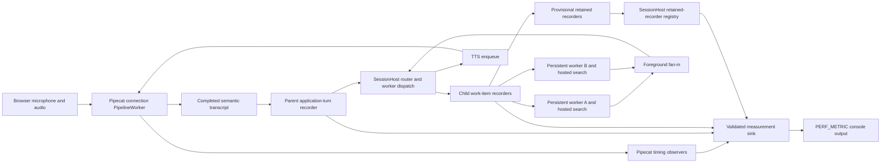

# Task: Add Pipecat-native latency observability

**Status**: Not Started
**Component**: Pipecat subagents
**Assigned to**: Codex
**Priority**: Medium
**Branch**: feature/latency-observability-v0.1.2
**Created**: 2026-07-27
**Review Gates**: full

## Objective

Add grep-friendly, console-only performance telemetry for pipeline startup,
conversation turns, user-to-bot speech latency, application routing, delegated
search, and retained background completion. Use Pipecat 1.6.0 observers for
framework-owned timing and retain explicit application timers for work that
executes outside Pipecat service processors.

## Context

The v0.1.1 runtime logs `routing_ms`, `search_ms`, and `total_ms` only after the
normal delegated-search path. Direct responses, clarification, failures,
cancellation, and retained background completion can return through other paths
without an equivalent terminal measurement. The latest delegated measurement is
also held in one mutable `SessionHost.last_turn_metrics` dictionary, primarily
for the paid smoke harness.

Pipecat 1.6.0 provides three relevant observer capabilities:

- `TurnTrackingObserver` tracks Pipecat conversation-turn start, end, duration,
  and interruption. `PipelineWorker` enables it by default.
- `UserBotLatencyObserver` measures user-to-bot speech latency and can consume
  Pipecat `MetricsFrame` data for service-level breakdowns.
- `StartupTimingObserver` measures processor startup and transport readiness.
  Small WebRTC reports client connection timing but no SFU-only bot connection
  timing.

These observers see pipeline frames, but the router, persistent-worker
selection, hosted web search, foreground timeout, and retained background
completion are application operations. Framework and application measurements
therefore need separate producers with a shared console format. This release
does not project performance telemetry through RTVI or add it to browser state.

## Requirements

- Prefix every performance line with the exact literal `PERF_METRIC`.
- Emit one single-line, grep-friendly `key=value` record per event, with
  `event=<stable_name>` immediately after the prefix and `schema=1` immediately
  after the event.
- Treat the event registry, field names, units, value grammar, outcome enums,
  cardinality, and unknown-field rejection rules below as a versioned
  operator-facing contract.
- Report durations in milliseconds with consistent field names and no
  transcript, prompt, response, citation URL, provider payload, credential, or
  exception detail.
- Include the available correlation fields: `session_id`, `origin_epoch`,
  `connection_worker`, Pipecat turn number, application `turn_id`,
  `work_item_id`, `result_id`, and `app_worker_id`. Keep connection-worker and
  application-worker identity distinct. Do not guess an application turn ID
  for a framework event when the mapping is ambiguous.
- Add one `StartupTimingObserver` and one `UserBotLatencyObserver` to each
  browser connection's `PipelineWorker`.
- Use the default `PipelineWorker.turn_tracking_observer`; do not create a
  duplicate `TurnTrackingObserver`.
- Enable Pipecat processor metrics so `UserBotLatencyObserver` can emit the
  breakdown supported by processors that actually produce `MetricsFrame` data.
- Keep the Pipecat turn-end timeout independent from Smart Turn's user-input
  completion timeout. Do not change either timeout as part of observability.
- Emit application foreground timing exactly once for every accepted semantic
  turn, including direct, unsupported, clarification, worker completion,
  retained acknowledgement, decline, timeout, user control, cancellation, and
  safe-error outcomes.
- Model a multi-intent semantic turn as one parent `app_turn_foreground` event
  plus one `work_item_foreground` event per child. The parent records fan-out
  and exhaustive fan-in counters and a truthful aggregate outcome; child events
  retain worker-specific timing and outcomes. Every application metric uses the
  parent semantic `turn_id`; `work_item_id` and `result_id` identify children.
- Emit a separate correlated terminal event for retained background work,
  including completed, failed, cancelled, stale-epoch, invalid-result, and
  duplicate-suppression outcomes.
- Report retained work, commit, and speech as independent outcome axes so a
  successful search whose result is suppressed or cannot be spoken is not
  mislabeled as a failed search.
- Route all measurements through an injectable sink. Production uses only a
  console sink; tests and the smoke harness may inject an in-memory collector
  keyed by `turn_id` and `work_item_id`. The production host must not retain a
  latest-value measurement cache.
- `SessionHost` owns the one sink instance for its process-lifetime session.
  The application composition root defaults it to the console sink and passes
  the same instance to connection observers and application recorders; tests
  and smoke construct the host with a collecting sink.
- Observer handlers must capture an immutable connection context containing
  only `session_id`, `origin_epoch`, and `connection_worker`, plus the sink and
  logger. They must not retain or mutate the host, runtime, pipeline worker,
  publisher, or session state.
- Before implementation, verify observer import paths, constructor signatures,
  callback events and payloads, default turn-tracker behavior, metrics
  enablement, and Small WebRTC timing fields against the exact locked Pipecat
  1.6.0 artifact rather than relying only on the Context Hub's newer source
  commit.
- Preserve the paid smoke harness's deterministic latency-budget checks while
  migrating it away from depending on a stale previous turn's mutable metrics.
- Keep telemetry in the server console. Do not change `shared/` schemas,
  `server/rtvi_messages.py`, browser reducers, browser rendering, or the v1.0
  protocol.
- Add no new runtime dependency and preserve Pipecat 1.6.0 compatibility.
- Prepare the coordinated v0.1.2 release metadata in `CHANGELOG.md`,
  `pyproject.toml`, `uv.lock`, and `web/package.json` without changing the
  dependency set.

## Review Focus

- Prove that each accepted semantic turn emits exactly one foreground terminal
  event across every return and exception path in `_handle_transcript_impl`,
  `_handle_pending`, and `_handle_multi_intent` — all three are terminal-path
  owners for accepted semantic turns.
- Prove that every registered retained work item emits exactly one background
  terminal event, while callbacks after finalization emit none, and that stale,
  cancelled, invalid, duplicate, disconnected, and TTS-less outcomes are
  accurately labelled without changing existing lifecycle behavior.
- Prove that multi-intent fan-out emits one parent and one child event per work
  item, including mixed, retained, and partially failed fan-in results.
- Verify that observer callbacks cannot keep a replaced connection alive or
  mutate authoritative session state.
- Verify that the default turn tracker is used once, and that observer turn
  numbers are not falsely presented as application `turn_id` values.
- Confirm `enable_metrics=True` does not change media behavior and that missing
  processor metrics produce a partial breakdown rather than an error.
- Treat `PERF_METRIC` field names and event names as an operator-facing logging
  contract; formatter tests reject unknown, multiline, malformed, non-finite,
  or structurally invalid fields, while producer tests prove sensitive/content
  inputs never enter allowed identity fields.
- Confirm the scope remains console-only and causes no RTVI protocol or browser
  state drift.

## Implementation Checklist

All three phases land as sequential commits on `feature/latency-observability-v0.1.2`
per AGENTS.md's feature-branch workflow; the branch merges to `main` only after
Phase 3's validation gate passes, not phase-by-phase.

### Phase 1: Performance log contract and Pipecat observers

**Impl files:** `server/perf_metrics.py`, `server/app.py`,
`server/pipeline.py`, `README.md`, `docs/architecture.md`
**Test files:** `tests/test_perf_metrics.py`, `tests/test_app.py`,
`tests/test_pipeline.py`
**Test command:** `uv run pytest tests/test_perf_metrics.py tests/test_app.py tests/test_pipeline.py -q`
**Goal:** Framework-owned timings must be emitted through one safe, stable
console contract without duplicating Pipecat's default turn tracker.

- Verify the selected observer imports, constructors, callback event names and
  payloads, default tracker property and timeout, `enable_metrics` behavior,
  and Small WebRTC timing fields against the exact installed/locked Pipecat
  1.6.0 artifact. Capture this as focused import/signature tests and an observer
  runtime smoke; if it disagrees with Context Hub results, update the plan and
  re-run review before coding around the mismatch. This verification step
  lands as its own first commit within Phase 1, gating every subsequent
  observer-wiring commit behind it — a failed verification here invalidates
  the review marker per Verified Starting Facts.
- Add a small performance logging module that implements the normative registry
  below, rejects unknown events and fields, accepts only allowlisted scalar
  values, formats milliseconds consistently, and emits one
  `PERF_METRIC event=... schema=1 ...` line through an injectable sink.
- Add both `ConsoleMeasurementSink` and `CollectingMeasurementSink` in this
  phase, in `server/perf_metrics.py`. Both are Phase 1 deliverables:
  `ConsoleMeasurementSink` is the production default, and
  `CollectingMeasurementSink` is required by this phase's own
  collector-identity-injection tests, not deferred to Phase 2.
- Add a keyword-only `measurement_sink: MeasurementSink | None = None`
  parameter to `_default_session_host` (server/app.py:285), forwarded into the
  `SessionHost(...)` constructor call — consistent with that function's
  existing pattern of optional keyword params (`router`,
  `router_responses_factory`). This is the seam Phase 2's smoke migration
  depends on.
- Add immutable `PerfConnectionContext` and callback factories that capture
  only that value object, the sink, and logger.
- Add the `SessionHost` sink constructor/storage seam in this phase, default it
  with an optional keyword-only `measurement_sink=None` parameter. Resolve
  `None` exactly once inside `SessionHost` to `ConsoleMeasurementSink`, keep
  `_default_session_host` explicit, preserve all existing direct constructor
  calls, and pass the same instance into connection observer factories. A
  preconstructed host supplied to `create_app(host=...)` or `serve(host=...)`
  retains its own sink. Defer application-turn recorders and
  `last_turn_metrics` removal to Phase 2.
- Add per-connection `StartupTimingObserver` and `UserBotLatencyObserver`
  instances and register event handlers before the worker starts.
- Pass the observers through `PipelineWorker(observers=[...])` and set
  `PipelineParams(enable_metrics=True)`.
- Register handlers on `worker.turn_tracking_observer` after worker
  construction; fail clearly in tests if Pipecat's enabled-by-default contract
  changes.
- Log pipeline startup, transport readiness, Pipecat turn start/end,
  interruption, first-bot-speech latency, user-to-bot latency, and available
  service breakdowns with session/connection identity.
- Update the `FakePipelineWorker` in `tests/test_pipeline.py` to expose the
  default `turn_tracking_observer` seam expected by application construction.
- Test `enable_metrics=False` versus `True` and no, partial, and full
  `MetricsFrame` breakdowns. Omit unavailable values without zero-filling or
  errors, while proving processor order, sample rates, transcript flow, TTS,
  and media behavior are unchanged.
- Test that `transport_ready` omits `bot_connected_ms` under the Small WebRTC
  transport this app uses (SFU-only field) and includes it only when the
  transport actually supplies it; never zero-fill it.
- Run paired synthetic pipelines through the real locked `PipelineWorker`, once
  with processor metrics disabled and once enabled. Assert identical processor
  order, sample rates, transcript/TTS calls, and downstream media-frame traces
  after excluding expected metrics-observation frames.
- Test that only `pipecat_turn` identifies framework turns, observer callbacks
  publish no RTVI messages, and replacement leaves old-epoch handlers
  console-only and collectible by weak-reference/GC checks.
- Document the framework event contract, exact grep filters, partial metrics,
  identity semantics, and console-only boundary in this phase.

### Phase 2: Complete application-turn and retained-work timing

**Impl files:** `server/pipeline.py`, `server/perf_metrics.py`,
`server/work_item_coordinator.py`, `scripts/smoke_conversation.py`,
`README.md`, `docs/architecture.md`
**Test files:** `tests/test_pipeline.py`, `tests/test_perf_metrics.py`,
`tests/test_work_item_coordinator.py`, `tests/test_smoke_conversation.py`,
`tests/test_session_host.py`
**Test command:** `uv run pytest tests/test_pipeline.py tests/test_perf_metrics.py tests/test_work_item_coordinator.py tests/test_smoke_conversation.py tests/test_session_host.py -q`
**Goal:** Every accepted application turn and retained work item must reach one
unambiguous terminal metric without altering routing, search, speech, or
reconnect behavior. This covers all three terminal-path owners:
`_handle_transcript_impl`, `_handle_pending`, and `_handle_multi_intent`.

- Replace the delegated-path-only timing assignment with a parent turn recorder
  and child work-item recorders that use `time.perf_counter()` and finalize
  once.
- Cover all three accepted-turn terminal-path owners, not only
  `_handle_transcript_impl`: `_handle_pending` and `_handle_multi_intent` are
  separate functions with their own early-exit returns and must carry the
  parent recorder too. Map each verified early-exit branch to its outcome:
  `_handle_transcript_impl`'s `if worker is None: return outcome`
  (pipeline.py:669) is parent `failed` / child `missing_worker`; its
  `if search is None: return outcome` (pipeline.py:673) is parent `failed` /
  child `missing_search`; `_handle_pending`'s `if search is None: return
  outcome` (pipeline.py:765) is parent `failed` / child `missing_search` for
  the continued pending work item. `_handle_multi_intent`'s per-item early
  returns (routing exception, direct/unsupported/clarify, dispatch exception
  at pipeline.py:848/866/877/886) already assign explicit per-item result text
  inline; each already corresponds one-to-one with a child outcome/counter, and
  the child telemetry recorder must be created and finalized at those exact
  per-item branch points.
- Record routing, delegated search, commit/enqueue, foreground acknowledgement,
  and foreground-total durations when those stages exist; omit unavailable
  stages instead of writing misleading zeroes.
- Label direct, unsupported, clarification, completed, mixed, retained,
  capacity/retention rejection, declined, cancelled, and safe-error outcomes
  explicitly. For multi-intent turns, emit child counters and one child record
  per fan-out item.
- Extend internal `LateResult` first with a backward-compatible structured
  `terminal_kind` (`completed`, `failed`, or `cancelled`) so application
  telemetry does not infer cancellation from an error string. Preserve existing
  sanitized error/result fields and coordinator callback-suppression behavior;
  land its focused tests before consumers depend on it. This is its own commit
  within Phase 2: `terminal_kind` and its tests must merge before the
  `on_late_terminal` hook or registry (below) share its enum values, so no
  within-phase commit leaves `on_late_terminal` depending on an untested
  vocabulary. `on_late_terminal` does not read `LateResult.terminal_kind`
  directly — it fires before `LateResult` is constructed (see below) and
  derives the same three-value classification independently from the task
  object; `LateResult.terminal_kind` is what the normal (non-shutdown-guarded)
  callback path and other consumers use once `LateResult` exists.
- Add an optional synchronous coordinator `on_late_terminal(work_item_id,
  terminal_kind)` hook that claims the recorder whenever retained work becomes
  terminal, before the existing shutdown guard can suppress
  `on_late_complete`. The hook performs no application mutation and does not
  change existing completion-callback suppression. Concretely: in
  `retain_late_task`'s `completed()` done-callback closure
  (work_item_coordinator.py:269-306), the `if self._shutdown: return` guard
  (line 275) exits before the try/except terminal-kind classification block
  (277-296) runs, so `on_late_terminal` must be invoked as the very first
  statement inside `completed()`, before that guard, classifying terminal_kind
  directly from the task object (`completed_task.cancelled()` → `cancelled`;
  `completed_task.exception() is not None` → `failed`; else → `completed`)
  rather than from the `LateResult` built later — this is the only way the
  hook fires under both the normal path and the shutdown-guard-suppressed
  path.
- Add the host-owned retained-recorder registry and an atomic recorder state
  machine: `pending`, `claimed`, `commit_recorded`, `speech_recorded`,
  `finalized`. Each transition is idempotent and stores its explicit outcome
  before the next await. The existing `_known_work_items` and
  `_cancelled_work_items` sets (pipeline.py:302-303) remain the sole
  behavioral authority for cancellation/dedup logic; the new registry is
  telemetry-only. Recorder outcome classification in `_commit_late_result`
  must derive from the same branch conditions that already mutate those two
  sets, never from an independent re-derivation, so the two bookkeeping
  structures cannot diverge.
- Create each provisional retained recorder before registering its coordinator
  callback. For single work, the callback captures the recorder directly. For
  multi-intent submission, build an immutable recorder map keyed by the
  deterministic `work_item_id` before coordinator callback registration; the
  shared callback resolves only through that captured map, never the host
  registry. After submit accepts retained ownership, register each recorder
  with `SessionHost` only if it has not already finalized. This two-phase,
  idempotent handoff must handle completion racing the acceptance return without
  losing or duplicating a metric.
- Carry the retained-work start time and identifiers to the late-result handler,
  then emit one background terminal metric with separate `work_outcome`,
  `commit_outcome`, and `speech_outcome` fields for every completion or
  suppression path.
- During `SessionHost.shutdown`, let `coordinator.shutdown()` cancel/settle
  retained work and its callback tasks first. `_commit_late_result` catches
  callback cancellation and records the actual commit/speech stage reached.
  After coordinator shutdown returns, finalize only recorders still open:
  unclaimed work is shutdown-cancelled, while claimed work uses its recorded
  terminal kind and reached stage. Connection replacement does not finalize the
  process-lifetime registry.
- Keep exact `turn_id`, `work_item_id`, worker, result, session, and epoch
  identifiers where the application owns that mapping.
- Inject a collector into tests and smoke runs instead of preserving
  `last_turn_metrics`; never let a direct turn inherit measurements from the
  preceding delegated turn. `scripts/smoke_conversation.py` calls
  `_default_session_host(measurement_sink=CollectingMeasurementSink())`
  (using the Phase 1 keyword-only seam) instead of the current bare
  `_default_session_host()` (scripts/smoke_conversation.py:39).
- Migrate the smoke harness and its deterministic stale-turn tests in the same
  phase/commit that removes `last_turn_metrics`, preserving routing/total
  budgets and the `SMOKE_RESULT=` summary contract.
- Build branch/fault tables for every return, helper exception, and
  `CancelledError` path in `_handle_transcript_impl`, and for every branch and
  completion/cancellation race in `_commit_late_result`. Prove exactly-once
  metrics without changing existing return, exception, result, or speech
  behavior.
- In `_commit_late_result`, classify work, attempt or suppress authoritative
  commit, attempt or suppress TTS enqueue/start, and only then finalize the
  recorder from explicit stage outcomes.
- Document parent/child fan-out, retained lifecycle ownership, timing
  boundaries, and the orthogonal background outcome axes in this phase.

### Phase 3: Release validation and benchmark evidence

**Impl files:** `docs/benchmarks/20260724-speech-latency.md`,
`CHANGELOG.md`, `pyproject.toml`, `uv.lock`, `web/package.json`
**Test files:** None
**Test command:** `uv run pytest -q`
**Validation cmd:** `uv lock --check && uv run ruff format --check . && uv run ruff check . && uv run pytest -q && (cd web && bun run build && bun test && bun run lint) && uv run python scripts/smoke_server.py && gitleaks git --no-banner --redact`
**Goal:** Operators must be able to isolate complete performance records with
`rg`, while existing paid latency budgets and the v0.1.1 benchmark baseline
remain reproducible.

- Preserve the dated benchmark as historical evidence and document how future
  live runs should append measurements rather than rewriting the baseline.
- Add the v0.1.2 changelog entry and synchronize the Python lock/project and Bun
  package versions. Allow no dependency additions or lock-content drift beyond
  the version change.
- Run the credential-safe full suite and static checks. Record local-media and
  paid hosted-search smoke results separately when the required services and
  credentials are available.
- Run the deterministic credential-free real-process server smoke after the
  browser build to verify startup, HTTP/session boundaries, assets, and clean
  shutdown.
- Prove the base diff contains no changes under `shared/`,
  `server/rtvi_messages.py`, or `web/src/`, and that dependency manifests differ
  only in the approved v0.1.1-to-v0.1.2 version fields. Run this as documented
  shell commands, not a checked-in script: `git diff --stat`/`git diff
  --name-only` against the merge-base, plus a `jq`/manual parse of
  `pyproject.toml`, `uv.lock`, and `web/package.json` version fields,
  executed immediately before the `Validation cmd` line.

## Technical Specifications

### Verified Starting Facts

- The working branch `feature/latency-observability-v0.1.2` and the annotated
  `v0.1.1` tag both resolve to commit
  `d83657c381bdca8619a364f1c8dd82f1dd6ae41c` as of plan creation.
- `pipecat-ai[cartesia,deepgram,openai,webrtc,runner]==1.6.0` is pinned in
  `pyproject.toml:9`; the Pipecat Context Hub indexed against 1.6.0 reports the
  three selected observer import paths as current and non-deprecated. The Hub's
  indexed source commit is newer than the 1.6.0 release artifact, so Phase 1
  must verify the exact locked artifact before treating callback details as
  stable.
- The browser connection constructs one `PipelineWorker` in
  `server/app.py:193-202`, currently without explicit observers and without
  `enable_metrics=True`.
- `SessionHost.last_turn_metrics` is one mutable dictionary at
  `server/pipeline.py:305`.
- The only current assignment and `Turn latency` log are after delegated search
  at `server/pipeline.py:734-746` (the cancelled-work check and
  `_commit_and_speak` call are at 734-735; the `last_turn_metrics` assignment
  and log itself start at line 737); earlier routing and direct-result returns
  do not pass through that block.
- Retained background results have multiple terminal and suppression paths in
  `server/pipeline.py:1060-1111` and currently emit no correlated duration.
- The paid smoke reads an unqualified copy of `host.last_turn_metrics` at
  `scripts/smoke_conversation.py:90` and
  `scripts/smoke_conversation.py:147`.
- Browser protocol kinds are closed in `server/rtvi_messages.py:19-46`, while
  browser state and rendering have no latency field. This plan deliberately
  leaves those contracts unchanged.
- Existing architecture documentation identifies the browser-connection
  `PipelineWorker.run()` task as the owner of transport, VAD, Smart Turn, STT,
  TTS, and RTVI processing at `docs/architecture.md:14-16`.
- These verified paths, patterns, dependency versions, and git refs are
  point-in-time plan facts. Correcting a path, pattern, or dependency after
  review invalidates the review marker and requires re-review; normal git-ref
  movement after creation does not.

### Performance Event Registry

Every record has the prefix `PERF_METRIC`, followed by `event=<name>` and
`schema=1`. Required fields must be present; optional fields must be omitted
when unknown. No producer may invent zeroes, empty identifiers, or cross-domain
IDs to satisfy the schema.

Every Pipecat 1.6.0 observer payload consumed by this plan is expressed in
**seconds** (`TransportTimingReport.client_connected_secs`/
`bot_connected_secs`, `UserBotLatencyObserver` latency floats,
`LatencyBreakdown.*.duration_secs`, `TurnTrackingObserver` `duration_secs`),
while every `PERF_METRIC` field is `_ms`. Framework-event producers must
multiply by 1000 before formatting; a raw seconds-to-`_ms` pass-through is
wrong by 1000x and would still pass formatter validation (finite,
non-negative). Phase 1 adds a test asserting the conversion: feed a known
`duration_secs` value through the real observer callback and assert the
emitted `_ms` field equals `duration_secs * 1000`, not a raw pass-through.

| Event | Cardinality | Required fields | Optional fields |
|-------|-------------|-----------------|-----------------|
| `pipeline_startup` | Once per pipeline start report | `session_id`, `origin_epoch`, `connection_worker`, `total_ms` | `processor_count` |
| `transport_ready` | Once per transport timing report | `session_id`, `origin_epoch`, `connection_worker`, `client_connected_ms` | `bot_connected_ms` |
| `pipecat_turn_start` | Once per Pipecat turn start | `session_id`, `origin_epoch`, `connection_worker`, `pipecat_turn` | None |
| `pipecat_turn_end` | Once per Pipecat turn end | `session_id`, `origin_epoch`, `connection_worker`, `pipecat_turn`, `duration_ms`, `interrupted` | None |
| `first_bot_speech_latency` | At most once per observer cycle | `session_id`, `origin_epoch`, `connection_worker`, `latency_ms` | None |
| `user_bot_latency` | At most once per completed observer cycle | `session_id`, `origin_epoch`, `connection_worker`, `latency_ms` | None |
| `service_latency` | Once per Pipecat breakdown datum | `session_id`, `origin_epoch`, `connection_worker`, `metric_kind`, `value_ms` | `processor` (required for `ttfb`/`text_aggregation` kinds, absent for `function_calls`/`user_turn_secs`); `pipecat_turn` only when supplied unambiguously by Pipecat |
| `app_turn_foreground` | Exactly once per accepted semantic turn | `session_id`, `origin_epoch`, `turn_id`, `outcome`, `total_ms`, `child_count`, `direct_count`, `unsupported_count`, `completed_count`, `retained_count`, `clarification_count`, `declined_count`, `failed_count`, `cancelled_count` | `control_action`, `control_outcome`, `routing_ms`, `commit_ms` |
| `work_item_foreground` | Exactly once per delegated single-intent child or decomposed multi-intent child | `session_id`, `origin_epoch`, `turn_id`, `work_item_id`, `outcome`, `total_ms` | `app_worker_id`, `result_id`, `search_ms`, `commit_ms` |
| `work_item_background` | Exactly once per registered retained child work item | `session_id`, `origin_epoch`, `turn_id`, `work_item_id`, `app_worker_id`, `background_ms`, `work_outcome`, `commit_outcome`, `speech_outcome` | `result_id` |

For a single-intent direct/unsupported turn, the parent event has
`child_count=0`, every child counter is zero, and no child event is emitted.
Clarification, decline, or user control before dispatch also uses zero children.
User control uses parent `outcome=control` plus the requested `control_action`
and resulting `control_outcome`. A delegated
single-intent turn emits one child. A decomposed multi-intent turn emits one
child record for every decomposed item, including direct, unsupported, clarify,
or pre-dispatch failure items. It allocates deterministic
`work-{parent_turn_id}-{index}` telemetry identity before branch selection; this
does not create coordinator work for non-runnable items. Every child belongs to
exactly one counter:

`child_count = direct_count + unsupported_count + completed_count +
retained_count + clarification_count + declined_count + failed_count +
cancelled_count`.

`missing_worker`, `missing_search`, `capacity_rejected`, and
`retention_rejected` child outcomes increment `failed_count`; `clarify`
increments `clarification_count`; all other child outcomes increment the
same-named counter. A parent outcome is the corresponding child category when
exactly one counter is non-zero and is `mixed` when more than one child counter
is non-zero. Background completion never rewrites the foreground parent.

On every application event, `turn_id` is the parent semantic-turn ID allocated
by `_handle_transcript_impl`. Child identity is carried only by `work_item_id`
and optional `result_id`; a child `GroundedResult.turn_id` is not logged in
schema 1.

Allowed outcomes are closed enums:

- `app_turn_foreground.outcome`: `direct`, `unsupported`, `control`,
  `clarify`, `completed`, `mixed`, `retained`, `declined`, `failed`,
  `cancelled`.
- `control_action`: `pause`, `resume`, `cancel`, `stop`, `consent`.
- `control_outcome`: `applied`, `unknown_target`, `no_active`, `no_pending`.
- `work_item_foreground.outcome`: `direct`, `unsupported`, `completed`,
  `retained`, `clarify`, `declined`, `failed`, `cancelled`,
  `missing_worker`, `missing_search`, `capacity_rejected`,
  `retention_rejected`.
- `work_outcome`: `completed`, `failed`, `cancelled`, `invalid_result`.
- `commit_outcome`: `committed`, `not_applicable`, `suppressed_cancelled`,
  `suppressed_stale`, `suppressed_duplicate`, `suppressed_shutdown`, `failed`.
- `speech_outcome`: `queued`, `no_tts`, `disconnected`, `stale_connection`,
  `cancelled`, `not_applicable`, `enqueue_failed`, `start_failed`.

`metric_kind` is limited to the exact Pipecat metric kinds verified in Phase 1;
do not pass arbitrary provider labels through. The required/optional field set
is fixed per `metric_kind` during that same Phase 1 verification: against the
installed pipecat-ai 1.6.0 `LatencyBreakdown` shape, `processor` is present
only for `ttfb` and `text_aggregation` kinds — `function_calls` entries carry
`function_name` instead and `user_turn_secs` is a bare scalar with neither.
`service_latency.processor` is required only for `ttfb`/`text_aggregation`
datums. Event and field names match
`[a-z][a-z0-9_]*`. Integers and booleans are canonical decimal and lowercase
`true`/`false`; durations are finite non-negative decimals rounded to one
millisecond decimal place. Identifiers and processor names are encoded as
JSON-string scalar values so spaces, `=`, quotes, CR/LF, and control characters
cannot split or inject fields. Unknown events, unknown fields, non-finite
numbers, nested values, and fields outside the event allowlist are rejected.
Required field order follows the registry table; optional fields follow in
registry order, making exact-line fixtures deterministic.

`schema` is the exact integer `1`. `origin_epoch`, `processor_count`,
`child_count`, and every category counter are integers greater than or equal to
zero; `pipecat_turn` is an integer greater than or equal to one. Booleans are
never accepted as integers, and integer fields reject fractional or string
representations. `app_turn_foreground` validation enforces the normative
child-counter sum before emission.

### Timing Boundaries

Every duration field's start/stop instant is grounded in the Context
Lifecycle table (see Architecture & Call Flow, rows 4-8):

- `total_ms` (`app_turn_foreground`): starts at semantic-turn acceptance /
  parent `turn_id` allocation (row 4), ends at parent terminal-event emission.
- `routing_ms`: starts when routing is requested, ends when the routing
  decision is received — a sub-span within `total_ms`.
- `search_ms` / `commit_ms` (`work_item_foreground`, child): start at work
  dispatch (row 5), end at child terminal-event emission.
- `background_ms` (`work_item_background`): starts at work dispatch /
  provisional-recorder creation — the same instant as row 5, since the
  provisional retained recorder is created before callback registration, at
  dispatch time, not at foreground-timeout/retention-acceptance — and ends at
  background terminal-event emission (row 8).

The deterministic-clock tests in Testing Notes assert exact values against
these boundaries.

### Measurement Sink Contract

`server/perf_metrics.py` defines a narrow `MeasurementSink.emit(record)`
protocol:

- `SessionHost` stores one sink dependency for its lifetime.
  Its optional keyword-only `measurement_sink=None` constructor parameter
  resolves exactly once to `ConsoleMeasurementSink`; `_default_session_host`
  supplies that default explicitly, and
  `_attach_connection` obtains that same sink from the host for observer
  callback factories. Existing direct constructors remain compatible, and
  `create_app(host=...)`/`serve(host=...)` preserve the supplied host's sink.
  Tests and smoke pass `CollectingMeasurementSink` into the host constructor.
  Holding the sink dependency is allowed; holding mutable latest-turn
  measurement state is not.
- `ConsoleMeasurementSink` is the production default and writes the validated
  line with Loguru raw-message mode plus exactly one trailing newline so the
  physical output begins `PERF_METRIC event=` without logger metadata.
- `CollectingMeasurementSink` is injected only by tests and the paid smoke
  harness. It indexes immutable records by event, `turn_id`, and
  `work_item_id`; it is not attached to browser state or RTVI publishing.
- Recorders receive a sink explicitly. `SessionHost` must not expose
  `last_turn_metrics` or another latest-value compatibility cache after Phase 2.
- Sink failures are contained and logged outside the `PERF_METRIC` namespace;
  telemetry failure must not change routing, result commit, speech,
  cancellation, or shutdown behavior. Exactly-once means one terminal sink
  attempt: the recorder finalizes and leaves its registry after that attempt
  even if the sink raises. There is no retry and no fallback `PERF_METRIC`
  output, so a duplicate callback cannot cause a second attempt.

`PerfConnectionContext` is an immutable value object with `session_id`,
`origin_epoch`, and `connection_worker`. Observer callback closures may capture
only this object, the sink, and logger. They may not close over `SessionHost`,
`ConnectionRuntime`, `PipelineWorker`, RTVI publisher, or mutable session state.

### Files to Modify

- `server/app.py` — construct observers, register connection-scoped handlers,
  enable processor metrics, and attach handlers to the default turn tracker.
  `server/observers.py` (existing `RuntimeObserver`, RTVI event projection) is
  untouched by this plan; all new Pipecat timing-observer wiring lives in
  `server/perf_metrics.py` and `server/app.py`.
- `server/pipeline.py` — measure every accepted application turn and every
  retained background terminal outcome; own the retained-recorder registry and
  finalize open recorders after coordinator work/callback tasks settle.
- `server/work_item_coordinator.py` — preserve structured completed/failed/
  cancelled terminal kind in the internal `LateResult` callback payload and
  synchronous telemetry-only terminal hook without changing completion-callback
  suppression or public routing behavior.
- `scripts/smoke_conversation.py` — consume the current turn's correlated
  application measurement without stale-value fallback.
- `tests/test_app.py` — verify observer construction, worker wiring, metrics
  enablement, and connection scope.
- `tests/test_pipeline.py` — verify all application foreground and retained
  background timing outcomes and exactly-once finalization; update the fake
  pipeline worker to model the default turn tracker.
- `tests/test_work_item_coordinator.py` — verify structured late terminal kinds,
  shared multi-intent callback identity, and unchanged shutdown suppression.
- `tests/test_session_host.py` — verify the new `measurement_sink` constructor
  parameter and the post-`coordinator.shutdown()` recorder-finalization step
  (server/pipeline.py:1290) without changing existing shutdown-ordering
  assertions.
- `README.md` — document console filters, event meanings, and smoke usage.
- `docs/architecture.md` — document framework-observer versus application-timer
  ownership and the console-only observability boundary.
- `docs/benchmarks/20260724-speech-latency.md` — preserve the baseline and state
  how later `PERF_METRIC` samples should be recorded.
- `CHANGELOG.md` — add the v0.1.2 latency-observability release entry.
- `pyproject.toml` — set the Python package version to 0.1.2 only.
- `uv.lock` — synchronize the root package version without dependency drift.
- `web/package.json` — set the browser package version to 0.1.2 only.

### New Files to Create

- `server/perf_metrics.py` — stable event names, safe one-line formatting,
  turn-scoped recorder, and observer callback wiring helpers, plus
  `ConsoleMeasurementSink` and `CollectingMeasurementSink` (both Phase 1
  deliverables).
- `tests/test_perf_metrics.py` — formatter, safety, callback, event-name, and
  exactly-once recorder tests.
- `tests/test_smoke_conversation.py` — deterministic smoke metric-selection and
  stale-turn regression tests.

### Architecture Decisions

- **Pipecat owns media timing:** use `StartupTimingObserver`,
  `UserBotLatencyObserver`, and the worker's default `TurnTrackingObserver`
  rather than recreating frame timing in application code.
- **The application owns semantic timing:** use explicit monotonic timers around
  routing, worker execution, acknowledgement, commit, and retained completion
  because these do not all execute as metric-emitting Pipecat service
  processors.
- **One textual contract:** all producers call the same formatter and emit
  `PERF_METRIC event=<name> schema=1 ...` with milliseconds and safe
  identifiers.
- **Parent and child semantic timing:** a parent application turn records
  routing and fan-in, while child work-item records own worker/search/commit
  details. This represents single- and multi-intent dispatch without assigning
  one worker identity to a fan-out turn. Every child record carries the parent
  semantic `turn_id`.
- **No false correlation:** Pipecat turn numbers and application turn IDs remain
  separately named. A framework event omits `turn_id` when the mapping cannot be
  proved under overlap, interruption, or late background speech.
- **Exactly-once terminal events:** foreground and retained-background
  recorders are idempotent. Suppression is an outcome, not a missing metric.
- **Host owns retained finalization:** a host-owned recorder registry is
  process-lifetime session state and survives connection replacement. A
  provisional recorder is created before callback registration, captured by
  that callback, and registered only if still open after retained acceptance.
  A synchronous telemetry-only terminal hook claims it before completion
  callback suppression. `WorkItemCoordinator.shutdown()` settles work and
  callback tasks, then the host finalizes any still-open recorder from its
  claimed terminal kind and reached commit/speech stages. Existing application
  completion-callback semantics remain unchanged. The existing
  `_known_work_items`/`_cancelled_work_items` sets remain the sole behavioral
  authority for cancellation and duplicate detection; the recorder registry
  is telemetry-only and classifies from the same branch conditions, never a
  parallel re-derivation.
- **Orthogonal retained outcomes:** work execution, authoritative commit, and
  speech delivery are reported independently.
- **Partial breakdown is valid:** processor-level fields appear only when
  Pipecat emitted the corresponding metric. Their absence is not converted to
  zero and does not fail a turn.
- **Console-only in v0.1.2:** no state retention, persistence, RTVI schema, or UI
  projection is added in production. Test/smoke collection is injected and
  process-local. The application adds no log persistence; retention depends on
  deployment-specific stdout/stderr capture, which operators verify in their
  target environment.
- **No timing-policy changes:** Smart Turn and Pipecat turn-end timeouts retain
  their existing semantics and defaults.

### Dependencies

- Existing `pipecat-ai==1.6.0` supplies all three observer classes.
- Existing Loguru usage supplies console logging.
- No Python, browser, schema, or infrastructure dependency is added.

### Integration Seams

| Seam | Writer (task) | Caller (task) | Contract |
|------|---------------|---------------|----------|
| Performance record formatting | Phase 1 `server/perf_metrics.py` | Observer callbacks and Phase 2 application timers | One line beginning `PERF_METRIC event=`, safe stable keys, milliseconds, no content |
| Measurement delivery | Phase 1 sink protocol | `SessionHost` composition root, then observers and application recorders | One host-owned sink instance; console in production, collector in tests/smoke; never latest-value state |
| Pipecat frame observations | Phase 1 observer instances | Connection-scoped `PipelineWorker` | Handlers capture immutable connection context, attach before run, release with the worker, and never mutate session state |
| Default turn tracking | `PipelineWorker` | Phase 1 turn handlers | Use `worker.turn_tracking_observer` once; preserve Pipecat turn-number semantics |
| Application foreground timing | Phase 2 parent and child recorders | `_handle_transcript_impl`, `_handle_pending`, `_handle_multi_intent`, and Phase 2 smoke | One parent per accepted `turn_id`, one child per dispatched `work_item_id`; absent stages are omitted |
| Retained background timing | Phase 2 provisional recorder map and host registry | Synchronous coordinator terminal hook, structured completion callback, `_commit_late_result`, and `SessionHost.shutdown` | Terminal hook claims before suppression; stage machine records before awaits; coordinator settles callbacks before host finalization; registry survives reconnect |
| Smoke budget selection | Phase 2 collecting sink | Phase 2 smoke harness | Select the requested `turn_id` and expected child; stale prior measurements are invalid |
| Operator evidence | Runtime console | README and benchmark procedure | Grep-friendly records are ephemeral unless the operator captures stdout/stderr |

## Architecture & Call Flow

Component graph — which component triggers which:



Trigger order — the sequence of calls across a single run:

```mermaid
sequenceDiagram
    participant B as Browser
    participant P as Pipecat pipeline
    participant O as Framework observers
    participant A as Application coordinator
    participant W1 as Work item 1
    participant W2 as Work item 2
    participant R as Retained registry
    participant L as PERF_METRIC logger

    B->>P: User audio
    P->>O: VAD user start and stop frames
    P->>A: Completed semantic transcript
    A->>A: Route and select outcome
    par Optional fan-out
        A->>R: Create provisional recorder before callback registration
        A->>W1: Dispatch child work
    and
        A->>R: Create provisional recorder before callback registration
        A->>W2: Dispatch child work
    end
    W1-->>A: Child result, failure, or foreground timeout
    W2-->>A: Child result, failure, or foreground timeout
    A->>A: Fan-in child classifications
    alt Foreground completion
        A->>P: Enqueue spoken result
        P->>O: Bot starts and stops speaking
        O->>L: User-bot and turn metrics
        A->>L: Child foreground metrics
        A->>L: Parent foreground metric
    else Foreground timeout with retained work
        A->>P: Enqueue acknowledgement
        A->>R: Register accepted recorder if still open
        A->>L: Child retained metrics
        A->>L: Parent foreground metric
        W1-->>R: Late result or failure
        R->>A: Work outcome
        A->>A: Commit or suppress authoritative result
        A->>P: Attempt or suppress late speech
        A->>R: Explicit commit and speech outcomes
        R->>L: Final background event
    end
    opt Connection replacement
        A->>A: Replace ConnectionPipeline; retain registry
    end
    opt SessionHost shutdown
        A->>A: coordinator.shutdown() settles work and callbacks
        A->>R: Finalize recorders still open from claimed/reached stages
    end
```

Context lifecycle — what enters context at each step, and whether it clears or
persists:

| Step | Trigger | Enters context | Cleared/persisted | Turn boundary |
|------|---------|----------------|-------------------|---------------|
| 1 | Browser connection accepted | Immutable session ID, origin epoch, connection worker name, observer instances | Handlers capture only immutable context and sink; observer references release with the worker | Connection boundary |
| 2 | Pipeline starts | Processor names and startup timestamps | Startup observer reports once and retains connection-scoped timing state until observer release | Pipeline-ready boundary |
| 3 | User speech frames flow | VAD timestamps and Pipecat turn number | Observer state persists until bot speech or turn end | Pipecat conversation-turn boundary |
| 4 | Semantic transcript accepted | Parent application turn ID, monotonic start, routing outcome | Parent recorder persists through fan-in to exactly one terminal outcome | Application semantic-turn boundary |
| 5 | Work dispatches | One child recorder and provisional retained recorder per work-item ID and application worker, created before callback registration | Callback captures the provisional recorder; child foreground recorder finalizes once at fan-in | Work-item boundary |
| 6 | Work exceeds foreground timeout | Accepted retained ownership and provisional recorder | Register only if still open; registry survives connection replacement until late completion, suppression, or SessionHost shutdown | Foreground acknowledgement boundary |
| 7 | Result reaches TTS and bot starts | Framework latency and available service metrics | Emitted to console; per-cycle observer accumulators reset | First bot-speech boundary |
| 8 | Late work terminates | Work, commit, and speech outcomes plus elapsed duration | Emitted once and removed from registry | Background-work boundary |
| 9 | Connection is replaced | Old connection observers and origin epoch | Release connection objects; process-lifetime retained registry remains and later reports stale commit/speech eligibility | Connection boundary |
| 10 | SessionHost shuts down | Claimed terminal kinds, reached commit/speech stages, and unresolved recorders | Coordinator settles work/callbacks first; host then finalizes still-open recorders from recorded state and releases all references | Process-session boundary |

## Testing Notes

### Test Approach

- Unit-test every registered event with its required and optional fields,
  deterministic ordering — including one fixture asserting `app_turn_foreground`
  renders `routing_ms` before `commit_ms` (registry table order) whenever both
  are present — one-decimal millisecond formatting, enum validation,
  identifier escaping, zero-duration acceptance, and rejection of empty
  required or supplied optional identifiers, negative durations, unknown keys,
  nested values, non-finite numbers, CR/LF, control characters, bool-as-int,
  fractional/string/negative integer fields, invalid turn/epoch ranges, and
  child-counter sum mismatches. Inject
  unique transcript, prompt, response, citation, provider-payload, credential,
  and exception sentinels at each producer boundary and assert none appears in
  collected records or captured console output.
- Verify exact Pipecat 1.6.0 imports, signatures, callback payloads, the default
  turn tracker/property and timeout, metrics enablement, and Small WebRTC timing
  fields before implementing callback adapters.
- Unit-test observer creation and callback registration without live media.
  Compare `enable_metrics=False` and `True`, and exercise no `MetricsFrame`,
  TTFB-only, text-aggregation-only, and complete breakdowns. Missing values
  remain absent; processor order, sample rates, transcript flow, TTS, and media
  output remain unchanged.
- Run the paired enabled/disabled synthetic trace through the real locked
  `PipelineWorker`; compare processor topology, sample rates, transcript/TTS
  calls, and downstream media frames after filtering only expected metric
  observations.
- Assert framework identity under overlapping turns, interruption, and two
  connection epochs: framework records use only `pipecat_turn`; startup and
  user-bot records omit IDs Pipecat did not supply. Extend this identity test
  to `service_latency`: a `MetricsFrame` breakdown datum under
  overlapping/ambiguous turn attribution emits `service_latency` without
  `pipecat_turn`; an unambiguous one includes it.
- Define "observer cycle" for `first_bot_speech_latency`/`user_bot_latency`
  cardinality as one Pipecat conversation turn tracked by the default
  `TurnTrackingObserver` (turn start to turn end/interruption). Add a test
  case: an interrupted turn with no bot speech emits zero
  `first_bot_speech_latency`/`user_bot_latency` events for that turn.
- Inspect each registered observer callback's closure/default state and assert
  its reachable captures are limited to `PerfConnectionContext`, the shared
  sink, and logger. Weak-reference the old RTVI publisher as well as runtime,
  worker, and observers, and prove all connection-owned objects release after
  replacement.
- Inject one collector at the application composition root and assert by object
  identity that the host, observer factories, parent/child recorders, and
  retained recorders all receive it. Emit framework and application records
  across connection replacement and prove no second sink is constructed. Also
  construct `SessionHost` without the optional argument and through
  `create_app(host=...)`/`serve(host=...)` to prove backward compatibility and
  preservation of the host-owned sink.
- Test the existing Smart Turn timeout and Pipecat default turn-end timeout
  behavior under controlled time advancement. Observability must not construct
  a custom turn tracker or override either timeout.
- Parameterize the foreground branch/fault matrix below. Assert one parent
  metric per accepted semantic turn, one child metric per dispatched work item,
  exact parent counters, no inherited stage values, and unchanged return or
  exception behavior.
- Inject a deterministic monotonic clock and assert exact `routing_ms`,
  `search_ms`, `commit_ms`, `total_ms`, and `background_ms` for representative
  foreground success, retained completion, and failure paths, against the
  start and terminal boundaries defined in Technical Specifications ###
  Timing Boundaries.
- Parameterize the retained branch/race matrix below. Assert exactly one
  background event per accepted retained item and no event after finalization,
  truthful work/commit/speech axes, registry removal, and unchanged
  canonical-result and speech behavior.
- Force retained completion before coordinator acceptance returns and
  immediately after accepted registration. Prove the provisional-recorder
  handoff emits once and never leaves a finalized recorder in the host registry.
- Verify coordinator callbacks preserve structured `completed`, `failed`, and
  `cancelled` terminal kinds for single and shared-callback multi-intent
  submissions without exposing exception text to metrics. Assert the
  synchronous terminal hook claims every retained task before completion
  callback suppression.
- Force work completion before completion-callback dispatch and shutdown during
  commit, TTS enqueue, and TTS start. Assert the recorder state machine stores
  each reached stage before awaits, coordinator shutdown settles callbacks, and
  final axes describe the actual work/commit/speech progress.
- Test smoke selection against alternating direct and delegated turns so a
  preceding turn cannot supply the current turn's budget values.
- Assert `SessionHost` no longer exposes `last_turn_metrics` after Phase 2 and
  run a scoped repository search over `server/`, `scripts/`, and `tests/` that
  fails on any legacy reference or equivalent latest-value compatibility cache.
- Replace a connection while retaining old handler references; invoke old
  callbacks and prove they only reach the console sink, publish no RTVI message,
  and mutate no host/session state. Drop references and use weak references plus
  `gc.collect()` to prove the old runtime, worker, and observers are collectible.
  Separately prove retained recorders survive connection replacement and are
  finalized only by late completion or process-session shutdown. Extend the
  same stale-callback assertion to a callback firing after
  `SessionHost.shutdown()` completes, not only after connection replacement —
  console-only output, no state mutation.
- Inject a sink that raises and prove routing, result commit, TTS enqueue,
  cancellation, and shutdown behavior remain unchanged. Assert one terminal
  sink attempt, finalized/removed recorder state, no retry or fallback metric,
  and no second attempt from a duplicate callback. Parameterize this over every
  framework observer callback and every parent, child, and retained terminal
  class, comparing unchanged pipeline/application traces.
- Capture `ConsoleMeasurementSink` through the production Loguru configuration
  and assert the physical bytes are exactly one line beginning
  `PERF_METRIC event=`; run the documented `rg` filters against that capture.
- Compare the base diff and reject any change under `shared/`,
  `server/rtvi_messages.py`, or `web/src/`. Parse the dependency manifests and
  permit only the root version changes to 0.1.2, with no dependency-set or
  resolved-package drift.
- Run the complete Python and browser suites, Ruff format/check, Bun build,
  ESLint, and the repository secret scan before push.
- Run local-media and paid hosted-search smoke commands when their machine-owned
  services and credentials are available; report environmental skips
  explicitly.

### Foreground Branch and Fault Matrix

Each row must preserve the existing application result/exception behavior and
emit exactly one `app_turn_foreground` event. Rows with dispatched work also
emit exactly one `work_item_foreground` event per child.

| Path or injected fault | Parent outcome | Child expectation |
|------------------------|----------------|-------------------|
| Empty/non-semantic input rejected before acceptance | No event | No child |
| Missing coordinator/origin connection context | No event | No transcript/state mutation |
| Stale origin, inactive connection, or rejected epoch guard | No event | Preserve guard return and state |
| Direct response | `direct` | No child |
| Unsupported capability | `unsupported` | No child |
| Pause/resume/cancel/stop user control | `control` with exact action and `applied` outcome | No child; every counter zero |
| Unknown control target or no active target | `control` with requested action and exact `control_outcome` | No child; every counter zero |
| Consent with pending dialogue | Outcome from `continue_pending` work | Child/counters follow resumed pending work; no standalone control metric |
| Consent without pending dialogue | `control` with `consent` / `no_pending` | No child; every counter zero |
| Router clarification | `clarify` | No child |
| Worker clarification | `clarify` | One `clarify` child if dispatch occurred |
| Worker decline | `declined` | One `declined` child |
| Missing catalogue worker | `failed` | One `missing_worker` child |
| Missing search capability | `failed` | One `missing_search` child |
| Delegated foreground success | `completed` | One `completed` child |
| Delegated foreground timeout retained | `retained` | One `retained` child |
| Single-intent capacity exhausted before task start | `failed` | One `capacity_rejected` child; no background recorder |
| Single-intent timeout followed by retention rejection | `failed` | One `retention_rejected` child; no background recorder |
| Multi-intent all completed | `completed` | One completed child per item |
| Multi-intent all retained | `retained` | One retained child per item |
| Multi-intent direct plus delegated | `mixed` | Deterministic child ID for each item; absent `app_worker_id` on direct child |
| Multi-intent containing an unsupported item | Matching category or `mixed` | One `unsupported` child, `unsupported_count` incremented |
| Multi-intent clarification or decline | Matching category or `mixed` | One child per decomposed item and exhaustive counters |
| Multi-intent missing worker/search or per-child routing failure | `failed` or `mixed` | One failed-class child per affected item |
| Multi-intent capacity exhausted before start | `failed` or `mixed` | One `capacity_rejected` child per affected item; no recorder |
| Multi-intent timeout followed by retention rejection | `failed` or `mixed` | One `retention_rejected` child per affected item; no recorder |
| Multi-intent mixed complete/retained/failed | `mixed` | Exact per-item outcomes and exhaustive counters |
| Multi-intent out-of-order completion | Outcome from categories, not completion order | Child identity and counters follow original item order |
| Router, dispatch, search, commit, or enqueue helper raises `Exception` | `failed` | Child only when dispatch occurred |
| Caller cancellation raises `CancelledError` at routing, dispatch, wait, commit, or enqueue | `cancelled` | Child only when dispatch occurred |

Tests must enumerate every concrete `return` in `_handle_transcript_impl` and
every awaited/helper call that can raise, then map each to this table. New
branches added during implementation must extend the matrix before merge.

### Retained Branch and Race Matrix

Each registered retained child must emit exactly one `work_item_background`
event and be removed from the registry. A duplicate result detected by the
first terminal callback is represented by `suppressed_duplicate`; callbacks
arriving after recorder finalization emit no second event.

| `_commit_late_result` or shutdown path | Required axes |
|----------------------------------------|---------------|
| Valid completion, commit, and speech queued | `completed` / `committed` / `queued` |
| Worker exception | `failed` / `not_applicable` / `not_applicable` |
| Worker cancellation | `cancelled` / `suppressed_cancelled` / `cancelled` |
| Host shutdown cancels unclaimed work | `cancelled` / `suppressed_shutdown` / `cancelled` |
| Completed work awaiting completion-callback dispatch during shutdown | Use claimed `terminal_kind` and exact reached commit/speech stages |
| Shutdown during late commit or TTS | Preserve recorded prior stages; current awaited stage becomes `failed` or `cancelled` per live behavior |
| Valid result whose captured origin epoch was replaced | `completed` / `committed` / `stale_connection` |
| Callback whose origin does not match its captured submission epoch | `completed` / `suppressed_stale` / `not_applicable` |
| Invalid result | `invalid_result` / `not_applicable` / `not_applicable` |
| Duplicate result detected by first terminal callback | `completed` / `suppressed_duplicate` / `not_applicable` |
| Callback after recorder already finalized | No additional event |
| Authoritative state-commit failure | `completed` / `failed` / `not_applicable`; preserve exception and partial-state behavior, remove recorder, no speech attempt |
| No active connection | `completed` / `committed` / `disconnected` |
| Inactive or replaced connection | `completed` / `committed` / `stale_connection` |
| No TTS service | `completed` / `committed` / `no_tts` |
| TTS enqueue failure | `completed` / `committed` / `enqueue_failed` |
| TTS start failure | `completed` / `committed` / `start_failed` |
| Cancellation wins completion race | One cancellation-class event; no later event |
| Completion wins cancellation race | One completion-class event; no later event |
| Callback completes before coordinator acceptance returns | One event; finalized provisional recorder is not inserted |
| Callback completes immediately after accepted registration | One event; registry entry is removed |

The implementation must first inventory live `_commit_late_result` behavior and
preserve it. If a table axis cannot describe an existing branch truthfully, add
an enum value and re-review the plan rather than collapsing two lifecycle facts.

### Expected Log Examples

```text
PERF_METRIC event=pipeline_startup schema=1 session_id="session-..." origin_epoch=1 connection_worker="browser-1" total_ms=284.1
PERF_METRIC event=work_item_foreground schema=1 session_id="session-..." origin_epoch=1 turn_id="turn-7" work_item_id="work-turn-7" app_worker_id="worker-3" outcome=completed total_ms=1084.2 result_id="result-7" search_ms=1080.4
PERF_METRIC event=app_turn_foreground schema=1 session_id="session-..." origin_epoch=1 turn_id="turn-7" outcome=completed total_ms=1402.7 child_count=1 direct_count=0 unsupported_count=0 completed_count=1 retained_count=0 clarification_count=0 declined_count=0 failed_count=0 cancelled_count=0 routing_ms=310.2
PERF_METRIC event=user_bot_latency schema=1 session_id="session-..." origin_epoch=1 connection_worker="browser-1" latency_ms=1423.6
PERF_METRIC event=pipecat_turn_end schema=1 session_id="session-..." origin_epoch=1 connection_worker="browser-1" pipecat_turn=3 duration_ms=5620.3 interrupted=false
```

### Edge Cases

- Pipeline without STT, TTS, or provider-emitted `MetricsFrame` values.
- A direct turn immediately following a slow delegated turn.
- Routing exception before a worker or search timer exists.
- Foreground timeout followed by late success after reconnect.
- Cancellation racing late completion.
- A duplicate late callback after the result is already committed.
- TTS-less and disconnected sessions where no user-to-bot speech metric can
  exist but the application terminal metric must still be present.
- Multiple connections over one process-lifetime session without cross-epoch
  observer attribution.
- Multi-intent fan-out with completion order different from dispatch order.
- Observer callback after connection replacement and after shutdown.
- Telemetry sink failure during every terminal lifecycle path.

## Acceptance Criteria

- Every performance log line starts with `PERF_METRIC event=` and remains one
  physical line under production Loguru configuration, includes `schema=1`,
  and conforms to the closed event registry.
- `rg 'PERF_METRIC'` selects all performance records, while
  `rg 'PERF_METRIC event=user_bot_latency'` and a `turn_id` filter isolate the
  intended subset.
- No performance record contains transcript, prompt, response, citation URL,
  provider payload, credential, or raw exception data.
- Unknown events, fields, enum values, empty identifiers, negative or
  non-finite durations, nested values, control characters, and multiline values
  are rejected; zero durations are accepted where structurally valid.
- Integer fields enforce their documented ranges and reject booleans,
  fractions, strings, and negative counts; application child counters must sum
  exactly to `child_count`.
- Each connection has one startup observer, exactly one
  **application-registered** `UserBotLatencyObserver`, and exactly one active
  default turn tracker. `PipelineWorker` itself constructs an internal
  `UserBotLatencyObserver` when `enable_tracing` is on and tracing is
  available (verified in the installed pipecat-ai 1.6.0 source,
  `pipeline/worker.py` around line 360-365); this plan's connection setup does
  not enable tracing, so no double-instance exists today, but the criterion
  does not assume that stays true.
- Pipeline startup, Small WebRTC client readiness, Pipecat turn lifecycle,
  first-bot-speech latency, user-to-bot latency, and available processor
  breakdowns are logged from Pipecat-native observers.
- Every accepted application turn emits exactly one foreground terminal metric
  with exhaustive fan-out counters whose sum equals `child_count` and no
  invented zero-duration stage. Every dispatched child emits exactly one
  foreground work-item metric using the parent semantic `turn_id`.
- Accepted pause/resume/cancel/stop and invalid-target control turns emit one
  zero-child parent metric with exact `control_action` and `control_outcome`.
- Consent with pending dialogue is measured as resumed pending work; consent
  without pending dialogue emits one zero-child `consent`/`no_pending` control
  metric.
- Every decomposed multi-intent item, including direct and non-runnable items,
  emits one child metric with deterministic identity and contributes to one
  exhaustive parent counter.
- Every registered retained work item emits exactly one background terminal
  metric with independent work, commit, and speech outcomes. Later duplicate
  callbacks emit no additional event.
- Shutdown settles retained work and completion callbacks, then finalizes every
  still-open recorder from its synchronously claimed terminal kind and recorded
  commit/speech stages, leaving no recorder behind.
- Retained-recorder handoff is race-safe when completion occurs before or
  during acceptance, and connection replacement does not finalize
  process-lifetime retained work.
- Replaced-epoch valid results retain the existing authoritative display/history
  commit and report only speech as `stale_connection`; only a true callback
  origin mismatch reports `suppressed_stale`.
- Direct and delegated turns cannot reuse or overwrite one another's metric
  identity in smoke-budget checks.
- `SessionHost.last_turn_metrics` and all equivalent unqualified latest-value
  caches and consumers are absent after Phase 2.
- The existing paid smoke keeps its routing and total budgets and
  `SMOKE_RESULT=` output.
- Smart Turn and Pipecat turn-end timeout behavior is unchanged.
- Exact locked Pipecat 1.6.0 import, callback, default-tracker,
  `enable_metrics`, and Small WebRTC timing contracts are verified by focused
  tests before observer integration.
- Missing or partial Pipecat service metrics are omitted without errors or
  zero-filling, and enabling metrics does not change processor order, sample
  rates, transcript, TTS, or media behavior.
- Observer callbacks retain no replaced host/runtime/worker/publisher state;
  old connection objects are collectible and stale callbacks only reach the
  console sink.
- The composition root supplies exactly one sink object to framework observers
  and every application recorder across connection replacement.
- Telemetry sink failures do not change application return, exception, commit,
  speech, cancellation, or shutdown behavior. They produce one terminal sink
  attempt, finalize/remove the recorder, and are never retried.
- Browser protocol v1.0, shared schemas, browser state, and UI output are
  unchanged.
- The base diff contains no changes under `shared/`,
  `server/rtvi_messages.py`, or `web/src/`.
- Python and Bun package versions and the changelog are synchronized at 0.1.2;
  no dependency is added, lock resolution does not drift, and Pipecat remains
  pinned to 1.6.0.
- Targeted tests, full Python tests, Ruff format/check, Bun build/tests/lint,
  credential-free real-process server smoke, secret scan, documentation review,
  code review, and security review pass before push.
- When the environment is available, local-media and paid routing/search smoke
  results are recorded separately from deterministic test evidence.

<!-- reviewed: 2026-07-27 @ 6db80b75eecb9f9a1179046f3a8d443df4202149 -->

## Progress

- [x] Phase 1: Performance log contract and Pipecat observers
- [x] Phase 2: Complete application-turn and retained-work timing
- [x] Phase 3: Release validation and benchmark evidence

## Findings

- Pipecat Context Hub 0.3.1 was refreshed on 2026-07-26 and indexed Pipecat
  1.6.0. It reports the selected observer modules as current and non-deprecated.
- `TurnTrackingObserver.turn_end_timeout_secs` closes a turn after bot speech;
  it is not the Smart Turn analyzer's incomplete-user-speech timeout.
- `UserBotLatencyObserver` provides the end-to-end speech measurement, while
  router/search attribution still requires explicit application timers.

### Review Waivers

- `/review-plan` codebase-claims finding (Verified Starting Facts branch/tag
  citation, originally flagged Critical): waived, no plan change needed.
  Verified directly: the annotated `v0.1.1` tag's target commit is exactly
  `d83657c381bdca8619a364f1c8dd82f1dd6ae41c` as the plan claims (`git tag -l
  v0.1.1 --format='%(objectname) %(*objectname)'`). The branch HEAD has since
  moved forward, which is precisely the "normal git-ref movement after
  creation does not [invalidate review]" case the plan's own Verified
  Starting Facts section already documents. Confirmed correct, not a defect.

## Issues & Solutions

- `/code-review -xhigh` on the landed Phase 1-3 diff found three
  exactly-once telemetry gaps: `_handle_pending`/`_handle_multi_intent`
  could exit via exception without finalizing `app_turn_foreground`;
  `on_late_terminal` was unguarded inside the coordinator's task
  done-callback, so a raising hook could drop `on_complete` delivery
  entirely; and `_commit_late_result`'s on-the-spot fallback recorder
  construction made `background_ms` report near-zero. Fixed in 9f9f234
  with regression tests (444/444 passing). Five lower-severity findings
  (an empty-`app_worker_id` validation gap, and four
  efficiency/duplication findings in `_handle_multi_intent`/
  `_commit_late_result`/`perf_metrics.py`) were deferred, not fixed.

## Final Results

### Summary

Not implemented.

### Outcomes

- (fill when complete)

### Learnings

- (fill when complete)

### Follow-up Work

- Consider UI projection or OpenTelemetry export only after console telemetry
  demonstrates that the event names, timing boundaries, and correlation fields
  answer operational questions without exposing content.
