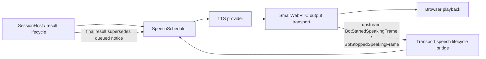

# Task: Transport-Aware Speech Supersession

**Status**: In Progress
**Component**: Pipecat subagents
**Assigned to**: Unassigned
**Priority**: High
**Branch**: fix/drop-stale-timeout-speech
**Created**: 2026-07-28
**Updated**: 2026-07-29
**Review Gates**: full

## Objective

Keep speech scheduling ownership until the output transport reports that the active
utterance has stopped, so a final result can remove its still-queued timeout notice
while unrelated speech is playing. Deliver this as a release-neutral precursor to
`docs/dev_plans/20260728-feature-early-ack-background-delivery-v0.1.3.md`, not as a
0.1.3 release or version bump.

## Context

The reported two-query trace exposes a lifecycle mismatch rather than primarily a
bad timeout value. The Helsinki result was still playing when the San Francisco
timeout notice was emitted. By the time the San Francisco final result was ready,
the notice had already crossed the scheduler boundary and was buffered behind
earlier audio, so queue-only supersession could no longer remove it.

The current pipeline records `synthesis_ended` and immediately converts it to
`delivery_unknown`, releasing the scheduler lease and starting the next queued
utterance (`server/pipeline.py:495-523`). The generic TTS completion processor does
the same before forwarding `TTSStoppedFrame` to `transport.output()`
(`server/app.py:60-96,187-204`). This conflicts with the repository's documented
contract: synthesis completion is not transport completion, and no server state
proves browser decode, playout, or audibility (`shared/protocol.md:69-80`).

Commit `73d1a7c` adds a valid but incomplete primitive:
`SpeechScheduler.discard_queued(work_item_id)` and a late-result call site. It can
remove a timeout notice only while the scheduler still owns that notice. This plan
retains that primitive but fixes the upstream lifecycle so later speech remains
queued until the output transport has drained the active utterance.

Pipecat 1.6.0 provides current, non-deprecated `BotStartedSpeakingFrame` and
`BotStoppedSpeakingFrame` types. `BaseOutputTransport` emits the stop frame
upstream and downstream when transport-managed bot speech stops. That signal is
the server-side delivery boundary for this plan; it is deliberately not described
as proof that the browser played or audibly rendered every sample.

Shortening `foreground_search_timeout_seconds` is out of scope. A shorter timer can
make duplicate notices occur closer together but cannot retract speech that has
already left scheduler ownership.

## Requirements

- Maintain one connection-local active speech lease from scheduler selection
  through transport stop, interruption, reconnect, or an explicit
  delivery-unknown fallback. `TTSStoppedFrame` and provider `synthesis_ended`
  record synthesis state only; neither releases the lease.
- Preserve FIFO ordering across work items while allowing a final result to
  supersede only its own queued timeout notice. Never discard or interrupt another
  work item's speech.
- Treat a timeout notice as no longer supersedable once it has started transport
  playback. Do not interrupt an already-started notice merely because its final
  result becomes ready.
- Correlate transport start/stop events with the scheduler's active lease or
  generation token so duplicate, late, and stale lifecycle frames cannot release a
  newer utterance.
- Preserve liveness on interruption, reconnect, shutdown, missing TTS, and missing
  transport-stop signals. Any watchdog is a delivery-unknown fallback derived from
  accumulated audio duration plus bounded grace, not a second semantic timeout.
- Keep canonical result commit, epoch fencing, and work-item cancellation ownership
  unchanged. This plan changes speech disposition and lifecycle only.
- Do not add a package version bump, tag, or release step. The reviewed invariant
  becomes a prerequisite consumed by the v0.1.3 delivery-policy phase.

## Review Focus

- Verify that `BotStoppedSpeakingFrame` reaches the lifecycle bridge in the actual
  SmallWebRTC pipeline direction and occurs after output-transport draining, not at
  provider synthesis completion.
- Verify correlation prevents a late start/stop frame from releasing a newer active
  lease after interruption or reconnect.
- Verify the exact two-query race: B's timeout notice stays scheduler-queued behind
  A's active transport speech, B's final result removes only that notice, and B's
  final speech starts after A stops.
- Verify the delivery-unknown fallback cannot fire before the accumulated active
  audio could reasonably drain and cannot deadlock the queue.
- Verify local event-capable TTS and generic Pipecat TTS use one lifecycle path each
  without duplicate scheduler transitions.

## Implementation Checklist

The phases below are the immutable implementation contract. Runtime progress and
durable findings belong below the review marker.

### Phase 1: Hold the speech lease through transport stop

**Impl files:** `server/app.py, server/pipeline.py, server/speech_scheduler.py`
**Test files:** `tests/test_app.py, tests/test_pipeline.py, tests/test_speech_scheduler.py`
**Test command:** `uv run pytest tests/test_app.py tests/test_pipeline.py tests/test_speech_scheduler.py -k 'speech or tts or transport or delivery' -v`
**Goal:** Synthesis completion records provider progress, while only a correlated transport stop or explicit terminal fallback releases the active speech lease.

- Replace synthesis-end release in both the local TTS callback and generic TTS
  completion path with a transport lifecycle bridge placed immediately before
  `transport.output()`.
- Observe upstream transport `BotStartedSpeakingFrame` and
  `BotStoppedSpeakingFrame`. Record started lease tokens in transport order and
  consume that lifecycle FIFO on stop, then let the scheduler accept a stop only
  when its token still matches the active lease.
- Keep `provider_synthesis_ended()` as a non-terminal progress transition. Move
  `start_next()` behind transport stop, interruption, reconnect, shutdown, or the
  explicit delivery-unknown fallback.
- Accumulate the active utterance's synthesized audio duration where needed to arm
  a bounded fallback after synthesis ends. Cancel the fallback on transport stop or
  any stronger terminal event.
- Cover local event-capable TTS and generic TTS processor assembly so neither path
  skips the bridge or reports lifecycle completion twice.

### Phase 2: Make queued timeout supersession explicit and work-scoped

**Impl files:** `server/pipeline.py, server/speech_scheduler.py`
**Test files:** `tests/test_pipeline.py, tests/test_speech_scheduler.py`
**Test command:** `uv run pytest tests/test_pipeline.py tests/test_speech_scheduler.py -k 'timeout or supersed or queued or late_result' -v`
**Goal:** A retained final result atomically removes only its own not-yet-started timeout notice and replaces it with final-result speech.

- Give ephemeral timeout notices an explicit speech role or supersession key rather
  than relying on broad work-item queue deletion.
- Replace the current generic `discard_queued(work_item_id)` call with a
  work-scoped, notice-specific operation that returns the exact discarded items and
  records their terminal delivery state once.
- Perform notice removal and final-result enqueue without an `await` boundary that
  could let `start_next()` select the notice between the two operations.
- Define the boundary explicitly: queued notices are supersedable; transport-started
  notices are not interrupted; final-result commit remains independent of either
  speech disposition.
- Preserve queue isolation, FIFO behavior, paused items, duplicate late callbacks,
  missing TTS, stale epochs, cancellation, and reconnect semantics.

### Phase 3: Prove the race and document the boundary

**Impl files:** `shared/protocol.md, CHANGELOG.md, docs/dev_plans/20260728-feature-early-ack-background-delivery-v0.1.3.md`
**Test files:** `tests/test_app.py, tests/test_pipeline.py, tests/test_speech_scheduler.py`
**Test command:** `uv run pytest tests/test_app.py tests/test_pipeline.py tests/test_speech_scheduler.py -v`
**Validation cmd:** `uv run ruff format --check . && uv run ruff check . && uv run pytest -q`
**Goal:** The reported interleaving is a deterministic regression test, and documentation distinguishes synthesis, transport drain, and browser audibility.

- Add a deterministic integration-style test reproducing the observed ordering:
  long-running A speech, B timeout while A is active, B final result before A's
  transport stop, then A stop. Assert that B's timeout notice never reaches TTS,
  B's final result is spoken next, and A is not interrupted.
- Add failure-path tests for missing/duplicate/stale transport frames, fallback
  expiry, interruption, reconnect, and shutdown; assert that no path starts two
  scheduler leases concurrently or permanently starves queued speech.
- Update `shared/protocol.md` with the transport-aware lease boundary and its
  limitation: transport stop is stronger than synthesis end but still does not
  prove browser audibility.
- Record the fix under the unreleased changelog section without changing the package
  version, and retain the explicit precursor link in the v0.1.3 plan.

## Technical Specifications

### Files to Modify

- `server/app.py` — install one transport speech lifecycle bridge immediately before
  `transport.output()` for both local event-capable and generic TTS pipelines.
- `server/pipeline.py` — stop releasing on provider synthesis end, connect transport
  lifecycle events to the scheduler, and invoke notice-specific supersession before
  enqueueing retained final-result speech.
- `server/speech_scheduler.py` — retain the active lease across synthesis end, bind
  transport events to lease tokens, implement bounded delivery-unknown fallback,
  and expose notice-specific queued supersession.
- `shared/protocol.md` — define provider, transport, and audibility boundaries.
- `CHANGELOG.md` — record the unreleased bug fix without a version bump.
- `docs/dev_plans/20260728-feature-early-ack-background-delivery-v0.1.3.md` —
  declare this reviewed precursor as a prerequisite for Phase 2.
- `tests/test_app.py`, `tests/test_pipeline.py`, `tests/test_speech_scheduler.py` —
  processor assembly, lifecycle, correlation, supersession, and reported-race
  coverage.

### New Files to Create

- None.

### Architecture Decisions

- `BotStoppedSpeakingFrame` is the authoritative server-side transport-drain signal
  for releasing ordinary speech. `TTSStoppedFrame` and provider
  `synthesis_ended` remain non-terminal scheduler progress.
- The scheduler continues to allow only one active lease. Holding that lease
  prevents later utterances from entering TTS/output buffers while earlier speech
  remains transport-active.
- The lifecycle bridge keeps a FIFO of lease tokens observed at transport start.
  Each transport stop consumes the oldest token; the scheduler ignores it if that
  token was already interrupted or superseded. This prevents a delayed stop for an
  old utterance from terminating a newer active lease.
- Supersession is role- and work-item-specific. A final result may remove its queued
  timeout notice but cannot cancel unrelated speech or retract a notice already
  started by the output transport.
- A transport-stop watchdog exists only for liveness. Its earliest expiry is based
  on observed synthesized audio duration plus bounded grace and resolves as
  `delivery_unknown`; it is not tuned by `foreground_search_timeout_seconds`.
- Transport drain and browser audibility remain separate claims. This precursor
  does not add a browser playback acknowledgement protocol.
- The existing `73d1a7c` queue-discard primitive is partial implementation evidence,
  not proof of acceptance. Phase 2 narrows or replaces it with the explicit
  notice-specific contract.

### Dependencies

- Python remains `>=3.12` and `pipecat-ai[cartesia,deepgram,openai,webrtc,runner]`
  remains pinned at `1.6.0` in `pyproject.toml`.
- `BotStartedSpeakingFrame` and `BotStoppedSpeakingFrame` are current,
  non-deprecated Pipecat 1.6.0 frame types.
- No new Python or browser dependency is required.
- Explore facts above the review marker are point-in-time contract facts. A later
  path, pattern, or dependency correction invalidates the review marker and
  requires `/review-plan` to run again.

### Integration Seams

| Seam | Writer | Caller | Contract |
|---|---|---|---|
| Provider synthesis lifecycle | Local TTS callback or generic TTS processor | `SpeechScheduler` | Synthesis end records progress and never releases the transport-active lease |
| Output transport lifecycle | SmallWebRTC `BaseOutputTransport` | Transport speech lifecycle bridge | Upstream starts append lease tokens in transport order; stops consume the oldest token and terminate only a still-matching active lease |
| Lease release | Lifecycle bridge or terminal fallback | `SpeechScheduler.start_next()` | The next item starts only after the prior lease is terminal |
| Late-result supersession | `SessionHost` late-result callback | `SpeechScheduler` | Remove only the same work item's queued timeout notice before enqueueing its final result |
| Reconnect/interruption/shutdown | Connection lifecycle | `SpeechScheduler` | Resolve the active lease once, cancel fallback state, and fence stale later callbacks |
| v0.1.3 delivery policy | This precursor's tested scheduler invariant | v0.1.3 Phase 2 | Phase 2 may assume queued notices remain scheduler-owned behind active transport speech |

## Architecture & Call Flow



```mermaid
sequenceDiagram
    participant H as SessionHost
    participant S as SpeechScheduler
    participant T as TTS
    participant O as Output transport
    participant B as Browser

    H->>S: enqueue Helsinki result
    S->>T: start Helsinki utterance
    T->>O: TTS audio and TTSStoppedFrame
    Note over S,T: Synthesis ended; keep scheduler lease active
    O->>B: play Helsinki audio
    H->>S: enqueue SF timeout notice
    Note over S: Notice remains queued behind Helsinki
    H->>S: SF final result becomes ready
    S->>S: discard queued SF notice
    S->>S: enqueue SF final result
    O-->>S: BotStoppedSpeakingFrame for Helsinki
    S->>T: start SF final result
    T->>O: SF result audio
    O->>B: play SF result
```

| Step | Trigger | Enters context | Cleared/persisted | Turn boundary |
|---|---|---|---|---|
| Speech scheduled | Result or timeout notice is enqueued | Utterance ID, work-item ID, role, origin epoch | Persists in scheduler queue or active lease | May cross turns |
| Synthesis ends | `TTSStoppedFrame` or provider callback | Synthesis terminal state and accumulated audio duration | Recorded; active lease remains held | No |
| Transport playback starts | Upstream `BotStartedSpeakingFrame` | Active lease token and transport-start state | Persists until matching stop or terminal fallback | No |
| Final result supersedes notice | Retained result completes while its notice is queued | Same work-item identity and notice role | Notice is discarded; final result replaces it | May cross turns |
| Transport playback stops | Matching upstream `BotStoppedSpeakingFrame` | Transport terminal state | Releases active lease and starts next eligible item | No |
| Delivery cannot be confirmed | Interruption, reconnect, shutdown, or watchdog expiry | Explicit unknown/interrupted outcome | Releases lease once and fences stale callbacks | May end connection |

## Testing Notes

### Test Approach

- [ ] Unit-test scheduler lease/token transitions independently of Pipecat.
- [ ] Test processor assembly and upstream/downstream frame handling for both TTS
      integration paths.
- [ ] Reproduce the two-query ordering with deterministic events rather than wall
      clock sleeps.
- [ ] Run the full credential-free Python suite, formatter, and linter.

### Test Results

- [ ] Targeted lifecycle tests pass.
- [ ] Deterministic two-query regression passes.
- [ ] Full test suite passes.
- [ ] `ruff format --check` and `ruff check` pass.

### Edge Cases Tested

- [ ] Final result arrives before its timeout notice starts.
- [ ] Final result arrives after its timeout notice starts.
- [ ] Duplicate or stale transport start/stop event.
- [ ] Interruption or reconnect before transport stop.
- [ ] Transport stop never arrives and the liveness fallback resolves once.
- [ ] Missing TTS and inactive/stale connection.
- [ ] Another work item's queued speech is unaffected.

## Acceptance Criteria

- The scheduler does not release an active ordinary-speech lease on synthesis end.
- A correlated transport stop, interruption, reconnect, shutdown, or bounded
  delivery-unknown fallback releases that lease exactly once.
- In the reported A/B interleaving, B's timeout notice remains queued, is removed
  when B's final result becomes ready, never reaches TTS/output, and B's final
  result plays after A without interrupting A.
- Once a timeout notice has transport-started, final-result arrival does not
  interrupt it; the final result still commits and is delivered according to the
  existing active-epoch policy.
- Duplicate, late, or stale lifecycle callbacks cannot release a newer utterance.
- Tests prove queue isolation, one-active-lease safety, fallback liveness, and both
  TTS integration paths.
- Protocol and changelog documentation are current, with no package version bump,
  tag, or release created by this plan.
- The v0.1.3 plan names this reviewed precursor as a Phase 2 prerequisite.
- `uv run ruff format --check .`, `uv run ruff check .`, and `uv run pytest -q`
  pass before merge.

<!-- reviewed: YYYY-MM-DD @ <hash> -->

## Progress

- [ ] Phase 1: Hold the speech lease through transport stop
- [ ] Phase 2: Make queued timeout supersession explicit and work-scoped
- [ ] Phase 3: Prove the race and document the boundary

## Findings

- The 2026-07-28 trace demonstrates that scheduler-queue state and actual output
  playback state diverge after synthesis completion.
- Commit `73d1a7c` implements queue-only work-item discard but cannot remove a notice
  already submitted to the output transport.

## Issues & Solutions

_To be filled during implementation._

## Final Results

_To be filled on completion._
