# Task: Transport-Aware Speech Supersession

**Status**: In Progress
**Component**: Pipecat subagents
**Assigned to**: Unassigned
**Priority**: High
**Branch**: fix/drop-stale-timeout-speech
**Created**: 2026-07-28
**Updated**: 2026-07-30
**Review Gates**: full

## Objective

Keep speech scheduling ownership until the output transport reports that the active
utterance has stopped or its connection-scoped output lane has completed teardown,
so a final result can remove its still-queued timeout notice while unrelated speech
is playing. Deliver this as a release-neutral precursor to
`docs/dev_plans/20260728-feature-early-ack-background-delivery-v0.1.3.md`, not as a
0.1.3 release or version bump.

## Context

The reported two-query trace exposes a lifecycle mismatch rather than primarily a
bad timeout value. The Helsinki result was still playing when the San Francisco
timeout notice was emitted. By the time the San Francisco final result was ready,
the notice had already crossed the scheduler boundary and was buffered behind
earlier audio, so queue-only supersession could no longer remove it.

The current pipeline records `synthesis_ended` and immediately converts it to
`delivery_unknown`, releasing the scheduler lease and starting the next queued
utterance (`server/pipeline.py:495-523`). The generic TTS completion processor does
the same before forwarding `TTSStoppedFrame` to `transport.output()`
(`server/app.py:60-96,187-204`). This conflicts with the repository's documented
contract: synthesis completion is not transport completion, and no server state
proves browser decode, playout, or audibility (`shared/protocol.md:69-80`).

Commit `73d1a7c` adds a valid but incomplete primitive:
`SpeechScheduler.discard_queued(work_item_id)` and a late-result call site. It can
remove a timeout notice only while the scheduler still owns that notice. This plan
retains that primitive but fixes the upstream lifecycle so later speech remains
queued until the output transport has drained the active utterance.

Pipecat 1.6.0 provides current, non-deprecated `BotStartedSpeakingFrame` and
`BotStoppedSpeakingFrame` types. `BaseOutputTransport` emits the stop frame
upstream and downstream when transport-managed bot speech stops, but both bot
frames are fieldless and cannot identify an utterance. Pipecat-generated
`TTSStartedFrame`, `TTSAudioRawFrame`, and `TTSStoppedFrame` carry `context_id`;
the pinned TTS service also serializes non-system downstream frames relative to
the generated TTS sequence. The implementation therefore needs an internal
generation marker before TTS plus a single in-flight transport slot; it must not
bind a fieldless bot event by consulting whichever scheduler lease is active when
that event happens to arrive.

Shortening `foreground_search_timeout_seconds` is out of scope. A shorter timer can
make duplicate notices occur closer together but cannot retract speech that has
already left scheduler ownership.

## Requirements

- Model every admitted utterance as one private `SpeechGeneration` with a stable
  scheduler token. Queue residency remains a `SpeechItem` concern; generation
  phases begin at `admitted`, then `handed_to_tts`,
  `synthesizing`, `synthesis_ended`, `transport_started`, and
  `transport_stopped`, with delivery dispositions `paused`, `interrupted`,
  `cancelled`, and `delivery_unknown`. Transitions are token-fenced and
  idempotent; the public `DeliveryState` wire/state contract remains unchanged.
- Make one `SpeechLifecycleCoordinator` the sole owner of the admitted generation,
  TTS-lane lease, global transport slot, tombstones, timers, and exactly-once
  terminalization. `SpeechScheduler` owns only per-work queues and selection;
  lifecycle processors and provider callbacks are stateless adapters into
  token-bearing coordinator methods.
- Preserve the hybrid scheduler: FIFO within each work-item queue, existing
  work-item selection/targeted-start policy between queues, and exactly one global
  transport slot. Do not claim or introduce global FIFO ordering.
- Hold the global transport slot from scheduler admission until correlated
  transport stop or completed cleanup of the old output lane.
  `TTSStoppedFrame` and provider `synthesis_ended` record synthesis state only;
  neither admits another generation to TTS/output. A timer expiry may initiate
  cleanup but may not by itself clear a slot that has submitted audio to output.
- Insert a private, token-bearing generation marker immediately before each
  `TTSSpeakFrame`. The post-TTS lifecycle bridge consumes that marker and binds the
  next generated TTS `context_id` to the token. Fieldless bot start/stop frames
  apply only to the sole occupied transport slot and never sample the scheduler's
  current active lease.
- Retain tombstones for paused, interrupted, cancelled, reconnected, and
  fallback-terminal generations until their TTS and transport barriers resolve.
  Drop later context-correlated audio or TTS stop frames before
  `transport.output()`. Tombstones do not purport to identify fieldless bot
  frames: after any audio has entered output, the next generation is not admitted
  until the old lane emits its normal stop or the connection-scoped output
  transport has been fully cancelled/torn down and can emit no later bot event.
- A timeout notice is supersedable only while it remains in its own work-item
  queue. Once its generation occupies the transport slot, final-result readiness
  does not interrupt it. Never reorder, delete, or interrupt another work item's
  speech.
- Use token-fenced liveness deadlines backed by an injected monotonic clock and
  injected cancellable timer scheduler:
  `speech_start_timeout_seconds = 10.0`, armed when a generation is handed to TTS
  and cancelled by its first correlated start/audio/provider-error event; and
  `speech_transport_grace_seconds = 1.0`, used after synthesis end at
  `synthesis_end + accumulated_audio_duration + grace`. Zero-audio synthesis uses
  only the grace. Barge-in and explicit pause arm an interruption-cleanup deadline
  at `interruption_forwarded_at + speech_transport_grace_seconds`.
- Deadline expiry atomically marks the captured token `cleanup_pending`, dispatches
  cancellation/flush, then records `delivery_unknown` once. If no audio has
  crossed into output, the coordinator may release only after the old TTS lane
  acknowledges that cleanup. If any audio has crossed into output, expiry
  invalidates and tears down that connection's output lane; queued speech is not
  admitted on it, and reconnect creates a fresh connection-scoped lane. A raw
  timer callback never makes a late fieldless A stop observable as B's stop.
- Treat generic and local provider errors as separate ingress paths. A generic
  Pipecat `ErrorFrame` is upstream and has no `context_id`; a pre-TTS error
  observer or provider `on_error` hook attributes it to the captured TTS-lane
  token and processor identity. The local-TTS callback retains its context-bearing
  mapping. Both converge on the same token-fenced delivery-unknown cleanup path.
- On user barge-in, record `interrupted` and create the tombstone before forwarding
  the interruption, cancel the start/drain timers, arm the interruption-cleanup
  deadline, and retain the transport barrier until the old generation stops or
  its output lane has been torn down. Do not automatically `start_next()` after
  barge-in; the new accepted turn or explicit resume owns the next scheduling
  decision.
- On explicit pause, record public `paused` disposition before forwarding the same
  interruption cleanup, retain the old barrier through stop/teardown, and keep the
  paused item outside the runnable queues. Explicit resume may enqueue a new
  generation only after that barrier resolves; the pause-control path, not the old
  stop callback, owns any confirmation or subsequent scheduling decision.
- Keep canonical result commit, epoch fencing, and work-item cancellation ownership
  unchanged. This plan changes speech disposition and lifecycle only.
- Defer browser playout acknowledgement, selective transport-buffer retraction,
  multiple in-flight transport generations, and adaptive timeout tuning to later
  plans as the transport integration matures.
- Do not add a package version bump, tag, or release step. The reviewed invariant
  becomes a prerequisite consumed by the v0.1.3 delivery-policy phase.

## Review Focus

- Verify the internal generation marker survives the pinned local and generic TTS
  paths in serialization order and binds generated `context_id` without relying on
  fieldless bot-frame identity.
- Verify the single global transport slot plus tombstones prevents late A
  start/audio/stop frames from binding to or releasing B after interruption,
  reconnect, cancellation, or fallback.
- Verify a fallback after output submission cannot admit B on A's lane: it must
  await normal stop or complete connection-scoped output teardown. Exercise
  A-fallback → attempted B admission → late fieldless A stop.
- Verify the exact two-query race: B's timeout notice stays in its work-item queue
  behind A's occupied transport slot, B's final result removes only that notice,
  and B's final speech starts after A stops.
- Verify both watchdog equations, the interruption-cleanup equation, zero-audio
  behavior, both provider-error ingress paths, and stop-versus-expiry races with a
  manual clock that controls both monotonic reads and timer wakeups.
- Verify the real pinned SmallWebRTC output path holds the slot until its controlled
  final-audio future resolves and emits the upstream stop.
- Verify barge-in terminalizes delivery before transport cleanup and never
  automatically advances old queued speech.
- Verify pause retains the old barrier, resume cannot requeue early, and only the
  explicit control path resumes scheduling.

## Implementation Checklist

The phases below are the immutable implementation contract. Runtime progress and
durable findings belong below the review marker.

### Phase 1: Add the correlated generation state machine and transport slot

**Impl files:** `server/app.py, server/config.py, config.toml, README.md, server/pipeline.py, server/speech_lifecycle.py, server/speech_scheduler.py, server/services/tts.py`
**Test files:** `tests/test_app.py, tests/test_config.py, tests/test_pipeline.py, tests/test_speech_lifecycle.py, tests/test_speech_scheduler.py`
**Test command:** `uv run pytest tests/test_app.py tests/test_config.py tests/test_pipeline.py tests/test_speech_lifecycle.py tests/test_speech_scheduler.py -k 'speech or tts or transport or delivery or config' -v`
**Goal:** Per-work queues feed one coordinator-owned transport slot; generation
identity is established before TTS, and the real pinned output lane proves that
synthesis completion, cleanup deadlines, and late frames cannot release the wrong
generation.

- Add the private `SpeechGeneration` state machine,
  `SpeechLifecycleCoordinator`, cancellable timer-scheduler protocol, and
  `SpeechGenerationMarkerFrame` in `server/speech_lifecycle.py`. The coordinator
  is the only owner of the TTS-lane lease, admitted generation, global transport
  slot, timers, tombstones, and terminal release. The marker carries the
  scheduler token and utterance identity, is inserted immediately before the
  matching `TTSSpeakFrame`, and is consumed after TTS rather than forwarded to
  the output transport.
- Add one shared `TransportSpeechLifecycleProcessor` after either TTS integration
  path and immediately before `transport.output()`. It is a stateless adapter that
  observes the serialized marker, generated
  `TTSStartedFrame`/`TTSAudioRawFrame`/`TTSStoppedFrame`, downstream interruption,
  and upstream bot start/stop, then calls token-bearing coordinator methods.
- Add a separate generic-TTS error adapter before TTS or register the pinned
  service's `on_error` hook. Capture the TTS-lane token when the request is
  admitted and attribute upstream `ErrorFrame` by that captured token plus
  `ErrorFrame.processor`; never infer identity from an `ErrorFrame.context_id`
  because none exists. Keep the local provider's context-bearing error callback
  as a distinct adapter into the same coordinator transition.
- Bind the first generated TTS `context_id` after a marker to that marker's token.
  The coordinator maintains one occupied global transport slot plus terminal
  tombstones; neither lifecycle adapter owns parallel slot state. Never bind a
  fieldless bot frame by looking up a scheduler lease.
- Preserve per-work-item FIFO and existing work-item selection/targeted-start
  semantics. `SpeechScheduler` owns only queues/selection and may ask the
  coordinator to admit a selected item only when the global slot is empty.
- Keep `provider_synthesis_ended()` non-terminal. Release/admit next only after
  transport stop or completed old-lane cleanup.
- Add and document validated config fields
  `speech_start_timeout_seconds = 10.0` and
  `speech_transport_grace_seconds = 1.0`.
- For matching downstream PCM audio, accumulate duration from byte length, sample
  rate, channel count, and sample width. Arm the drain fallback at
  `synthesis_end + total_audio_duration + grace`; zero audio uses only grace.
- Inject both monotonic time and a cancellable `call_at`/`sleep_until` scheduler
  into the coordinator. Production uses the event loop; tests use one manual
  clock that advances reads and wakes due timers deterministically.
- Route both provider-error adapters and start-timeout through
  `delivery_unknown`. If no audio reached output, cancel/flush the old TTS lane
  and require its acknowledgement before clearing the slot. If audio reached
  output or either lane cannot acknowledge cleanup, invalidate the connection
  epoch, cancel/tear down its output transport, and do not admit queued speech
  until a fresh connection-scoped lane exists.
- On barge-in or explicit pause, record the disposition and tombstone before
  forwarding interruption, cancel normal timers, and arm
  `forwarded_at + speech_transport_grace_seconds`. The normal bot stop resolves
  the barrier; expiry tears down the connection-scoped output lane rather than
  clearing it for reuse. Neither the interruption nor its later stop calls
  `start_next()`.
- Move the lifecycle proof into this phase. Add marker-order tests for both pinned
  TTS paths; a credential-free real `SmallWebRTCOutputTransport` test with a fake
  peer/audio track and controlled final `RawAudioTrack.add_audio_bytes()` future;
  manual-clock start/drain/interruption deadline tests; and parameterized late-A
  start/audio/stop/error traces for interruption, pause, reconnect, cancellation,
  shutdown, start-timeout, and drain fallback. Assert slot mutation occurs only
  through the coordinator and exactly once.

### Phase 2: Make queued timeout supersession explicit and work-scoped

**Impl files:** `server/pipeline.py, server/speech_scheduler.py`
**Test files:** `tests/test_pipeline.py, tests/test_speech_scheduler.py`
**Test command:** `uv run pytest tests/test_pipeline.py tests/test_speech_scheduler.py -k 'timeout or supersed or queued or late_result' -v`
**Goal:** A retained final result atomically replaces only its own queued timeout notice before that notice can occupy the global transport slot.

- Give speech items an internal role (`result`, `timeout_notice`, or other existing
  non-supersedable role) rather than relying on broad work-item queue deletion.
- Replace the current generic `discard_queued(work_item_id)` call with a
  work-scoped, notice-specific operation that returns the exact discarded items and
  records their terminal delivery state once.
- Perform notice removal and final-result enqueue without an `await` boundary that
  could let `start_next()` select the notice between the two operations.
- Define the boundary explicitly: a notice is supersedable while it remains in its
  per-work queue; a notice admitted to the global slot is not interrupted;
  final-result commit remains independent of either speech disposition.
- Preserve within-work FIFO, existing cross-work selection, targeted-start policy,
  paused items, duplicate late callbacks, missing TTS, stale epochs, cancellation,
  and reconnect semantics.
- Add the deterministic reported-race test in this phase: A occupies the proven
  transport slot, B has a mixed same-work queue containing non-supersedable speech
  around its timeout notice, and B's final result arrives before A stops. Assert
  only B's notice terminates once, B's remaining same-work items retain order,
  another work queue is unchanged, the final enqueue is atomic, and A is not
  interrupted.

### Phase 3: Document the boundary and run cross-phase validation

**Impl files:** `shared/protocol.md, CHANGELOG.md, docs/dev_plans/20260728-feature-early-ack-background-delivery-v0.1.3.md`
**Test files:** `tests/test_app.py, tests/test_pipeline.py, tests/test_speech_lifecycle.py, tests/test_speech_scheduler.py`
**Test command:** `uv run pytest tests/test_app.py tests/test_pipeline.py tests/test_speech_lifecycle.py tests/test_speech_scheduler.py -v`
**Validation cmd:** `uv run ruff format --check . && uv run ruff check . && uv run pytest -q`
**Goal:** Documentation distinguishes synthesis, transport drain, teardown, and
browser audibility, while the full suite re-runs the Phase 1 lifecycle and Phase 2
supersession invariants together.

- Re-run, without duplicating ownership, the Phase 1 real-transport/manual-clock
  contract matrix and the Phase 2 deterministic A/B mixed-queue regression as a
  cross-phase validation gate.
- Add an ordered event-log assertion for start-timeout cleanup:
  `fence A cleanup-pending → dispatch cancel/flush A → record delivery_unknown →
  acknowledge or tear down A's lane → clear or invalidate slot → optionally
  admit B`. For barge-in and pause assert
  `record disposition/tombstone → forward InterruptionFrame → stop or teardown`,
  with no `start_next()` from the interruption or stale stop.
- Assert the full terminal matrix—interruption, pause, reconnect, cancellation,
  shutdown, start-timeout, drain fallback, generic error, and local error—drops
  late context-bearing A frames before output, prevents any late fieldless A stop
  from being observed on B's lane, leaves B unchanged, and progresses exactly
  once.
- Update `shared/protocol.md` with the transport-aware lease boundary and its
  limitation: transport stop is stronger than synthesis end but still does not
  prove browser audibility.
- Record the fix under the unreleased changelog section without changing the package
  version, and retain the explicit precursor link in the v0.1.3 plan.

## Technical Specifications

### Files to Modify

- `server/app.py` — install one shared transport lifecycle processor immediately
  before `transport.output()` for both local event-capable and generic TTS paths;
  install the distinct generic upstream error observer/provider hook; and expose
  connection-scoped output cancellation/teardown completion to the coordinator.
- `server/config.py`, `config.toml`, `README.md` — define, validate, load, and
  document the two speech-liveness timeout fields.
- `server/pipeline.py` — stop releasing on provider synthesis end, connect transport
  lifecycle events to the coordinator, emit the internal marker with each speak
  request, make pause/barge-in ordering explicit, and invoke notice-specific
  replacement before enqueueing final speech.
- `server/speech_scheduler.py` — preserve and select per-work queues, delegate
  admission to the lifecycle coordinator, retain paused items outside runnable
  queues, and expose notice-specific queued replacement. It does not own a second
  active transport lease.
- `server/services/tts.py` — verify or adapt the local provider so the marker and
  context-correlated lifecycle/error callbacks traverse the shared coordinator
  adapters exactly once.
- `shared/protocol.md` — define provider, transport, and audibility boundaries.
- `CHANGELOG.md` — record the unreleased bug fix without a version bump.
- `docs/dev_plans/20260728-feature-early-ack-background-delivery-v0.1.3.md` —
  declare this reviewed precursor as a prerequisite for Phase 2.
- `tests/test_app.py`, `tests/test_config.py`, `tests/test_pipeline.py`,
  `tests/test_speech_scheduler.py` — assembly, configuration, queue selection,
  supersession, and reported-race coverage.

### New Files to Create

- `server/speech_lifecycle.py` — authoritative private generation coordinator,
  marker frame, stateless lifecycle/error adapters, tombstones, injectable timer
  scheduler, and output-lane cleanup coordination.
- `tests/test_speech_lifecycle.py` — state-transition, stale-frame, manual
  clock/timer, provider-error, teardown, and pinned SmallWebRTC drain-boundary
  contract tests.

### Architecture Decisions

- Decision (grilled): use a private token-bearing marker through the pinned TTS
  serialization boundary plus one global transport slot. Fieldless bot events never
  establish identity from the currently active scheduler lease.
- Decision (reviewed): `SpeechLifecycleCoordinator` is the only owner of the
  admitted generation, TTS-lane lease, global transport slot, timers, tombstones,
  and exactly-once terminalization. `SpeechScheduler` owns queues/selection and
  lifecycle processors are stateless frame adapters.
- Decision (grilled): retain terminal generation tombstones until TTS and transport
  cleanup complete; discard later context-correlated frames for stale contexts
  before output.
- Decision (grilled): formalize a small internal `SpeechGeneration` state machine
  now while leaving public `DeliveryState` unchanged. Defer browser acknowledgement,
  selective buffered-audio retraction, multiple in-flight generations, and adaptive
  timeout policy.
- Decision (grilled): retain the hybrid scheduler. Per-work queues keep FIFO and
  existing selection/targeted-start flexibility; one global slot serializes actual
  transport work. This plan does not introduce global FIFO.
- Decision (grilled): use a 10-second start watchdog and a one-second transport
  grace. The drain deadline is synthesis end plus accumulated PCM duration plus
  grace; interruption/pause cleanup is forwarded-at plus the same grace. Both
  monotonic time and timer wakeups are injected; all callbacks are token-fenced.
- Decision (reviewed): a deadline never reuses an output lane that may still emit
  a fieldless event. With no submitted output audio, acknowledged TTS flush permits
  release. After output submission, expiry invalidates the connection and awaits
  output cancellation/teardown; queued speech waits for a fresh lane.
- Decision (reviewed): generic upstream `ErrorFrame` and local context-bearing
  errors enter through different adapters. Both capture the old TTS-lane token and
  converge on `delivery_unknown`; neither samples a later active generation.
- Decision (grilled): barge-in records interruption before output cleanup, holds the
  old transport barrier until normal stop or completed teardown, and never
  auto-advances queued speech.
- Decision (reviewed): explicit pause follows the same barrier cleanup but records
  `paused`; resume creates a new generation only after the old barrier resolves,
  and the explicit control path owns subsequent scheduling.
- `BotStoppedSpeakingFrame` is the normal server-side transport-drain signal, but
  it is fieldless and valid only while the same connection-scoped lane has not
  been retired by completed teardown. Transport drain and browser audibility
  remain separate claims.
- Supersession is role- and work-item-specific. A final result removes only its
  queued timeout notice and cannot retract an item already occupying the global
  slot.
- The existing `73d1a7c` queue-discard primitive is partial implementation evidence,
  not proof of acceptance. Phase 2 narrows or replaces it with notice-specific
  replacement.

### Dependencies

- Python remains `>=3.12` and `pipecat-ai[cartesia,deepgram,openai,webrtc,runner]`
  remains pinned at `1.6.0` in `pyproject.toml`.
- `BotStartedSpeakingFrame` and `BotStoppedSpeakingFrame` are current,
  non-deprecated but fieldless Pipecat 1.6.0 frame types; they cannot fence a late
  old-lane event after timer-only reuse.
- `TTSStartedFrame`, `TTSAudioRawFrame`, and `TTSStoppedFrame` carry generated
  `context_id`; `TTSSpeakFrame` does not accept a caller-supplied context ID.
- Pipecat 1.6.0 TTS processing serializes non-system downstream frames relative to
  generated audio contexts; Phase 1 contract tests this marker seam for both pinned
  TTS paths rather than relying on documentation alone.
- Pipecat 1.6.0 generic TTS errors are upstream `ErrorFrame` instances without
  `context_id`; Phase 1 verifies the provider hook/upstream observer rather than
  routing them through the downstream lifecycle processor.
- No new Python or browser dependency is required.
- Explore facts above the review marker are point-in-time contract facts. A later
  path, pattern, or dependency correction invalidates the review marker and
  requires `/review-plan` to run again.

### Integration Seams

| Seam | Writer | Caller | Contract |
|---|---|---|---|
| Work queues → global slot | `SpeechScheduler` queue selector | `SpeechLifecycleCoordinator.try_admit()` | Preserve within-work FIFO/current selection; coordinator admits exactly one generation |
| Generation marker → TTS context | Pipeline marker before `TTSSpeakFrame` | Post-TTS lifecycle adapter | Serialized marker token binds the next generated `context_id`; marker never reaches output |
| Provider synthesis lifecycle | Local callback or generic downstream TTS frames | Coordinator | Matching start/audio/end transitions the captured token; synthesis end does not clear the slot |
| Generic provider error | TTS `on_error` hook or pre-TTS upstream observer | Coordinator TTS-lane lease | Attribute upstream fieldless-with-respect-to-context error by captured token and processor identity |
| Output transport lifecycle | SmallWebRTC `BaseOutputTransport` | Coordinator through lifecycle adapter | Normal fieldless stop clears only the still-occupied same lane; a timed-out lane is torn down, never reused |
| Stale-frame fence | Tombstoned generation/context | Lifecycle adapter | Drop late context-bearing audio/TTS stop before output; never claim tombstones identify fieldless bot events |
| Watchdogs | Injected monotonic clock plus timer scheduler | Coordinator | Start, duration-plus-grace drain, and forwarded-at-plus-grace interruption deadlines compare captured token |
| Cleanup fallback | Coordinator | Connection-scoped TTS/output lane | Acknowledged no-audio TTS flush may release; submitted-output expiry tears down the lane before any fresh admission |
| Late-result supersession | `SessionHost` late-result callback | Per-work speech queue | Atomically replace only the same work item's queued timeout notice |
| Barge-in/pause | Control/interruption path | Coordinator | Record disposition first, forward interruption, retain barrier through stop/teardown, do not auto-start |
| Reconnect/shutdown | Connection lifecycle | Coordinator | Invalidate epoch and await connection-scoped output teardown before a fresh lane can admit speech |
| v0.1.3 delivery policy | This precursor's tested invariant | v0.1.3 Phase 2 | Phase 2 may assume notices remain per-work queued while another generation occupies transport |

## Architecture & Call Flow

```mermaid
graph LR
    Host["SessionHost / result lifecycle"] --> WorkQueues["Per-work speech queues"]
    WorkQueues --> Coordinator["Speech lifecycle coordinator"]
    Coordinator --> Slot["Single global transport slot"]
    Slot --> Marker["Token-bearing generation marker"]
    Marker --> TTS["TTS provider serialization"]
    TTS --> Bridge["Transport speech lifecycle processor"]
    TTS -->|"upstream ErrorFrame / provider hook"| ErrorAdapter["Generic error adapter"]
    ErrorAdapter --> Coordinator
    Bridge --> Output["SmallWebRTC output transport"]
    Output --> Browser["Browser playback"]
    Output -->|"fieldless upstream bot start / stop"| Bridge
    Bridge --> Coordinator
    Host -->|"replace same-work queued notice"| WorkQueues
```



```mermaid
sequenceDiagram
    participant H as SessionHost
    participant Q as Work queues
    participant S as Lifecycle coordinator / slot
    participant T as TTS
    participant L as Lifecycle bridge
    participant O as Output transport
    participant B as Browser

    H->>Q: enqueue Helsinki result
    Q->>S: admit Helsinki generation
    S->>T: marker(token A), then TTSSpeakFrame
    T->>L: marker, TTSStarted(context A), audio, TTSStopped
    L->>O: correlated audio and TTSStopped
    Note over S,L: Synthesis ended; keep global slot occupied
    O->>B: play Helsinki audio
    H->>Q: enqueue SF timeout notice
    Note over Q,S: Notice remains per-work queued; slot is occupied
    H->>Q: SF final result replaces queued notice
    O-->>L: fieldless BotStoppedSpeakingFrame
    L->>S: stop sole generation A; clear slot
    Q->>S: admit SF final generation
    S->>T: marker(token B), then TTSSpeakFrame
    T->>L: correlated SF result audio
    L->>O: SF result audio
    O->>B: play SF result
```

Fallback sequence after output submission:

```mermaid
sequenceDiagram
    participant S as Lifecycle coordinator
    participant O as Old output lane
    participant Q as Work queues
    participant N as Fresh connection lane

    S->>O: A drain/interruption deadline expires
    S->>S: fence A cleanup-pending; retain A slot
    S->>O: dispatch cancel/flush
    S->>S: record delivery_unknown once
    S->>O: await connection-scoped teardown
    Q-->>S: B remains queued; admission rejected
    O-->>S: teardown complete; old lane cannot emit later bot events
    S->>S: retire A slot and old connection epoch
    N-->>S: fresh connection lane ready
    S->>N: admit selected B generation
```

| Step | Trigger | Enters context | Cleared/persisted | Turn boundary |
|---|---|---|---|---|
| Speech queued | Result or timeout notice enters a work queue | Utterance ID, work-item ID, role, origin epoch | Persists in that work queue | May cross turns |
| Generation admitted | Queue selector finds the global slot empty | Stable token, utterance, start watchdog | Persists in the sole global slot | No |
| Marker crosses TTS | Serialized marker precedes generated TTS context | Token bound to generated `context_id` | Persists in generation ledger | No |
| Synthesis progresses | Matching start/audio/end or captured provider error | Internal phase and accumulated PCM duration | End/error updates state; end keeps slot occupied | No |
| Final replaces notice | Retained result completes while notice is work-queued | Same work-item identity and timeout-notice role | Notice terminates once; final occupies its queue position | May cross turns |
| Transport stops | Output emits fieldless stop for sole occupied slot | Transport terminal event | Clears slot once; normal selector may run | No |
| Barge-in/pause | Downstream interruption precedes output cleanup | Interrupted/paused disposition plus transport tombstone | Slot stays fenced through stop/teardown; no automatic next start | May begin newer turn |
| Delivery unknown before output | Start watchdog or captured provider error | Captured token and stale-context fence | Acknowledged TTS flush may clear slot once | May cross turns |
| Delivery unknown after output | Drain/interruption deadline or captured provider error | Captured token, tombstone, invalid connection epoch | Tears down old output lane before retiring slot; no same-lane reuse | May cross turns |

## Testing Notes

### Test Approach

- [ ] Unit-test scheduler lease/token transitions independently of Pipecat.
- [ ] Test the internal state machine, marker ordering, tombstone fence, and both TTS
      integration paths.
- [ ] Test the generic upstream error observer/provider hook with a real-shape
      context-free `ErrorFrame`, separately from the local context-bearing callback.
- [ ] Exercise pinned SmallWebRTC output with a controlled real audio-track future.
- [ ] Reproduce the two-query ordering with deterministic events rather than wall
      clock sleeps.
- [ ] Drive monotonic reads and timer wakeups with one manual scheduler; do not use
      wall-clock sleeps for deadline boundaries.
- [ ] Use an ordered event-log spy for interruption, pause, flush, teardown, slot
      retirement, and next-admission precedence.
- [ ] Run the full credential-free Python suite, formatter, and linter.

### Test Results

- [ ] Targeted lifecycle tests pass.
- [ ] Deterministic two-query regression passes.
- [ ] Full test suite passes.
- [ ] `ruff format --check` and `ruff check` pass.

### Edge Cases Tested

- [ ] Final result arrives before its timeout notice starts.
- [ ] Final result arrives after its timeout notice starts.
- [ ] Duplicate or stale transport start/stop event.
- [ ] A interrupted before start, B pending, then late A start/audio/stop.
- [ ] A paused before start, explicit resume requested before and after barrier
      resolution, then late A start/audio/stop.
- [ ] Interruption, pause, cancellation, shutdown, or reconnect before transport
      stop.
- [ ] Generic upstream provider error, local context-bearing error, or no start/end
      lifecycle.
- [ ] Start, drain, and interruption-cleanup deadline boundaries; zero audio; and
      stop-versus-expiry in both deterministic orders.
- [ ] Output-submitted expiry rejects B until old-lane teardown completes; a late
      fieldless A stop can never be observed on B's fresh lane.
- [ ] Missing TTS and inactive/stale connection.
- [ ] Mixed same-work queue removes only the timeout-notice role and preserves all
      other item order.
- [ ] Another work item's queued speech is unaffected.

## Acceptance Criteria

- Per-work queues retain within-work FIFO and current cross-work selection behavior;
  exactly one generation may occupy the global transport slot.
- `SpeechLifecycleCoordinator` is the sole slot/ledger mutation authority;
  `SpeechScheduler` owns queues/selection and all adapters call token-bearing
  coordinator APIs.
- The marker/context ledger never obtains identity from a fieldless bot event, and
  late frames for A cannot bind to or release B.
- Synthesis end and raw timer expiry do not clear an output-active slot. Normal
  transport stop clears it once; otherwise acknowledged no-audio TTS flush or
  completed connection-scoped output teardown retires it exactly once before any
  fresh admission.
- In the reported A/B interleaving, B's timeout notice remains queued, is removed
  when B's final result becomes ready, never reaches TTS/output, and B's final
  result plays after A without interrupting A.
- Once a timeout notice has transport-started, final-result arrival does not
  interrupt it; the final result still commits and is delivered according to the
  existing active-epoch policy.
- Barge-in records interruption before transport cleanup and never automatically
  advances previously queued speech.
- Pause records `paused` before cleanup, retains the barrier, and permits explicit
  resume to enqueue a fresh generation only after that barrier resolves.
- Manual-clock/timer tests prove the 10-second start watchdog,
  duration-plus-one-second drain deadline, forwarded-at-plus-one-second
  interruption deadline, zero-audio path, both provider-error paths, and
  stop-versus-expiry races.
- A pinned SmallWebRTC contract test proves slot release waits for the controlled
  final-audio future and upstream stop.
- The A/B regression uses a mixed same-work queue and proves only the exact timeout
  notice is removed, other same-work and cross-work ordering is preserved, and the
  final result is enqueued atomically.
- Parameterized tests prove queue isolation, one-slot safety, marker ordering,
  generic/local error attribution, every terminal-path stale-context fence,
  fail-closed fallback liveness, cleanup ordering, and both TTS integration paths.
- Protocol and changelog documentation are current, with no package version bump,
  tag, or release created by this plan.
- The v0.1.3 plan names this reviewed precursor as a Phase 2 prerequisite.
- `uv run ruff format --check .`, `uv run ruff check .`, and `uv run pytest -q`
  pass before merge.

<!-- reviewed: 2026-07-30 @ 3e4e2ed71916d02a4ff6049fa3240ba7761f5dda -->

## Progress

- [x] Phase 1: Add the correlated generation state machine and transport slot
- [x] Phase 2: Make queued timeout supersession explicit and work-scoped
- [x] Phase 3: Document the boundary and run cross-phase validation

## Findings

- The 2026-07-28 trace demonstrates that scheduler-queue state and actual output
  playback state diverge after synthesis completion.
- Commit `73d1a7c` implements queue-only work-item discard but cannot remove a notice
  already submitted to the output transport.
- Phase 1 fix loop surfaced a genuine wiring bug (missing `await` on
  `SpeechLifecycleCoordinator.on_transport_bot_stopped`) and a missing
  `start_next()`/marker-consumption gap on the interruption/pause path; both were
  fixed within the fix loop. Iteration 2 correctly identified 3 remaining test
  failures as test-contract mismatches (tests asserting behavior the plan
  explicitly forbids) rather than implementation bugs; the test-writer then
  aligned those 3 assertions with the already-tested Phase 1 contract.

## Issues & Solutions

- Phase 1, iterations 0-1: `SpeechLifecycleCoordinator.on_transport_bot_stopped`
  was called without `await` in `server/pipeline.py`, and the coordinator did not
  call `start_next()` after synthesis completion + transport release in all
  paths. Fixed by the implementer across two fix-loop iterations.
- Phase 1, iteration 2: 3 tests in `tests/test_pipeline.py` asserted behavior
  contradicting explicit Phase 1 requirements (synthesis-end-alone must not
  release the transport slot; a `SpeechGenerationMarkerFrame` must precede every
  `TTSSpeakFrame` including control acks). The implementer flagged
  `test_contract_mismatch: true`; the test-writer fixed the 3 assertions to
  match the established, already-tested contract instead.

## Final Results

All 3 phases implemented via `/skein:conduct --autonomous`. Final state: 578/578
tests pass, `ruff format --check` and `ruff check` clean. Commits:
`6124040` (phase 1), `13d1044` (phase 2), `df0d5e0` (phase 3), plus progress
bookkeeping commits `9ff8f70` and `3a5f6c9`.
