# Task: Transport-Aware Speech Supersession

**Status**: In Progress
**Component**: Pipecat subagents
**Assigned to**: Unassigned
**Priority**: High
**Branch**: fix/drop-stale-timeout-speech
**Created**: 2026-07-28
**Updated**: 2026-07-29
**Review Gates**: full

## Objective

Keep speech scheduling ownership until the output transport reports that the active
utterance has stopped, so a final result can remove its still-queued timeout notice
while unrelated speech is playing. Deliver this as a release-neutral precursor to
`docs/dev_plans/20260728-feature-early-ack-background-delivery-v0.1.3.md`, not as a
0.1.3 release or version bump.

## Context

The reported two-query trace exposes a lifecycle mismatch rather than primarily a
bad timeout value. The Helsinki result was still playing when the San Francisco
timeout notice was emitted. By the time the San Francisco final result was ready,
the notice had already crossed the scheduler boundary and was buffered behind
earlier audio, so queue-only supersession could no longer remove it.

The current pipeline records `synthesis_ended` and immediately converts it to
`delivery_unknown`, releasing the scheduler lease and starting the next queued
utterance (`server/pipeline.py:495-523`). The generic TTS completion processor does
the same before forwarding `TTSStoppedFrame` to `transport.output()`
(`server/app.py:60-96,187-204`). This conflicts with the repository's documented
contract: synthesis completion is not transport completion, and no server state
proves browser decode, playout, or audibility (`shared/protocol.md:69-80`).

Commit `73d1a7c` adds a valid but incomplete primitive:
`SpeechScheduler.discard_queued(work_item_id)` and a late-result call site. It can
remove a timeout notice only while the scheduler still owns that notice. This plan
retains that primitive but fixes the upstream lifecycle so later speech remains
queued until the output transport has drained the active utterance.

Pipecat 1.6.0 provides current, non-deprecated `BotStartedSpeakingFrame` and
`BotStoppedSpeakingFrame` types. `BaseOutputTransport` emits the stop frame
upstream and downstream when transport-managed bot speech stops, but both bot
frames are fieldless and cannot identify an utterance. Pipecat-generated
`TTSStartedFrame`, `TTSAudioRawFrame`, and `TTSStoppedFrame` carry `context_id`;
the pinned TTS service also serializes non-system downstream frames relative to
the generated TTS sequence. The implementation therefore needs an internal
generation marker before TTS plus a single in-flight transport slot; it must not
bind a fieldless bot event by consulting whichever scheduler lease is active when
that event happens to arrive.

Shortening `foreground_search_timeout_seconds` is out of scope. A shorter timer can
make duplicate notices occur closer together but cannot retract speech that has
already left scheduler ownership.

## Requirements

- Model every admitted utterance as one private `SpeechGeneration` with a stable
  scheduler token. Its internal phases are `queued`, `handed_to_tts`,
  `synthesizing`, `synthesis_ended`, `transport_started`, and
  `transport_stopped`, with terminal delivery outcomes `interrupted`,
  `cancelled`, and `delivery_unknown`. Transitions are token-fenced and
  idempotent; the public `DeliveryState` wire/state contract remains unchanged.
- Preserve the hybrid scheduler: FIFO within each work-item queue, existing
  work-item selection/targeted-start policy between queues, and exactly one global
  transport slot. Do not claim or introduce global FIFO ordering.
- Hold the global transport slot from scheduler admission until correlated
  transport stop, interruption cleanup, reconnect/shutdown, or a fenced fallback.
  `TTSStoppedFrame` and provider `synthesis_ended` record synthesis state only;
  neither admits another generation to TTS/output.
- Insert a private, token-bearing generation marker immediately before each
  `TTSSpeakFrame`. The post-TTS lifecycle bridge consumes that marker and binds the
  next generated TTS `context_id` to the token. Fieldless bot start/stop frames
  apply only to the sole occupied transport slot and never sample the scheduler's
  current active lease.
- Retain tombstones for interrupted, cancelled, reconnected, and fallback-terminal
  generations until their transport barrier resolves. Drop later correlated audio
  or stop frames for stale contexts before `transport.output()`.
- A timeout notice is supersedable only while it remains in its own work-item
  queue. Once its generation occupies the transport slot, final-result readiness
  does not interrupt it. Never reorder, delete, or interrupt another work item's
  speech.
- Use two token-fenced liveness fallbacks:
  `speech_start_timeout_seconds = 10.0`, armed when a generation is handed to TTS
  and cancelled by its first correlated start/audio/error event; and
  `speech_transport_grace_seconds = 1.0`, used after synthesis end at
  `synthesis_end + accumulated_audio_duration + grace`. Zero-audio synthesis uses
  only the grace. Expiry records `delivery_unknown` once and fences later frames.
- A correlated TTS `ErrorFrame` or local-TTS error callback uses the same
  delivery-unknown terminal path. Start-timeout cleanup must interrupt/cancel the
  old TTS lane before the global slot admits another generation.
- On user barge-in, record `interrupted` before forwarding the interruption,
  cancel normal watchdogs, and retain the transport barrier until the old
  generation stops or reaches interruption fallback. Do not automatically
  `start_next()` after barge-in; the new accepted turn or explicit resume owns the
  next scheduling decision.
- Keep canonical result commit, epoch fencing, and work-item cancellation ownership
  unchanged. This plan changes speech disposition and lifecycle only.
- Defer browser playout acknowledgement, selective transport-buffer retraction,
  multiple in-flight transport generations, and adaptive timeout tuning to later
  plans as the transport integration matures.
- Do not add a package version bump, tag, or release step. The reviewed invariant
  becomes a prerequisite consumed by the v0.1.3 delivery-policy phase.

## Review Focus

- Verify the internal generation marker survives the pinned local and generic TTS
  paths in serialization order and binds generated `context_id` without relying on
  fieldless bot-frame identity.
- Verify the single global transport slot plus tombstones prevents late A
  start/audio/stop frames from binding to or releasing B after interruption,
  reconnect, cancellation, or fallback.
- Verify the exact two-query race: B's timeout notice stays in its work-item queue
  behind A's occupied transport slot, B's final result removes only that notice,
  and B's final speech starts after A stops.
- Verify both watchdog equations, zero-audio behavior, provider-error behavior, and
  stop-versus-expiry races with a fake monotonic clock.
- Verify the real pinned SmallWebRTC output path holds the slot until its controlled
  final-audio future resolves and emits the upstream stop.
- Verify barge-in terminalizes delivery before transport cleanup and never
  automatically advances old queued speech.

## Implementation Checklist

The phases below are the immutable implementation contract. Runtime progress and
durable findings belong below the review marker.

### Phase 1: Add the correlated generation state machine and transport slot

**Impl files:** `server/app.py, server/config.py, config.toml, README.md, server/pipeline.py, server/speech_lifecycle.py, server/speech_scheduler.py, server/services/tts.py`
**Test files:** `tests/test_app.py, tests/test_config.py, tests/test_pipeline.py, tests/test_speech_lifecycle.py, tests/test_speech_scheduler.py`
**Test command:** `uv run pytest tests/test_app.py tests/test_config.py tests/test_pipeline.py tests/test_speech_lifecycle.py tests/test_speech_scheduler.py -k 'speech or tts or transport or delivery or config' -v`
**Goal:** Per-work queues feed one global transport slot; generation identity is established before TTS, and synthesis completion never releases that slot.

- Add a private `SpeechGeneration` state machine and
  `SpeechGenerationMarkerFrame` in `server/speech_lifecycle.py`. The marker carries
  the scheduler token and utterance identity, is inserted immediately before the
  matching `TTSSpeakFrame`, and is consumed after TTS rather than forwarded to the
  output transport.
- Add one shared `TransportSpeechLifecycleProcessor` after either TTS integration
  path and immediately before `transport.output()`. It observes the serialized
  marker, generated `TTSStartedFrame`/`TTSAudioRawFrame`/`TTSStoppedFrame`,
  correlated errors, downstream interruption, and upstream bot start/stop.
- Bind the first generated TTS `context_id` after a marker to that marker's token.
  Maintain one occupied global transport slot plus terminal tombstones; never bind
  a fieldless bot frame by looking up the current scheduler lease.
- Preserve per-work-item FIFO and existing work-item selection/targeted-start
  semantics. The scheduler may admit a selected item only when the global slot is
  empty.
- Keep `provider_synthesis_ended()` non-terminal. Release/admit next only after
  transport stop or an explicit terminal cleanup path.
- Add and document validated config fields
  `speech_start_timeout_seconds = 10.0` and
  `speech_transport_grace_seconds = 1.0`.
- For matching downstream PCM audio, accumulate duration from byte length, sample
  rate, channel count, and sample width. Arm the drain fallback at
  `synthesis_end + total_audio_duration + grace`; zero audio uses only grace.
- Route correlated provider errors and start-timeout through `delivery_unknown`.
  On start-timeout, cancel/interruption-flush the old TTS lane before clearing the
  global slot, and drop later frames for tombstoned contexts before output.
- On barge-in, record `interrupted` and fence the old generation before forwarding
  the interruption. The later bot stop cleans up that tombstone and never becomes
  successful completion or an automatic `start_next()`.

### Phase 2: Make queued timeout supersession explicit and work-scoped

**Impl files:** `server/pipeline.py, server/speech_scheduler.py`
**Test files:** `tests/test_pipeline.py, tests/test_speech_scheduler.py`
**Test command:** `uv run pytest tests/test_pipeline.py tests/test_speech_scheduler.py -k 'timeout or supersed or queued or late_result' -v`
**Goal:** A retained final result atomically replaces only its own queued timeout notice before that notice can occupy the global transport slot.

- Give speech items an internal role (`result`, `timeout_notice`, or other existing
  non-supersedable role) rather than relying on broad work-item queue deletion.
- Replace the current generic `discard_queued(work_item_id)` call with a
  work-scoped, notice-specific operation that returns the exact discarded items and
  records their terminal delivery state once.
- Perform notice removal and final-result enqueue without an `await` boundary that
  could let `start_next()` select the notice between the two operations.
- Define the boundary explicitly: a notice is supersedable while it remains in its
  per-work queue; a notice admitted to the global slot is not interrupted;
  final-result commit remains independent of either speech disposition.
- Preserve within-work FIFO, existing cross-work selection, targeted-start policy,
  paused items, duplicate late callbacks, missing TTS, stale epochs, cancellation,
  and reconnect semantics.

### Phase 3: Prove the race and document the boundary

**Impl files:** `shared/protocol.md, CHANGELOG.md, docs/dev_plans/20260728-feature-early-ack-background-delivery-v0.1.3.md`
**Test files:** `tests/test_app.py, tests/test_pipeline.py, tests/test_speech_lifecycle.py, tests/test_speech_scheduler.py`
**Test command:** `uv run pytest tests/test_app.py tests/test_pipeline.py tests/test_speech_lifecycle.py tests/test_speech_scheduler.py -v`
**Validation cmd:** `uv run ruff format --check . && uv run ruff check . && uv run pytest -q`
**Goal:** The reported interleaving is a deterministic regression test, and documentation distinguishes synthesis, transport drain, and browser audibility.

- Add a deterministic integration-style test reproducing the observed ordering:
  long-running A speech occupying the global slot, B timeout queued in its work
  queue, B final result before A's transport stop, then A stop. Assert that B's
  timeout notice never reaches TTS, B's final result is selected next, and A is not
  interrupted.
- Add a credential-free contract test using the pinned real
  `SmallWebRTCOutputTransport` with a fake peer/audio track and controlled final
  `RawAudioTrack.add_audio_bytes()` future. Assert the upstream bot stop and global
  slot release occur only after that final future resolves.
- Add fake-clock tests for just-before/at start-timeout, just-before/at drain
  expiry, zero audio, provider error, no start/end event, stop-versus-expiry, and
  exactly-once queue progress.
- Add A-interrupt → B-pending → late-A-start/audio/stop and reconnect equivalents.
  Assert A's frames are tombstoned/dropped, B cannot occupy the slot early, the old
  stop cannot release B, and barge-in does not auto-start queued speech.
- Update `shared/protocol.md` with the transport-aware lease boundary and its
  limitation: transport stop is stronger than synthesis end but still does not
  prove browser audibility.
- Record the fix under the unreleased changelog section without changing the package
  version, and retain the explicit precursor link in the v0.1.3 plan.

## Technical Specifications

### Files to Modify

- `server/app.py` — install one shared transport lifecycle processor immediately
  before `transport.output()` for both local event-capable and generic TTS paths.
- `server/config.py`, `config.toml`, `README.md` — define, validate, load, and
  document the two speech-liveness timeout fields.
- `server/pipeline.py` — stop releasing on provider synthesis end, connect transport
  lifecycle events to the scheduler, emit the internal marker with each speak
  request, and invoke notice-specific replacement before enqueueing final speech.
- `server/speech_scheduler.py` — preserve per-work queues, own the single global
  transport slot, admit/token-fence generations, and expose notice-specific queued
  replacement.
- `server/services/tts.py` — verify or adapt the local provider so the marker and
  correlated lifecycle/error events traverse the same shared bridge exactly once.
- `shared/protocol.md` — define provider, transport, and audibility boundaries.
- `CHANGELOG.md` — record the unreleased bug fix without a version bump.
- `docs/dev_plans/20260728-feature-early-ack-background-delivery-v0.1.3.md` —
  declare this reviewed precursor as a prerequisite for Phase 2.
- `tests/test_app.py`, `tests/test_config.py`, `tests/test_pipeline.py`,
  `tests/test_speech_scheduler.py` — assembly, configuration, queue selection,
  supersession, and reported-race coverage.

### New Files to Create

- `server/speech_lifecycle.py` — private generation state machine, marker frame,
  lifecycle processor, tombstones, and watchdog coordination.
- `tests/test_speech_lifecycle.py` — state-transition, stale-frame, fake-clock, and
  pinned SmallWebRTC drain-boundary contract tests.

### Architecture Decisions

- Decision (grilled): use a private token-bearing marker through the pinned TTS
  serialization boundary plus one global transport slot. Fieldless bot events never
  establish identity from the currently active scheduler lease.
- Decision (grilled): retain terminal generation tombstones until transport cleanup
  completes; discard later correlated frames for stale contexts before output.
- Decision (grilled): formalize a small internal `SpeechGeneration` state machine
  now while leaving public `DeliveryState` unchanged. Defer browser acknowledgement,
  selective buffered-audio retraction, multiple in-flight generations, and adaptive
  timeout policy.
- Decision (grilled): retain the hybrid scheduler. Per-work queues keep FIFO and
  existing selection/targeted-start flexibility; one global slot serializes actual
  transport work. This plan does not introduce global FIFO.
- Decision (grilled): use a 10-second start watchdog and a one-second transport
  grace. The drain deadline is synthesis end plus accumulated PCM duration plus
  grace; all expiry callbacks are token-fenced.
- Decision (grilled): correlated provider errors and missing-start timeout converge
  on `delivery_unknown`, cancel/flush the old TTS lane, fence later frames, and
  release the global slot exactly once.
- Decision (grilled): barge-in records interruption before output cleanup, holds the
  old transport barrier until stop/fallback, and never auto-advances queued speech.
- `BotStoppedSpeakingFrame` is the normal server-side transport-drain signal, but
  transport drain and browser audibility remain separate claims.
- Supersession is role- and work-item-specific. A final result removes only its
  queued timeout notice and cannot retract an item already occupying the global
  slot.
- The existing `73d1a7c` queue-discard primitive is partial implementation evidence,
  not proof of acceptance. Phase 2 narrows or replaces it with notice-specific
  replacement.

### Dependencies

- Python remains `>=3.12` and `pipecat-ai[cartesia,deepgram,openai,webrtc,runner]`
  remains pinned at `1.6.0` in `pyproject.toml`.
- `BotStartedSpeakingFrame` and `BotStoppedSpeakingFrame` are current,
  non-deprecated but fieldless Pipecat 1.6.0 frame types.
- `TTSStartedFrame`, `TTSAudioRawFrame`, and `TTSStoppedFrame` carry generated
  `context_id`; `TTSSpeakFrame` does not accept a caller-supplied context ID.
- Pipecat 1.6.0 TTS processing serializes non-system downstream frames relative to
  generated audio contexts; Phase 1 contract tests this marker seam for both pinned
  TTS paths rather than relying on documentation alone.
- No new Python or browser dependency is required.
- Explore facts above the review marker are point-in-time contract facts. A later
  path, pattern, or dependency correction invalidates the review marker and
  requires `/review-plan` to run again.

### Integration Seams

| Seam | Writer | Caller | Contract |
|---|---|---|---|
| Work queues → global slot | `SpeechScheduler` queue selector | `SpeechGeneration` admission | Preserve within-work FIFO/current selection; admit exactly one generation |
| Generation marker → TTS context | Pipeline marker before `TTSSpeakFrame` | Post-TTS lifecycle processor | Serialized marker token binds the next generated `context_id`; marker never reaches output |
| Provider synthesis lifecycle | Local TTS callback or generic TTS processor | `SpeechGeneration` | Matching start/audio/end/error transitions the token; synthesis end does not clear the slot |
| Output transport lifecycle | SmallWebRTC `BaseOutputTransport` | Lifecycle processor/global slot | Fieldless start/stop applies only to the occupied slot; normal stop clears it once |
| Stale-frame fence | Tombstoned generation/context | Lifecycle processor | Drop late matching audio/stop before output; never apply it to a newer generation |
| Watchdogs | Fake-clock-testable scheduler tasks | `SpeechGeneration` | 10-second no-start and duration-plus-one-second drain fallback compare captured token |
| Late-result supersession | `SessionHost` late-result callback | Per-work speech queue | Atomically replace only the same work item's queued timeout notice |
| Barge-in/reconnect/shutdown | Connection lifecycle | Generation state/global slot | Record terminal outcome first, retain cleanup barrier, do not auto-start queued speech |
| v0.1.3 delivery policy | This precursor's tested invariant | v0.1.3 Phase 2 | Phase 2 may assume notices remain per-work queued while another generation occupies transport |

## Architecture & Call Flow

```mermaid
graph LR
    Host["SessionHost / result lifecycle"] --> WorkQueues["Per-work speech queues"]
    WorkQueues --> Slot["Single global transport slot"]
    Slot --> Marker["Token-bearing generation marker"]
    Marker --> TTS["TTS provider serialization"]
    TTS --> Bridge["Transport speech lifecycle processor"]
    Bridge --> Output["SmallWebRTC output transport"]
    Output --> Browser["Browser playback"]
    Output -->|"fieldless upstream bot start / stop"| Bridge
    Bridge --> Slot
    Host -->|"replace same-work queued notice"| WorkQueues
```



```mermaid
sequenceDiagram
    participant H as SessionHost
    participant Q as Work queues
    participant S as Global transport slot
    participant T as TTS
    participant L as Lifecycle bridge
    participant O as Output transport
    participant B as Browser

    H->>Q: enqueue Helsinki result
    Q->>S: admit Helsinki generation
    S->>T: marker(token A), then TTSSpeakFrame
    T->>L: marker, TTSStarted(context A), audio, TTSStopped
    L->>O: correlated audio and TTSStopped
    Note over S,L: Synthesis ended; keep global slot occupied
    O->>B: play Helsinki audio
    H->>Q: enqueue SF timeout notice
    Note over Q,S: Notice remains per-work queued; slot is occupied
    H->>Q: SF final result replaces queued notice
    O-->>L: fieldless BotStoppedSpeakingFrame
    L->>S: stop sole generation A; clear slot
    Q->>S: admit SF final generation
    S->>T: marker(token B), then TTSSpeakFrame
    T->>L: correlated SF result audio
    L->>O: SF result audio
    O->>B: play SF result
```

| Step | Trigger | Enters context | Cleared/persisted | Turn boundary |
|---|---|---|---|---|
| Speech queued | Result or timeout notice enters a work queue | Utterance ID, work-item ID, role, origin epoch | Persists in that work queue | May cross turns |
| Generation admitted | Queue selector finds the global slot empty | Stable token, utterance, start watchdog | Persists in the sole global slot | No |
| Marker crosses TTS | Serialized marker precedes generated TTS context | Token bound to generated `context_id` | Persists in generation ledger | No |
| Synthesis progresses | Matching start/audio/end/error frame | Internal phase and accumulated PCM duration | End/error updates state; end keeps slot occupied | No |
| Final replaces notice | Retained result completes while notice is work-queued | Same work-item identity and timeout-notice role | Notice terminates once; final occupies its queue position | May cross turns |
| Transport stops | Output emits fieldless stop for sole occupied slot | Transport terminal event | Clears slot once; normal selector may run | No |
| Barge-in | Downstream interruption precedes output cleanup | Interrupted terminal state plus transport tombstone | Slot stays fenced; no automatic next start | Begins newer user turn |
| Delivery unknown | Start/drain watchdog or correlated provider error | Captured token and stale-context fence | Flushes old lane, clears slot once, drops later stale frames | May cross turns |

## Testing Notes

### Test Approach

- [ ] Unit-test scheduler lease/token transitions independently of Pipecat.
- [ ] Test the internal state machine, marker ordering, tombstone fence, and both TTS
      integration paths.
- [ ] Exercise pinned SmallWebRTC output with a controlled real audio-track future.
- [ ] Reproduce the two-query ordering with deterministic events rather than wall
      clock sleeps.
- [ ] Run the full credential-free Python suite, formatter, and linter.

### Test Results

- [ ] Targeted lifecycle tests pass.
- [ ] Deterministic two-query regression passes.
- [ ] Full test suite passes.
- [ ] `ruff format --check` and `ruff check` pass.

### Edge Cases Tested

- [ ] Final result arrives before its timeout notice starts.
- [ ] Final result arrives after its timeout notice starts.
- [ ] Duplicate or stale transport start/stop event.
- [ ] A interrupted before start, B pending, then late A start/audio/stop.
- [ ] Interruption or reconnect before transport stop.
- [ ] Provider emits error or no start/end lifecycle.
- [ ] Start and drain watchdog boundaries, zero audio, and stop-versus-expiry.
- [ ] Missing TTS and inactive/stale connection.
- [ ] Another work item's queued speech is unaffected.

## Acceptance Criteria

- Per-work queues retain within-work FIFO and current cross-work selection behavior;
  exactly one generation may occupy the global transport slot.
- The marker/context ledger never obtains identity from a fieldless bot event, and
  late frames for A cannot bind to or release B.
- Synthesis end does not clear the global slot. Normal transport stop, fenced
  interruption/reconnect/shutdown cleanup, or delivery-unknown fallback clears it
  exactly once.
- In the reported A/B interleaving, B's timeout notice remains queued, is removed
  when B's final result becomes ready, never reaches TTS/output, and B's final
  result plays after A without interrupting A.
- Once a timeout notice has transport-started, final-result arrival does not
  interrupt it; the final result still commits and is delivered according to the
  existing active-epoch policy.
- Barge-in records interruption before transport cleanup and never automatically
  advances previously queued speech.
- Fake-clock tests prove the 10-second start watchdog, duration-plus-one-second
  drain fallback, zero-audio path, provider-error path, and stop-versus-expiry race.
- A pinned SmallWebRTC contract test proves slot release waits for the controlled
  final-audio future and upstream stop.
- Tests prove queue isolation, one-slot safety, marker ordering, stale-context
  fencing, fallback liveness, and both TTS integration paths.
- Protocol and changelog documentation are current, with no package version bump,
  tag, or release created by this plan.
- The v0.1.3 plan names this reviewed precursor as a Phase 2 prerequisite.
- `uv run ruff format --check .`, `uv run ruff check .`, and `uv run pytest -q`
  pass before merge.

<!-- reviewed: YYYY-MM-DD @ <hash> -->

## Progress

- [ ] Phase 1: Add the correlated generation state machine and transport slot
- [ ] Phase 2: Make queued timeout supersession explicit and work-scoped
- [ ] Phase 3: Prove the race and document the boundary

## Findings

- The 2026-07-28 trace demonstrates that scheduler-queue state and actual output
  playback state diverge after synthesis completion.
- Commit `73d1a7c` implements queue-only work-item discard but cannot remove a notice
  already submitted to the output transport.

## Issues & Solutions

_To be filled during implementation._

## Final Results

_To be filled on completion._
