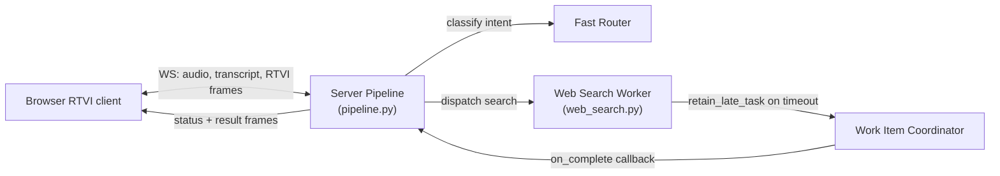
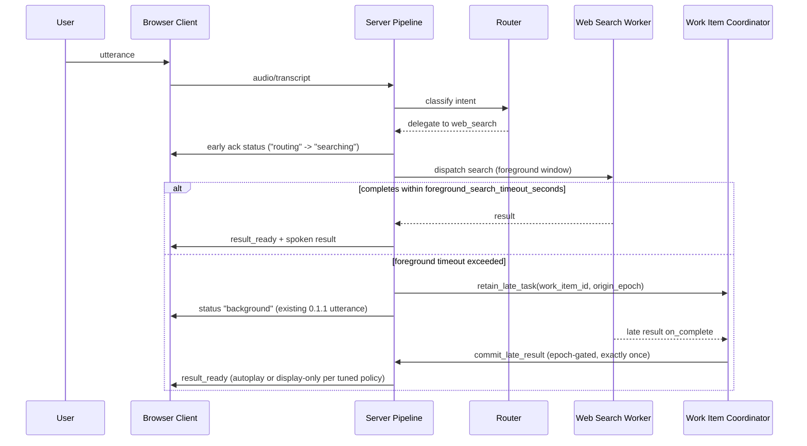

# Task: v0.1.3 — Early Acknowledgement and Background-Delivery Policy

**Status**: Not Started
**Component**: Pipecat subagents
**Assigned to**: Unassigned
**Priority**: High
**Branch**: feature/early-ack-background-delivery-v0.1.3 (create after `feature/latency-observability-v0.1.2` merges to `main`)
**Created**: 2026-07-28
**Review Gates**: full

## Objective

Ship a deterministic, sub-timeout acknowledgement the moment routing confirms a delegated search, then use v0.1.2's latency benchmark data to tune background-delivery policy (autoplay vs. display-only, cancellation/reconnect/newer-turn handling), expand RTVI status to coarse truthful progressive states, and — only if the data supports it — narrow the search worker's conversational context window.

## Context

v0.1.1 shipped the core background-delivery mechanism: late results are retained, committed exactly once, and queued for same-epoch speech (`CHANGELOG.md:23-25`). It did not change when the user first hears anything — the current acknowledgement is still gated on the 15-second `foreground_search_timeout_seconds` in `server/pipeline.py:678-691`, so a user gets silence until either the search finishes or the foreground timeout fires a fixed "taking longer than expected" utterance (`server/pipeline.py:695-699`).

v0.1.2 (`feature/latency-observability-v0.1.2`, currently an **unmerged worktree** at `/Users/vr000m/Code/pipecat-ai/pipecat-subagents-lab-latency-observability`, HEAD `77a34083fd2d7e5d9bc25ab2bb1a6357b2230749`) is adding a performance-log contract and Pipecat observers (`server/perf_metrics.py`) to measure where turn time actually goes — routing vs. search vs. delivery. This plan is the next release and depends on that data and on the merge landing first, because it touches the same files (`server/pipeline.py` most heavily) and current line numbers will shift once 0.1.2's ~500-line diff to that file lands.

This plan operationalizes four prior recommendations, in priority order: early acknowledgement (P0), background-delivery policy tuning (P1), progressive RTVI status (P1/P2), and query-context narrowing as a measured experiment (P2), gated on 0.1.2's data rather than assumed.

## Requirements

- Early acknowledgement must fire deterministically once routing confirms a delegated search — not on a timeout — and must not claim false progress (no "found it" before a result exists).
- Background-delivery policy changes must preserve the existing invariants from 0.1.1: late results committed exactly once, epoch-gated (`server/pipeline.py:1077,1086,1100-1101`), and retained work correctly cancelled on shutdown/caller cancellation (`server/work_item_coordinator.py:251,624`).
- New RTVI status states must be truthful (reflect actual pipeline state, not simulated progress) and must not introduce word-level progress — `shared/protocol.md:79` explicitly reserves that for a future Phase-3 extension.
- Query-context narrowing (`server/workers/web_search.py:332-341`, `history[-4:]`) is not to be implemented speculatively — it requires 0.1.2 metrics showing a correlation between context size and search latency, controlling for provider variance.
- This plan does not start implementation until `feature/latency-observability-v0.1.2` has merged to `main`; Files-to-Modify line numbers below must be re-verified against post-merge `main` before Phase 1 begins.

## Architecture & Call Flow

This plan touches 3 independently-executing components: the browser RTVI client, the server pipeline (router + turn orchestration), and the web-search worker (coordinated via `work_item_coordinator`).

| Step | Trigger | Enters context | Cleared/persisted | Turn boundary |
|---|---|---|---|---|
| Early ack emission | Router confirms delegated search | ack status frame ("routing"/"searching") | ephemeral, replaced by next status | same turn |
| Foreground search window | Worker dispatched | search execution state, `origin_epoch` | cleared on completion or timeout | same turn |
| Retain late task | Foreground timeout exceeded | `work_item_id`, `origin_epoch` in coordinator | persisted until complete/cancelled | crosses turn boundary |
| Commit late result | Worker completes after timeout | late result payload | delivered exactly once, then cleared | may land in a later turn; epoch-gated |
| Progressive status frames | Each state transition (routing/searching/background/result_ready) | RTVI status kind | ephemeral, replaces prior status | same turn per frame |

**Does this topology look correct before I write the phases below?**

## Implementation Checklist

### Phase 0: Prerequisite — merge gate and re-verification
**Impl files:** none (verification only)
**Test files:** none
**Test command:** `git -C /Users/vr000m/Code/pipecat-ai/pipecat-subagents-lab merge-base --is-ancestor feature/latency-observability-v0.1.2 main`
**Goal:** Confirm 0.1.2 has merged to `main` before any 0.1.3 code changes begin; re-verify all Files-to-Modify line numbers below against post-merge `main`.

- Confirm `feature/latency-observability-v0.1.2` is merged (or explicitly re-scope this plan to branch from the worktree if the user wants to proceed in parallel).
- Re-run `rg -n "foreground_search_timeout_seconds|retain_late_task|history\[-4:\]" server/` against post-merge `main` and update line refs in this plan's Technical Specifications.
- Pull 0.1.2's benchmark output (`docs/benchmarks/`) to ground Phase 2 and Phase 4 decisions in real numbers rather than assumption.

### Phase 1: Early acknowledgement (P0)
**Impl files:** `server/pipeline.py`
**Test files:** `tests/test_pipeline.py`
**Test command:** `uv run pytest tests/test_pipeline.py -k ack -v`
**Goal:** Replace timeout-gated silence with a deterministic ack emitted the instant routing confirms delegation, without claiming progress that hasn't happened.

- Add an ack emission point at the routing-confirms-delegation seam (upstream of the current `_search_with_timeout` call at `server/pipeline.py:678-691`), independent of the 15s `foreground_search_timeout_seconds`.
- If 0.1.2 data (from Phase 0) shows routing itself is a significant latency contributor, add a cheap pre-routing "working" state or fast classification path — scope this sub-task only if the data supports it.
- Preserve the existing timeout-fired "taking longer than expected" utterance (`server/pipeline.py:695-699`) as the fallback for genuinely slow searches — it becomes the second ack, not the first.

### Phase 2: Background-delivery policy tuning (P1)
**Impl files:** `server/pipeline.py`, `server/work_item_coordinator.py`
**Test files:** `tests/test_pipeline.py`, `tests/test_work_item_coordinator.py`
**Test command:** `uv run pytest tests/test_pipeline.py tests/test_work_item_coordinator.py -v`
**Goal:** Tune autoplay-vs-display-only policy for late results using 0.1.2 benchmark data, without breaking the existing exactly-once/epoch-gated commit invariant.

- Using 0.1.2 benchmark data, define policy thresholds for when a late result autoplays vs. renders display-only (e.g. by elapsed time since original ack, or by turn-boundary crossing).
- Verify cancellation, reconnect (`interrupted_by_reconnect` in `shared/protocol.md`), and newer-turn arrival correctly suppress or supersede a pending late-result delivery — extend existing epoch checks (`server/pipeline.py:1077,1086,1100-1101`) rather than introducing a parallel mechanism.
- Do not change the exactly-once commit semantics in `work_item_coordinator.py:251,624`; policy changes only affect *whether/how* the committed result is delivered, not whether it is committed.

### Phase 3: Progressive RTVI status (P1/P2)
**Impl files:** `shared/protocol.md`, `server/rtvi_messages.py`, `web/` (client status handling)
**Test files:** `tests/test_app.py`, `tests/integration/test_browser_session.py`
**Test command:** `uv run pytest tests/test_app.py tests/integration/test_browser_session.py -v`
**Goal:** Add coarse, truthful status states (`routing`, `searching`, `background`, `result_ready`) to the RTVI contract without introducing word-level progress.

- Extend `shared/protocol.md`'s reserved work-state seam (`started`, `progress`, `completed`, etc., L71-77) with the four coarse states as an explicit, documented v1 addition — do not touch the L79 word-level-progress reservation.
- Wire emission points in `server/pipeline.py`/`server/rtvi_messages.py` at the same seams used for Phase 1's early ack and Phase 2's late-result delivery, so this phase composes with those rather than adding a separate status pipe.
- Update the browser client to render the four states; confirm in a live browser session (per this repo's "test UI changes before reporting complete" convention) that states appear in true order and never regress to a less-specific state.

### Phase 4: Query-context narrowing experiment (P2, conditional)
**Impl files:** `server/workers/web_search.py`, `server/perf_metrics.py` (if `query_chars`/`context_chars` fields are not already added in 0.1.2)
**Test files:** `tests/test_pipeline.py` (worker context tests)
**Test command:** `uv run pytest tests/ -k web_search -v`
**Goal:** Only narrow `_contextual_input`'s `history[-4:]` window if 0.1.2 data shows context size correlates with search latency after controlling for provider variance — this phase may resolve to "no change" and that is a valid outcome.

- Check whether 0.1.2's `perf_metrics.py` already records `query_chars`/`context_chars`; if not, add them as a measurement prerequisite before any narrowing code change.
- Analyze correlation between context size and search latency, controlling for provider (the request's own caveat).
- If and only if the data supports it, reduce `history[-4:]` (`server/workers/web_search.py:332-341`) or the 1200-char truncation, and re-benchmark to confirm the change actually reduces latency without degrading answer quality on multi-turn follow-ups.

## Technical Specifications

### Files to Modify
- `server/pipeline.py` — ack emission (Phase 1), late-result delivery policy (Phase 2), status emission points (Phase 3). Current relevant lines on pre-0.1.2-merge `main`: `678-691` (foreground timeout config/dispatch), `695-699` (timeout-fired fallback utterance), `1050-1059` (commit-late-result wiring), `1077,1086,1100-1101` (epoch gating). **Must be re-verified post-0.1.2-merge (Phase 0).**
- `server/work_item_coordinator.py` — `retain_late_task` (defined `L251`, called `L624`) — Phase 2 policy hooks only, no change to commit semantics.
- `shared/protocol.md` — delivery/work state documentation, 139 lines currently; states at `L60-68`, reserved work states `L71-77`, word-level-progress reservation at `L79` (do not modify).
- `server/rtvi_messages.py` — RTVI frame construction for new status kinds (Phase 3).
- `web/` — browser client status rendering (Phase 3).
- `server/workers/web_search.py` — `_contextual_input` at `L332`, `history[-4:]` at `L335` (Phase 4, conditional).
- `server/perf_metrics.py` — add `query_chars`/`context_chars` fields if absent after 0.1.2 merge (Phase 4 prerequisite).
- `CHANGELOG.md`, `pyproject.toml` — version bump to 0.1.3 on completion (current version `0.1.1` per `pyproject.toml`).

### Integration Seams
- Ack emission (Phase 1) and status emission (Phase 3) share the same seam in `server/pipeline.py` around the routing-confirms-delegation point — implement Phase 1 first, then extend the same call site for Phase 3 rather than adding a parallel emission path.
- Late-result delivery policy (Phase 2) must compose with epoch gating already in place (`server/pipeline.py:1077,1086,1100-1101`) and with the `retain_late_task`/`on_complete` wiring in `work_item_coordinator.py` — do not fork a second delivery path.
- Phase 4 is gated on Phase 0's benchmark pull; it may be marked "no change, data did not support it" as a valid completion.

## Testing Notes

_To be filled during implementation._

## Issues & Solutions

_To be filled during implementation._

## Acceptance Criteria

- [ ] Early ack fires deterministically on routing-confirmed delegation, verified by test asserting ack precedes the 15s foreground timeout path.
- [ ] Background-delivery policy (autoplay vs. display-only) is data-driven from 0.1.2 benchmarks and documented in this plan's Testing Notes; exactly-once/epoch-gated commit invariant unchanged (verified by existing + new tests passing).
- [ ] RTVI protocol documents and emits `routing`/`searching`/`background`/`result_ready` states; browser client renders them in a live session; no word-level progress introduced.
- [ ] Query-context narrowing is either implemented with benchmark evidence of a latency win, or explicitly marked "not promoted — data did not support it."
- [ ] `CHANGELOG.md` and `pyproject.toml` updated to 0.1.3.
- [ ] Full test suite and `ruff format && ruff check` pass before merge.

## Review Focus

- Epoch-gating and exactly-once commit invariants (`server/pipeline.py:1077,1086,1100-1101`, `server/work_item_coordinator.py:251,624`) must hold after Phase 2 changes — this is the highest-risk seam in the plan.
- RTVI protocol changes (Phase 3) must not conflict with the reserved word-level-progress seam at `shared/protocol.md:79`.
- Phase 4 must show its correlation evidence (or absence thereof) in Testing Notes — do not accept an unmeasured "seems faster" justification.

## Final Results

_To be filled on completion._
