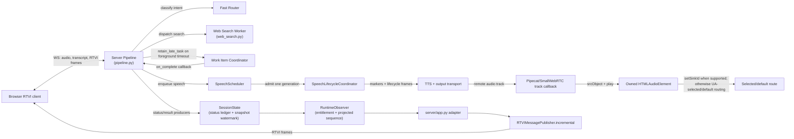

# Task: v0.1.3 — Early Acknowledgement and Background-Delivery Policy

**Status**: Phases 0–3 implemented and complete; Phase 4 (query-context narrowing) implemented but not promoted (`promotion_eligible=false`, `reason=real_stratum_missing` — no paid-provider evidence collected, by design). Review-gauntlet round 1 complete (35 findings fixed, `de0c5c4`..`f12d30b`); all 6 round-1 follow-ups resolved 2026-08-06 (`2da0b85`..`9dd5114`). Round 2 (2026-08-09) fixed the promotion-manifest/evidence-gate cluster plus ack/work-item lifecycle races. Round 3 (2026-08-10) fixed a bug reproduced by execution (a still-running retained/background child wrongly permanently failed) plus the Phase 4B forged-evidence gap, both corroborated by multiple gates. Round 4 (2026-08-10/11, `a324ca5`) fixed 14 of 18 reconciled findings (1 disproven, 3 deferred) — ack-admission retry, full-stop speech sweep, and the Coordinator Protocol declaration, among others; see its Known Follow-ups section below. Round 5 (2026-08-11, `f64a573`) fixed 8 of 9 themes (A, B, E, F, G, H, I, plus the non-quarantined half of C), 1 theme deferred with reason (D), 1 sub-finding quarantined-local (C's getattr-removal), 0 halts; see its Known Follow-ups section below. All 23 acceptance criteria and all known follow-ups through round 5 checked. Final CI-equivalent chain (ruff, mypy, pytest, bun build/test/lint, smoke_server, check_release_metadata, gitleaks) has passed end-to-end after every round through round 5 (most recently against `f64a573`: pytest 1330 passed/1 skipped, mypy clean (30 files), ruff check/format clean, bun test 86 passed/1 skipped, eslint clean).
**Component**: Pipecat subagents
**Assigned to**: Unassigned
**Priority**: High
**Branch**: feature/early-ack-background-delivery-v0.1.3 (create from, or synchronize with, `main` after PR #3, PR #4, and PR #5 merge; Phase 0 must re-verify the same boundaries on the implementation `HEAD`)
**Created**: 2026-07-28
**Review Gates**: full

## Objective

Ship a deterministic acknowledgement fired immediately when routing confirms a delegated search — not gated on the foreground timeout, though not guaranteed sub-timeout if routing itself runs long — then use newly collected v0.1.2-compatible `PERF_METRIC` evidence plus the dated historical baseline to tune background-delivery policy (autoplay vs. display-only, cancellation/reconnect/newer-turn handling), expand RTVI status to coarse truthful progressive states, and — only if the data supports it — narrow the search worker's conversational context window. Phase 0 must establish the new evidence artifact before any policy decision.

## Context

v0.1.1 shipped the core background-delivery mechanism: late results are retained, committed exactly once, and queued for same-epoch speech (see the v0.1.1 entry in `CHANGELOG.md`'s history — its exact line numbers have since shifted; the invariant is independently verifiable via `SessionState`'s exactly-once commit and `WorkItemCoordinator`'s retention). It did not change when the user first hears anything — the current acknowledgement is still gated on the 15-second `foreground_search_timeout_seconds` timeout path in `server/pipeline.py`, so a user gets silence until either the search finishes or the foreground timeout fires a fixed "taking longer than expected" utterance. Phase 0 re-verifies the current symbols and records exact locations before implementation.

v0.1.2 is merged to `main` at PR #3 (`2951dd3`) and provides the performance-log contract and Pipecat observers (`server/perf_metrics.py`) needed to measure routing vs. search vs. delivery. PR #4 (`2dfe06c`, merged through `2a73a71`) adds the transport-aware speech lifecycle that now governs scheduler admission, timeout-notice supersession, and connection teardown. PR #5 (`ce14d37`, merged through `c5ac273`) adds the browser audio-sink owner, connection-generation cleanup, and the marker/flush frame bus exclusions that protect TTS routability. This plan depends on all three release boundaries because it touches the same server and browser seams; Phase 0 verifies their live ancestry and re-reads all line references before implementation.

Transport-aware speech ownership is specified separately in `docs/dev_plans/20260728-bug-transport-aware-speech-supersession.md`. That release-neutral precursor is now reviewed and merged; v0.1.3 must preserve its scheduler/transport invariant from Phase 1 onward. Queue-only discard is not sufficient once synthesized audio has entered the output transport.

This plan operationalizes four prior recommendations, in priority order: early acknowledgement (P0), background-delivery policy tuning (P1), progressive RTVI status (P1/P2), and query-context narrowing as a measured experiment (P2), gated on collected evidence rather than assumed.

## Requirements

- Early acknowledgement must fire exactly once per delegated semantic turn across direct, pending-dialogue, and multi-intent paths — not on a timeout — and must not claim false progress (no "found it" before a result exists). It is an ephemeral speech item, not a `GroundedResult`, transcript entry, or result-history record.
- Background-delivery policy changes must preserve the existing invariants from 0.1.1: `SessionHost`/`SessionState` own idempotent late-result commit and epoch fencing, and the coordinator remains responsible for task ownership/cancellation. Phase 0 records the current call sites by symbol rather than relying on brittle line numbers.
- New RTVI status states must be truthful (reflect actual pipeline state, not simulated progress), have an explicit wire contract and legal transition rules, preserve their original `origin_epoch` across reconnect snapshots for the five-minute TTL, and must not introduce word-level progress — `shared/protocol.md:80` explicitly reserves that for a future Phase-3 extension.
- Query-context narrowing (`server/workers/web_search.py`, `_contextual_input`, `history[-4:]`) is not to be implemented speculatively — it requires a dated data-collection artifact with query/context dimensions, provider/model controls, and a defined latency/quality comparison. No change is a valid result.
- Any accepted TTS generation must have an end-to-end routability contract: the server may suppress only stale or unaccepted lifecycle frames; accepted audio frames must be forwarded through the connection transport, while the generation's remote track must reach the active browser track callback, the owned `HTMLAudioElement`, and an attempted `play()` using the selected sink when `setSinkId` succeeds or user-agent-selected/default routing otherwise. Track callbacks are generation/track events, not per-audio-frame callbacks — this granularity claim is assumed pending the Phase 2 pinned-source check of `@pipecat-ai/small-webrtc-transport`'s track-callback semantics (see Phase 2's transport/browser contract spike), not independently verified here. Server transport completion is not browser audibility, and the credential-free route gate makes no physical-audibility claim.
- This plan does not start implementation until PR #3 (`2951dd3`), the PR #4 merge (`2a73a71`), and the PR #5 merge (`ce14d37`) are ancestors of both `main` and the implementation `HEAD`; Files-to-Modify symbol references below must be re-verified against that merged state before Phase 1 begins.

## Architecture & Call Flow

This plan touches 4 independently-executing components: the browser RTVI client, the server pipeline (router + turn orchestration), the web-search worker (coordinated via `WorkItemCoordinator`), and the connection-scoped speech/transport lifecycle.



```mermaid
sequenceDiagram
    participant U as User
    participant B as Browser Client
    participant P as Server Pipeline
    participant SS as SessionState
    participant RO as RuntimeObserver
    participant AD as App adapter
    participant MP as RTVIMessagePublisher
    participant R as Router
    participant W as Web Search Worker
    participant C as Work Item Coordinator
    participant S as SpeechScheduler
    participant L as SpeechLifecycleCoordinator
    participant O as TTS/output transport
    participant T as Browser track callback
    participant A as HTMLAudioElement/output sink

    U->>B: utterance
    B->>P: audio/transcript
    P->>R: classify intent
    R-->>P: delegate to web_search
    P->>S: enqueue ephemeral ack (no result claim)
    S->>L: admit ack (interruptible, non-canonical)
    L->>O: marker, TTS, and transport lifecycle
    O-->>T: remote ack audio track for active connection generation
    T->>A: attach track to srcObject and attempt play
    A-->>B: ack route/play attempt, or local playback-blocked diagnostic; no audibility claim
    P->>W: dispatch search (foreground window)
    alt completes within foreground_search_timeout_seconds
        W-->>P: result
        P->>SS: commit result/status projection
        SS->>RO: projected result_ready event
        RO->>AD: capability-filtered typed event
        AD->>MP: incremental(sequence, result_ready)
        MP-->>B: result_ready + spoken result frame
    else foreground timeout exceeded
        P->>C: retain_late_task(work_item_id, origin_epoch)
        P->>SS: emit background status
        SS->>RO: projected work_status event
        RO->>AD: capability-filtered typed event
        AD->>MP: incremental(sequence, background)
        MP-->>B: Phase 3 work_status frame
        W-->>C: late result on_complete
        C->>P: commit_late_result (epoch-gated, exactly once)
        P->>S: enqueue final result / replace queued same-work timeout notice
        S->>L: admit only if connection-scoped transport slot is free
        L->>O: marker, TTS, and transport lifecycle
        O-->>T: remote audio track for active connection generation
        T->>A: attach track to srcObject and attempt play
        A-->>B: audio route/play attempt, or local playback-blocked diagnostic; no audibility claim
        P->>SS: commit result_ready projection
        SS->>RO: projected result_ready event
        RO->>AD: capability-filtered typed event
        AD->>MP: incremental(sequence, result_ready)
        MP-->>B: result_ready frame (server commit/display state only)
    end
```

| Step | Trigger | Enters context | Cleared/persisted | Turn boundary |
|---|---|---|---|---|
| Early ack emission | Router confirms delegated search | ephemeral ack item (`ack_id`, turn/work identity) | dropped, admitted, or completed; never canonical | same turn |
| Foreground search window | Worker dispatched | search execution state, `origin_epoch` | cleared on completion or timeout | same turn |
| Retain late task | Foreground timeout exceeded | `work_item_id`, `origin_epoch` in coordinator | persisted until complete/cancelled | crosses turn boundary |
| Commit late result | Worker completes after timeout | late result payload | delivered exactly once, then cleared | may land in a later turn; epoch-gated |
| Progressive status frames | Each state transition (routing/searching/background/result_ready) | capability-gated RTVI status kind | latest keyed status retained for snapshot TTL | same turn per frame |

The early acknowledgement is a logical delegation-confirmed operation shared by all delegated paths. It schedules an ephemeral item through the connection's `SpeechScheduler`; it never enters canonical result state. Status messages are server-authored and flow through the existing session-state/observer boundary as the strict `work_status` contract described below. Speech admission and transport completion remain owned by the merged connection-scoped `SpeechLifecycleCoordinator`; v0.1.3 must reuse that boundary rather than create parallel lifecycle state.

## Implementation Checklist

### Phase 0: Prerequisite — merge gate and re-verification
**Impl files:** `server/perf_metrics.py`, `shared/schemas/v013-evidence.json`, `scripts/validate_v013_evidence.py`, `tests/test_perf_metrics.py`, `tests/test_v013_perf_scenarios.py` (evidence-contract preparation only; no user-facing behavior change — Phase 0A does land a benign log-schema addition to `perf_metrics.py`)
**Test files:** `tests/test_speech_lifecycle.py`, `tests/test_pipeline.py`, `tests/test_speech_scheduler.py`, `tests/test_app.py`, `tests/test_config.py`, `tests/test_perf_metrics.py`, `tests/test_v013_perf_scenarios.py`, `web/test/app.test.js`, `web/test/protocol.test.js`
**Test command (0-preflight, before any Phase 0A edit):** `git merge-base --is-ancestor 2951dd3 main && git merge-base --is-ancestor 2a73a71 main && git merge-base --is-ancestor ce14d37 main && git merge-base --is-ancestor 2951dd3 HEAD && git merge-base --is-ancestor 2a73a71 HEAD && git merge-base --is-ancestor ce14d37 HEAD`
**Test command (0A, after the zero-edit preflight and Phase 0A instrumentation/fixture commit — schema/fixture gate):** `uv run pytest tests/test_perf_metrics.py tests/test_v013_perf_scenarios.py -k 'schema or fixture' -v`
**Test command (0B, run after 0A passes — ancestry/lifecycle gate):** `git merge-base --is-ancestor 2951dd3 main && git merge-base --is-ancestor 2a73a71 main && git merge-base --is-ancestor ce14d37 main && git merge-base --is-ancestor 2951dd3 HEAD && git merge-base --is-ancestor 2a73a71 HEAD && git merge-base --is-ancestor ce14d37 HEAD && uv run pytest tests/test_speech_lifecycle.py tests/test_pipeline.py tests/test_speech_scheduler.py tests/test_app.py tests/test_config.py tests/test_perf_metrics.py -v && (cd web && bun test app.test.js protocol.test.js)`
**Test command (0C, run after 0B passes — artifact production and validation gate):** `uv run pytest tests/test_v013_perf_scenarios.py -v && uv run python scripts/validate_v013_evidence.py --phase phase0 --input docs/benchmarks/v0.1.3-phase0-transport-baseline.jsonl`
**Goal:** Confirm all three merged release boundaries, prepare the credential-free evidence schema/fixture, and verify the transport-aware lifecycle and browser-media contracts before 0.1.3 behavior changes begin; re-verify all Files-to-Modify symbols against the verified checkout.

- Confirm PR #3 (`2951dd3`), the PR #4 merge (`2a73a71`, containing the transport lifecycle fixes through `2dfe06c`), and the PR #5 merge (`ce14d37`, containing the browser audio-sink/generation fixes through `c5ac273`) are ancestors of both `main` and `HEAD`; record the verified base/branch commit in the dated Phase 0 artifact and do not begin Phase 1 against a branch that lacks any boundary.
- The implementation branch must satisfy the ancestry gate above before Phase 0A changes land. If any `git merge-base --is-ancestor` check fails, synchronize or recreate the implementation branch from the verified `main` ancestry, then re-run the preflight and the `createAudioSink` symbol/source check against that `HEAD`; do not infer missing PR #5 symbols from the review checkout. The merge-base preflight is the sole authority for whether this gate is red.
- The 0-preflight command is a zero-edit gate: run it on the synchronized implementation branch before changing `server/perf_metrics.py`, tests, or any other production file. If it fails, rebase or recreate the feature branch from the verified `main` ancestry and rerun the gate; do not land Phase 0A instrumentation on the incomplete base.
- Re-run the transport precursor's focused lifecycle, app-wiring, configuration, pipeline, and scheduler tests plus the merged PR #5 browser tests. The gate must cover marker-before-TTS ordering, marker/flush exclusion from the worker bus, synthesis-end non-terminal behavior, stale-frame suppression, provider-error attribution, queued-vs-admitted notice behavior, teardown completion before next admission, remote-track attachment, speaker-sink failure handling, and connection-generation cleanup.
- Re-run `rg -n "foreground_search_timeout_seconds|retain_late_task|history\[-4:\]" server/` against the verified checkout and record symbol/file matches in the Phase 0 artifact; do not preserve stale line references in this plan.
- Separately record the `SessionHost`/`SessionState` exactly-once-commit and epoch-fencing call sites Requirements calls out: re-run `rg -n "commit_late_result|_commit_late_result|def accepts\b|origin_epoch" server/session_state.py server/pipeline.py` against the verified checkout and record the matched symbols/files in the same Phase 0 artifact. The artifact contains a machine-checked `call_site_evidence` object with the source commit, query, expected symbols, file paths, and non-empty match list; `validate_v013_evidence.py --phase phase0 --repo-root .` re-runs these checks and rejects a hand-edited or stale call-site record. Line numbers are informational only.
  - **Amended 2026-08-10 (review-gauntlet round 3):** this machine-checked artifact and the `--repo-root` validator flag were never built — the Phase 0 evidence file only ever carried latency-sample records, `shared/schemas/v013-evidence.json` has no `call_site_evidence` property (`additionalProperties: false`), and `validate_v013_evidence.py` has no `--repo-root` argument. The underlying code invariant this bullet exists to protect is independently true and verified (ownership lives in `SessionHost.accepts`/`commit_late_result_once`/`_commit_result_state` and `SessionState`'s ledger methods, confirmed by the same `rg` query against current HEAD), so this is a documentation/tooling gap, not a live defect. Given the cost of building a new machine-checked artifact format and validator subcommand versus the value already delivered by review-gauntlet's own reconciliation record, this call-site evidence is recorded here, in the review ledger, instead of as a separate artifact. This bullet is not implemented as originally written and should not be treated as satisfied by any existing script.
- Produce the credential-free Phase 0 artifact with `uv run pytest tests/test_v013_perf_scenarios.py -v`; it must cover direct, delegated-complete, retained-late, cancellation, reconnect, and same-epoch newer-turn fixtures and validate `phase`, scenario, turn/work-item ID, provider/model (or `unavailable`), query/context lengths, `routing_phase_latency_ms` (routing-phase latency; the field is required on every record and `validate_v013_evidence.py` rejects its absence, though its value is nullable for scenarios where no routing phase occurs), outcome, disposition, a per-run monotonic sample timestamp in integer milliseconds from the run's monotonic origin, optional UTC wall-clock recording time, `run_id`, `sample_index`, and sample count. Monotonic values are comparable only within one run; never compare them across independently generated artifacts. The Phase 0 minimum is one record for each named scenario, one record for each outcome exercised by the fixture matrix, and one record in every provider/model stratum (the credential-free stratum is explicitly `unavailable`/`unavailable`); the validator rejects a missing scenario, outcome, stratum, or declared minimum. A paid-provider supplement may use `uv run python scripts/smoke_conversation.py --query 'What is the latest stable Pipecat release?' --timeout 120`, but missing credentials/provider availability records `blocked` or `not-run` and does not fail the credential-free gate. Store dated JSONL/summary output under `docs/benchmarks/`; preserve pre-precursor data only as a baseline.
- Verify whether 0.1.2 emits safe `query_chars`, `context_chars`, provider/model, acknowledgement, scenario, delivery-disposition, and routing-phase-latency dimensions (the last needed to evaluate Phase 1's conditional pre-routing-marker bullet). If not, Phase 0A adds those fields and tests before collection; Phase 4 remains blocked until the schema-valid artifact exists. Each JSONL record validates against `shared/schemas/v013-evidence.json`; record the observed schema, per-scenario/outcome/provider-model minimums, and validator result in the artifact summary.
- Phase 0A is an explicit instrumentation/fixture commit and gate after the zero-edit preflight: land the metric fields, schema validator, and deterministic scenario fixture only after the prerequisites pass; then run 0A, 0B, and 0C in order. Phase 0 is complete only after the scenario fixture has produced the dated artifact and `validate_v013_evidence.py` has passed; Phase 1 cannot start before that completion gate.

### Phase 1: Early acknowledgement (P0)
**Impl files:** `server/pipeline.py`, `server/speech_scheduler.py`, `server/speech_lifecycle.py`, `server/perf_metrics.py`, `server/config.py`, `server/app.py` (lands all three `Config` feature fields and the immutable `FeaturePolicy`; wires `enable_early_ack`), `shared/schemas/v013-evidence.json`, `scripts/validate_v013_evidence.py` (extended with the `phase=phase1` field set and minimums)
**Test files:** `tests/test_pipeline.py`, `tests/test_speech_scheduler.py`, `tests/test_speech_lifecycle.py`, `tests/test_app.py`, `tests/test_config.py`, `tests/test_perf_metrics.py`, `tests/test_v013_perf_scenarios.py`, `tests/test_session_host.py` (turn latch, `on_ack_terminal`, `cancel_turn_or_child`, and the `SessionHost(registry)` constructor-compatibility test all live here)
**Test command:** `git merge-base --is-ancestor 2951dd3 main && git merge-base --is-ancestor 2a73a71 main && git merge-base --is-ancestor ce14d37 main && git merge-base --is-ancestor 2951dd3 HEAD && git merge-base --is-ancestor 2a73a71 HEAD && git merge-base --is-ancestor ce14d37 HEAD && uv run python scripts/validate_v013_evidence.py --phase phase0 --input docs/benchmarks/v0.1.3-phase0-transport-baseline.jsonl && uv run pytest tests/test_speech_lifecycle.py tests/test_pipeline.py tests/test_speech_scheduler.py tests/test_app.py tests/test_config.py tests/test_perf_metrics.py tests/test_v013_perf_scenarios.py tests/test_session_host.py -v && (cd web && bun test app.test.js protocol.test.js)` (re-runs the Phase 0B ancestry/lifecycle gate and validated Phase 0 artifact before this phase's ack-path tests; there is no separate trailing pytest invocation).
**Goal:** Replace timeout-gated silence with a deterministic ack emitted the instant routing confirms delegation, without claiming progress that hasn't happened.

**Normative build order for this phase** (the bullets below describe the full ack contract but must be implemented in this sequence, not list order): (1) land all three `Config`/`FeaturePolicy` fields and the kill-switch wiring described later in this phase; (2) make `lifecycle` a required, unconditional `SpeechScheduler` constructor parameter and migrate existing tests off the `lifecycle is None` fallback onto `ManualTimerScheduler`-backed coordinators; (3) extend `GenerationIdentity` with `role`/`turn_id`/`ack_id`; (4) add the shared delegation-confirmed ack operation and its scheduling; (5) close with the dated Phase 1 evidence artifact. Building the ack operation before the `Config`/`FeaturePolicy` fields and the lifecycle-required migration land means building it on top of fallback branches and pre-flag code that this same phase then removes.

- Add a shared delegation-confirmed operation with semantic-turn/work-item identity and invoke it from direct, pending-dialogue, and multi-intent delegated paths (the latter currently branch at `_handle_pending`/`_handle_multi_intent`). Define one ephemeral ack per semantic turn, including mixed multi-intent turns: emit one parent ack when at least one child is delegated, never one ack per child, and do not ack a turn containing only direct/unsupported/clarification work. Enforce this with a turn-scoped acknowledgement latch in `SessionHost`: invoke it immediately after the first eligible multi-intent child decision, carry the parent turn identity, and make subsequent eligible children no-ops for acknowledgement emission. Clear the latch in the turn's normal completion/cancellation/failure cleanup; do not retain an unbounded process-lifetime set. This latch is the single enforcement mechanism for the exactly-once invariant — it must land in this phase, not be deferred or duplicated by a later phase.
- Disambiguate route names in the implementation matrix: this plan's “direct” means a direct web-search delegation (`existing_worker`/`new_worker`), not `RoutingDecision.action=direct`, which is the non-delegated main-responder path and remains ack-free. Pending continuation is eligible only after it confirms delegated search; a mixed multi-intent turn gets one parent ack when any child is eligible.
- Schedule the ack through a scheduler/lifecycle-internal ephemeral type with a distinct identity (`turn_id`, optional parent `work_item_id`, `ack_id`). `SpeechScheduler` owns the ack item, `ack_id` index, queued discard, and local selection/serialization bookkeeping; `SpeechLifecycleCoordinator` is the sole authority for connection-scoped generation admission, transport occupancy, release, and media-generation state; `SessionHost` owns the turn latch and acknowledgement metrics. `SpeechScheduler._active` is only a local lease mirror/serialization guard: it may be set only after `lifecycle.try_admit()` succeeds, never admits or releases transport independently, and is cleared only from the lifecycle terminal callback after the lifecycle has released or fenced the generation. Synthesis end, provider callbacks, interruption, teardown, and terminal callbacks must use that one lifecycle path; stale callbacks are no-ops. It must be interruptible, must not create canonical result/transcript/history state, and must be dropped atomically via an explicit `discard_queued_ack(ack_id)` operation if the real result is ready before admission; an admitted ack may finish but never blocks a result from being committed. Concretely: `SpeechItem` (`server/speech_scheduler.py`) already carries `role` and `result_id` post-PR#4 — Phase 0 confirms their exact shape; this phase adds the new nullable `ack_id: str | None` field and the `role="ack"` value (result items require `result_id`; ack items require `ack_id` and no `result_id`); maintain an explicit `ack_id` index to the same `work_item_id`-keyed queues `SpeechScheduler` already uses for results; and make every `speech_progress` call site role-conditional, including enqueue, admission, interruption, cancellation, pause/resume, reconnect, provider failure, and terminalization. Ack items are wire-invisible in `speech_progress` and remain server-log/observability-only, keyed by `ack_id`; they never call `SessionState.speech_progress()` or `RTVIMessagePublisher.speech_progress()`, so result-shaped wire state remains result-only. `discard_queued_ack(ack_id)` removes only that still-queued ack and atomically clears the index; it must not affect admitted speech or another queued item. This does not create result-oriented `speech_progress` and does not introduce a parallel lifecycle pipe.
- `SessionHost` composes the ack's spoken text (the `SpeechItem.text` field): a fixed, non-progress-claiming utterance produced at delegation confirmation, optionally overridable via a `Config` string field defaulting to that fixed wording; neither `SpeechScheduler` nor the lifecycle invents ack wording, and the text never claims a result exists.
- Make the migration boundary executable before adding ack role conditionals: all provider, transport, interruption, pause, reconnect, and teardown paths issue lifecycle commands; `SpeechLifecycleCoordinator` performs the one terminal transition and invokes `SpeechScheduler.on_lifecycle_terminal(generation_id)` exactly once; only that callback clears `_active` and advances the next queue item. The `lifecycle` parameter becomes an unconditionally required (non-optional, no default) `SpeechScheduler` constructor argument in this phase — not merely "required for production" — because every construction site, test included, must supply a real or fake `SpeechLifecycleCoordinator`: every production `SpeechScheduler` is built with the connection's `SpeechLifecycleCoordinator` (per the every-connection rule below), and the current `lifecycle is None` branches — `_release()` clearing `_active` directly and the `uuid4().hex` fallback token in `start_next()` — are deleted entirely, not merely bypassed in production. All 18 existing `SpeechScheduler(SessionState())` no-lifecycle test constructions in `tests/test_speech_scheduler.py` must migrate to `ManualTimerScheduler`-backed fake `SpeechLifecycleCoordinator` instances (the `FakeClock`/timer scaffolding already in `server/speech_lifecycle.py` supports this), so exactly one release protocol exists anywhere, including tests. A scheduler-side `_active = None` or lifecycle-slot release is forbidden. Add an invariant test that instruments every release path and proves one lifecycle release, one scheduler mirror clear, and no admission before the teardown barrier.
- Extend `GenerationIdentity` with explicit `role`, `turn_id`, and nullable `ack_id` fields so pre-admission terminal records derive `ack_id`, `turn_id`, and `origin_epoch` from typed data; result identities carry `role="result"`/`result_id`, while ack identities carry `role="ack"`/`ack_id`. Synthetic `ack_work_item_id` remains only the queue key and is never parsed to recover identity.
- Define the ack's queue key explicitly, including for mixed multi-intent turns where the ack has no single child `work_item_id`: use a synthetic `ack_work_item_id = f"ack-{turn_id}"` as both the `SpeechScheduler` queue key and the `GenerationIdentity.work_item_id` for admission, distinct from any real child `work_item_id`. `cancel(work_item_id)` therefore only ever removes the ack when called with `ack_work_item_id` (i.e. a whole-turn cancel); cancelling a single delegated child's `work_item_id` does not touch the parent ack, unless that child was the turn's only delegated child, in which case the turn-level cancellation path cancels both under their respective keys in the same operation. `ack_work_item_id` values exist only in `SpeechScheduler` queue indexing and `GenerationIdentity`; they must never be admitted into `WorkItemCoordinator`'s retained-task ledger or `SessionState`'s result/work records, keeping the synthetic ack namespace fully disjoint from real `work_item_id`s (`work-{turn_id}-{index}`) in every persisted or cancellable store.
- Enforce ack wire-invisibility through one choke point rather than per-call-site discipline: route every `speech_progress`-shaped emission in `SpeechScheduler` through a single internal `_emit_progress(item, state)` helper that no-ops for `item.role == "ack"` before it would call `SessionState.speech_progress()` / `RTVIMessagePublisher.speech_progress()`; no call site invokes those methods directly. Add one sweep test that drives an ack item through every `DeliveryState` transition (enqueue, admission, interruption, cancellation, pause/resume, reconnect, provider failure, terminalization) and asserts zero `SessionState`/`RTVIMessagePublisher` speech-progress events are recorded.
- Define the no-TTS and unavailable-transport cases explicitly: construct one `SpeechLifecycleCoordinator` for every connection, including connections whose `connection_tts` is `None`, and inject a transport-acceptance predicate. The scheduler creates a `GenerationIdentity` from the ack identity before queue pop or `_active` assignment, then calls an idempotent lifecycle `pre_admission_disposition(identity) -> Admit | Terminal(reason)` under the same per-item lock used by `discard_queued_ack()`. `PreAdmissionTerminalReason` is a closed enum containing `no_tts` and `unavailable_transport`; each terminal record carries `ack_id`, `turn_id`, `origin_epoch`, reason, and terminal timestamp, and invokes no admitted-generation callback. A `Terminal` result records the reason in the lifecycle terminal ledger but does not allocate a transport token; the scheduler removes only the queued item/`ack_id` index and emits the bounded observability record, while an idempotent `SessionHost.on_ack_terminal(identity, reason)` callback remains the sole turn-latch mutator. That callback is injected into `SpeechScheduler` as a constructor callable at connection setup in `SessionHost.connect()`, matching the existing `speak`/`stop` callable pattern; the scheduler holds no `SessionHost` reference, keeping the dependency direction host→scheduler. An `Admit` result is the only path allowed to pop the queue, call `try_admit()`, or set `_active`; the lifecycle terminal callback is admitted-generation-only. Result-ready/discard versus admission races resolve under that lock, and reconnect cancels any pending pre-admission identity exactly once. Constructing a `SpeechLifecycleCoordinator` when `connection_tts` is `None` reverses the current wiring (today the pipeline constructs it only `if connection_tts is not None`), so the coordinator's transport-facing callbacks (`on_terminal`, `dispatch_cleanup`, `dispatch_teardown`) must have an explicit no-TTS behavior: each becomes a no-op (or receives a null-transport adapter) when no TTS/transport lane exists, and start/grace timers must never arm for a generation that terminalizes via `pre_admission_disposition` before any timer would be scheduled. Wire the unconditional lifecycle through the app processor chain and test identity allocation, no-slot occupancy, terminal reason, exactly-once scheduler cleanup plus host latch callback, no-op dispatch-callback behavior with no TTS, and both no-TTS/unavailable-transport construction paths. `work_status_v1` gates the Phase 3 wire status only; it does not gate the internal ack or its TTS/media route when TTS is available.
- The pre-admission identity/lock contract is normative: `GenerationIdentity` carries explicit `role`, `turn_id`, and nullable `ack_id` fields; `PreAdmissionTerminalReason` is a closed `no_tts|unavailable_transport` enum; every "lock" named in this phase and Phase 2 (host turn-cancellation, scheduler per-item, lifecycle admission) is a non-awaiting synchronous critical section, not an `asyncio.Lock` — see Phase 2's concurrency-model resolution for the full rationale. The nesting order is host turn-cancellation section → scheduler per-item section → lifecycle admission section; that nesting covers the pre-admission decision, queue/index mutation, `try_admit`, and `_active` assignment, and lifecycle/host callbacks run only after the nested scheduler/lifecycle sections return. Result-ready/discard, cancellation, and reconnect interleavings must deliver one terminal event, one scheduler cleanup, and one host latch callback with no transport-slot occupancy.
- Define acknowledgement timing as the first scheduler enqueue after an observable delegation-confirmed event and record `ack_enqueued` with `ack_id`, turn/work identity, and monotonic timestamp; the acknowledgement is queued immediately upon that delegation-confirmed event, subject to transport availability. Do not claim the ack is queued "before the configured foreground timeout" as a guarantee: nothing in this codebase bounds routing latency (the OpenAI Responses-API router call carries its own client timeout, independent of `foreground_search_timeout_seconds`), so a slow or degraded router can delay delegation confirmation. The foreground search timer starts only after search dispatch inside `_search_with_timeout`; a routing stall does not fire the legacy search-timeout notice. v0.1.3 does not add a second turn-level routing deadline: the existing router timeout, explicit cancellation, or routing failure ends the turn as `failed`/`cancelled`, clears the latch, and retains no search task. Phase 0's routing-phase-latency dimension measures this; if routing-phase median latency exceeds 15% of the foreground budget, Phase 1's conditional pre-routing marker bullet below applies. Test both the no-timeout-notice-before-dispatch rule and routing failure/cancellation cleanup. This timing claim does not claim browser audibility; the end-to-end media route is covered by the Phase 2 routability gate below.
- Add a test matrix for exactly-once delegated acknowledgement, no acknowledgement for direct/unsupported/clarification/rejected routes, no false result claim, interruption, cancellation, reconnect, normal completion cleanup, failure cleanup, post-cleanup reuse, and result-ready-before-ack. For direct, pending-dialogue, and mixed multi-intent paths, assert canonical results, transcript/history, snapshots, and RTVI `speech_progress` remain unchanged by the ack. Include explicit multi-intent cancellation cases: cancelling one child leaves `ack_work_item_id` queued, cancelling the whole turn removes the parent ack and all child queues under their respective keys, and cancelling the sole delegated child removes both keys atomically. The no-TTS and unavailable-transport cases must assert terminal observability, zero media/TTS calls, zero retained queue entries, cleared index/latch state, and bounded ledger eviction.
- Add explicit timing tests with deterministic barriers/fake clock, including result completion before ack enqueue, queued-ack discard, admitted-ack completion, same-parent multi-intent identity, and the invariant that a later semantic turn can acquire one fresh latch after each cleanup path.
- Add a routing-barrier test proving that a router held beyond `foreground_search_timeout_seconds` does not emit the search timeout notice before dispatch, plus routing-time failure and cancellation tests proving the legal terminal outcome and latch cleanup.
- Make cancellation a host-owned turn operation: implement `SessionHost.cancel_turn_or_child(turn_id, child_work_item_id | None)` under the turn's cancellation lock. It computes the delegated-child set and sole-child condition, updates the parent acknowledgement latch, cancels retained coordinator work, and calls one scheduler bulk mutation for the parent `ack_work_item_id` and affected child keys before releasing the lock. A child cancel never accidentally removes a parent ack; whole-turn and sole-child cancellation remove both under the same operation. Test cancellation at the boundary where a child completion and cancellation race.
- Add fake no-TTS and unavailable-transport tests covering retained ack identity/observability, absence of TTS and media output, latch cleanup, zero queue retention, bounded terminal-ledger eviction, and compatibility with the legacy timeout behavior.
- Before any Phase 1 behavior change, add all three `Config` fields and their immutable `FeaturePolicy` (`enable_early_ack`, `enable_background_status`, `enable_autoplay_policy`), the environment/TOML mappings below, `FeaturePolicy.from_config()`, and the constructor/injection contract: preserve the existing `SessionHost` constructor shape with `registry` remaining the first positional/keyword parameter; add `config` and `feature_policy` as keyword-only inputs, with `_default_session_host(config)` constructing one policy and injecting it into `SessionHost`; `create_app()` and `SessionHost.connect()` use that same object; a custom injected `SessionHost` is authoritative and a conflicting registry `Config` fails fast rather than creating a second policy. Add a compatibility test for existing `SessionHost(registry)` callers. Later phases consume these fields and do not reconstruct or extend the policy.
- Wire the `enable_early_ack` kill switch (landed on `Config`/`FeaturePolicy` in the bullet above) into `server/app.py`, defaulting on. When disabled, this phase's entire ack path (delegation-confirmed ack scheduling, `discard_queued_ack`, and ack media output) must not fire, reproducing pre-v0.1.3 timeout-gated behavior exactly. Parameterize flag-off regression coverage across direct delegated search, pending continuation, and mixed multi-intent turns, asserting no ack scheduling, ack metrics, latch residue, queue/index entries, or media output and unchanged timeout-notice behavior. Keep a separate timeout assertion for each path so the test does not only prove that the ack disappeared. All three switches are read from the one immutable `FeaturePolicy` described above; browser behavior changes only through the server contract and its negotiated capability path. `create_app()` must not resolve a second policy from `WorkerRegistry.config`.
- Close this phase with a dated Phase 1 evidence artifact: re-run `tests/test_v013_perf_scenarios.py` with ack-path scenarios included (`ack_enqueued` timing, exactly-once/discard/admitted-completion/no-TTS cases) and store the dated JSONL/summary at `docs/benchmarks/v0.1.3-phase1-ack-evidence.jsonl` alongside Phase 0's artifact. Every JSONL line must validate against `shared/schemas/v013-evidence.json` with `phase=phase1` and require `scenario`, `turn_id`, nullable `work_item_id`, nullable `ack_id`, `ack_enqueued`, nullable `ack_enqueued_ms`, `ack_terminal_state`, `outcome`, `disposition`, `provider`, `model`, `run_id`, `sample_index`, and the per-run monotonic timestamp contract from Phase 0. The minimum is one record per named ack matrix scenario and terminal outcome, one record per provider/model stratum, and two records each for the queued-discard and admitted-completion race scenarios. Phase 0A lands only the `phase=phase0` schema rules and minimums; this phase extends `shared/schemas/v013-evidence.json` and `scripts/validate_v013_evidence.py` with the `phase=phase1` field set and race-scenario minimums (hence both files in this phase's impl list). Run `uv run python scripts/validate_v013_evidence.py --phase phase1 --input docs/benchmarks/v0.1.3-phase1-ack-evidence.jsonl`; a failing validator blocks Phase 2 autoplay activation.
- Preserve the merged control-ack lifecycle: pause/cancel/stop disposition is recorded before interruption, control acknowledgements cannot reuse the interrupted transport generation, and explicit resume or a newly accepted turn waits for the stop or teardown barrier before scheduling speech. Cover applied and unknown-target control requests.
- If 0.1.2 data (from Phase 0) shows routing itself is a significant latency contributor — defined as routing-phase median latency exceeding 15% of the `foreground_search_timeout_seconds` budget — add an internal-only pre-routing `working` marker or fast classification path — it must not become a client-visible status until Phase 3 extends the wire enum. Test exactly 15%, just below, and just above the threshold; the marker is absent at or below the boundary, present only above it, and remains internal-only (no `work_status`/RTVI frame). The median is computed only over samples from real provider/model strata; synthetic credential-free fixture latencies (the `unavailable`/`unavailable` stratum) are excluded, so a Phase 0 artifact containing only credential-free samples resolves this conditional to "no change". This requires the `routing_phase_latency_ms` dimension in the Phase 0 evidence schema (see Phase 0's schema-verification and field-list bullets); without it, this conditional cannot be evaluated and defaults to "no change".
- Phase 1 has no capability handshake yet (that lands in Phase 3), so foreground-timeout handling in this phase is capability-blind: every client retains the legacy timeout notice on foreground-timeout, defined separately for single, pending, and multi-intent work items. The merged PR's queued timeout-notice supersession remains required for these notice paths and must not interrupt an already-admitted notice. Test the no-duplicate behavior when the early ack is queued, active, or already complete.

### Phase 2: Background-delivery policy tuning (P1)
**Impl files:** `server/pipeline.py`, `server/speech_scheduler.py`, `server/speech_lifecycle.py`, `server/app.py`, `server/config.py` (promotion-manifest loader only — the flag fields and `FeaturePolicy` are Phase-1-landed and not modified here), `scripts/validate_v013_evidence.py`, `scripts/validate_phase2_transport_browser_contract.py`, `scripts/emit_v013_deployment_metadata.py`, `scripts/_evidence_common.py`, `shared/schemas/v013-transport-browser-contract.json`, `.github/workflows/ci.yml` (release metadata producer), `web/src/app.js`, `shared/protocol.md` (amend the autoplay rule described below in the same commit as the policy change)
**Test files:** `tests/test_pipeline.py`, `tests/test_work_item_coordinator.py`, `tests/test_speech_scheduler.py`, `tests/test_speech_lifecycle.py`, `tests/test_app.py`, `tests/test_config.py`, `tests/test_deployment_metadata.py`, `tests/test_v013_perf_scenarios.py`, `tests/test_phase2_transport_browser_contract.py`, `tests/test_session_host.py` (adds `commit_late_result_once` coverage), `tests/test_v013_evidence_validator.py` (new — see New files to create), `tests/integration/test_browser_session.py`, `web/test/app.test.js`
**Test command:** `uv run python scripts/validate_v013_evidence.py --phase phase0 --input docs/benchmarks/v0.1.3-phase0-transport-baseline.jsonl && uv run python scripts/validate_v013_evidence.py --phase phase1 --input docs/benchmarks/v0.1.3-phase1-ack-evidence.jsonl && uv run python scripts/validate_phase2_transport_browser_contract.py --input docs/benchmarks/v0.1.3-phase2-transport-browser-contract.json && uv run pytest tests/test_phase2_transport_browser_contract.py tests/test_pipeline.py tests/test_work_item_coordinator.py tests/test_speech_scheduler.py tests/test_speech_lifecycle.py tests/test_app.py tests/test_config.py tests/test_deployment_metadata.py tests/test_v013_perf_scenarios.py tests/test_session_host.py tests/test_v013_evidence_validator.py tests/integration/test_browser_session.py -v && uv run python scripts/emit_v013_deployment_metadata.py --check-release-inputs && (cd web && bun test app.test.js)`
**Goal:** Tune autoplay-vs-display-only policy for late results without breaking the existing exactly-once/epoch-gated commit invariant. Phase 2 code may land behind `enable_autoplay_policy=false`, but autoplay activation is a machine-checked gate with two separate outcomes: schema validity proves that an artifact is structurally trustworthy, while `promotion_eligible` proves that the required evidence is suitable for an autoplay decision. The credential-free `unavailable`/`unavailable` stratum may pass schema validation and validate lifecycle correctness, but it can never make autoplay promotion-eligible. Promotion additionally requires complete, real provider/model strata declared by the release manifest — a committed machine-readable file, `docs/benchmarks/v0.1.3-promotion-manifest.json`, emitted only by `scripts/validate_v013_evidence.py --write-manifest` after the Phase 0/Phase 1 validators and the Phase 2 transport gate all pass; at runtime `server/config.py` gains a `load_promotion_manifest()` loader that `_default_session_host(config)` calls once, handing the immutable verdict to the `SessionHost` policy evaluator; the manifest path is a `Config` field (`Config.promotion_manifest_path`, defaulting to `docs/benchmarks/v0.1.3-promotion-manifest.json` for the repo-checkout dev/CI case but overridable for deployments that don't ship the `docs/` tree, e.g. packaged installs), so runtime startup never hard-depends on a docs-tree path — a missing, unreadable, schema-invalid, or `promotion_eligible=false` manifest at whatever path is configured defaults to display-only with `evidence_unavailable` (or the precise reason) recorded — and no `blocked`, `not-run`, `unavailable`, malformed, contaminated, or uncontrolled samples, the transport/browser contract gate, and the explicit predicate tests below. If evidence is missing, blocked, unavailable-only, contaminated, or malformed, the policy evaluator records `evidence_unavailable` (or the precise eligibility reason), commits valid results exactly once, and forces `commit_display_only`; it never claims a data-driven tuning result or enables autoplay. No v0.1.3 phase mandates paid real-strata collection: unless the optional Phase 0 paid supplement (or a dedicated blocked-allowed real-strata collection run before Phase 2 activation) produces complete real provider/model strata, v0.1.3 ships with autoplay promotion expected ineligible and the policy in `commit_display_only`.

- Phase 2 starts with the transport/browser contract spike, before finalizing or implementing the policy's media-routability tests and ownership changes. Run `uv run python scripts/validate_phase2_transport_browser_contract.py --input docs/benchmarks/v0.1.3-phase2-transport-browser-contract.json`; it must verify the landed `createAudioSink` owner and pinned Small WebRTC track-callback source/docs plus the fake transport/audio-element route. A real-browser check may be recorded as `not-done` for credential-free lifecycle validation, but in that case the artifact is `audibility_unverified` and can never be `promotion_eligible`; only a named browser/device check recorded as `audibility_verified` may satisfy the autoplay promotion predicate. An unverified source contract or fake route is a blocking `blocked` result and leaves the policy disabled.
- The Phase 2 validator test matrix must cover missing, malformed, blocked, unavailable-only, real-stratum-missing, contaminated, unverified-source, invalid-fake-route, and `audibility_unverified` artifacts. Each negative case asserts `promotion_eligible=false`, the policy remains disabled, and valid results are display-only. A schema-valid artifact with only `unavailable` provider/model values is valid evidence for credential-free lifecycle tests but is not a promotion input. Only a schema-valid source-and-fake-route artifact plus complete real provider/model strata, `audibility_verified` from a named browser/device, and the remaining eligibility predicates can pass the activation gate. These tests are separate from optional live-media collection, but `audibility_verified` is mandatory for autoplay promotion.
- The Phase 2 transport artifact uses strict `shared/schemas/v013-transport-browser-contract.json` evidence for audibility: `audibility_verified` requires non-empty browser name/version, OS/device name, output route, prior-user-gesture state, check method, check timestamp, runner identity, checked source commit/tree hash, route-artifact SHA-256, pinned `@pipecat-ai/small-webrtc-transport` version/integrity/source anchor, and an observed `play_result=resolved`; it means playback permission was observed, not physical human/loopback audibility. Fake-only/manual claims, malformed metadata, missing fields, dependency-anchor drift, or source/route hash mismatches are schema-invalid and force `audibility_unverified`/`promotion_eligible=false`. Add validator cases for forged or under-specified verified claims, dependency-version/integrity mismatch, and a valid named-browser/device record bound to the exact source, dependency, and fake-route artifact.
- `v013-transport-browser-contract.json` is closed (`additionalProperties=false`) with required top-level `status`, `reason`, `promotion_eligible`, `source_commit`, `source_tree_hash`, `package_version`, `package_integrity`, `source_anchor`, fake-route hash, and audibility object fields/types/enums. The validator reads `web/package.json` and `web/bun.lock` as the source of truth and rejects an artifact whose dependency version/integrity/source anchor differs from the lockfile or installed pinned source; unknown fields and type-invalid values are negative fixtures.
- Before it can be invoked below, extend `scripts/validate_v013_evidence.py` with the `--write-manifest` mode itself: it must accept `--phase0-input`/`--phase1-input`/`--phase2-input`/`--phase4c-input` (optional, only for a promoted Phase 4C runtime change)/`--source-commit`/`--source-tree-hash`/`--deployed-at-utc`/`--feature-policy-fingerprint`/`--output`, revalidate all supplied inputs against their respective schemas, and consume the Phase 2 transport-contract artifact produced by the separate `validate_phase2_transport_browser_contract.py` script (that artifact's `promotion_eligible`/gate result is an input to this writer, not something this script recomputes). This writer-mode extension is new work in this phase, not already covered by Phase 0/1's `--phase phase0`/`--phase phase1` validation modes or by `scripts/_evidence_common.py`'s shared status enum.
- After the Phase 0 and Phase 1 validators plus the Phase 2 transport validator pass, run `uv run python scripts/validate_v013_evidence.py --write-manifest --manifest-phase provisional --phase0-input docs/benchmarks/v0.1.3-phase0-transport-baseline.jsonl --phase1-input docs/benchmarks/v0.1.3-phase1-ack-evidence.jsonl --phase2-input docs/benchmarks/v0.1.3-phase2-transport-browser-contract.json --source-commit "$PIPECAT_SOURCE_COMMIT" --source-tree-hash "$PIPECAT_SOURCE_TREE_HASH" --deployed-at-utc "$PIPECAT_DEPLOYED_AT_UTC" --feature-policy-fingerprint "$PIPECAT_FEATURE_POLICY_FINGERPRINT" --output docs/benchmarks/v0.1.3-promotion-manifest.json`. The writer must revalidate all three inputs, embed `manifest_phase=provisional`, their SHA-256 hashes plus the schema hash, release version, source commit/tree hash, immutable `FeaturePolicy` fingerprint, deployment timestamp, and `generated_at_utc`, and refuse to write a manifest when any gate is missing, failed, stale, malformed, or phase-incomplete. A provisional manifest is accepted for diagnostics but is permanently `promotion_eligible=false` and display-only; Phase 3 must replace it with a `manifest_phase=final` manifest before Phase 4A. Commit the provisional file only as a phase artifact, never as proof that autoplay is eligible.
- Manifest writer/loader tests must cover missing, failed, stale, schema-invalid, source-mismatched, policy-fingerprint-mismatched, wrong-phase, and `promotion_eligible=false` manifests, all of which fail closed to display-only. A provisional manifest may omit Phase 3/4C hashes but can never enable autoplay; a final manifest must include the Phase 3 completion hash and any declared Phase 4C hash. A valid manifest is bound to the runtime release/source and exact artifact hashes; deployment/rollback must replace it atomically with the matching release.
- Runtime identity is explicit: `Config.release_version` comes from the package version, `Config.source_commit`/`Config.source_tree_hash` come from deployment metadata and identify the clean runtime tree that is deployed (the final release commit after version bump is canonical; docs-only commits before that release do not change the code identity), `Config.deployed_at_utc` comes from `PIPECAT_DEPLOYED_AT_UTC`, and `Config.feature_policy_fingerprint` is computed from the frozen policy. **Fail-closed, not fail-fast:** missing or malformed metadata never prevents server boot; it makes `load_promotion_manifest()` treat the manifest as foreign/unbound and default to display-only. The loader requires `manifest_phase=provisional` to remain display-only without Phase 3, while `manifest_phase=final` requires the Phase 3 hash and validates any optional Phase 4C hash. `load_promotion_manifest()` compares all identity values plus the final schema and required artifact hashes; a manifest is stale when any required binding differs, is unset, or its `generated_at_utc` predates `Config.deployed_at_utc`. The writer receives deployment values and `--feature-policy-fingerprint`/`--source-tree-hash` explicitly. It writes a same-directory temporary file, fsyncs the temp file, atomically replaces the manifest, then fsyncs the parent directory; it retains a complete `.previous` copy until the replacement is durable and restores that copy on a pre-durability failure. `PIPECAT_SOURCE_TREE_HASH` is a deterministic filtered hash of the committed deployable runtime set (`server/**`, `web/src/**`, `shared/protocol.md`, the four runtime JSON schemas (`rtvi-message`, `snapshot-handshake`, `work-status`, `runtime-snapshot`), package/build metadata, and lockfiles), explicitly excluding `docs/benchmarks/**`, evidence `v013-*` schemas, test fixtures, scripts, and generated evidence; the emitter and loader use the same allowlist, so Phase 4A/4B tooling commits and generated manifests cannot drift the runtime identity. Tests inject failures before rename, after rename before directory fsync, and during restore, asserting the loader sees either the complete old or complete new manifest, and mutate excluded/generated files to prove the filtered hash remains stable. The supported deployment target is a local POSIX filesystem with same-filesystem rename and fsync durability (ext4/APFS); network and overlay filesystems are unsupported and must fail the deployment preflight rather than claim the preservation guarantee.
- Concrete metadata ownership and handoff: `.github/workflows/ci.yml` owns the release/manifest job and invokes the new `scripts/emit_v013_deployment_metadata.py --shell-export`. The script rejects dirty/untracked trees and writes exactly four bare `KEY=VALUE` lines with no `export` prefix (`PIPECAT_SOURCE_COMMIT`, `PIPECAT_SOURCE_TREE_HASH`, `PIPECAT_DEPLOYED_AT_UTC`, `PIPECAT_FEATURE_POLICY_FINGERPRINT`) to stdout; CI appends them directly to `$GITHUB_ENV` (`... --shell-export >> "$GITHUB_ENV"`) before invoking the writer. Local/interactive use still captures the same bare lines into the current shell via `eval "$(... --shell-export)"`. It derives the values from the clean checked-out release tree and frozen deployment `Config`/`FeaturePolicy`, and refuses activation when any is absent or the tree is dirty; local dev/test may leave them unset and remains display-only. `tests/test_deployment_metadata.py` executes the exact `eval "$(... --shell-export)"` plus writer/loader subprocess handoff, parses the four exports, feeds the exact values through writer and loader, and covers malformed/absent output, `--check-release-inputs` refusal, dirty/untracked-tree rejection, non-default policy fingerprints, and mismatches.

- Add an immutable `LateDeliveryContext` containing semantic turn, work item, origin epoch, acknowledgement timestamp/sequence, and the latest accepted same-epoch turn sequence. Default to closure capture: `retain_late_task`'s `on_complete` is already a caller-supplied closure (`server/work_item_coordinator.py:282-288`, invoked directly at `:357`), so the pipeline captures the immutable context in that closure rather than threading it through the coordinator's callback signature — this avoids adding `LateDeliveryContext` transport to `WorkItemCoordinator`'s contract. Only change the coordinator's callback boundary if Phase 0 investigation demonstrates closure capture cannot work. The policy evaluator runs after idempotent commit and before speech scheduling, and duplicate/cancelled completion paths release the context exactly once.
- Make `SessionHost.commit_late_result_once(context, late_result)` the sole host-owned atomic API for late-result callbacks: under the turn-cancellation critical section it observes and records the cancellation state without marking a valid callback cancelled, rejects duplicate IDs, performs the idempotent canonical commit, computes the immutable autoplay/display-only disposition, releases the retained context exactly once, and returns the commit plus disposition to the scheduler. `WorkItemCoordinator` remains delivery-only; its asynchronous callback must enter this API before any scheduler mutation, and `cancel_turn_or_child()` must use the same critical-section/API so cancellation cannot interleave between context capture, commit, and delivery disposition. **Concurrency model, resolved:** every "lock" in this phase (turn-cancellation, per-item, admission) is a non-awaiting synchronous critical section — not an `asyncio.Lock` — matching the prevailing pattern already used throughout `server/pipeline.py` (no `asyncio.Lock` exists in `server/` today) and sufficient on the single asyncio event loop this server runs on. The rule that makes this safe: no critical section awaits mid-section, so nothing else can run between its start and its return. This is why the existing lifecycle-terminal-callback flow (`SpeechLifecycleCoordinator` invoking `SpeechScheduler.on_lifecycle_terminal(generation_id)`, i.e. lifecycle→scheduler) is unaffected by, and does not need to match, the host→scheduler→lifecycle acquisition order named below for the commit/admission path — they are two independent non-awaiting call chains, not two orderings of one shared lock.
- The scheduler handoff is part of that transaction: `commit_late_result_once` invokes a synchronous scheduler-disposition callback synchronously, within the same non-awaiting host turn-cancellation critical section; the scheduler then enters its own per-item critical section under the host→scheduler→lifecycle call order before queue mutation — all still synchronous and non-awaiting, so "order" here means call-stack nesting, not lock acquisition sequencing. There is no post-return token path. Cancellation cannot interleave between disposition and enqueue because nothing yields control between them; tests cover cancellation immediately before, during, and after the handoff.
- Reuse the merged ownership boundary: `SpeechLifecycleCoordinator` is authoritative for admitted generations and one transport slot per connection-scoped output lane (global within that lane, released only by same-lane transport stop or completed connection-lane teardown), timers, tombstones, teardown barriers, and exactly-once speech terminalization; `SpeechScheduler` owns per-work queues/selection plus the `_active` lease mirror, but never independently admits or releases a transport generation; `WorkItemCoordinator` owns retained-task cancellation/completion callbacks; `SessionHost` (policy evaluator) and `SessionState` (canonical commit/projection) own result disposition without conflating those roles. The scheduler/lifecycle synchronization contract from Phase 1 remains in force for late results, timeout notices, ack items, interruption, teardown, and terminal callbacks.
- Preserve the transport invariants: synthesis/TTS end is non-terminal; only normal transport stop or completed output teardown releases the lane; stale marker/context frames cannot bind to a replacement generation; reconnect creates a fresh lane and old-lane speech cannot be admitted. An acknowledged no-audio/flush path may release a generation only after the merged `SpeechGenerationFlushAckFrame` contract says no output remains; it must not be treated as synthesis completion.
- Apply the accepted deterministic policy: commit every valid late result exactly once; when `enable_autoplay_policy` is enabled, autoplay only when the evidence is both schema-valid and promotion-eligible (including complete real provider/model strata and the Phase 2 transport contract), the originating epoch is active, no newer semantic turn has been accepted, the work is not cancelled, and the user has not explicitly paused or stopped output. Otherwise commit the result display-only. Cancellation before callback, while queued, or while admitted suppresses/reclassifies speech delivery but does not suppress a valid canonical commit. For a stale-origin result, snapshot active worker pointers and relevant state immediately before callback delivery; assert they are byte-for-byte/state-equivalent afterward, with no speech admission and exactly one canonical commit. Malformed results and internally mismatched origin metadata (for example, callback context versus result origin) are rejected outright with no commit; duplicate result IDs produce no new commit because the prior commit is retained unchanged; a valid result whose origin epoch is historical/inactive is committed exactly once as display-only. Refactor the current cancellation-before-commit branch into an explicit commit-once outcome before delivery disposition. Do not introduce an arbitrary elapsed-time threshold in v0.1.3. This adds predicates (newer-accepted-turn, explicit-pause/stop) beyond `shared/protocol.md:150-154`'s narrower current autoplay rule — amend that section in `shared/protocol.md` in the same commit (see impl files above) so the spec and runtime never diverge.
- Wire the Phase-1-landed `enable_autoplay_policy` flag (already present on `Config`/`FeaturePolicy`; this phase adds no policy field to `server/config.py`) into its consumer path in `server/app.py` and the policy evaluator; it defaults on. When disabled, skip the new policy predicates and preserve the pre-v0.1.3 late-result behavior for a valid result on its still-active originating connection: commit once and enqueue/start speech. This is the strict rollback path; the display-only fallback applies only when the policy is enabled but its predicates or evidence gate reject autoplay. Add a flag-off regression test.
- Consume the reviewed transport-aware invariant from `docs/dev_plans/20260728-bug-transport-aware-speech-supersession.md`: supersede a timeout notice when its retained final result becomes ready while the notice is still work-queued behind a transport-active generation. Do not interrupt a notice that occupies the connection-scoped transport slot, and do not discard any other work item's queued speech. After pause or barge-in cleanup, do not auto-admit pre-existing queued speech; only explicit resume or a newly accepted turn may open admission.
- Define the outcome for a `commit_and_autoplay`-disposed, still-queued (not yet admitted) result that barge-in cleanup interrupts before admission: barge-in cleanup reclassifies it to `commit_display_only` in place (the result was already committed exactly once; only the delivery disposition changes) and removes it from the queue — it is not held for a later explicit resume, since resume reopens admission for pre-existing queued speech only when the newer-turn/cancellation/pause predicates are re-evaluated at that later point, and a barged-in turn has by definition made this result's originating turn no longer the newest. Add this case to the Phase 2 test matrix below.
- Verify cancellation, reconnect (`interrupted_by_reconnect` in `shared/protocol.md`), and newer-turn arrival correctly suppress or supersede pending late-result delivery — extend existing epoch/turn fencing rather than introducing a parallel mechanism. Capture the host-owned accepted-turn sequence at callback registration and compare it at callback delivery; define the increment point as acceptance of a new semantic turn by `SessionHost`.
- Test the cancellation matrix explicitly: before callback = commit display-only/no speech; queued = commit display-only and remove only that work item's queued speech; admitted = commit display-only and let transport lifecycle finish unless an explicit stop interrupts it; malformed/origin-metadata-invalid = no commit; duplicate result ID = prior commit retained, no second commit (assert the first commit persists unchanged after duplicate delivery). Test the same matrix for no-TTS, reconnect, and explicit pause/stop — including pause already active at callback delivery (forces `commit_display_only`), pause while queued, and pause/stop after admission.
- Add the ordinary active-speech case explicitly: hold an unrelated lifecycle-owned generation token in the connection-scoped slot through synthesis-ended/cleanup-pending and until transport stop or teardown completes, deliver a valid late result, and assert exactly-once commit, no interruption or queue jump while the coordinator token is occupied, the specified queued/display-only disposition, and post-release re-evaluation when a newer turn, pause, cancellation, or reconnect occurs while queued. The test oracle must consult coordinator occupancy, not scheduler or connection convenience flags.
- Add the media routability gate: for an accepted generation, verify marker binding, accepted `TTSStartedFrame`/`TTSAudioRawFrame`/`TTSStoppedFrame`, forwarding of audio frames through `transport.output()`, delivery of the generation's remote track to the active browser track callback, attachment to the owned `HTMLAudioElement.srcObject`, and an attempted `audio.play()`. Stale or rejected generations must not reach transport or the browser element; tests separately assert frame forwarding and track-event delivery.
- Make browser output ownership explicit: one connection-generation-fenced audio element owns the remote track; disconnect, failed reconnect, and replacement connection clear the old `srcObject`, ignore late callbacks, and attach only the new generation's track. When speaker selection is supported, the same owner applies `setSinkId` only after success; when unsupported, the browser may perform its user-agent-selected/default routing, but the plan makes no audibility claim without named-browser/device evidence. The spike records `audibility_verified` or `audibility_unverified`; the credential-free gate accepts only transport → track callback → element attachment → playback attempt. Named assumption underlying the value of `commit_and_autoplay`: browser autoplay policy generally permits programmatic `play()` on a late result after prior in-session user interaction, without a fresh gesture; the real-browser `done`/`not-done` check records the observed allow/reject behavior for exactly this late-`play()` case. Test track replacement, stale `onTrackStopped`, `play()` rejection, sink-switch failure, and reconnect cleanup.
- The spike records findings in a separate `docs/benchmarks/v0.1.3-phase2-transport-browser-contract.json` artifact linked to, but not written into, the completed Phase 0 baseline; do not mutate the completed Phase 0 artifact. PR #5's `createAudioSink` is the sole browser output owner: verify `setSinkId` support detection, the success-promise commit point, reset-on-disconnect, and rejection behavior against the landed `main` implementation. The pinned dependency is `@pipecat-ai/small-webrtc-transport` 1.10.6 from `web/bun.lock`; record its integrity/source anchors in the contract artifact. The callback probe must cover initial muted→unmute track start, transient mute→unmute, mute-vs-ended stop semantics, replacement track objects, and generation fencing because callbacks carry a track object rather than a speech-generation ID. No browser/driver is pinned anywhere in this repo, and the mandatory credential-free media gate exercises fake transport tracks and a fake audio element — those fakes encode a test double contract, not a real-browser claim. Record real-browser verification as `done` or `not-done` against a named browser/version when available, and record `audibility_unverified` whenever no named browser/device check exists. Verify these callback semantics from the pinned package source/docs and record the result before proceeding.
- Before any policy test can enable autoplay, run the Phase 0/Phase 1 evidence validators against fixtures for missing input, `blocked` input, unavailable-only input, malformed JSONL/schema, schema-valid credential-free input, and schema-valid real-stratum input. Missing, blocked, unavailable-only, or malformed evidence must produce `evidence_unavailable` or the precise eligibility reason, `commit_display_only`, `promotion_eligible=false`, and an explicit recorded reason; schema validity alone never enables autoplay. Add these fixtures to `tests/test_v013_perf_scenarios.py` and `tests/test_config.py`.
- Add a deterministic same-epoch newer-turn test: register callback at sequence `n`, accept sequence `n+1`, deliver the callback, and assert exactly-once display-only commit with no autoplay.
- Consume the Phase 1 turn-level acknowledgement latch's identity (parent `turn_id`) in `LateDeliveryContext`; Phase 2 does not re-implement or duplicate the latch.
- Keep commit ownership in `SessionHost`/`SessionState`; the coordinator only owns task retention/cancellation and callback delivery. Assert exactly-once commit separately from autoplay/display-only disposition.

### Phase 3: Progressive RTVI status (P1/P2)
**Impl files:** `shared/protocol.md`, `shared/schemas/rtvi-message.json`, `shared/schemas/snapshot-handshake.json`, `shared/schemas/work-status.json`, `shared/schemas/runtime-snapshot.json`, `server/contracts.py`, `server/app.py` (wires the Phase-1-landed `enable_background_status` flag and owns the serialized flush-frame acknowledgement), `server/connection_arbiter.py`, `server/session_state.py`, `server/observers.py`, `server/rtvi_messages.py`, `server/speech_lifecycle.py` (defines/registers `SnapshotBarrierFlushFrame` beside `CONNECTION_LOCAL_FRAMES`), `server/pipeline.py`, `scripts/validate_v013_evidence.py`, `scripts/record_phase3_completion.py`, `scripts/_evidence_common.py`, `docs/architecture.md`, `web/src/app.js`, `web/src/protocol.js`, `web/src/state.js`, `web/src/render.js`
**Test files:** `tests/test_app.py`, `tests/test_config.py`, `tests/test_connection_arbiter.py`, `tests/test_contracts.py`, `tests/test_rtvi_messages.py`, `tests/test_session_state.py`, `tests/test_speech_lifecycle.py`, `tests/test_observers.py` (new bridge/barrier coverage), `tests/test_work_status.py`, `tests/test_v013_evidence_validator.py` (covers `record_phase3_completion.py` and the final `--write-manifest` regeneration), `tests/integration/test_browser_session.py`, `web/test/protocol.test.js`, `web/test/state.test.js`, `web/test/render.test.js`, `web/test/app.test.js`
**Test command:** `uv run pytest tests/test_app.py tests/test_config.py tests/test_connection_arbiter.py tests/test_pipeline.py tests/test_rtvi_messages.py tests/test_session_state.py tests/test_speech_lifecycle.py tests/test_observers.py tests/test_work_status.py tests/test_contracts.py tests/test_v013_evidence_validator.py tests/integration/test_browser_session.py -v && (cd web && bun test && bun run lint)`
**Goal:** Add coarse, truthful status states (`routing`, `searching`, `background`, `result_ready`, `failed`, `cancelled`) to the RTVI contract without introducing word-level progress.

- Before any Phase 3 browser/server edits, pin the pre-Phase-3 baseline this phase must not silently drift from: pin `tests/fixtures/runtime-snapshot-v1.0-as-shipped.json` as an immutable copy of the verified pre-Phase-3 `runtime-snapshot.json` schema (including its source commit and checksum in the fixture metadata), and archive the pre-Phase-3 browser protocol/reducer bundle plus the pre-Phase-3 runtime-snapshot schema under `tests/fixtures/legacy-v0.1.2/`, extracted from that same recorded pre-Phase-3 source commit and pinned first, before any Phase 3 browser (`web/src/*`) or server edits — recording the source commit and checksum. Run an ASGI/TestClient compatibility fixture against the old request parser and the current app through a query-preserving deployment/ingress adapter: a new browser's unknown `capabilities` parameter must be ignored by the old server, while the old browser must receive a snapshot with no status field. A proxy that strips, duplicates, or rewrites the query is a separate failing fixture. Co-deployment as the normal release mode is an operational assumption (nothing in this repository establishes a release mode); the pinned client/server/ingress fixtures are its verification, not a formality.

- Implement the accepted capability-gated `work_status` contract in this order: (1) add the strict `capabilities` field and canonical URL decoding to `SnapshotHandshake` and `_handshake_from_query` (`server/contracts.py`, `server/app.py`) for both `POST /api/rtc` offers and `PATCH /api/rtc` ICE-candidate requests; this browser→server carrier is distinct from `SessionHost.session_handshake()` (`server/pipeline.py:1801`), which serves the separate `GET /api/session` discovery response and does not carry client-declared capabilities; (2) have `SessionHost.connect()` pass the validated `SnapshotHandshake` through the live `ConnectionArbiter.promote()` path (`server/pipeline.py:465-473`, `server/connection_arbiter.py:33-43`), store the normalized capability set on the promoted `Connection`, and construct `RuntimeObserver` with that connection capability set; `ConnectionEpochArbiter.activate()` is only a client-tracking facade over `promote()` and is not an alternative production capability path; (3) land and test the capability-aware observer/publisher adapter and server filtering; (4) advertise `work_status_v1` from the browser only after the server carrier/storage/observer path is live; (5) add status producers, reducer, and rendering. Absent/unknown means unsupported. Preserve existing result/control frames and retain the legacy timeout notice for unsupported clients during rollout. Define the handshake schema, canonical query encoding, capability name, timing, and legacy-client behavior in the versioned contract; no capability state may be inferred from browser rendering or an unknown-kind fallback.
- Canonical capability encoding is one URL-encoded JSON array of strings in a single `capabilities` query parameter on both POST and PATCH, emitted by `URLSearchParams` as `JSON.stringify([...])`. The server decodes one array, requires each entry to be a non-empty capability-name string, rejects malformed JSON/non-string entries with the existing 400 handshake error, removes duplicates, sorts retained names lexicographically, and ignores well-formed unknown future names as unsupported. Absent, empty, or all-unknown arrays normalize to an empty set. Before reading framework-decoded `request.query_params`, the handshake parser validates the raw ASGI `scope["query_string"]` bytes and rejects a percent sign not followed by two ASCII hex digits with the same 400 handshake error; this is an app-layer defense for whatever bytes arrive in the ASGI scope. Named assumption: whether malformed percent sequences survive uvicorn's HTTP parser (h11/httptools) to reach `scope["query_string"]` at all is unverified parser behavior — the direct-ASGI tests below inject into the scope and bypass the production parser, so record a live-uvicorn raw-socket probe (send a malformed request line and record what, if anything, reaches `scope["query_string"]`) at `docs/benchmarks/v0.1.3-phase3-uvicorn-query-probe.json`, alongside them. Tests must cover direct ASGI raw-query cases on the pinned FastAPI/Starlette versions as well as TestClient round-trip encoding, ordering, duplicates, empty arrays, malformed percent/JSON input, non-string entries, and unknown future capabilities.
- Capabilities are bound immutably to the promoted connection epoch: a PATCH request must either carry the exact normalized set from the POST offer or omit the field and inherit the bound set; a present mismatch is rejected with the existing handshake error and cannot mutate observer entitlement. Add mismatch, duplicate, and query-preserving-ingress tests for this rule.
- `server/app.py` owns the PATCH check: before ICE handling it calls `SessionHost.validate_patch_handshake(promoted_connection, handshake)`, which compares the normalized POST-bound set, treats an omitted PATCH field as inheritance, and rejects a present mismatch without changing the `Connection` or `RuntimeObserver`. `SnapshotHandshake` carries a separate `capabilities_present` bit so an explicitly present empty/all-unknown array cannot be confused with omission. The raw query parser rejects duplicate `capabilities` keys before normalization; duplicate entries inside the single JSON array remain deduplicated. Test omission inheritance, explicit-empty mismatch, post-promotion entitlement immutability, duplicate query keys, mismatches, and ingress rewrites.
- Once the handshake above lands, extend Phase 1's capability-blind foreground-timeout handling: capable clients advertising `work_status_v1` switch to status-only handling — retain the work item and emit the `background` wire event instead of a second canonical timeout result or transcript/history entry — while unsupported clients keep the Phase 1 legacy timeout notice. Define this separately for single, pending, and multi-intent work items, and re-run Phase 1's queued/active/complete no-duplicate matrix against both capability branches now that real negotiation exists.
- **Contract-versioning decision (required before touching `shared/schemas/rtvi-message.json`):** all touched wire schemas are strict (`additionalProperties: false`, closed `kind` enum, `contract_version: {"const": "v1.0"}`), and `shared/protocol.md`'s v1.0 kind list is closed by name. Extend v1.0 in place by adding `work_status` to the closed kind list as a capability-conditional kind (legacy/non-advertising clients simply never receive it and the browser's existing unknown-kind-drop behavior at `web/src/protocol.js:131` is not relied upon as the safety net) — do not mint v1.1 or introduce dual-accept, since that would require also versioning every other v1.0 kind. State this rule explicitly in the schema/protocol.md update. Because `runtime-snapshot.json` is strict (`additionalProperties: false`, `shared/protocol.md:12`), validate against the `tests/fixtures/runtime-snapshot-v1.0-as-shipped.json` fixture pinned at the start of this phase. Snapshot projection for non-`work_status_v1`-capable connections must omit the status section entirely (field absent, not an empty array/object). Test both that non-capable projection validates against this frozen schema and that a status-bearing snapshot is rejected by it; also test that a legacy (non-advertising) client's snapshot under the extended schema carries zero `work_status` frames.
- Also when amending `shared/protocol.md` for the `work_status` kind, reword its existing word-level-progress reservation (currently "reserves that for a future, verified Phase-3 extension") so it cannot be misread as satisfied by this release's coarse `work_status` addition — this plan's Phase 3 is the coarse-status extension, not the word-level one the reservation describes; the reservation must continue to read as still-open after this phase lands.
- Add `tests/test_contracts.py` cases for the new handshake `capabilities` field itself — absent, empty, unknown-entry, malformed JSON, duplicate, and malformed `capabilities` arrays — asserting the existing strict-validation behavior (`shared/protocol.md:12`, "JSON objects reject unknown fields") holds for the new optional field on the new server. Add `tests/test_app.py` and `web/test/app.test.js` coverage that the canonical capability query encoding is present on both the POST offer and PATCH ICE-candidate request, including the normalization/error matrix above, and add `tests/test_connection_arbiter.py` coverage proving normalized capabilities survive `promote()` on the same client/epoch. A pre-Phase-3 server parses only its known query fields, so an otherwise valid new-browser request is accepted with the capability parameter ignored and treated as unsupported; test that mixed-version request fixture explicitly rather than claiming strict rejection.
- Wire the Phase-1-landed `enable_background_status` flag (already present on `Config`/`FeaturePolicy`; this phase does not modify `server/config.py`) into its consumer path in `server/app.py`, defaulting on. When disabled, no `work_status` frames are emitted regardless of client capability, and the Phase 1 legacy timeout notice applies universally, reproducing pre-Phase-3 behavior. Add a flag-off regression test. Add one combined test exercising the documented rollback order (disable `enable_background_status` first, then `enable_autoplay_policy`, then `enable_early_ack`) and asserting each preceding phase's disabled-switch path remains operational at every step; add a matching Acceptance Criteria bullet.
- Define `WorkStatusKey = (origin_epoch, turn_id, work_item_id-or-parent)` and make the `SessionState` work-status ledger allocate `event_sequence` per key while `_emit()` owns the global state sequence. This per-`WorkStatusKey` `event_sequence` is independent of the reserved `WorkItemEvent.event_sequence` seam (`shared/protocol.md:109-115`, states `started`/`progress`/`cancelled`/`completed`/`failed`) — the reservation stands unchanged and this plan does not consume or extend it; enforce this with a schema assertion test that strict `work_status` payloads reject the `WorkItemEvent`-reserved states (`started`/`progress`) as invalid state values, alongside the word-level-progress rejection test. Only delegated children participate in the client-visible parent work-status ledger; direct, unsupported, clarify, and declined multi-intent children remain in the existing internal turn join and do not hold a delegated parent status open. For delegated children, parent aggregation is exhaustive: `routing` while any child is routing; `searching` while any child is searching and none is routing; `background` when no child is active and at least one remains retained; after all delegated children are terminal, `failed` wins if any child is `failed`, `missing_worker`, or `retention_rejected`; otherwise `cancelled` applies only when every delegated child is `cancelled`; otherwise `result_ready` applies when at least one child completed successfully and every remaining child is `completed` or `cancelled`. Thus completed-plus-cancelled is `result_ready`, delegated-plus-clarification is aggregated from the delegated child set, and no parent remains non-terminal. Child statuses never overwrite the parent ledger. Reducers reject stale/duplicate sequences and terminal states never regress. Terminal records preserve their original `origin_epoch` and remain in capable-client snapshots for a fixed 5-minute session-clock TTL. `SessionState` is synchronous with no timer source, so pruning is lazy: a terminal record is excluded at snapshot-projection time once its age is `>=` the 5-minute TTL (inclusive at exactly-TTL — a record exactly at the boundary is excluded, not the last one served), not removed by a background timer, meaning an idle session's ledger may still hold expired records in memory but never serves them past the TTL. Test just-below, exactly-at, and just-above the TTL boundary.
- Clarify/declined outcomes are explicitly excluded from the delegated child set: an all-clarify/all-declined turn creates no client-visible parent status, while a mixed delegated-plus-clarify/declined turn aggregates only its delegated children. Test all-clarify, all-declined, mixed completed-plus-clarify, and mixed failed/cancelled-plus-declined turns so no delegated parent remains without a legal terminal state.
- Keep sequence ownership explicit and complete the observer migration: `SessionState._emit()`'s global sequence is the authoritative `runtime_snapshot.snapshot_sequence` watermark. `RuntimeObserver` owns one connection-local projected sequence for every client-visible incremental RTVI event, seeded from the snapshot watermark, filters unauthorized/invisible events before incrementing it, and emits a typed projected event containing `kind`, `data`, `origin_epoch`, and the assigned envelope sequence. Reconnect/startup uses an explicit `SnapshotBarrier` owned by `RuntimeObserver` and shared with the state-emission adapter and publisher: subscribe the observer paused before snapshot assembly; route synchronous `SessionState._emit()` listener callbacks through the barrier queue; under one observer/publisher lock atomically install the snapshot watermark in both components, enqueue a `SnapshotBarrierFlushFrame` through the same serialized worker/transport writer, await its flush acknowledgement, and only then open the publisher for incremental delivery; discard queued events at or below the installed watermark and replay queued events above it exactly once. No event may bypass the barrier or increment the projected sequence before baseline installation. Refactor `RuntimeObserver.subscribe()` to deliver only that typed event; it must no longer construct or emit `RTVIServerMessageFrame` objects. `server/app.py` passes the event to `RTVIMessagePublisher.incremental(...)`, a new generic kind-agnostic method (distinct from, and not replacing, the existing kind-specific `result(...)` method — `speech_progress(...)` is addressed by its own disposition below) that validates/serializes the supplied sequence without allocating a second counter, wraps it in `RTVIServerMessageFrame`, and queues it on the worker; `work_status` emission uses `incremental(...)` directly rather than gaining its own kind-specific method, since it originates from the observer's generic typed-event path rather than a dedicated call site the way `result(...)` does. No direct observer-to-worker frame bypass remains. `frame()` is removed or made a private test-only compatibility helper, and `messages()` either becomes an explicitly diagnostic projected-event API with the same filtering/sequence rules or is removed; neither path may be a network serializer. The publisher's currently caller-less `result()`/`speech_progress()` methods and `_message()`'s own sequence allocation (`self._sequence` increment / `sequence_provider`) receive the same disposition in this migration: remove them or route them through the supplied-sequence `incremental(...)` contract; after Phase 3 no `RTVIMessagePublisher` method may allocate its own incremental sequence. A reconnect snapshot resets both the publisher serializer and observer projection to the same global watermark. Add startup/reconnect race tests that (a) prove the `SnapshotBarrierFlushFrame` reaches the network before any incremental, (b) drop a queued event at or below the installed watermark, (c) replay a queued event above it exactly once, and (d) prove the first post-baseline incremental is contiguous, including an assertion that the barrier owns and drains the synchronous `_emit()` callback. Update all current consumers and observer/RTVI tests in the same Phase 3 commit. The per-`WorkStatusKey` payload `event_sequence`, the connection-projected envelope `sequence`, and the global snapshot watermark are distinct fields with separate tests.
- Snapshot-barrier frame ownership is explicit: define `SnapshotBarrierFlushFrame` in `server/speech_lifecycle.py` beside `CONNECTION_LOCAL_FRAMES`, carrying only a connection-generation/token and acknowledgement handle; register it in the connection-local exclusion tuple so it cannot cross a bus bridge. `server/app.py` is its sole serialized-writer consumer and resolves the handle only after all earlier worker frames drain; the frame is never an RTVI payload. `RuntimeObserver` owns timeout/error completion and fails closed if the writer cannot acknowledge. Bridge tests cover registration, sole-consumer routing, writer failure/timeout, and flush-before-incremental ordering.
- Define explicit child status producers: `SessionHost`/`server/pipeline.py` emits parent and child `routing`/`searching` records when each delegated child is admitted, `WorkItemCoordinator` callbacks feed retained/background and terminal outcomes through the pipeline, and `SessionState` aggregates child records into the parent `WorkStatusKey`. Every child carries its parent `turn_id`, child `work_item_id`, and `origin_epoch`; child terminal records update the parent only through the aggregation rules above and never overwrite it directly. Test child creation, out-of-order completion, retention, failure, and cancellation for mixed multi-intent turns.
- Keep the wire state enum coarse: `missing_worker` and `retention_rejected` are `terminal_reason` values carried with a `failed` child state, while `clarify`, `declined`, and unsupported/direct outcomes remain internal non-delegated join outcomes; none becomes an undocumented extra `work_status` state. The parent join must apply the precedence above to these reasons and expose the winning terminal reason in the strict payload when applicable.
- **Reconciling two existing invariants with cross-epoch terminal-status preservation:** keep the RTVI envelope and the top-level `RuntimeSnapshot.origin_epoch` equal to the current connection epoch; only embedded terminal `work_status` records inside that snapshot may retain their historical `origin_epoch`. This is explicitly an envelope-vs-payload split, because two existing hard gates drop any *incremental* frame whose envelope `origin_epoch` mismatches the active/connection epoch and must remain unmodified by this phase: `server/rtvi_messages.py`'s publisher-side check (`if origin_epoch != self.active_epoch: return None`) and the browser reducer's snapshot-vs-epoch check in `web/src/state.js` (a non-snapshot message with a mismatched `connectionEpoch` is dropped). A cross-epoch terminal status therefore can never travel as an incremental frame — doing so would be silently dropped by both gates — and must only ever appear embedded inside a snapshot payload, whose top-level envelope epoch is always current; the browser reducer reads the preserved historical epoch from the embedded `work_status` record's own field, never from the snapshot's envelope epoch. Do not use the migrated observer subscription, or any retained private/diagnostic `frame()`/`messages()` compatibility helper, as a network serializer or as a source of historical incremental events; all such incremental paths remain strictly epoch-fenced. Instead, assemble the entitled historical terminal records in the explicit snapshot projection, and validate that projection separately. Add tests for: a post-reconnect old-epoch terminal status reaching a capable client's snapshot; a snapshot containing mixed-epoch terminal statuses validating correctly; and confirmation that non-status kinds and incremental status events remain strictly epoch-fenced.
- Define legal transitions: `routing -> searching|failed|cancelled`; `searching -> background|result_ready|failed|cancelled`; `background -> result_ready|failed|cancelled`; `result_ready|failed|cancelled` are terminal. Routing-time cancellation/failure is legal because routing may end before search dispatch; it does not create a retained search task or a foreground timeout notice. A no-TTS result may still reach `result_ready`; that state describes canonical commit, not audio.
- Define `result_ready` as “the canonical result is committed and display-ready”; it does not claim that speech is queued, delivered, audible, or complete. The latest status for each `turn_id`/`work_item_id` is included in reconnect snapshots, and stale or duplicate events cannot regress a higher `event_sequence`.
- Wire emission through the existing `SessionState._emit()` → capability-aware `RuntimeObserver` → explicit `server/app.py` adapter → `RTVIMessagePublisher.incremental(...)` → RTVI frame boundary; do not introduce a parallel status pipe or emit raw `WorkItemEvent` as an undocumented RTVI kind. The observer is the single owner of entitlement filtering and projected sequence assignment, while the publisher is the sole serializer of that assigned sequence for incremental frames. No direct observer-to-worker bypass is permitted.
- Update Python and browser validators/reducers/rendering for the chosen contract. Test valid/invalid transitions, routing-time failure/cancellation, fast success without `background`, duplicate/stale transitions, overlapping turns, mixed multi-intent parent aggregation including completed-plus-cancelled, failed, missing-worker, retention-rejected, and delegated-plus-clarification cases, out-of-order child completion, TTL expiry, reconnect snapshots preserving old `origin_epoch`, capability-supported/unsupported/absent clients, POST/PATCH capability query propagation and normalization/error cases, `ConnectionArbiter.promote()` storage, typed observer subscription with no direct frame bypass, diagnostic `messages()`/frame compatibility semantics or their removal, unknown fields/kinds, invalid sequence/epoch relationships, projected sequence monotonicity through invisible/visible interleavings, and terminal-state non-regression. Reject word-level-progress fields and kinds.
- Separate credential-free contract/browser tests from optional live local-media and paid-provider acceptance; record live-session evidence only when the required environment is available.
- The credential-free browser/media route is mandatory with fake transport tracks and a fake audio element. Optional live local-media and paid-provider acceptance remains separate evidence and is not required for the deterministic route gate.
- Closing step, run only after every bullet above passes: implement and test `scripts/record_phase3_completion.py`; first run `eval "$(uv run python scripts/emit_v013_deployment_metadata.py --shell-export)"` against the clean implementation tree so all four identity variables are assigned in the same shell, then run this phase's own **Test command** (above) and, once it passes, run `uv run python scripts/record_phase3_completion.py --source-commit "$PIPECAT_SOURCE_COMMIT" --source-tree-hash "$PIPECAT_SOURCE_TREE_HASH" --command-digest <sha256-of-this-phase's-Test-command> --output docs/benchmarks/v0.1.3-phase3-completion.json`. Then regenerate and commit the final promotion manifest with `uv run python scripts/validate_v013_evidence.py --write-manifest --manifest-phase final --phase0-input docs/benchmarks/v0.1.3-phase0-transport-baseline.jsonl --phase1-input docs/benchmarks/v0.1.3-phase1-ack-evidence.jsonl --phase2-input docs/benchmarks/v0.1.3-phase2-transport-browser-contract.json --phase3-input docs/benchmarks/v0.1.3-phase3-completion.json --source-commit "$PIPECAT_SOURCE_COMMIT" --source-tree-hash "$PIPECAT_SOURCE_TREE_HASH" --deployed-at-utc "$PIPECAT_DEPLOYED_AT_UTC" --feature-policy-fingerprint "$PIPECAT_FEATURE_POLICY_FINGERPRINT" --output docs/benchmarks/v0.1.3-promotion-manifest.json`. The writer must include the Phase 3 source/tree/command digest plus the final schema hash and reject any manifest whose Phase 3 completion record, schema, source/tree identity, deployment timestamp, policy fingerprint, or earlier artifact hashes do not match; this final manifest is the only one Phase 4A may consume. Phase 3 owns the `--phase3-input` extension and its validator/recording tests. Referencing "this phase's Test command" (not a line number) keeps this digest binding stable if the plan is reformatted, consistent with Phase 0's rule against brittle line references.

### Phase 4: Query-context narrowing experiment (P2, conditional)
**Impl files:** `server/perf_metrics.py` (instrumentation only if absent), `server/workers/web_search.py` (conditional narrowing), `scripts/run_query_context_experiment.py` (bounded experiment-only condition runner; production defaults remain unchanged), `scripts/collect_query_context_latency.py` (new collector, exports the JSONL Phase 4B consumes), `scripts/analyze_query_context_latency.py` (new analysis artifact), `shared/schemas/v013-query-context-raw.json`, `shared/schemas/v013-query-context-post-change-analysis.json`
**Test files:** `tests/test_perf_metrics.py`, `tests/test_web_search_worker.py`, `tests/test_pipeline.py`, `tests/test_query_context_latency.py`, `tests/test_v013_phase4c_manifest.py` (new strict post-change artifact and manifest-binding tests)
**Test command:** `uv run python scripts/validate_v013_evidence.py --phase phase0 --input docs/benchmarks/v0.1.3-phase0-transport-baseline.jsonl && uv run python scripts/validate_v013_evidence.py --phase phase1 --input docs/benchmarks/v0.1.3-phase1-ack-evidence.jsonl && uv run python scripts/validate_phase2_transport_browser_contract.py --input docs/benchmarks/v0.1.3-phase2-transport-browser-contract.json && uv run pytest tests/test_work_status.py tests/test_contracts.py tests/test_connection_arbiter.py -v && (cd web && bun test protocol.test.js state.test.js render.test.js app.test.js) && uv run pytest tests/test_perf_metrics.py tests/test_web_search_worker.py tests/test_pipeline.py tests/test_query_context_latency.py tests/test_v013_phase4c_manifest.py -v` (validates Phase 0/1 evidence, the Phase 2 transport gate, the Phase 3 Python/browser contract boundary, and the unfiltered Phase 4 module plus strict Phase 4C manifest suite before collection; if narrowing is promoted, `web_search.py` behavior changed and the full regression suite in these modules must gate the phase)
- The phase command is followed by the bounded artifact commands in order: `uv run python scripts/run_query_context_experiment.py --dry-run --fixture tests/fixtures/query-context-quality-v1.json --output docs/benchmarks/v0.1.3-query-context-dry-run.json`, then (only when the required paid input exists) `uv run python scripts/collect_query_context_latency.py --input docs/benchmarks/v0.1.3-query-context-raw.jsonl --output docs/benchmarks/v0.1.3-query-context.jsonl`, then `uv run python scripts/analyze_query_context_latency.py --input docs/benchmarks/v0.1.3-query-context.jsonl --output docs/benchmarks/v0.1.3-query-context-analysis.json`; blocked/not-run paths still run the analyzer against their deterministic status artifact. A promoted 4C path additionally runs the full affected regression suite, regenerates the strict post-change artifact with the same fixture/controls/scorer, and executes the complete final writer command below with every Phase 0/1/2/3/4C input and identity argument.
- Phase 4A's entry gate must first rerun Phase 3's own **Test command** (its closing step, `scripts/record_phase3_completion.py`, is what this gate depends on — not a line number), then regenerate the final promotion manifest with the Phase 3 source/schema binding described above and verify its hash. Collection cannot begin after only the subset of Phase 3 contract tests listed in this phase's command; a missing, stale, or mismatched final manifest blocks the Phase 4A runner.
**Goal:** Only narrow `_contextual_input`'s `history[-4:]` window if 0.1.2 data shows context size correlates with search latency after controlling for provider variance — this phase may resolve to "no change" and that is a valid outcome.

- Commit boundaries are explicit and reversible: 4A owns the raw schema, fixture, runner, collector, and raw/normalized artifacts; 4B owns the analyzer, decision artifact, and promotion/not-promoted/blocked outcome; 4C is conditional and owns only the runtime guard, affected regression tests, strict post-change analysis artifact, and final-manifest regeneration. Each boundary must pass its named tests and produce its artifact before the next boundary begins; a promoted 4C change cannot activate until its new source/completion/artifact hashes are bound in a final manifest.

- Check whether 0.1.2's `perf_metrics.py` already records `query_chars`, `context_chars`, and provider/model dimensions; if not, add instrumentation and stop before narrowing.
- Phase 4A must produce the input through the bounded experiment runner rather than assume that the collector can discover it: select exactly one candidate history-count or answer-character limit per named condition, leave production defaults unchanged, and record the selected dimension/value. Run the fixed versioned provider/model fixture for at least 10 repeated baseline-quality samples and every narrowed/un-narrowed context cell, capturing only fields from a strict raw-record allowlist (`run_id`, `run_block`, `run_order`, `fixture_version`, `fixture_turn_id`, `condition`, `selected_dimension`, `selected_value`, `context_chars`, `query_chars`, `provider`, `model`, `latency_ms`, `outcome`, `quality_score`, `matched_fact_ids`, `matched_citation_ids`, `matched_disallowed_claim_ids`, `scorer_version`, `scorer_hash`, `attempt_count`, `retry_count`, `rate_limit_count`, `cache_status`, `retrieval_snapshot_id`, and `recorded_at_utc`) to `docs/benchmarks/v0.1.3-query-context-raw.jsonl`. `additionalProperties: false` is mandatory; collector tests inject `prompt`, `transcript`, `context`, free-form response, secret-like, and unknown fields and require rejection before analysis. The raw capture must contain at least 30 paired fixture-turn identities per provider/model/context cell before 4B may run. Keep transcript and prompt content out of logs; only safe lengths, normalized match IDs, and identifiers are recorded. A missing paid sample produces a blocked/not-run artifact rather than fabricated evidence. Phase 4A opens with a control-field source audit: for each of `cache_status`, `retrieval_snapshot_id`, `rate_limit_count`, `attempt_count`, and `retry_count`, determine and record whether the value comes from OpenAI Responses provider response metadata or from client-side collector bookkeeping, before freezing `shared/schemas/v013-query-context-raw.json`; a control field with no discoverable source resolves that provider to `blocked` with `reason=provider_effect_uncontrolled`, per assumption (d) below.
- Use a fixed versioned multi-turn fixture with explicit fact IDs, canonical citation identities, and a disallowed-claim list in `tests/fixtures/query-context-quality-v1.json`. The scorer, not collector input, derives normalized fact/citation/disallowed-claim IDs from the fixture and provider response, binds them to the fixture version and scorer version/hash, and rejects caller-supplied, unknown, duplicate, mismatched, or forged IDs/hash before emitting `quality_score`. A fact is present only when its normalized fact ID is matched; a citation is valid only when its canonical URL/domain and fixture-expected fact mapping match; a disallowed claim is a matched claim ID from the versioned list, not arbitrary free text. Score quality deterministically as `(required_facts_present + valid_citations - disallowed_claims) / (required_facts + expected_citations)`, clamped to `[0,1]`, with quality floor `0.90`; reject a denominator of zero and record all scorer-derived matched IDs. Treat one fixture turn under one provider/model and one context-window condition as the sample unit; pair narrowed and un-narrowed runs by fixture-turn identity where both exist. Within each provider/model stratum, report Spearman's rank correlation between `context_chars` and search latency as descriptive evidence, then compute the promotion statistic as the equal-weight median of paired relative latency improvements across strata. Bootstrap paired fixture-turn identities within each stratum 10,000 times with seed 0, recompute that same equal-weight median, and use the 5th percentile as the one-sided 95% lower bound. Require at least 30 paired samples per provider/model/context cell; promote only when the median latency improves by at least 10% and the bootstrap lower bound is at least 5%, while no quality cell falls below 0.90 or drops by more than 0.02 from baseline. Record the correlation, pairing unit, aggregation, resampling rule, seed, scorer version/hash, score matches, thresholds, bootstrap result, and sample counts in JSONL; otherwise record "not promoted — data did not support it".
- **Named assumptions this promotion rule depends on, each requiring a Phase 4A pre-step before the thresholds above are treated as meaningful:** (a) live search-provider responses are stable/machine-checkable enough that the quality score measures the context-window effect rather than provider run-to-run variance — the existing `_response_citations` extractor (`server/workers/web_search.py:233-260`) is an explicitly heuristic tree-walk over an undocumented response shape, so this is not yet verified; measure baseline variance (same query/context, N repeats, minimum 10) first and record it alongside the promotion result. Give this the same halt shape as (b)/(c): if the standard deviation of repeated-run quality scores exceeds 0.01 (half the promotion rubric's 0.02 quality-drop-from-baseline budget), halt with an explicit "baseline too noisy — not promoted" outcome rather than letting the 10%/5%/0.02 promotion thresholds be applied against unmeasured provider noise. (b) the un-narrowed baseline configuration already scores >= 0.90 on the fixture — record baseline quality in Phase 4A before evaluating any narrowed cell, and if baseline is < 0.90, halt with an explicit "baseline below quality floor" outcome rather than letting the rubric silently predetermine "not promoted". (c) paid-provider quota/cost/rate limits permit >= 30 samples per cell — an undersized (partially collected) run resolves to a distinct `blocked` artifact with `reason=undersized_cell`, `promotion_eligible=false`, and `analysis=null`; a fully missing paid sample resolves to `not-run` with `reason=no_paid_samples`, `promotion_eligible=false`, and `analysis=null`; missing credentials/provider availability resolves to `blocked` with `reason=provider_unavailable`. None of these may be classified as ordinary `not promoted`. (d) provider run order, retries, cache state, rate limits, and retrieval drift do not confound the comparison — randomize a seeded `run_order`, interleave baseline and narrowed conditions within balanced `run_block`s, record all control fields above, and exclude any sample with `attempt_count > 1`, `retry_count > 0`, `rate_limit_count > 0`, unknown cache state, or missing retrieval snapshot when the provider exposes one. If the provider cannot expose the required cache/retrieval control, resolve to `blocked` with `reason=provider_effect_uncontrolled`; require balanced blocks per provider/model/context cell before 4B.
- Split this phase into 4A instrumentation/collection, 4B analysis/decision, and 4C conditional runtime change/regression. 4A first implements the strict raw schema, versioned fixture, bounded experiment runner, scorer, and collector; runs `uv run pytest tests/test_query_context_latency.py -v` on synthetic data, including exactly one selected dimension/value, deterministic seeded run blocks/order, paired baseline/narrowed cells, invalid or multiple-condition rejection, scorer-derived ID/hash provenance, and unchanged production `_contextual_input` defaults; then runs `uv run python scripts/run_query_context_experiment.py --dry-run --fixture tests/fixtures/query-context-quality-v1.json` and validates the generated paired-condition schema before collecting at least 10 baseline-quality repeats and every narrowed/un-narrowed context cell, requiring at least 30 paired fixture-turn identities per provider/model/context cell. After collection, run `uv run python scripts/collect_query_context_latency.py --input docs/benchmarks/v0.1.3-query-context-raw.jsonl --output docs/benchmarks/v0.1.3-query-context.jsonl` and reject scalar-only quality records or any score whose normalized match IDs/scorer identity cannot be validated. 4B runs `uv run python scripts/analyze_query_context_latency.py --input docs/benchmarks/v0.1.3-query-context.jsonl --output docs/benchmarks/v0.1.3-query-context-analysis.json`. 4B is blocked until 4A produces a schema-valid artifact, and analyzer tests cover missing dimensions, forbidden raw fields, fully missing paid samples, partially collected/undersized cells, exact `blocked`/`not-run`/`provider_effect_uncontrolled` status and reason fields, no promotion or ordinary `not promoted` classification for blocked shapes, mixed strata, threshold boundaries including exactly/below/above 10% and 5%, quality-floor fixtures at exactly/below/above 0.90 and quality-drop fixtures at exactly/below/above 0.02 (pinning inclusive/exclusive semantics), baseline-variance fixtures just below, exactly at, and just above SD 0.01 with continuation for `<=0.01` and a `baseline too noisy — not promoted` halt only for `>0.01`, deterministic not-promoted output, Spearman correlation calculation, paired-stratum aggregation, exact 10,000-resample/seed-0 bootstrap reproducibility, rejection of duplicate or unpaired fixture-turn identities before the median, score formula/clamping, fact/citation/disallowed-claim golden cases including forged IDs and hashes, baseline-below-floor, baseline-variance failure, quality-drop rejection, and exact promotion eligibility. If 4B promotes narrowing, 4C first adds the runtime guard and changes only the selected dimension (`history[-4:]` or the 1200-character truncation), then runs the full Phase 4 module command plus the relevant pipeline/search integration tests and regenerates a distinct post-change latency/quality artifact with the same fixture, controls, and scorer. If 4B is blocked, not-run, or not promoted, 4C makes no runtime change and records that outcome.
- Regardless of paid-provider availability, 4A and 4B always emit the named normalized and analysis artifacts at `docs/benchmarks/v0.1.3-query-context.jsonl` and `docs/benchmarks/v0.1.3-query-context-analysis.json`. Blocked, not-run, undersized, provider-unavailable, and not-promoted outcomes use the same strict schemas with `status`, `reason`, `promotion_eligible=false`, `analysis=null` where applicable, source/fixture/scorer hashes, and no fabricated samples; the paths are never absent merely because collection could not run.
- If 4C changes `web_search.py`, commit the code change, rerun the exact Phase 3 test command, regenerate `v0.1.3-phase3-completion.json` with the new source commit/tree hash and command digest, regenerate `docs/benchmarks/v0.1.3-query-context-post-change-analysis.json`, and rerun `uv run python scripts/validate_v013_evidence.py --write-manifest --manifest-phase final --phase0-input docs/benchmarks/v0.1.3-phase0-transport-baseline.jsonl --phase1-input docs/benchmarks/v0.1.3-phase1-ack-evidence.jsonl --phase2-input docs/benchmarks/v0.1.3-phase2-transport-browser-contract.json --phase3-input docs/benchmarks/v0.1.3-phase3-completion.json --phase4c-input docs/benchmarks/v0.1.3-query-context-post-change-analysis.json --source-commit "$PIPECAT_SOURCE_COMMIT" --source-tree-hash "$PIPECAT_SOURCE_TREE_HASH" --deployed-at-utc "$PIPECAT_DEPLOYED_AT_UTC" --feature-policy-fingerprint "$PIPECAT_FEATURE_POLICY_FINGERPRINT" --output docs/benchmarks/v0.1.3-promotion-manifest.json`, then verify the manifest hash and loader acceptance before any autoplay deployment; if 4C makes no runtime change, omit the optional Phase 4C input and the final Phase 3-bound manifest remains the activation artifact.
- The optional Phase 4C binding is part of the manifest contract: `shared/schemas/v013-query-context-post-change-analysis.json` is strict (`additionalProperties=false`) and requires `status=promoted`, `promotion_eligible=true`, the post-change source commit and `post_change_source_tree_hash`, Phase 3 completion hash, Phase 4B baseline/normalized-input hashes, exact experiment/analyzer command digests, fixture version, scorer version/hash, control/lockfile fingerprint, and generated timestamp. `--phase4c-input` is accepted only for that promoted runtime change, its SHA-256 is stored as `phase4c_artifact_sha256`, and `load_promotion_manifest()` requires the field to match when present while treating an unexpected or mismatched field as stale/foreign. `tests/test_v013_phase4c_manifest.py` covers blocked/not-run/unpromoted input rejection, unknown fields/types/enums, missing bindings, source-tree/baseline/control/command mismatch, byte mutation/hash mismatch, and successful promoted binding; the release path carries the same optional field without making it mandatory for a no-change outcome.
- If and only if the evidence supports it, reduce `history[-4:]` or the 1200-character truncation, then re-run the same latency and quality comparison with the same fixture and controls. Blocked, not-run, or not-promoted evidence must be tested to prove the runtime still uses the existing `history[-4:]` and truncation behavior; a promoted fixture must prove only the explicitly selected dimension changes.

### New files to create

- `shared/schemas/work-status.json` — strict payload schema and capability-gated `work_status` kind.
- `shared/schemas/v013-evidence.json` — strict JSONL record schema shared by the Phase 0 baseline and Phase 1 acknowledgement evidence; `validate_v013_evidence.py` owns cross-record minimums and blocked/not-run-safe outcomes. Phase 0A lands the `phase0` rules; Phase 1 extends both files with the `phase1` rules.
- `shared/schemas/v013-transport-browser-contract.json` — strict Phase 2 transport/audibility artifact schema, including provenance-bound named-browser/device evidence for `audibility_verified`.
- `tests/test_work_status.py` — Python state machine, identity, sequence, snapshot, and transition tests.
- `scripts/validate_v013_evidence.py` — deterministic Phase 0/Phase 1/Phase 2/Phase 3 evidence validator plus optional promoted Phase 4C artifact validator, and sole writer of provisional/final promotion manifests via `--write-manifest`.
- `scripts/record_phase3_completion.py` — records the exact Phase 3 command digest, clean source commit, and source-tree hash in the machine-checkable Phase 3 completion artifact consumed by the final manifest writer.
- `scripts/validate_phase2_transport_browser_contract.py` — validator for the blocking Phase 2 source/fake-route contract spike artifact.
- `scripts/_evidence_common.py` — shared eligibility/validation module owning the `blocked`/`not-run`/`unavailable`/`provider_effect_uncontrolled` status enum, promotion-eligibility outcome shapes, and JSONL schema loading, consumed by `validate_v013_evidence.py`, `validate_phase2_transport_browser_contract.py`, and `analyze_query_context_latency.py`; the three scripts must not re-implement this state machine.
- `docs/benchmarks/v0.1.3-phase3-completion.json` — machine-checkable record of the exact Phase 3 command digest, source commit, and completion timestamp.
- `docs/benchmarks/v0.1.3-promotion-manifest.json` — committed machine-readable promotion verdict emitted only by `validate_v013_evidence.py --write-manifest` after the provisional Phase 0/1/2 gates and final Phase 3 completion gate pass; contains `manifest_phase` (`provisional` or `final`), release/source/source-tree/schema/Phase-0/1/2/3-artifact hashes, an optional `phase4c_artifact_sha256`, policy fingerprint, deployment timestamp, and generation timestamp; loaded at runtime by `server/config.py`'s `load_promotion_manifest()` with runtime-binding and fail-closed validation; provisional, absent, stale, foreign, or invalid manifests are display-only.
- `scripts/emit_v013_deployment_metadata.py` — release-only producer for `PIPECAT_SOURCE_COMMIT`, `PIPECAT_SOURCE_TREE_HASH`, `PIPECAT_DEPLOYED_AT_UTC`, and `PIPECAT_FEATURE_POLICY_FINGERPRINT`, rejecting dirty/untracked trees and deriving all values from the exact release tree and frozen deployment `Config`/`FeaturePolicy`.
- `docs/benchmarks/v0.1.3-query-context-post-change-analysis.json` — optional Phase 4C post-change analysis artifact, generated only when narrowing is promoted and bound into the final manifest by hash.
- `tests/test_phase2_transport_browser_contract.py` — negative and blocked-artifact tests for the Phase 2 transport/browser gate.
- `tests/test_deployment_metadata.py` — producer-to-writer-to-loader tests for source commit, UTC timestamp, policy fingerprint, malformed/absent metadata, docs-only identity, and CI refusal when release metadata is incomplete.
- `tests/test_observers.py` — Phase 3 observer/snapshot-barrier bridge tests, including projected sequence and callback ownership.
- `tests/test_v013_phase4c_manifest.py` — strict Phase 4C post-change artifact and optional manifest-binding tests.
- `tests/test_v013_evidence_validator.py` — tests for `scripts/validate_v013_evidence.py`'s `--write-manifest` mode (missing/failed/stale/schema-invalid/source-mismatched/policy-fingerprint-mismatched manifests, interrupted-write rollback, deterministic stale fixtures), `scripts/_evidence_common.py`'s shared status enum, and `scripts/record_phase3_completion.py`'s digest/source-commit recording.
- `scripts/collect_query_context_latency.py` — Phase 4A collector: transforms `perf_metrics.py` logs into the schema-valid `docs/benchmarks/v0.1.3-query-context.jsonl` artifact Phase 4B consumes.
- `scripts/analyze_query_context_latency.py` — deterministic, credential-free JSONL validator/analyser with explicit promotion thresholds, versioned scorer/hash, and blocked/not-run eligibility outcomes.
- `scripts/run_query_context_experiment.py` — bounded Phase 4A runner that selects one explicitly named history-count or answer-character condition, injects it only into experiment runs, and records the selected dimension/value without changing production defaults.
- `scripts/check_release_metadata.py` — release-finalization check that `pyproject.toml` and `CHANGELOG.md` both identify 0.1.3; implement this script and its tests as the first post-Phase-4 release-finalization task, before changing either version file.
- `tests/test_v013_perf_scenarios.py` — deterministic credential-free lifecycle/performance scenario fixture harness used by the Phase 0 evidence command.
- `tests/test_query_context_latency.py` — Phase 4A schema, fixture, and analyzer rejection/promotion-boundary tests.
- `tests/test_release_metadata.py` — release-check tests for matching 0.1.3 metadata, mismatched versions, missing changelog section, and malformed metadata.
- `tests/fixtures/runtime-snapshot-v1.0-as-shipped.json` — immutable pre-Phase-3 runtime-snapshot schema fixture with source commit/checksum metadata.
- `tests/fixtures/legacy-v0.1.2/` — pinned pre-Phase-3 browser bundle, request parser, and query-preserving ingress compatibility fixtures with source commit/checksum metadata.
- `tests/fixtures/query-context-quality-v1.json` — versioned fact/citation/disallowed-claim fixture and scorer input.
- `shared/schemas/v013-query-context-raw.json` — strict allowlist schema for credential-safe Phase 4A raw records, including normalized scorer match IDs and scorer version/hash; scalar-only quality records are invalid.
- `shared/schemas/v013-query-context-post-change-analysis.json` — strict Phase 4C promoted-artifact schema requiring post-change source/completion/fixture/scorer/control bindings.
- `docs/benchmarks/v0.1.3-phase0-transport-baseline.jsonl` — dated Phase 0 scenario output and schema summary.
- `docs/benchmarks/v0.1.3-phase1-ack-evidence.jsonl` — dated Phase 1 ack-path evidence artifact; Phase 2's entry gate requires this alongside the Phase 0 baseline.
- `docs/benchmarks/v0.1.3-phase2-transport-browser-contract.json` — early Phase 2 verification artifact linked to, but not written into, the completed Phase 0 baseline.
- `docs/benchmarks/v0.1.3-query-context-raw.jsonl` — safe raw Phase 4A `PERF_METRIC` capture consumed by the collector; no transcript or prompt content.
- `docs/benchmarks/v0.1.3-query-context.jsonl` and `docs/benchmarks/v0.1.3-query-context-analysis.json` — deterministic normalized/analysis artifacts emitted for promoted, not-promoted, blocked, and not-run outcomes; contain status/reason and hashes but no secrets or transcript content.

## Technical Specifications

### Files to Modify
- `server/pipeline.py` — shared delegation-confirmed ack, late-result policy, delivery metadata, and status emission points. Symbol references and call sites **must be re-verified post-merge (Phase 0).**
- `server/speech_scheduler.py` — ephemeral acknowledgement scheduling, interruption, drop-if-result-ready, and non-canonical delivery identity.
- `server/speech_lifecycle.py` — merged prerequisite owning speech-generation admission, transport slot, timers, tombstones, teardown barriers, and terminalization; preserve this ownership in Phase 1/2.
- `server/app.py`, `server/config.py` — merged lifecycle wiring, `speech_start_timeout_seconds`/`speech_transport_grace_seconds`, the three feature-switch loader mappings (all landed in Phase 1; Phases 2/3 only wire consumers), the Phase 2 `load_promotion_manifest()` loader, and a `@dataclass(frozen=True) FeaturePolicy` (`enable_early_ack`, `enable_background_status`, `enable_autoplay_policy`) constructed once from `Config`, owned/injected by `SessionHost`, and shared by connection pipelines, observers, and policy evaluators; compatibility surfaces, not parallel policy owners. Preserve the existing `SessionHost` constructor shape with `registry` as the first positional/keyword parameter; add `config` and `feature_policy` as keyword-only inputs. `_default_session_host(config)` passes the policy explicitly, `create_app(session_host=...)` uses an injected host's policy as authoritative, and a conflicting registry config fails fast instead of resolving a second policy.
- The canonical config/policy source is the immutable `Config` object constructed by `_default_session_host()`: inject that exact object into `WorkerRegistry`, `WorkItemCoordinator`, and `SessionHost`, derive one frozen `FeaturePolicy`, and expose a deterministic config/policy fingerprint for custom-host validation. `SessionHost.__init__` owns the rejection: for a custom host it requires the registry and coordinator to reference the host's canonical config or have the same fingerprint; `create_app(session_host=...)` calls that validation before serving and has no separate hidden config input. A legacy `SessionHost(registry)` derives its canonical config/policy from that registry. Identity, equality, conflict, and legacy-constructor tests cover every combination. **This single-source invariant is not yet enforced today**: `server/app.py:196`, `server/app.py:374`, and `server/pipeline.py:580` each currently fall back to `getattr(..., "config", None) or Config()`, constructing a fresh, divergent `Config` whenever the registry lacks one. This phase must remove or unify those three fallback sites (e.g. `SessionHost` resolves `Config` once and exposes it; the connection pipeline and app read only `host.feature_policy`/`host.config`) — otherwise the "one immutable object, never resolved independently" claim is unenforced and any host built without registry config (tests, embedders) silently gets divergent switch values.
- `Config` maps deployment identity explicitly: `PIPECAT_SOURCE_COMMIT`, `PIPECAT_SOURCE_TREE_HASH`, `PIPECAT_DEPLOYED_AT_UTC`, and `PIPECAT_FEATURE_POLICY_FINGERPRINT` are emitted by `scripts/emit_v013_deployment_metadata.py` in the release workflow, optional at local startup, included in the config/policy fingerprint inputs, and passed to both manifest generation and `load_promotion_manifest()`; missing or malformed deployment metadata never blocks local server startup and instead fails closed for autoplay only.
- `server/work_item_coordinator.py` — no change expected by default (`LateDeliveryContext` is closure-captured by the pipeline, not threaded through the coordinator); only touch this file if Phase 0 shows closure capture cannot work. Task ownership/cancellation remains its responsibility, not commit ownership.
- `server/session_state.py`, `server/observers.py` — authoritative status ledger plus the single capability-aware, connection-projected incremental RTVI emission boundary (Phase 3).
- `tests/test_contracts.py` — already exists on the current branch; extend it with schema/capability compatibility tests, including unsupported-client behavior and the new `capabilities` handshake field validation (Phase 3). Do not overwrite existing contract tests.
- `server/contracts.py`, `server/app.py`, `server/connection_arbiter.py`, `server/observers.py`, `server/rtvi_messages.py`, `shared/schemas/rtvi-message.json`, `shared/schemas/snapshot-handshake.json`, `shared/schemas/work-status.json`, `shared/schemas/runtime-snapshot.json` — strict `work_status` contract, `SnapshotHandshake.capabilities` carrier, connection capability ownership, projected incremental sequencing, and snapshot projection (Phase 3).
- `web/src/app.js`, `web/src/protocol.js`, `web/src/state.js`, `web/src/render.js` — browser capability advertisement, validation, transition reducer, and status rendering (Phase 3).
- `tests/test_connection_arbiter.py` — connection-owned capability normalization and handshake propagation tests (Phase 3).
- `server/workers/web_search.py` — `_contextual_input` and context-window narrowing only if Phase 4 evidence supports it.
- `server/perf_metrics.py`, `scripts/analyze_query_context_latency.py` — safe query/context dimensions and reproducible conditional analysis (Phase 4).
- `tests/` and `web/test/` — named contract, scheduler, lifecycle, observer-adapter, reducer, rendering, release-metadata, and analysis tests from the phase contracts.
- `CHANGELOG.md`, `pyproject.toml` — version bump to 0.1.3 on completion.

### Integration Seams
- The shared delegation-confirmed operation is called by direct, pending-dialogue, and multi-intent paths. It creates one ephemeral ack per semantic turn and hands it to `SpeechScheduler`; it does not call canonical-result commit.
- Ack ownership is explicit: `SpeechScheduler` owns queued ack identity/indexing and discard, `SpeechLifecycleCoordinator` owns admitted ack generation/media state, and `SessionHost` owns the turn latch and metrics. Ack roles never call `SessionState.speech_progress()` or `RTVIMessagePublisher.speech_progress()`; result-shaped snapshots and wire events remain result-only.
- No-TTS ownership is also single-source: every connection constructs one `SpeechLifecycleCoordinator`, including when `connection_tts` is `None`; the scheduler creates a `GenerationIdentity` before queue pop or `_active` assignment and calls the idempotent lifecycle `pre_admission_disposition(identity)`. The lifecycle owns the transport disposition and terminal reason, the scheduler owns queued item/index cleanup and bounded ack observability, and `SessionHost.on_ack_terminal(identity, reason)` remains the sole turn-latch mutator; the shared per-item lock makes result-ready/discard versus admission exactly once. A `Terminal(no_tts|unavailable_transport)` result allocates no transport token, and an `Admit` result is the only path to `try_admit()`/`_active`. The app processor chain must carry this lifecycle even when no TTS processor is installed.
- Generation ownership is single-source: `SpeechLifecycleCoordinator` owns transport admission/release; `SpeechScheduler._active` is only a local lease mirror set after lifecycle admission and cleared from the lifecycle terminal callback. No scheduler, provider, interruption, teardown, or stale callback may release the lifecycle slot independently; lifecycle terminalization invokes the scheduler mirror-clear/advance callback exactly once.
- The ack and status paths share the semantic turn/work-item identity but have separate state machines: ack speech is ephemeral delivery, while status is server-authored runtime projection.
- Media delivery is a separate connection-local path: `SpeechLifecycleCoordinator` owns server generation admission and terminalization; `transport.output()` owns server-to-client media production; the browser app owns the generation-fenced audio element and sink/playback attempt. No server status event claims that the browser played audio.
- Feature policy is a single immutable host-owned object resolved from the shared `Config` during `_default_session_host()` construction; `registry` remains the existing first `SessionHost` constructor parameter while `config` and `feature_policy` are keyword-only. `create_app()`, `ConnectionPipeline`, `RuntimeObserver`, and late-result evaluators receive that same object and never resolve independent switch values. A custom `SessionHost` supplied to `create_app()` is authoritative for both policy and lifecycle; the app must not read a second policy from `WorkerRegistry.config`, and it must fail fast if a separately supplied registry config conflicts with the injected host config. Add identity tests plus a legacy `SessionHost(registry)` compatibility test.
- Late-result delivery policy runs after idempotent `SessionHost`/`SessionState` commit and before speech scheduling. It consumes immutable delivery context and existing epoch fencing; it does not make the coordinator the commit owner.
- Turn cancellation is a host-owned atomic boundary: `SessionHost.cancel_turn_or_child(...)` computes child ownership, updates the acknowledgement latch, cancels coordinator tasks, and performs one scheduler bulk mutation under the turn cancellation lock. Child cancellation, whole-turn cancellation, and sole-child cancellation therefore cannot leave a parent ack, child queue, or latch residue behind.
- Phase 2 reuses the merged transport-aware boundary: per-work queues feed one `SpeechLifecycleCoordinator`-owned slot per connection-scoped output lane (global within that lane), released only by same-lane transport stop or completed connection-lane teardown; synthesis end does not clear that slot; final-result readiness can replace only a same-work-item timeout notice that remains work-queued behind the transport-active generation.
- A timeout notice already admitted to the transport is never interrupted by late-result readiness. Output teardown must complete before the old lane releases, and a fresh connection lane is the only place where replacement speech may be admitted after reconnect.
- The accepted late-result policy is a server delivery disposition only: with `enable_autoplay_policy` on, use `commit_and_autoplay` only when the final Phase 0/Phase 1/Phase 2/Phase 3 evidence gate is schema-valid, promotion-eligible with complete real provider/model strata and a named-browser/device `audibility_verified` result (as declared by the committed final promotion manifest loaded once by `server/config.py`'s `load_promotion_manifest()`), and all active-epoch/newer-turn/cancellation/pause predicates hold, meaning schedule server speech and let the browser attempt playback; otherwise use `commit_display_only` and record the gate/predicate reason. Credential-free unavailable-only artifacts and any `audibility_unverified` artifact can prove lifecycle correctness but always record `promotion_eligible=false`. With the switch off, preserve the pre-v0.1.3 active-origin enqueue/start behavior for rollback. Neither path claims browser audibility. Both paths commit a valid result exactly once. `SessionHost` evaluates disposition; `SessionState` performs the idempotent commit/projection.
- The lifecycle release invariant includes the merged `SpeechGenerationFlushAckFrame`: synthesis end alone is never release; normal transport stop, completed teardown, or a validated no-audio flush acknowledgement are the only release paths. Pause/barge-in cleanup never auto-admits older queued speech.
- Status emission uses the capability-aware `SessionState` ledger → `RuntimeObserver` → explicit `server/app.py` adapter → `RTVIMessagePublisher.incremental(...)` frame construction. `SessionState._emit()` remains the global snapshot watermark; `RuntimeObserver` is the sole owner of entitlement filtering and connection-local projected incremental sequencing, seeded from each snapshot watermark; the publisher serializes that supplied sequence and never reads the global state sequence for incremental frames. The chosen payload/message kind, `SnapshotHandshake.capabilities` carrier, and snapshot projection must be updated in Python, JSON Schema, browser validation, reducer, snapshot, and tests as one contract change.
- Phase 0 live samples precede any Phase 4 narrowing decision; the accepted Phase 2 policy has no elapsed-time threshold. Phase 4 may be marked "not promoted — data did not support it" with its analysis artifact.
- Rollout safety: `enable_early_ack`, `enable_background_status`, and `enable_autoplay_policy` are independent kill switches with the following precedence matrix:

  | `enable_early_ack` | `enable_background_status` | capable client | acknowledgement | foreground timeout | late-result policy |
  |---|---|---|---|---|---|
  | off | either | either | no ack | legacy timeout notice | controlled by `enable_autoplay_policy` |
  | on | off | either | early ack | legacy timeout notice | controlled by `enable_autoplay_policy` |
  | on | on | no | early ack | legacy timeout notice | controlled by `enable_autoplay_policy` |
  | on | on | yes | early ack | status-only `background` | controlled by `enable_autoplay_policy` |

  Thus disabling early ack always forces the legacy timeout path even if background status remains configured on; disabling background status does not disable the ack or late-result policy; disabling autoplay policy only selects the pre-v0.1.3 active-origin enqueue/start behavior. The documented rollback order is status, then autoplay, then ack, and each preceding disabled-switch path remains operational. The switches have explicit config names `WEBSEARCH_ENABLE_EARLY_ACK`, `WEBSEARCH_ENABLE_BACKGROUND_STATUS`, and `WEBSEARCH_ENABLE_AUTOPLAY_POLICY`, with matching `[features]` TOML keys `enable_early_ack`, `enable_background_status`, and `enable_autoplay_policy`; TOML defaults load first, env-file values override TOML, and process environment overrides both, with strict boolean parsing and defaults `true`. Add loader/precedence/invalid-value tests before wiring each phase. Unsupported clients always retain the legacy timeout notice. A new server treats absent/unknown capability as unsupported. The pre-Phase-3 parser compatibility behavior is an assumption until the pinned old-parser/current-app/query-preserving-ingress fixture in Phase 3 passes; do not treat unknown-capability handling as verified deployment behavior before that gate.

### Architecture Decisions

- **Late-result delivery:** Always commit a valid late result exactly once. With `enable_autoplay_policy` enabled, autoplay only when the final Phase 0/Phase 1/Phase 2/Phase 3 evidence is schema-valid and promotion-eligible with complete real provider/model strata (per the committed final promotion manifest and its `server/config.py` runtime loader), the originating epoch is still active, no newer semantic turn has been accepted, the work is not cancelled, and the user has not explicitly paused or stopped output; unavailable-only, blocked, not-run, malformed, contaminated, or uncontrolled evidence always produces display-only delivery with a recorded reason. With the switch disabled, preserve the pre-v0.1.3 active-origin enqueue/start behavior for rollback; neither path claims browser audibility.
- **Foreground timeout after early ack:** For `work_status_v1` clients the timeout is status-only; it retains the delegated work and emits truthful `background` status without creating or speaking a second canonical timeout result or transcript/history entry. Unsupported clients retain the legacy timeout notice during rollout. Legacy/pre-ack timeout notices remain selectively supersedable while queued, but an admitted notice is never interrupted.
- **Status wire contract:** Progressive state uses a capability-gated strict `work_status` RTVI kind with `turn_id`, nullable `work_item_id`/`worker_id`, a state enum, per-entity `event_sequence`, and `origin_epoch`. The optional snapshot-handshake capability is `work_status_v1`; absent/unknown means unsupported. `WorkStatusKey`, parent aggregation, legal transitions, terminal precedence, five-minute snapshot TTL, and unsupported-client behavior are normative. Latest eligible statuses appear in runtime snapshots. `result_ready` means the canonical result is committed and display-ready, not that speech has been queued, delivered, or heard.
- Terminal `work_status` payloads may carry a strict `terminal_reason` field that is nullable only when no reason applies; it must be non-null for `failed` children when the failure is `missing_worker` or `retention_rejected`, and it is never used to smuggle `clarify`, `declined`, direct, or unsupported outcomes into the delegated status state enum. Parent payloads expose the deterministic winning terminal reason when one exists.
- **Sequence namespaces:** The global `SessionState` sequence is used only as the runtime snapshot watermark; every connection-visible incremental RTVI frame receives a contiguous observer-projected envelope sequence seeded at the snapshot watermark. Invisible events do not advance that projected sequence. `work_status.event_sequence` remains per `WorkStatusKey` and is not interchangeable with either envelope sequence.

## Testing Notes

- Phase 0 must leave a dated, credential-safe ancestry/test/metrics artifact. Phase 1 must pass its expanded focused command plus the Phase 0 gate after the status-independent ack changes. Phase 3 must run the exact Python and Bun command above, including `tests/test_work_status.py` and `tests/test_contracts.py`.
- Phase 1's matrix must prove ack latch cleanup on normal completion, cancellation, and failure; later-turn reuse; no canonical/snapshot/RTVI speech-progress mutation; and no-TTS/unavailable-transport behavior.
- Phase 3 must interleave invisible and visible events to prove projected sequences remain contiguous while `snapshot_sequence` remains the global watermark, and must exercise explicit parent/child status producers and aggregation.
- Phase 4A validates the strict raw-record allowlist, minimum samples, safe dimensions, provider/model controls, seeded/interleaved run blocks, retry/rate-limit/cache/retrieval contamination rules, and call-site/scorer metadata. Phase 4B runs the analysis script against a fixed fixture and records the Spearman correlation, paired-stratum estimator, seeded bootstrap method, fact/citation/disallowed-claim matches, rubric/baseline gates, and deterministic promoted/not-promoted or blocked/not-run result. If promoted, Phase 4C reruns the full affected regression suite and produces a distinct post-change artifact; otherwise the runtime context window remains unchanged.
- The lifecycle matrix must include queued, admitted, synthesis-ended, normal-stop, teardown-complete, flush-ack/no-audio, pause, barge-in, reconnect, and stale-frame cases.
- The routability matrix must include accepted audio-frame forwarding through the transport, generation/remote-track delivery to the browser track callback, audio element attachment/play attempt; play rejection; stale/rejected audio suppression; track stop; failed reconnect; old-generation callback fencing; replacement-track attachment; and supported/unsupported speaker sink behavior. `delivery_completed` remains server transport completion, never proof of browser audibility.
- Release finalization is a separate post-Phase-4 task: first implement and test `scripts/check_release_metadata.py`, run it against the pre-release tree, then update `CHANGELOG.md` and `pyproject.toml` for 0.1.3 and commit that version-bump tree cleanly. **Immediately after that clean version-bump commit, run `eval "$(uv run python scripts/emit_v013_deployment_metadata.py --shell-export)"` and capture the committed Git tree hash before creating any generated completion/analysis/manifest files. Then rerun the exact Phase 3 test command and `scripts/record_phase3_completion.py`; if 4C changed runtime code, also regenerate `docs/benchmarks/v0.1.3-query-context-post-change-analysis.json` with the same fixture/controls/scorer but the new source/tree/completion bindings.** Finally regenerate the promotion manifest with those captured values and generated artifact inputs; generated evidence files are outside the committed source-tree-hash scope. Validate that the loader accepts that exact release/source identity and optional artifact binding. No manifest generated against 0.1.2 or an earlier code commit may ship. Record the no-change/not-promoted outcome when applicable; the final CI command cannot reference an unimplemented script. The local secret-scan equivalent remains `gitleaks git --no-banner --redact` from the repository root as documented in `README.md`; the CI-pinned acceptance command is the exact workflow invocation: `docker run --rm --volume "$GITHUB_WORKSPACE:/repo" ghcr.io/gitleaks/gitleaks@sha256:c00b6bd0aeb3071cbcb79009cb16a60dd9e0a7c60e2be9ab65d25e6bc8abbb7f git /repo --no-banner --redact --log-opts="$scan_range"`.
- Every phase has a reversible commit boundary and uses the kill switches above; rollback verification keeps legacy timeout behavior and old-client compatibility intact.

## Issues & Solutions

_To be filled during implementation._

## Acceptance Criteria

- [x] Early ack fires exactly once per delegated semantic turn across direct, pending, and multi-intent paths; it is ephemeral, interruptible, non-canonical, and tested against non-delegated routes, cancellation, reconnect, and result-ready-before-ack.
- [x] Background-delivery policy implements the accepted commit-and-autoplay/display-only matrix across newer turns, an unrelated active generation, cancellation, reconnect, stale epoch, duplicate callback, and no-TTS; an active generation is never interrupted or bypassed, queued late delivery is re-evaluated after release, autoplay is impossible until schema-valid evidence is also promotion-eligible with complete real provider/model strata, the transport gate, and named-browser/device `audibility_verified` evidence, unavailable-only/blocked/not-run/malformed/contaminated/`audibility_unverified` evidence records its reason and forces display-only, and commit remains exactly once and epoch-gated. _(2026-08-06: the multi-intent parent-aggregate non-termination gap that blocked this is fixed — see the matching follow-up above.)_
- [x] Every accepted TTS generation has a tested end-to-end route for audio-frame forwarding through `transport.output()` plus generation/remote-track delivery to the active browser track callback, the generation-owned `HTMLAudioElement`, and an attempted `play()` through a successfully selected sink or UA-selected/default routing; stale, rejected, disconnected, or failed-reconnect generations cannot attach audio, and missing named browser/device evidence is recorded as `audibility_unverified` rather than physical-audibility success. _(Fixed 2026-08-06: `web/test/app.test.js` now drives a real fake track through `onTrackStarted`, spies on the real `audio.play`, and asserts it's actually invoked with a real `MediaStream`-like `srcObject` — not just a string match on the wiring code.)_
- [x] Transport-aware delivery preserves ownership and lifecycle invariants: synthesis end does not release the connection-scoped slot; validated no-audio flush acknowledgement is covered as a separate release path; queued same-work timeout notices can be superseded; admitted notices are not interrupted; unrelated queues remain unchanged; and pause/barge-in does not auto-admit older queued speech.
- [x] Ownership boundaries remain explicit and tested: `SessionHost`/`SessionState` commit canonical results, `WorkItemCoordinator` retains/cancels work, `SpeechScheduler` owns per-work queues and only mirrors an admitted lifecycle lease, and `SpeechLifecycleCoordinator` alone owns generation/transport admission, release, and terminalization.
- [x] Ack ownership is explicit and tested: `SpeechScheduler` owns ack queue/index/discard and bounded pre-admission queue cleanup, every connection has a lifecycle owner even without TTS, `SpeechLifecycleCoordinator` owns the transport disposition/reason and admitted ack generation/media state, `SessionHost` owns the turn latch/metrics through the idempotent `on_ack_terminal(identity, reason)` callback, the shared per-item lock makes admission/discard/pre-admission terminalization exactly once with no slot occupancy for terminal results, and no ack path mutates `SpeechProgress`, canonical results, transcript/history, or runtime snapshots.
- [x] After an early acknowledgement, capable clients receive status-only `background` state while unsupported clients retain the legacy timeout notice; neither path creates a duplicate canonical timeout result, and queued/active/completed races are covered. _(Fixed 2026-08-06: `tests/test_pipeline.py::test_retained_foreground_child_on_capable_connection_stays_status_only` covers the capable-client status-only branch directly, asserting the legacy timeout speech/result is never committed and only `background` work_status is emitted.)_
- [x] Existing pause/cancel/stop/resume and unknown-target control acknowledgements preserve the transport lifecycle ordering: disposition precedes interruption, no old generation is reused, and replacement speech waits for stop or teardown.
- [x] The chosen capability-gated RTVI status contract defines the single URL-encoded JSON-array handshake carrier on POST/PATCH, advertisement, payload identity, producer, entity-keyed sequence ownership, parent aggregation, legal transitions including fast success, terminal meaning, five-minute snapshot/reconnect TTL, unsupported-client behavior, Python/JSON/browser validation, reducer behavior, typed observer-to-publisher adapter, and rendering tests; word-level progress is rejected.
- [x] Status sequencing is tested across invisible/visible interleavings: global `snapshot_sequence` remains the watermark, connection-projected incremental envelope sequences remain contiguous, and per-`WorkStatusKey` `event_sequence` remains independent.
- [x] Capability/legacy compatibility is tested against the immutable pre-Phase-3 runtime-snapshot schema and pinned legacy browser/server/ingress fixtures; malformed raw percent encoding is rejected at the ASGI query boundary.
- [x] The feature-policy loader has explicit TOML/env precedence and invalid-value tests; existing `SessionHost(registry)` construction remains compatible while injected hosts, app wiring, connections, observers, and evaluators share one `FeaturePolicy`, and the switch precedence/rollback matrix is tested.
- [x] Credential-free server and browser media-route tests pass; optional live local-media and paid-provider acceptance is reported separately, with `audibility_verified` only for a named browser/device check and `audibility_unverified` otherwise, and neither redefines server transport completion as browser audibility.
- [x] Query-context narrowing is either implemented with reproducible latency and deterministic answer-quality evidence under provider/model controls, or explicitly marked "not promoted — data did not support it" with the analysis artifact; absent paid evidence is recorded as blocked/not-run.
- [x] Phase 4 records the exact Spearman statistic, paired sample unit, equal-weight stratum aggregation, seeded 10,000-resample bootstrap, confidence-bound calculation, versioned fact/citation/disallowed-claim scorer, strict raw allowlist, run-order/retry/cache/rate-limit/retrieval controls, baseline variance/floor, and quality-drop gates, with fixtures covering each promotion and blocked/not-run decision boundary; any promoted narrowing has a distinct post-change artifact and full affected regression run.
- [x] The final `manifest_phase=final` promotion manifest is generated only after machine-verified Phase 0/1/2 inputs and the exact post-release Phase 3 completion command, binds release/source/source-tree/schema/artifact hashes plus the immutable policy fingerprint and optional Phase 4C post-change hash, is atomically deployed with interrupted-write preservation on the supported local POSIX filesystem, and the writer/loader fail closed on missing, stale, foreign, malformed, dirty-tree, or ineligible manifests. _(Fixed 2026-08-06: regenerated against `740b364` — see the matching follow-up below.)_
- [x] POST/PATCH capability handling binds one normalized capability set to the promoted epoch: PATCH omission inherits POST, a present mismatch is rejected, and observer entitlement cannot be mutated after promotion.
- [x] The snapshot barrier owns synchronous `SessionState._emit()` callbacks between subscription and baseline installation, and startup/reconnect tests prove no projected sequence gaps or duplicates. _(Fixed 2026-08-06: `SnapshotBarrier` implemented in `server/observers.py` (pause/buffer/resume on `RuntimeObserver`, `subscribe_paused`/`install_baseline`/`cancel`); wired into `server/app.py`'s reconnect/snapshot handler with a `_SnapshotBarrierConsumer` `FrameProcessor` resolving `SnapshotBarrierFlushFrame.acknowledge()`. The 4 `TestSnapshotBarrierOrdering` tests in `tests/test_observers.py` are unskipped and pass without weakened assertions.)_
- [x] Late-result delivery and turn cancellation use one host-owned atomic commit/disposition API under the turn lock, proving exactly-once commit, context release, scheduler mutation, and cancellation ordering.
- [x] Config and `FeaturePolicy` identity/fingerprint checks prevent custom-host/registry/coordinator divergence while preserving legacy `SessionHost(registry)` construction.
- [x] Each kill switch (`enable_early_ack`, `enable_background_status`, `enable_autoplay_policy`) has a flag-off regression test reproducing pre-phase behavior; the early-ack-off test is parameterized across direct delegated, pending continuation, and mixed multi-intent paths and asserts no ack scheduling/metrics/latch/index/media residue; the documented rollback order (status, then autoplay, then ack) is covered by a test asserting each preceding disabled-switch path stays operational. _(Fixed 2026-08-06: `tests/test_pipeline.py::test_disabled_early_ack_leaves_no_scheduling_latch_index_or_media_residue`, parameterized across the three paths, asserts the ack latch, scheduler ack index, and ack-role speech items all stay empty.)_
- [x] The post-Phase-4 release task implements and tests `scripts/check_release_metadata.py` before updating `CHANGELOG.md` and `pyproject.toml` to 0.1.3, then passes the check against the final tree.
- [x] Final CI-equivalent verification passes after release metadata changes: `uv run ruff format --check . && uv run ruff check . && uv run mypy && uv run pytest && (cd web && bun run build && bun test && bun run lint) && uv run python scripts/smoke_server.py && uv run python scripts/check_release_metadata.py --version 0.1.3`; repository secret scanning runs with the exact CI-pinned gitleaks invocation documented in Testing Notes, and any paid-provider/live-media evidence is reported separately. _(Fixed 2026-08-06: full chain run end-to-end against `9dd5114` — ruff format-check (74 files) and check clean, mypy clean (29 files), `uv run pytest` 1175 passed/1 skipped, `bun run build` succeeded, `bun test` 81 passed/1 skipped, `bun run lint` clean, `smoke_server.py` passed (health, assets, origin policy, handshake, clean shutdown), `check_release_metadata.py --version 0.1.3` OK, local `gitleaks git --no-banner --redact` found no leaks across 260 commits. No paid-provider/live-media evidence collected this round (unchanged from Phase 4 status).)_

## Review Focus

- The shared delegation-confirmed ack must cover direct, pending-dialogue, and multi-intent paths exactly once without entering canonical result state.
- Epoch-gating and exactly-once commit invariants are owned by `SessionHost`/`SessionState`; coordinator task ownership must remain separate. Phase 0 records the concrete call sites by symbol.
- Late-delivery policy must be deterministic for same-epoch newer turns, active speech, cancellation, reconnect, stale epoch, duplicate callback, and missing TTS.
- RTVI protocol changes (Phase 3) must define the complete handshake/Python/JSON/browser contract and must not conflict with the reserved word-level-progress seam at `shared/protocol.md:80`.
- Phase 4 must show provider/model-controlled correlation evidence, answer-quality comparison, and reproducible analysis—or explicitly record that narrowing was not promoted.
- Phase 4A must validate the strict raw schema, scorer, fixture, and bounded experiment runner before paid/provider collection; every sample must carry normalized score-match IDs and scorer version/hash, and narrowed/un-narrowed conditions must be produced by the experiment runner without changing production defaults.
- No-TTS and unavailable-transport acknowledgement cleanup must have one lifecycle owner and an explicit pre-admission terminalization path, including the no-TTS app processor-chain construction.
- Active-speech delivery tests must use the lifecycle coordinator's occupied-generation token as the oracle through synthesis end, cleanup, transport stop, and teardown; scheduler mirrors and connection flags are not authoritative.
- The Phase 4 scorer must derive and bind match IDs and quality to the versioned fixture/response, rejecting forged IDs or hashes before analysis.

<!-- reviewed: 2026-08-04 @ 5098e0ca4d4334d1d835c0a08316dfffd13f0f8b -->

<!-- /review-plan writes the marker line above. Everything below is the workspace: edits here do not invalidate the marker. -->

## Final Results

Feature complete on `feature/early-ack-background-delivery-v0.1.3` as of `f64a573`. All 23 acceptance criteria above are checked and verified.

**Feature completeness:**
- **Phase 1 (early acknowledgement, P0):** shipped. A shared delegation-confirmed ack covers the direct, pending-dialogue, and multi-intent paths exactly once, is ephemeral/interruptible/non-canonical, and never enters canonical result state.
- **Phase 2 (background-delivery policy, P1):** shipped, gated by `enable_autoplay_policy`. Autoplay requires a schema-valid, promotion-eligible `manifest_phase=final` promotion manifest with complete real provider/model strata; unavailable/blocked/malformed/contaminated evidence always forces `commit_display_only`. Commit remains exactly once and epoch-gated in every case.
- **Phase 3 (progressive RTVI status, P1/P2):** shipped. Capability-gated `work_status` handshake/wire contract, bounded client and server state, epoch-disambiguated reconnect rows, and a single derived state-vocabulary source (`server/contracts.py`).
- **Phase 4 (query-context narrowing, P2, experimental):** implemented but **not promoted** — `promotion_eligible=false`, `reason=real_stratum_missing` (no paid-provider evidence collected, by design; no v0.1.3 phase mandates paid real-strata collection). This is the documented "not promoted — data did not support it" outcome, not a defect.

**Review-gauntlet history (5 rounds):**
- Round 1 (2026-08-05/08): 35 findings fixed (`de0c5c4`..`f12d30b`), plus 6 structural findings grilled and resolved (`2da0b85`..`9dd5114`).
- Round 2 (2026-08-09, `5c13b11`..`2b07c8f`): promotion-manifest/evidence-gate cluster hardened, ack/work-item lifecycle races fixed.
- Round 3 (2026-08-10, `9bd822b`..`1882aff`, `be656d4`): a bug reproduced by execution (a still-running retained/background child wrongly permanently failed) and the Phase 4B forged-evidence gap fixed, both corroborated by multiple gates.
- Round 4 (2026-08-10/11, `a324ca5`): 14 of 18 reconciled findings fixed (1 disproven, 3 deferred) — ack-admission retry, full-stop speech sweep, Coordinator Protocol declaration.
- Round 5 (2026-08-11, `f64a573`): 8 of 9 themes fixed (A, B, E, F, G, H, I, plus the non-quarantined half of C), 1 deferred with reason (D — a 3-state `InterruptScope` enum, judged out of scope), 1 sub-finding quarantined-local (C's `getattr`-removal, reverted after breaking 67 tests against duck-typed test-double coordinators), 0 halts.

Three structural findings remain deliberately deferred, consistent with the risk-based deferral pattern across all 5 rounds: `SessionHost` responsibility sizing/sprawl, `commit_late_result_once`'s classify/effects split, and promotion-manifest vocabulary's placement in `server/config.py`.

**Final verification (against `f64a573`):** `uv run pytest` — 1330 passed, 1 skipped; `uv run mypy server` — clean (30 files); `uv run ruff check .` / `ruff format --check .` — clean; `cd web && bun test` — 86 passed, 1 skip; `bun run lint` — clean.

## Known Follow-ups (Review Gauntlet Round 1, 2026-08-05)

`/skein:review-gauntlet` ran all 4 gates (code-review, Codex adversarial review, 4-lens deep-review, security-review) against `feature/early-ack-background-delivery-v0.1.3` @ merge-base `579de28`. 35 reconciled findings were fixed across 12 batches (commits `de0c5c4`..`f12d30b`), full CI-equivalent check green. These items were surfaced but deliberately **not** fixed in that pass — open for reconsideration before the next review round:

- [x] **Wire `SnapshotBarrierFlushFrame` (severable, Phase-3-sized).** Fixed 2026-08-06 — see the matching acceptance-criteria line above for the mechanism and test evidence.
- [x] **Multi-intent `clarify`/`declined` children never terminate their parent's work-status aggregate.** Fixed 2026-08-06: `_work_status_for_outcome` (server/pipeline.py) now classifies `clarify`/`declined` outcomes as `result_ready` (both commit and speak a real canonical result, same as a completed search), and the three call sites that previously skipped status emission entirely for these outcomes (single-intent delegated child, single-intent pending-continuation, multi-intent fan-in) now emit it unconditionally. Same fix applied to all three sites, not just multi-intent, since all three shared the identical gap. New regression test: `tests/test_pipeline.py::test_multi_intent_declined_child_still_terminates_the_parent_aggregate`.
- [x] **A work item cancelled after its owning turn task has already returned (background-retained case) emits no terminal work-status.** Verified 2026-08-06 as **not a live defect**, not fixed (raw finding was stale): `SessionHost._cancel_work` unconditionally calls `coordinator.cancel(work_item_id)` regardless of `_inflight_turn_tasks`/`_inflight_work_tasks` tracking; `WorkItemCoordinator.cancel` cancels the same `_work_tasks[item_id]` task object that was handed to `retain_late_task` at submit time (not a separate supervisor task), whose done-callback still fires `on_late_complete` → `commit_late_result_once`, which unconditionally emits a terminal work-status in its `finally` block — independent of the turn's own `except asyncio.CancelledError` handler. Confirmed with a new permanent regression test, `tests/test_pipeline.py::test_cancel_of_retained_child_after_turn_task_returns_emits_terminal_status`, which was verified to actually fail when the emission was temporarily disabled (ruling out a tautological pass).
- [x] **Latent config-conflict trap in `WorkItemCoordinator.__init__`.** Fixed 2026-08-06 in `SessionHost`'s check rather than in `WorkItemCoordinator` itself: `WorkItemCoordinator`'s `dataclasses.replace(self.config, ...)` override path is an existing, tested, intentional behavior (`test_constructor_overrides_preserve_pending_dialogue_timeout`), not the bug — raising at `WorkItemCoordinator.__init__` broke that legitimate call site when first attempted. The real fix: `SessionHost`'s coordinator/host config-conflict check now treats `max_work_items_per_turn`/`multi_intent_wait_timeout_ms` as coordinator-owned fields excluded from the comparison, so a coordinator built with `config=` plus a matching override no longer trips a false-positive conflict; every other field still must match. New regression test: `tests/test_session_host.py::test_session_host_accepts_a_coordinator_whose_config_only_diverges_via_its_own_overrides`.
- [x] **Stale `export KEY=VALUE` wording in this plan's own Phase 3/CI example commands** (the `eval "$(...)"` handoff lines above). Fixed 2026-08-06: refreshed the CI-handoff description to match `scripts/emit_v013_deployment_metadata.py --shell-export`'s actual bare-`KEY=VALUE`/`$GITHUB_ENV`-append behavior (Batch 11, finding M6); the local `eval "$(...)"` example commands were already correct and left unchanged.
- [x] **Promotion manifest not regenerated.** Fixed 2026-08-06: `docs/benchmarks/v0.1.3-phase3-completion.json` and `docs/benchmarks/v0.1.3-promotion-manifest.json` regenerated against `740b364` (same invocation as commit `1b9d3eb`), using the fixed `dcaf4832...` Phase 3 command digest (command text unchanged since the last binding). `promotion_eligible` stays `false` (`reason=real_stratum_missing`, no paid-provider evidence collected, as expected). Verified `server.config.load_promotion_manifest()` accepts this exact identity.

Findings verified during the fix pass as **not live defects** (raw gate output was wrong or stale, corrected by the architect/implementer chain rather than blindly patched): cold-start `missing_worker`/`missing_search` terminal states were already reachable (call site already guards against `previous=None`); PATCH returning 400 vs 409 on a null connection was already correct (`SessionHost.accepts()` already short-circuits before the capability-mismatch path); the "duplicate cancelled result raises ValueError" claim was inaccurate (session state returns `None` silently on duplicates, not a raise — the real gap was a missing epoch fence, which was fixed); the two outcome→work-status derivations were already in agreement (unified into one helper as a maintenance-hazard fix, not a divergence fix); `"work_status_v1"` literal count was overstated by one file.

Quarantined as genuine design-intent (not bugs): promotion-manifest/phase vocabulary living in `server/config.py` is explicitly mandated by this plan's Phase 2 section (`load_promotion_manifest()`, `Config.promotion_manifest_path`) — relocating it would need a plan change, not a fix.

## Known Follow-ups (Review Gauntlet Round 1 — 6 Structural Findings, Grilled 2026-08-08)

`/skein:grill` walked the 6 structural findings deliberately left undecided at the end of the review-gauntlet round 1 fix pass (commits `2ba7422`, `bd3cf1c`, `c237b21`, `d9e2d0e` on top of `0fce203`). Grilled workspace-only — the plan already carries a `/review-plan` marker (2026-08-04); no outcome here touches Architecture/Requirements/Technical Specifications content above it.

- [x] **Fix now: decouple `_late_result_disposition` (server/pipeline.py:2599) from raw promotion-manifest/Phase-4C artifacts.** Fixed 2026-08-08: `SessionHost.__init__` now precomputes `self._promotion_eligible: bool` from `promotion_manifest` at construction; `_late_result_disposition` reads only that cached boolean and no longer references `self._promotion_manifest`. New regression test `tests/test_session_host.py::test_late_result_disposition_reads_only_the_cached_promotion_eligible_boolean` mutates `host._promotion_manifest` to `None` post-construction and asserts disposition is unaffected, proving the value is cached rather than re-derived.
- [x] **Fix now: collapse the `work_status` wire-presence gate into one shared helper.** Fixed 2026-08-08: `server/contracts.py` gained `resolve_work_status_wire_presence(capabilities)` as the single source; `server/observers.py`'s `RuntimeObserver.supports_work_status` and `server/app.py`'s snapshot-reseed path both now call it instead of independently testing `WORK_STATUS_V1` membership. New regression test `tests/test_contracts.py::test_resolve_work_status_wire_presence_is_the_single_capability_gate` checks the truth table plus (via `inspect.getsource`) that both call sites reference the function by name.
- Deferred with reason (quarantined design debt, needs a dedicated follow-up dev-plan):
  - **`SessionHost` responsibility sprawl** (config reconciliation, ack lifecycle, promotion-manifest custody, work-status emission, late-delivery policy, HTTP handshake validation all in one 3265-line module). A component-boundary split is a genuine architecture decision — out of scope for a workspace-only pass on a branch that just finished stabilizing this exact file.
  - ~~**Full Phase 4C cross-artifact binding**...~~ **Superseded 2026-08-10** — see `## Known Follow-ups (Review Gauntlet Round 2, 2026-08-09)` below: round 2's security/deep-review lenses independently corroborated that the promotion-manifest evidence gate has multiple real gaps, and the operator explicitly chose to fix the full cluster this round rather than continue deferring it. Tracked as fix-now, not quarantined.
  - **`f"work-{turn_id}"` / `f"work-{turn_id}-{index}"` id-construction convention left unchanged** even though `SessionHost._turn_work_items` (pipeline.py:567) is now the actual ownership source of truth (per its own docstring at line 1004). The naming convention is cosmetic at every read site checked (1233, 1272, 1741, 1942, 1958, 2106, 2109+) — renaming it everywhere is wide-touching churn for no correctness gain.
- Waived (working as designed, no follow-up needed): **early-ack ordering divergence across single-intent/pending/multi-intent paths.** Unifying it would conflict with this plan's own Phase 1 ack-timing requirement; the required `dispatched` flag is the intended mechanism for making the divergence explicit and safe, not a partial fix.

## Known Follow-ups (Review Gauntlet Round 2, 2026-08-09)

`/skein:review-gauntlet` resumed the existing ledger (`branch:feature/early-ack-background-delivery-v0.1.3`, prior decision `restart`) and ran a fresh full gate-1 pass against `579de28...HEAD` (88 files, 55 commits). Gate 1 (`/code-review`) was substituted with an equivalent local 5-lens review — the installed `/code-review` command posts a public comment to PR #7 and doesn't emit structured findings, so gate 1 ran as CLAUDE.md-compliance/bug-scan/git-history/prior-comments/comment-compliance lenses at conductor level instead. Gates 2 (Codex adversarial), 3 (deep-review, 4 lenses), and 4 (security-review, 3-step vuln-ID/filter/threshold) ran as specified. Findings were reconciled by hand across gates (not via the bundled `reconcile-findings.sh`, since gate 1/3/4 didn't produce the exact raw JSON shapes that script expects).

**Gate 4 (security-review) converged to zero findings** — all 5 candidate vulnerabilities (symlink-follow disclosure on the manifest-writer's backup path, promotion-gate bypass via self-declared provider stratum, unkeyed "forgery-detection" hash, fail-open schema binding, served-bundle-outside-tree-hash) scored 2-3/10 confidence on independent false-positive review: each confirmed the underlying mechanism is real but reclassified it as a data-integrity/correctness gap with no crossed privilege boundary, not an OWASP-category vulnerability. Those mechanisms are the same ones gates 2-3 flagged directly (see below) — captured there, not lost.

Routing decision on the promotion-manifest/Phase-4C evidence-gate cluster (gates 2 + 3 + gate-4's filtered vulns all converge on the same subsystem): this duplicates the round-1 grill's deferred decision #4 ("Full Phase 4C cross-artifact binding... needs new writer CLI inputs"). Operator explicitly chose **fix everything, no quarantine** — reopening that deferral rather than routing it to a separate plan amendment. See the struck-through entry above.

- [x] **Fix now — ack/work-item lifecycle races (highest-confidence cluster, corroborated by 2 independent gates).** Fixed 2026-08-10, commit `5c13b11`: added `SessionHost._ack_work_item_id`/`_release_turn_work_item`; the three turn handlers now track a retained-still-open flag (or per-index set, for multi-intent) and only release ack ownership in their `finally` when nothing was left retained — `commit_late_result_once` releases it instead when the retained child actually goes terminal, and `shutdown` clears any leftovers. `cancel_turn_id` no longer falls back to the control turn when the ack-owner lookup misses (`cancel_turn_or_child`'s `turn_id` is now `str | None`). Multi-intent's rejection path now calls `scheduler.cancel` in addition to `discard_queued_ack` so an already-admitted ack is retracted, not just a queued one. 4 new regression tests in `tests/test_pipeline.py`, each asserting the race directly (an unrelated turn's ack/latch stays untouched, or the accessor is the sole source of the id string) rather than steady-state behavior.
- [x] **Fix now — logic-lens findings.** Fixed 2026-08-10, commit `2584870`: `_commit_and_speak` gained a `suppressed_out` param so the multi-intent commit loop can downgrade a pre-derived `result_ready` to `cancelled` when a concurrent cancel actually suppressed the commit; the dispatched search task is now tracked immediately after dispatch, before `_emit_early_ack`'s yield; `suppressed_stale` now emits a terminal status instead of none (only `suppressed_duplicate` still emits nothing); `_work_status_sequence` counters now survive record eviction, bounded by their own separate `_MAX_WORK_STATUS_SEQUENCES` cap; `interrupt(reconnect=True)` now terminalizes and clears `_paused`; `synthesis_started` gained the `and current` guard its siblings already had. One pre-existing test (`test_suppressed_stale_late_result_emits_no_work_status`) asserted the bug as intended behavior and was renamed/corrected to match the fix.
- [x] **Fix now — promotion-manifest/evidence-gate hardening (reopened scope, see routing decision above).** Fixed 2026-08-10, commit `2f775e4`: `_schema_hash_matches` returns a tri-state (match/mismatch/unverifiable) instead of collapsing "unreadable" into "matches"; falsy `phase4c_artifact_sha256` now hex-validated before the is-not-None branch proceeds; final manifests now require all of `phase0`/`phase1`/`phase2`/`phase3` present in `inputs`; `generated_at_utc` is now parsed unconditionally, not only inside the staleness comparison; hex-digest regexes switched from `^...$`+`.match` to unanchored+`.fullmatch` (a trailing newline no longer passes) in `_evidence_common.py` and `validate_v013_evidence.py`; `has_real_provider_stratum` now checks membership in an explicit `REAL_PROVIDER_ALLOWLIST` instead of merely differing from `"unavailable"`; the Phase 4B analyzer now recomputes `scorer_hash` against each record's own matched IDs/quality_score and rejects a mismatch; any undersized-or-uncontrolled stratum now blocks the whole promotion decision, not just its own pairwise comparison; mixed `selected_dimension` values across records are now rejected; the collector's blocked/not-run status record now carries `--source-commit`/`--source-tree-hash`. Deliberately did NOT add generic re-hashing of manifest-declared `inputs[*].path` — that path is self-declared inside the artifact under scrutiny, so treating it as a runtime read target would be an attacker-steerable arbitrary-file-read primitive; the existing Phase 4C check (re-hashing an *operator-configured* path) stays the only re-hash pattern. Both `tests/test_query_context_latency.py` xfail tests are now hard assertions (renamed, gaps closed for real).
- [x] **Fix now — remaining security/architecture/logic minors.** Fixed 2026-08-10 across commits `55233d2` and `2b07c8f`: ack-index leak fixed (normal admission now pops `_ack_index` too); `messages()`'s diagnostic sequence numbering now matches `project()`'s projected numbering; `capabilities` query-param parsing now bounds raw length and catches `RecursionError`; `resolve_work_status_wire_presence` redundant call site in `app.py` simplified to read `runtime.observer.supports_work_status` directly; `contracts.py`'s `WORK_STATUS_COLD_START` docstring restated in domain terms instead of naming a private `SessionHost` method; `check_release_metadata.py` now uses `tomllib` instead of a hand-rolled regex; README gained Scripts and Promotion-manifest sections; `scripts/` is now a real package (`scripts/__init__.py`) with ordinary package-qualified imports replacing all 7 `sys.path.insert`/`importlib`-by-path uses (every script verified to still run standalone); `RTVIMessagePublisher`'s 3-way sequence-ownership explanation consolidated to one docstring; `SnapshotBarrierFlushFrame` relocated to a new `server/frames.py` (pure move, `CONNECTION_LOCAL_FRAMES` registration unchanged) since it carried no speech semantics and only lived in `speech_lifecycle.py` because that module happened to define `CONNECTION_LOCAL_FRAMES`.
  - Explicitly skipped as judgment calls, not silently dropped: relocating promotion-manifest logic out of `server/config.py` into its own module (too risky immediately after the promotion-manifest batch's heavy edits to that exact code — a future round can revisit once that code has settled); renaming `PIPECAT_*` env vars to `WEBSEARCH_*` (an established external contract — `.github/workflows/ci.yml` already sets these names); renaming `phase4c`-numbered field/path names (the "Phase 4C" convention is referenced widely across `scripts/validate_v013_evidence.py` and siblings — a unilateral rename's blast radius outweighs the naming-inconsistency finding); the `OWNED_CONFIG_FIELDS` `getattr` fallback in `pipeline.py` (existing test doubles in the suite rely on it); `/api/session` handshake tokens' local-origin-only trust model (accepted as documented, per the plan's own config forbidding non-loopback `bind_host`).
- Not live defects (verified during reconciliation, no fix needed): the `dispatch_turn_sequence`-before-first-await race (pipeline.py:1951) and the work_status-gate double-unification (contracts.py:269) were both already fixed at HEAD by earlier commits on this branch — gate 1's history lens flagged the *pattern* (fix one duplicated path, catch the sibling later) as worth extra scrutiny going forward, not a live bug.

## Known Follow-ups (Review Gauntlet Round 3, 2026-08-10)

`/skein:review-gauntlet` resumed the existing ledger (`branch:feature/early-ack-background-delivery-v0.1.3`, prior decision `restart`) and ran a fresh full gate-1→4 pass against `579de28...5bbda8f` (90 files, 62 commits). Gate 1 was again substituted with an equivalent local review (3 lenses: logic, security, architecture — architecture and logic corroborated by `skein:deep-review`'s own copies of those lenses, run as gate 3). Gate 2 (Codex adversarial) ran directly via `codex exec review --base <merge-base>`. Gate 3 (`skein:deep-review --verbose`) ran all 5 lenses (spec compliance included this round, against the plan's `## Review Focus` bullets). Gate 4 (security-review) ran its 3-step vuln-identification/false-positive-filter/threshold process; the identification step's own executed repro (forged 70 records, confirmed the analyzer accepted them while the collector correctly rejected the same file) was treated as sufficient verification in place of spawning separate per-finding false-positive-filter subagents, since the finding was independently corroborated by 2 other gates at high confidence and Guardrail 2 fixes real findings regardless of confidence score anyway.

Highest-value result: a bug **reproduced by execution**, not just inferred — a still-running retained/background child got permanently terminalized `failed` (an unrecoverable terminal transition) whenever an unrelated sibling's commit in the same turn raised, because the three turn handlers' generic exception sweeps didn't exclude children still legitimately running in the background. The late result that actually succeeded was spoken to the user, but the client's progressive work-status record stayed stuck on `failed` forever. A second bug — the Phase 4B analyzer accepting wholesale forged evidence (invented match IDs, an invented fixture_turn_id, a favorable quality_score, and a correctly-recomputed-but-meaningless keyless scorer_hash) — was independently found and corroborated by 3 separate gates, one of which executed the forgery end-to-end and confirmed the collector correctly rejected the identical file the analyzer promoted.

Also surfaced during reconciliation, and fixed as part of the same batch that fixed the retained-child bug: applying **round 3's own fix** to `server/speech_lifecycle.py:record_interruption`'s deferred-terminalization change (itself a fix for a Codex finding) broke 3 pre-existing `test_speech_scheduler.py` tests that call `interrupt()` synchronously with no event loop running — the deferred coroutine was silently dropped by `_schedule`'s no-running-loop fallback, permanently fencing the slot. Caught by running the full suite after all 5 parallel fixer batches landed (Guardrail 4: verify against live repo state, not self-reports), not by any individual batch's own test run — none of the 5 batches ran the full cross-batch suite before reporting done, only their own scoped test files. Fixed by making the no-bound-context branch loop-aware: defer (fenced) only when a loop is actually running to race against, run synchronously otherwise, since without a running loop nothing else can interleave to create the race the deferral exists to prevent.

- [x] **Fix now — retained/background child wrongly failed + duplicated turn-handler epilogues + 3 Codex ack/notice-retraction races + the interrupt-fencing regression the round's own fix introduced.** Fixed 2026-08-10, commit `9bd822b`: new shared `_finalize_turn_exception` helper replaces the three near-identical `except CancelledError`/`except Exception` epilogues in `_handle_transcript_impl`/`_handle_pending`/`_handle_multi_intent`, excludes still-retained children from the failure sweep, and discards the turn's queued ack on every exception path (closing 3 of Codex's stale-ack/notice findings: display-only timeout notices not superseded, retained-turn acks not retracted before ownership release, acks not discarded when dispatch aborted before a result). `record_interruption`'s no-bound-context branch now checks for a running loop before deciding whether to defer or run synchronously. Renamed `_release_turn_work_items`→`_release_all_turn_work_items`, folding in the ack-latch clear. Moved `CONNECTION_LOCAL_FRAMES` into `server/frames.py`. Minors: `was_cancelled` now reads the local `work_item_id`; `_ack_admission_tasks` now cancelled/awaited in `shutdown()`.
- [x] **Fix now — `resume()` permanently stranding a PAUSED speech-progress record + queue-discard duplication.** Fixed 2026-08-10, commit `9911043`: `resume()` now emits `INTERRUPTED` for the old utterance_id before enqueuing the replay under a new one, mirroring `interrupt(reconnect=True)`'s treatment of paused items. Extracted `_set_queue`/`_discard_queued` helpers; `discard_queued_ack` and `discard_queued_notice` were near-identical hand-rolled copies of the same fetch/filter/write-back/emit shape.
- [x] **Fix now — `_prune_work_status_sequences` contradicting its own asserted invariant + observer task leak + capability-gate registry not consulted + `SnapshotBarrier` optional-but-load-bearing param.** Fixed 2026-08-10, commit `3686dfb`: the sequence-counter map is now never pruned (the only way to literally satisfy `__init__`'s own "never restart event_sequence at 1" comment); `RuntimeObserver._deliver`'s `asyncio.create_task` now tracked in an instance-level set with `add_done_callback` cleanup, matching `SessionHost`'s existing pattern; `_CAPABILITY_GATED_KINDS` restructured into a kind→predicate mapping that `_visible` actually consults; `SnapshotBarrier.install_baseline`'s `snapshot_writer` is now a required keyword-only parameter (the one production caller already always passed it).
- [x] **Fix now — Phase 4B analyzer accepting forged evidence (3-gate-corroborated, one by execution) + manifest byte-verification asymmetry + evidence-gate architecture cleanup.** Fixed 2026-08-10, commit `1882aff`: lifted `FixtureIndex`/`validate_against_fixture` out of the collector into `_evidence_common.py` as a shared primitive; the analyzer now resolves every record against the fixture via a new `--fixture` argument instead of only recomputing a keyless self-hash. `server/config.py`'s final-manifest loader now byte-verifies Phase 0-3 `inputs` digests against disk (previously shape-checked only) and requires `phase4c_artifact_sha256` when `config.phase4c_artifact_path` is configured (previously skippable by omission). Deduped `MIN_PAIRED_SAMPLES_PER_CELL` and the collector's hand-rolled JSONL loader into `_evidence_common.py`; unified `EvidenceValidationError` into `EvidenceGateError`; the manifest writer now derives `release_version` from `Config()` instead of a third hand-maintained literal; converted 7 test modules from by-file-path `importlib` loading to real `scripts.*` package imports (the by-path copies held a distinct, non-identical `EvidenceGateError` class). Minors: bootstrap percentile off-by-one, missing-schema-file now fails closed instead of stamping an empty hash, `UnicodeDecodeError` now wrapped per `load_json`/`load_jsonl`'s "every read failure" contract, transport-contract validator's dead `PACKAGE_JSON_PATH` now used and its lockfile regex hardened against duplicate-entry false matches, CHANGELOG date-heading regex no longer accepts "TBD", release tree-hash glob now filtered through `git ls-files`.
- [x] **Fix now — unbounded client work-status state, epoch-blind reconnect rows, `contracts.py` triplicated state vocabulary, missing `config.toml` example.** Fixed 2026-08-10, commit `be656d4`: client `workStatus` store now mirrors the server's bound (256-key cap, 5-minute terminal TTL, terminal-first eviction); work-status rows now render and key on `origin_epoch` so a reconnect can't produce two visually-identical rows for one `turn_id`; `contracts.py`'s `WORK_STATUS_STATES`/`WORK_STATUS_TERMINAL` are now derived from `_WORK_STATUS_TRANSITIONS` instead of hand-duplicated; added a documented `[features]` example table to `config.toml`.
- [x] **Fix now — active-speech four-stage tests not using the occupied-generation token as the identity oracle.** Test-only, no production code touched — see the commit landed after this plan update for the exact diff (dev-plan Review Focus requirement #8; the underlying production API was already correct, only the tests fell back to non-authoritative scheduler/connection mirrors).
- **Documented instead of built — Phase 0 `call_site_evidence` machine-checked artifact.** See the amendment on the Phase 0 bullet above (Technical Specifications / Phase 0). The underlying invariant holds; the artifact and validator flag the plan originally specified were never built, and building them now is judged out of proportion to the finding — recorded here instead of as new evidence-gate infrastructure.
- Not live defects / no fix needed: none this round — every reconciled finding either got a fix or an explicit documented-instead-of-built disposition above.

## Known Follow-ups (Review Gauntlet Round 4, 2026-08-10/11)

`/skein:review-gauntlet` ran a fresh full gate 1→4 pass (code-review, adversarial Codex review, 5-lens deep-review, security-review). 18 reconciled findings: 14 fixed, 1 disproven, 3 deferred (consistent with the same risk-based deferral pattern in rounds 1-3). Fixed in commit `a324ca5`:

- [x] **`ConnectionPipeline.shutdown` inferred `reconnect` from a free-text `reason` string match instead of taking it as an explicit parameter.** Two connection-replaced-during-setup call sites used a different `reason` string than the exact match expected, silently taking the non-reconnect branch and leaving the active utterance stuck at `STARTED` forever (stamped with a now-stale epoch that `SessionState.speech_progress` then silently dropped). `shutdown` now takes `reconnect` as an explicit parameter; both setup-race call sites pass `reconnect=True`.
- [x] **`SpeechScheduler.interrupt` gained a `full_stop` parameter, independent of `reconnect`.** A non-reconnect connection teardown (`ConnectionPipeline.shutdown`'s "speech output teardown"/"session shutdown" paths, and `deactivate()`) previously left queued/paused items on other work-item keys as `QUEUED`/`PAUSED` forever, leaking into every later connection's snapshot. `full_stop=True` (now always passed by `deactivate()`) sweeps them too. The pre-existing task-local contract for a bare `interrupt()` call is preserved.
- [x] **`SpeechLifecycleCoordinator.record_interruption`'s no-bound-context branch didn't fall back to `_request_teardown` when `_dispatch_cleanup` raised on an uncontexted generation**, unlike the bound-context path — leaving the transport slot fenced forever on that failure. Now falls back the same way.
- [x] **Failed early-ack admission went dormant instead of retrying** — a submission failure (e.g. the connection's Pipecat worker not yet attached) re-queued the ack item but nothing scheduled another admission attempt, so it stayed queued-but-never-admitted unless an unrelated speech admission happened to call `start_next` again. `_schedule_ack_admission` now retries automatically after `_ACK_ADMISSION_RETRY_DELAY_SECONDS`. (Round 5 Theme A subsequently capped this retry loop's attempt count — see below.)
- [x] **`start_next` returned after the first candidate key's terminal pre-admission disposition instead of probing every remaining key**, even though the transport slot was still provably free — stranding other queued keys' items until an unrelated caller happened to call `start_next` again. Now probes every key in one call. (Round 5 Theme I subsequently closed a related same-key gap — see below.)
- [x] **Declared a `Coordinator` Protocol for the `SessionHost` <-> `WorkItemCoordinator` boundary**, replacing untyped `getattr` probing and an `Any`-typed `coordinator` field with an explicit typed surface, matching the pattern already used elsewhere in `server/`. (Round 5 Theme C subsequently found and fixed several places this Protocol was declared but not actually enforced — see below.)
- [x] **`grounded-result.json` was reachable from the browser/runtime schema graph but excluded from the runtime deployment-metadata hash allowlist.** Added to the allowlist.
- [x] **`SpeechLifecycleCoordinator.connection_epoch` renamed to the private `_teardown_generation`** — it counted teardowns, not the connection epoch owned by `ConnectionArbiter`/`SessionState`; the old name was misleading about ownership.
- [x] **Two thin cancel/fail wrapper methods dropped** in favor of direct `state=` calls at their single call site.
- [x] **`shared/protocol.md` and matching docstrings corrected**: clarify/declined worker outcomes on an already-delegated child do emit a terminal `work_status` (the spec text, not the code, was wrong); the parent work-status record is a recomputed aggregate exempt from the per-child transition table; the client's terminal-record TTL clock now survives a reconnect snapshot instead of restamping to `now()`. (Round 5 Theme E subsequently found and fixed a residual self-contradiction in this same section — see below.)
- [x] 4 further minor findings fixed in the same commit (see `a324ca5`'s full commit message for the complete list).
- 1 finding disproven during reconciliation (raw gate output did not describe a live defect).
- Deferred with reason (consistent with rounds 1-3's risk-based deferral): `SessionHost` responsibility sizing/sprawl; `commit_late_result_once`'s classify/effects split; promotion-manifest vocabulary's placement in `server/config.py`.

Verified independently (not just via the fixer's self-report): pytest 1326 passed/1 skipped, mypy clean (30 files), ruff check/format clean, bun test 86 passed/1 skipped.

## Known Follow-ups (Review Gauntlet Round 5, 2026-08-11)

`/skein:review-gauntlet` ran a fresh full gate 1→4 pass against round 4's fix commit `a324ca5`. 25 raw findings grouped into 9 themes (A-I). Fixed as a single pending commit (not yet landed as of this writing):

- [x] **Theme A — unbounded ack-admission retry loop, no attempt cap.** Fixed: `_schedule_ack_admission` now takes an `attempt` counter (default 1) and gives up (discards the queued ack, clears the turn's ack latch) past `_ACK_ADMISSION_MAX_ATTEMPTS` (4) instead of retrying forever against a worker that never attaches. The paired finding's other claimed mechanism -- that each retry mints a fresh `utterance_id` that lands unbounded `DISPLAYED`/`QUEUED`/`STARTED`/`DELIVERY_UNKNOWN` records in `SessionState.speech` -- was verified false during reconciliation: `SpeechScheduler._emit_progress` has gated `role == ROLE_ACK` out of every `SessionState.speech_progress` call since Phase 1's original commit (`ec090e2`), so ack items have never touched that ledger regardless of retry count. Only the attempt-cap half of the two-part finding was a live defect. Regression test: `tests/test_pipeline.py::test_ack_admission_retry_gives_up_after_max_attempts_instead_of_forever` (confirmed to hang/fail without the cap).
- [x] **Theme B — `allow_stale_reconnect=reconnect` on a `full_stop=True, reconnect=False` sweep could silently drop terminal records if `active_epoch` had already advanced.** Fixed: all three `_emit_progress` call sites in `SpeechScheduler.interrupt` now pass `allow_stale_reconnect=reconnect or full_stop` -- the fence-bypass tracks "this scheduler is being discarded," which `full_stop` already asserts, independent of whether it was a genuine reconnect. Regression test: `tests/test_speech_scheduler.py::test_full_stop_without_reconnect_still_emits_when_active_epoch_already_advanced` (confirmed to fail without the fix).
- [x]/quarantined-local — **Theme C — the `Coordinator` Protocol declared but under-enforced.** Fixed: `_require_coordinator()` now returns `Coordinator` instead of `Any` (confirmed this surfaces real mypy errors before the follow-on fixes, then confirmed clean after -- proving the erasure was real, not just that mypy stayed silent); `add_worker_clarification` added to the Protocol with its real keyword signature; `WorkItemCoordinator.shutdown`'s already-async nature is now reflected directly where safe; `@runtime_checkable` dropped (unused, not load-bearing); the Protocol's own docstring corrected. Also fixed: 4 latent `coordinator.registry`/`coordinator.router` could-be-`None` gaps surfaced by the return-type change (`server/pipeline.py` single-intent pending-dialogue lookup and multi-intent per-item routing), previously silently relying on a broad `except Exception` to catch the resulting `AttributeError`. **Quarantined-local**: converting the `getattr` probes for `registry`/`config`/`OWNED_CONFIG_FIELDS` (in `SessionHost.__init__`) and `start_task`/`cancel`/`shutdown` (at their call sites) to required direct access, as the finding specified. Verified empirically, not just asserted: doing this broke 67 of `tests/test_pipeline.py`'s ~360 tests. A structural scan found at least 60 duck-typed test-double `*Coordinator` classes across that file implementing only the subset of `Coordinator` methods their specific test exercises -- most implement none of `registry`/`config`/`cancel`/`start_task`/`shutdown` at all. This is the same pattern round 2 already made an explicit judgment call to preserve for `OWNED_CONFIG_FIELDS` specifically ("existing test doubles in the suite rely on it"); round 5 found it extends to the whole boundary, not just that one field. Reverted these five sites to `getattr`, matching the pre-round-5 code, and documented the reason both in the Protocol's own docstring and inline at each site so a future round doesn't rediscover this the same way. Blast radius of *not* fixing this: `mypy server` cannot catch a real type error at these five sites (same as before round 5); blast radius of fixing it as specified: breaks ~20% of `tests/test_pipeline.py`. No regression test needed (no behavior changed at the reverted sites; the kept fixes are covered by Theme H's test exercising `_require_coordinator`'s call sites and by the existing full suite).
- [x] **Theme D — `reconnect`/`full_stop` as two overlapping booleans instead of one 3-state enum.** Deferred, not fixed: judged as scope creep beyond Theme B's minimal, already-reviewed-as-low-risk fix (widening one existing bypass condition). A 3-state `InterruptScope` enum touches a semi-public scheduler API and is a genuine follow-up-plan-sized change, not a same-round bolt-on.
- [x] **Theme E — `shared/protocol.md` self-contradicted on `commit_late_result_once`/`result_ready` semantics.** Fixed: the new parenthetical now reads "(the canonical result is still committed and display-ready)", matching the pre-existing sentence three paragraphs below instead of contradicting it; the clarify/declined-on-already-delegated-child language now correctly attributes the terminal transition to the *child* (not the parent) and states both outcomes (`result_ready` on a successful commit, `failed` on a failed or stale one). Mirrored the same correction in `SessionState.WorkStatusKey`'s docstring. Doc-only, no test.
- [x] **Theme F — `web/src/state.js` `_terminalSince` preservation, 3 minor comment/robustness gaps.** Fixed: all three comments corrected/added (scoped the "measured from when the record went terminal" claim to this serving process, since `SessionState.from_snapshot` does restamp on restore; documented the inherited-not-independently-enforced TTL behavior when a pruned terminal key reappears; documented the reduce-accumulator-vs-pre-snapshot-state seeding note). No behavior change, doc-only, no test.
- [x] **Theme G — dev plan missing a Round 4 Known Follow-ups section, stale status line.** Fixed: added the "Known Follow-ups (Review Gauntlet Round 4, 2026-08-10/11)" section above (14 fixes, 1 disproven, 3 deferred, commit `a324ca5`); updated the status line to reflect rounds 1-5 instead of only round 1. The two optional Low/Very-Low doc findings (CHANGELOG cross-reference, architecture.md note on internal `reconnect`/`full_stop` signatures) were skipped as directed, not worth the churn.
- [x] **Theme H — a parent ack could be cancelled while a coordinator-owned sibling was still live.** Fixed: `WorkItemCoordinator` gained `live_work_item_ids()` (returns `frozenset(self._work_tasks)`), and `SessionHost.cancel_turn_or_child`'s sole-child liveness check now includes it alongside the host's own local `_inflight_work_tasks`/`_inflight_turn_tasks` bookkeeping. Deliberately **not** added to the `Coordinator` Protocol as a required member -- per Theme C's finding, it is brand new and, per the same empirical scan, no existing duck-typed test-double coordinator implements it; the one call site probes it with `getattr` and tolerates its absence, same as any other genuinely optional member. Regression test: `tests/test_pipeline.py::test_cancel_of_one_coordinator_retained_child_leaves_the_ack_for_a_still_live_sibling`.
- [x] **Theme I (batched minors) — `start_next`'s pre-admission-terminal loop moved to the next candidate key instead of re-checking the same key's newly-exposed next item.** Fixed: restructured the per-key probe into an inner `while` loop that keeps discarding and re-checking the same key until it yields a non-terminal candidate or empties, before moving to the next key. Regression test: `tests/test_speech_scheduler.py::test_start_next_probes_the_same_keys_newly_exposed_second_item_after_a_terminal_head` (two items queued under one key, both cleared in a single `start_next()` call; confirmed to fail without the fix). The other Theme I item (`pipeline.py:3283` area) was already fixed in round 4 per the docs lens -- no action.

Blast-radius self-classification: all fixes above are **local** (single file or a small, mechanically-connected set of call sites; no cross-theme cascading). No halts.

Totals: 8 themes fixed (A, B, E, F, G, H, I, plus the non-quarantined half of C), 1 theme partially quarantined-local (C's getattr-removal sub-finding), 1 theme deferred with reason (D), 0 halts.

Full verification (this round, on top of round 4's `a324ca5`): `uv run pytest` -- 1330 passed, 1 skipped; `uv run mypy server` -- clean (30 files); `uv run ruff check .` -- all checks passed; `uv run ruff format --check .` -- 76 files already formatted; `cd web && bun test` -- 86 passed, 1 skip; `bun run lint` -- clean. Changes left staged/unstaged per process, not committed by the fixer.
