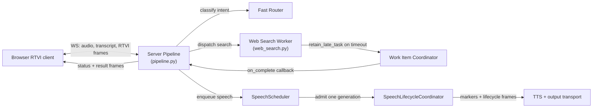
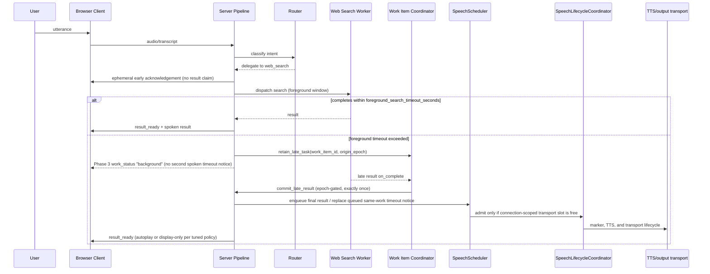

# Task: v0.1.3 — Early Acknowledgement and Background-Delivery Policy

**Status**: Not Started
**Component**: Pipecat subagents
**Assigned to**: Unassigned
**Priority**: High
**Branch**: feature/early-ack-background-delivery-v0.1.3 (create after PR #3 and PR #4 merge to `main`)
**Created**: 2026-07-28
**Review Gates**: full

## Objective

Ship a deterministic, sub-timeout acknowledgement the moment routing confirms a delegated search, then use v0.1.2's latency benchmark data to tune background-delivery policy (autoplay vs. display-only, cancellation/reconnect/newer-turn handling), expand RTVI status to coarse truthful progressive states, and — only if the data supports it — narrow the search worker's conversational context window.

## Context

v0.1.1 shipped the core background-delivery mechanism: late results are retained, committed exactly once, and queued for same-epoch speech (`CHANGELOG.md:23-25`). It did not change when the user first hears anything — the current acknowledgement is still gated on the 15-second `foreground_search_timeout_seconds` timeout path in `server/pipeline.py`, so a user gets silence until either the search finishes or the foreground timeout fires a fixed "taking longer than expected" utterance. Phase 0 re-verifies the current symbols and records exact locations before implementation.

v0.1.2 is merged to `main` at PR #3 (`2951dd3`) and provides the performance-log contract and Pipecat observers (`server/perf_metrics.py`) needed to measure routing vs. search vs. delivery. PR #4 (`2dfe06c`, merged through `2a73a71`) adds the transport-aware speech lifecycle that now governs scheduler admission, timeout-notice supersession, and connection teardown. This plan depends on both release boundaries because it touches the same files (`server/pipeline.py` and `server/speech_scheduler.py` most heavily); Phase 0 verifies their live ancestry and re-reads all line references before implementation.

Transport-aware speech ownership is specified separately in `docs/dev_plans/20260728-bug-transport-aware-speech-supersession.md`. That release-neutral precursor is now reviewed and merged; v0.1.3 must preserve its scheduler/transport invariant from Phase 1 onward. Queue-only discard is not sufficient once synthesized audio has entered the output transport.

This plan operationalizes four prior recommendations, in priority order: early acknowledgement (P0), background-delivery policy tuning (P1), progressive RTVI status (P1/P2), and query-context narrowing as a measured experiment (P2), gated on 0.1.2's data rather than assumed.

## Requirements

- Early acknowledgement must fire exactly once per delegated semantic turn across direct, pending-dialogue, and multi-intent paths — not on a timeout — and must not claim false progress (no "found it" before a result exists). It is an ephemeral speech item, not a `GroundedResult`, transcript entry, or result-history record.
- Background-delivery policy changes must preserve the existing invariants from 0.1.1: `SessionHost`/`SessionState` own idempotent late-result commit and epoch fencing, and the coordinator remains responsible for task ownership/cancellation. Phase 0 records the current call sites by symbol rather than relying on brittle line numbers.
- New RTVI status states must be truthful (reflect actual pipeline state, not simulated progress), have an explicit wire contract and legal transition rules, survive or deliberately reset across reconnect snapshots, and must not introduce word-level progress — `shared/protocol.md:79` explicitly reserves that for a future Phase-3 extension.
- Query-context narrowing (`server/workers/web_search.py`, `_contextual_input`, `history[-4:]`) is not to be implemented speculatively — it requires a dated data-collection artifact with query/context dimensions, provider/model controls, and a defined latency/quality comparison. No change is a valid result.
- This plan does not start implementation until PR #3 (`2951dd3`) and the PR #4 merge (`2a73a71`) are ancestors of both `main` and the implementation `HEAD`; Files-to-Modify symbol references below must be re-verified against that merged state before Phase 1 begins.

## Architecture & Call Flow

This plan touches 4 independently-executing components: the browser RTVI client, the server pipeline (router + turn orchestration), the web-search worker (coordinated via `WorkItemCoordinator`), and the connection-scoped speech/transport lifecycle.

| Step | Trigger | Enters context | Cleared/persisted | Turn boundary |
|---|---|---|---|---|
| Early ack emission | Router confirms delegated search | ephemeral ack item (`ack_id`, turn/work identity) | dropped, admitted, or completed; never canonical | same turn |
| Foreground search window | Worker dispatched | search execution state, `origin_epoch` | cleared on completion or timeout | same turn |
| Retain late task | Foreground timeout exceeded | `work_item_id`, `origin_epoch` in coordinator | persisted until complete/cancelled | crosses turn boundary |
| Commit late result | Worker completes after timeout | late result payload | delivered exactly once, then cleared | may land in a later turn; epoch-gated |
| Progressive status frames | Each state transition (routing/searching/background/result_ready) | RTVI status kind | ephemeral, replaces prior status | same turn per frame |

The early acknowledgement is a logical delegation-confirmed operation shared by all delegated paths. It schedules an ephemeral item through the connection's `SpeechScheduler`; it never enters canonical result state. Status messages are server-authored and flow through the existing session-state/observer boundary as the strict `work_status` contract described below. Speech admission and transport completion remain owned by the merged connection-scoped `SpeechLifecycleCoordinator`; v0.1.3 must reuse that boundary rather than create parallel lifecycle state.

## Implementation Checklist

### Phase 0: Prerequisite — merge gate and re-verification
**Impl files:** none (verification only)
**Test files:** `tests/test_speech_lifecycle.py`, `tests/test_pipeline.py`, `tests/test_speech_scheduler.py`, `tests/test_app.py`, `tests/test_config.py`
**Test command:** `git merge-base --is-ancestor 2951dd3 main && git merge-base --is-ancestor 2a73a71 main && git merge-base --is-ancestor 2951dd3 HEAD && git merge-base --is-ancestor 2a73a71 HEAD && uv run pytest tests/test_speech_lifecycle.py tests/test_pipeline.py tests/test_speech_scheduler.py tests/test_app.py tests/test_config.py -v`
**Goal:** Confirm both merged release boundaries and the transport-aware lifecycle contract before any 0.1.3 code changes begin; re-verify all Files-to-Modify symbols against the verified checkout.

- Confirm PR #3 (`2951dd3`) and the PR #4 merge (`2a73a71`, containing the transport lifecycle fixes through `2dfe06c`) are ancestors of both `main` and `HEAD`; record the verified base/branch commit in the dated Phase 0 artifact and do not begin Phase 1 against a branch that lacks either boundary.
- Re-run the transport precursor's focused lifecycle, app-wiring, configuration, pipeline, and scheduler tests. The gate must cover marker-before-TTS ordering, synthesis-end non-terminal behavior, stale-frame suppression, provider-error attribution, queued-vs-admitted notice behavior, and teardown completion before next admission.
- Re-run `rg -n "foreground_search_timeout_seconds|retain_late_task|history\[-4:\]" server/` against the verified checkout and record symbol/file matches in the Phase 0 artifact; do not preserve stale line references in this plan.
- Capture a dated post-merge, post-transport-precursor `PERF_METRIC` sample with `uv run python scripts/smoke_conversation.py --query 'What is the latest stable Pipecat release?' --timeout 120` for the paid direct/delegated path and `uv run pytest tests/test_v013_perf_scenarios.py -v` for credential-free retained-late, cancellation, reconnect, and same-epoch newer-turn fixtures. Store JSONL/summary output under `docs/benchmarks/` with scenario, turn/work-item ID, provider/model, query/context lengths, outcome, and sample count; preserve pre-precursor data only as a baseline.
- Verify whether 0.1.2 emits safe `query_chars`, `context_chars`, and provider/model dimensions. If not, Phase 4 remains blocked until its instrumentation and data-collection subphase lands. Record the observed schema and minimum sample requirement in the artifact.

### Phase 1: Early acknowledgement (P0)
**Impl files:** `server/pipeline.py`, `server/speech_scheduler.py`
**Test files:** `tests/test_pipeline.py`, `tests/test_speech_scheduler.py`, `tests/test_speech_lifecycle.py`, `tests/test_app.py`, `tests/test_config.py`
**Test command:** `uv run pytest tests/test_pipeline.py tests/test_speech_scheduler.py tests/test_speech_lifecycle.py tests/test_app.py tests/test_config.py -k 'ack or speech or timeout or control' -v`
**Goal:** Replace timeout-gated silence with a deterministic ack emitted the instant routing confirms delegation, without claiming progress that hasn't happened.

- Add a shared delegation-confirmed operation with semantic-turn/work-item identity and invoke it from direct, pending-dialogue, and multi-intent delegated paths (the latter currently branch at `_handle_pending`/`_handle_multi_intent`). Define one ephemeral ack per semantic turn, including mixed multi-intent turns: emit one parent ack when at least one child is delegated, never one ack per child, and do not ack a turn containing only direct/unsupported/clarification work.
- Schedule the ack through `SpeechScheduler` with a distinct non-result role and ephemeral correlation ID (`turn_id`, optional `work_item_id`, `ack_id`). It must be interruptible, must not create canonical result/transcript/history state, and must be dropped atomically via an explicit `discard_queued_ack(ack_id)` operation if the real result is ready before admission; an admitted ack is allowed to finish but never blocks a result from being committed.
- Define the no-TTS case explicitly: retain the internal ack transition and ack identity for observability, but do not synthesize or fabricate an audio acknowledgement; Phase 3 emits the wire status only when the client capability is negotiated.
- Define acknowledgement timing as the first scheduler enqueue after routing confirmation and record that boundary in tests/metrics; the acknowledgement must be queued before the configured foreground timeout, subject to transport availability.
- Add a test matrix for exactly-once delegated acknowledgement, no acknowledgement for direct/unsupported/clarification/rejected routes, no false result claim, interruption, cancellation, reconnect, and result-ready-before-ack.
- Preserve the merged control-ack lifecycle: pause/cancel/stop disposition is recorded before interruption, control acknowledgements cannot reuse the interrupted transport generation, and explicit resume or a newly accepted turn waits for the stop or teardown barrier before scheduling speech. Cover applied and unknown-target control requests.
- If 0.1.2 data (from Phase 0) shows routing itself is a significant latency contributor, add a cheap pre-routing "working" state or fast classification path — scope this sub-task only if the data supports it.
- After a delegated early acknowledgement, make the foreground timeout status-only: retain the work item and defer the `background` wire event to Phase 3, but do not create or speak a second canonical timeout result or transcript/history entry. Define this separately for single, pending, and multi-intent work items. Test the no-duplicate behavior when the early ack is queued, active, or already complete. The merged PR's queued timeout-notice supersession remains required for legacy/pre-ack notice paths and must not interrupt an already-admitted notice.

### Phase 2: Background-delivery policy tuning (P1)
**Impl files:** `server/pipeline.py`, `server/speech_scheduler.py`, `server/speech_lifecycle.py`, `server/app.py`, `server/config.py`, `server/work_item_coordinator.py` (only if immutable late-delivery metadata must cross its callback boundary; do not change its task-ownership contract)
**Test files:** `tests/test_pipeline.py`, `tests/test_work_item_coordinator.py`, `tests/test_speech_scheduler.py`, `tests/test_speech_lifecycle.py`, `tests/test_app.py`, `tests/test_config.py`
**Test command:** `uv run pytest tests/test_pipeline.py tests/test_work_item_coordinator.py tests/test_speech_scheduler.py tests/test_speech_lifecycle.py tests/test_app.py tests/test_config.py -v`
**Goal:** Tune autoplay-vs-display-only policy for late results using 0.1.2 benchmark data, without breaking the existing exactly-once/epoch-gated commit invariant.

- Add an immutable delivery context carrying semantic turn, work item, origin epoch, acknowledgement timestamp/sequence, and the latest accepted same-epoch turn sequence. The policy evaluator runs after idempotent commit and before speech scheduling.
- Reuse the merged ownership boundary: `SpeechLifecycleCoordinator` owns admitted generations, one transport slot per connection-scoped output lane, timers, tombstones, teardown barriers, and exactly-once speech terminalization; `SpeechScheduler` owns only per-work queues/selection; `WorkItemCoordinator` owns retained-task cancellation/completion callbacks; `SessionHost` (policy evaluator) and `SessionState` (canonical commit/projection) own result disposition without conflating those roles.
- Preserve the transport invariants: synthesis/TTS end is non-terminal; only normal transport stop or completed output teardown releases the lane; stale marker/context frames cannot bind to a replacement generation; reconnect creates a fresh lane and old-lane speech cannot be admitted. An acknowledged no-audio/flush path may release a generation only after the merged `SpeechGenerationFlushAckFrame` contract says no output remains; it must not be treated as synthesis completion.
- Apply the accepted deterministic policy: commit every valid late result exactly once; autoplay only when the originating epoch is active, no newer semantic turn has been accepted, the work is not cancelled, and the user has not explicitly paused or stopped output. Otherwise commit the result display-only. Cancellation before callback, while queued, or while admitted suppresses/reclassifies speech delivery but does not suppress a valid canonical commit; stale, invalid, duplicate, and explicitly forgotten results are not committed. Do not introduce an arbitrary elapsed-time threshold in v0.1.3.
- Consume the reviewed transport-aware invariant from `docs/dev_plans/20260728-bug-transport-aware-speech-supersession.md`: supersede a timeout notice when its retained final result becomes ready while the notice is still work-queued behind a transport-active generation. Do not interrupt a notice that occupies the connection-scoped transport slot, and do not discard any other work item's queued speech. After pause or barge-in cleanup, do not auto-admit pre-existing queued speech; only explicit resume or a newly accepted turn may open admission.
- Verify cancellation, reconnect (`interrupted_by_reconnect` in `shared/protocol.md`), and newer-turn arrival correctly suppress or supersede pending late-result delivery — extend existing epoch/turn fencing rather than introducing a parallel mechanism. Capture the host-owned accepted-turn sequence at callback registration and compare it at callback delivery.
- Test the cancellation matrix explicitly: before callback = commit display-only/no speech; queued = commit display-only and remove only that work item's queued speech; admitted = commit display-only and let transport lifecycle finish unless an explicit stop interrupts it; stale/invalid/duplicate = no commit. Test the same matrix for no-TTS and reconnect.
- Keep commit ownership in `SessionHost`/`SessionState`; the coordinator only owns task retention/cancellation and callback delivery. Assert exactly-once commit separately from autoplay/display-only disposition.

### Phase 3: Progressive RTVI status (P1/P2)
**Impl files:** `shared/protocol.md`, `shared/schemas/rtvi-message.json`, `shared/schemas/work-status.json`, `shared/schemas/runtime-snapshot.json`, `server/contracts.py`, `server/session_state.py`, `server/observers.py`, `server/rtvi_messages.py`, `server/pipeline.py`, `web/src/protocol.js`, `web/src/state.js`, `web/src/render.js`
**Test files:** `tests/test_app.py`, `tests/test_rtvi_messages.py`, `tests/test_session_state.py`, `tests/test_work_status.py`, `tests/integration/test_browser_session.py`, `web/test/protocol.test.js`, `web/test/state.test.js`, `web/test/render.test.js`, `web/test/app.test.js`
**Test command:** `uv run pytest tests/test_app.py tests/test_rtvi_messages.py tests/test_session_state.py tests/test_work_status.py tests/test_contracts.py tests/integration/test_browser_session.py -v && (cd web && bun test && bun run lint)`
**Goal:** Add coarse, truthful status states (`routing`, `searching`, `background`, `result_ready`) to the RTVI contract without introducing word-level progress.

- Implement the accepted capability-gated `work_status` contract: exact payload identity (`turn_id`, nullable `work_item_id`, nullable `worker_id`, `state`, per-entity `event_sequence`, `origin_epoch`), the `work_status` RTVI kind, runtime-snapshot inclusion, and global envelope ordering. Unsupported clients receive no `work_status` events and continue receiving existing result/control frames. Document the capability name, handshake timing, and behavior when capability negotiation is absent.
- Define `WorkStatusKey = (origin_epoch, turn_id, work_item_id-or-parent)` and make the producer responsible for monotonically allocating `event_sequence` per key. Parent statuses summarize children; child statuses never overwrite the parent ledger. Reducers reject stale/duplicate sequences and terminal states never regress. Reconnect snapshots carry the latest record for every active/non-expired key.
- Define legal transitions: `routing -> searching -> background -> result_ready`; `routing/searching -> failed|cancelled`; `background -> result_ready|failed|cancelled`; `result_ready|failed|cancelled` are terminal. A no-TTS result may still reach `result_ready`; that state describes canonical commit, not audio.
- Define `result_ready` as “the canonical result is committed and display-ready”; it does not claim that speech is queued, delivered, audible, or complete. The latest status for each `turn_id`/`work_item_id` is included in reconnect snapshots, and stale or duplicate events cannot regress a higher `event_sequence`.
- Wire emission through the existing `SessionState._emit()` → `RuntimeObserver` → RTVI frame boundary; do not introduce a parallel status pipe or emit raw `WorkItemEvent` as an undocumented RTVI kind.
- Update Python and browser validators/reducers/rendering for the chosen contract. Test valid transitions, duplicate/stale transitions, overlapping turns, reconnect snapshots, and terminal-state non-regression.
- Separate credential-free contract/browser tests from optional live local-media and paid-provider acceptance; record live-session evidence only when the required environment is available.

### Phase 4: Query-context narrowing experiment (P2, conditional)
**Impl files:** `server/perf_metrics.py` (instrumentation only if absent), `server/workers/web_search.py` (conditional narrowing), `scripts/analyze_query_context_latency.py` (new analysis artifact)
**Test files:** `tests/test_perf_metrics.py`, `tests/test_web_search_worker.py`, `tests/test_pipeline.py`
**Test command:** `uv run pytest tests/test_perf_metrics.py tests/test_web_search_worker.py tests/test_pipeline.py -k 'web_search or context or query' -v && uv run python scripts/analyze_query_context_latency.py --input docs/benchmarks/v0.1.3-query-context.jsonl --output docs/benchmarks/v0.1.3-query-context-analysis.json`
**Goal:** Only narrow `_contextual_input`'s `history[-4:]` window if 0.1.2 data shows context size correlates with search latency after controlling for provider variance — this phase may resolve to "no change" and that is a valid outcome.

- Check whether 0.1.2's `perf_metrics.py` already records `query_chars`, `context_chars`, and provider/model dimensions; if not, add instrumentation and stop before narrowing.
- Collect a dated, minimum-size sample with a single provider/model or an explicit provider/model stratification. Keep transcript and prompt content out of logs; only safe lengths and identifiers are recorded. The sample validator must fail on missing dimensions, mixed provider/model strata without controls, or fewer than the declared minimum per comparison cell.
- Run the reproducible analysis artifact to compare latency distributions and answer-quality outcomes on a fixed multi-turn follow-up fixture. It must emit a deterministic `promoted`/`not_promoted` decision using declared latency effect, confidence/uncertainty, quality floor, and minimum-sample thresholds. If the data does not support a benefit, record "not promoted — data did not support it" and make no narrowing change.
- Split this phase into 4A instrumentation/collection and 4B analysis/experiment. 4A must produce the schema-valid artifact; 4B owns the analysis command and promotion gate. If 4A is incomplete, 4B cannot be marked complete.
- If and only if the evidence supports it, reduce `history[-4:]` or the 1200-character truncation, then re-run the same latency and quality comparison with the same fixture and controls.

### New files to create

- `shared/schemas/work-status.json` — strict payload schema and capability-gated `work_status` kind.
- `tests/test_work_status.py` — Python state machine, identity, sequence, snapshot, and transition tests.
- `tests/test_contracts.py` — schema/capability compatibility tests, including unsupported-client behavior.
- `scripts/analyze_query_context_latency.py` — deterministic, credential-free JSONL validator/analyser with explicit promotion thresholds.
- `tests/test_v013_perf_scenarios.py` — deterministic credential-free lifecycle/performance scenario fixture harness used by the Phase 0 evidence command.
- `docs/benchmarks/v0.1.3-phase0-transport-baseline.jsonl` — dated Phase 0 scenario output and schema summary.
- `docs/benchmarks/v0.1.3-query-context.jsonl` and `docs/benchmarks/v0.1.3-query-context-analysis.json` — generated artifacts, only when Phase 4A/4B evidence is collected; do not commit secrets or transcript content.

## Technical Specifications

### Files to Modify
- `server/pipeline.py` — shared delegation-confirmed ack, late-result policy, delivery metadata, and status emission points. Symbol references and call sites **must be re-verified post-merge (Phase 0).**
- `server/speech_scheduler.py` — ephemeral acknowledgement scheduling, interruption, drop-if-result-ready, and non-canonical delivery identity.
- `server/speech_lifecycle.py` — merged prerequisite owning speech-generation admission, transport slot, timers, tombstones, teardown barriers, and terminalization; preserve this ownership in Phase 1/2.
- `server/app.py`, `server/config.py` — merged lifecycle wiring and `speech_start_timeout_seconds`/`speech_transport_grace_seconds` configuration; compatibility surfaces, not parallel policy owners.
- `server/work_item_coordinator.py` — only if immutable late-delivery metadata must cross its callback boundary; task ownership/cancellation remains its responsibility, not commit ownership.
- `server/session_state.py`, `server/observers.py` — authoritative status projection and existing incremental RTVI emission boundary (Phase 3).
- `server/contracts.py`, `server/rtvi_messages.py`, `shared/schemas/rtvi-message.json`, `shared/schemas/work-status.json`, `shared/schemas/runtime-snapshot.json` — strict `work_status` contract and snapshot projection (Phase 3).
- `web/src/protocol.js`, `web/src/state.js`, `web/src/render.js` — browser validation, transition reducer, and status rendering (Phase 3).
- `server/workers/web_search.py` — `_contextual_input` and context-window narrowing only if Phase 4 evidence supports it.
- `server/perf_metrics.py`, `scripts/analyze_query_context_latency.py` — safe query/context dimensions and reproducible conditional analysis (Phase 4).
- `tests/` and `web/test/` — named contract, scheduler, lifecycle, reducer, rendering, and analysis tests from the phase contracts.
- `CHANGELOG.md`, `pyproject.toml` — version bump to 0.1.3 on completion.

### Integration Seams
- The shared delegation-confirmed operation is called by direct, pending-dialogue, and multi-intent paths. It creates one ephemeral ack per semantic turn and hands it to `SpeechScheduler`; it does not call canonical-result commit.
- The ack and status paths share the semantic turn/work-item identity but have separate state machines: ack speech is ephemeral delivery, while status is server-authored runtime projection.
- Late-result delivery policy runs after idempotent `SessionHost`/`SessionState` commit and before speech scheduling. It consumes immutable delivery context and existing epoch fencing; it does not make the coordinator the commit owner.
- Phase 2 reuses the merged transport-aware boundary: per-work queues feed one `SpeechLifecycleCoordinator`-owned slot per connection-scoped output lane; synthesis end does not clear that slot; final-result readiness can replace only a same-work-item timeout notice that remains work-queued behind the transport-active generation.
- A timeout notice already admitted to the transport is never interrupted by late-result readiness. Output teardown must complete before the old lane releases, and a fresh connection lane is the only place where replacement speech may be admitted after reconnect.
- The accepted late-result policy is a delivery disposition only: use `commit_and_autoplay` when all active-epoch/newer-turn/cancellation/pause predicates hold; otherwise use `commit_display_only`. Both paths commit a valid result exactly once. `SessionHost` evaluates disposition; `SessionState` performs the idempotent commit/projection.
- The lifecycle release invariant includes the merged `SpeechGenerationFlushAckFrame`: synthesis end alone is never release; normal transport stop, completed teardown, or a validated no-audio flush acknowledgement are the only release paths. Pause/barge-in cleanup never auto-admits older queued speech.
- Status emission uses `SessionState._emit()` → `RuntimeObserver` → RTVI frame construction. The chosen payload/message kind must be updated in Python, JSON Schema, browser validation, reducer, snapshot, and tests as one contract change.
- Phase 0 live samples precede any Phase 4 narrowing decision; the accepted Phase 2 policy has no elapsed-time threshold. Phase 4 may be marked "not promoted — data did not support it" with its analysis artifact.

### Architecture Decisions

- **Late-result delivery:** Always commit a valid late result exactly once. Autoplay only when the originating epoch is still active, no newer semantic turn has been accepted, the work is not cancelled, and the user has not explicitly paused or stopped output; otherwise deliver display-only.
- **Foreground timeout after early ack:** The timeout is status-only. It retains the delegated work and emits truthful `background` status without creating or speaking a second canonical timeout result or transcript/history entry. Legacy/pre-ack timeout notices remain selectively supersedable while queued, but an admitted notice is never interrupted.
- **Status wire contract:** Progressive state uses a capability-gated strict `work_status` RTVI kind with `turn_id`, nullable `work_item_id`/`worker_id`, a state enum, per-entity `event_sequence`, and `origin_epoch`. `WorkStatusKey`, legal transitions, terminal precedence, snapshot retention, and unsupported-client behavior are normative. Latest statuses appear in runtime snapshots. `result_ready` means the canonical result is committed and display-ready, not that speech has been queued, delivered, or heard.

## Testing Notes

- Phase 0 must leave a dated, credential-safe ancestry/test/metrics artifact. Phase 1 must pass its expanded focused command plus the Phase 0 gate after the status-independent ack changes. Phase 3 must run the exact Python and Bun command above, including `tests/test_work_status.py` and `tests/test_contracts.py`.
- Phase 4A validates the JSONL schema, minimum samples, safe dimensions, and provider/model controls. Phase 4B runs the analysis script against a fixed fixture and records thresholds and a deterministic promoted/not-promoted result.
- The lifecycle matrix must include queued, admitted, synthesis-ended, normal-stop, teardown-complete, flush-ack/no-audio, pause, barge-in, reconnect, and stale-frame cases.

## Issues & Solutions

_To be filled during implementation._

## Acceptance Criteria

- [ ] Early ack fires exactly once per delegated semantic turn across direct, pending, and multi-intent paths; it is ephemeral, interruptible, non-canonical, and tested against non-delegated routes, cancellation, reconnect, and result-ready-before-ack.
- [ ] Background-delivery policy implements the accepted commit-and-autoplay/display-only matrix across newer turns, active speech, cancellation, reconnect, stale epoch, duplicate callback, and no-TTS; commit remains exactly once and epoch-gated.
- [ ] Transport-aware delivery preserves ownership and lifecycle invariants: synthesis end does not release the connection-scoped slot; validated no-audio flush acknowledgement is covered as a separate release path; queued same-work timeout notices can be superseded; admitted notices are not interrupted; unrelated queues remain unchanged; and pause/barge-in does not auto-admit older queued speech.
- [ ] Ownership boundaries remain explicit and tested: `SessionHost`/`SessionState` commit canonical results, `WorkItemCoordinator` retains/cancels work, `SpeechScheduler` owns per-work queues, and `SpeechLifecycleCoordinator` owns generation/transport admission and terminalization.
- [ ] After an early acknowledgement, the foreground timeout emits status-only `background` state and never creates a second spoken canonical timeout result; early-ack queued/active/completed races are covered.
- [ ] Existing pause/cancel/stop/resume and unknown-target control acknowledgements preserve the transport lifecycle ordering: disposition precedes interruption, no old generation is reused, and replacement speech waits for stop or teardown.
- [ ] The chosen capability-gated RTVI status contract defines payload identity, producer, entity-keyed sequence ownership, legal transitions, terminal meaning, snapshot/reconnect behavior, unsupported-client behavior, Python/JSON/browser validation, reducer behavior, and rendering tests; no word-level progress is introduced.
- [ ] Contract/browser tests pass, with optional live local-media and paid-provider acceptance reported separately from credential-free tests.
- [ ] Query-context narrowing is either implemented with reproducible latency and answer-quality evidence under provider/model controls, or explicitly marked "not promoted — data did not support it" with the analysis artifact.
- [ ] `CHANGELOG.md` and `pyproject.toml` updated to 0.1.3.
- [ ] Full verification passes before merge: `uv run ruff format --check . && uv run ruff check . && uv run pytest -q && (cd web && bun test && bun run lint)`; any paid-provider/live-media evidence is reported separately.

## Review Focus

- The shared delegation-confirmed ack must cover direct, pending-dialogue, and multi-intent paths exactly once without entering canonical result state.
- Epoch-gating and exactly-once commit invariants are owned by `SessionHost`/`SessionState`; coordinator task ownership must remain separate. Phase 0 records the concrete call sites by symbol.
- Late-delivery policy must be deterministic for same-epoch newer turns, active speech, cancellation, reconnect, stale epoch, duplicate callback, and missing TTS.
- RTVI protocol changes (Phase 3) must define the complete Python/JSON/browser contract and must not conflict with the reserved word-level-progress seam at `shared/protocol.md:79`.
- Phase 4 must show provider/model-controlled correlation evidence, answer-quality comparison, and reproducible analysis—or explicitly record that narrowing was not promoted.

## Final Results

_To be filled on completion._
