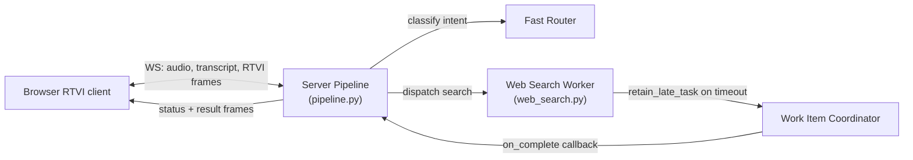
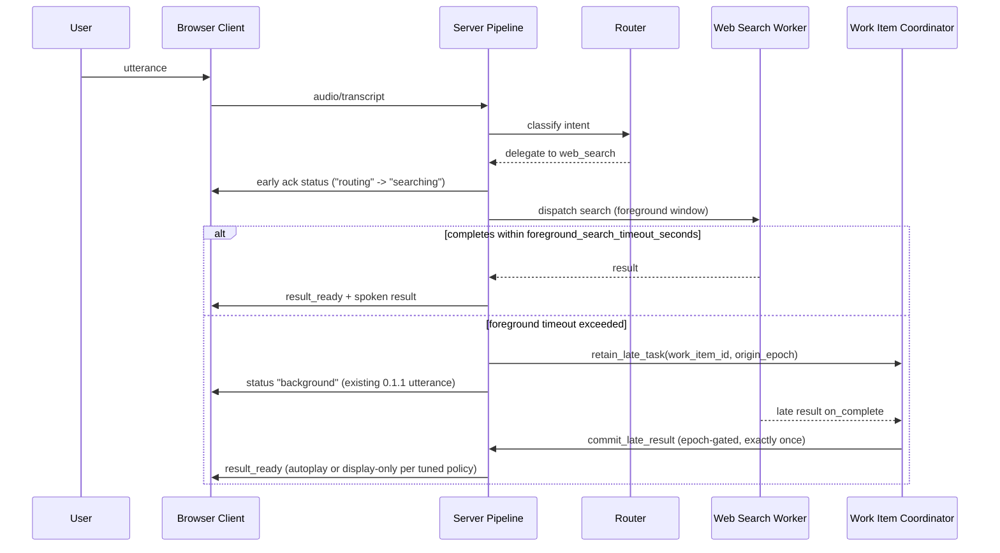

# Task: v0.1.3 — Early Acknowledgement and Background-Delivery Policy

**Status**: Not Started
**Component**: Pipecat subagents
**Assigned to**: Unassigned
**Priority**: High
**Branch**: feature/early-ack-background-delivery-v0.1.3 (create after `feature/latency-observability-v0.1.2` merges to `main`)
**Created**: 2026-07-28
**Review Gates**: full

## Objective

Ship a deterministic, sub-timeout acknowledgement the moment routing confirms a delegated search, then use v0.1.2's latency benchmark data to tune background-delivery policy (autoplay vs. display-only, cancellation/reconnect/newer-turn handling), expand RTVI status to coarse truthful progressive states, and — only if the data supports it — narrow the search worker's conversational context window.

## Context

v0.1.1 shipped the core background-delivery mechanism: late results are retained, committed exactly once, and queued for same-epoch speech (`CHANGELOG.md:23-25`). It did not change when the user first hears anything — the current acknowledgement is still gated on the 15-second `foreground_search_timeout_seconds` in `server/pipeline.py:678-691`, so a user gets silence until either the search finishes or the foreground timeout fires a fixed "taking longer than expected" utterance (`server/pipeline.py:695-699`).

v0.1.2 (`feature/latency-observability-v0.1.2`, currently an **unmerged worktree** at `/Users/vr000m/Code/pipecat-ai/pipecat-subagents-lab-latency-observability`) is adding a performance-log contract and Pipecat observers (`server/perf_metrics.py`) to measure where turn time actually goes — routing vs. search vs. delivery. This plan is the next release and depends on that data and on the merge landing first, because it touches the same files (`server/pipeline.py` most heavily) and current line numbers will shift once 0.1.2 lands. The worktree commit is intentionally not pinned here; Phase 0 verifies the live ref before implementation.

Transport-aware speech ownership is specified separately in `docs/dev_plans/20260728-bug-transport-aware-speech-supersession.md`. That release-neutral precursor must be reviewed and its scheduler/transport invariant implemented before this plan's Phase 2 relies on queued timeout-notice supersession; queue-only discard is not sufficient once synthesized audio has entered the output transport.

This plan operationalizes four prior recommendations, in priority order: early acknowledgement (P0), background-delivery policy tuning (P1), progressive RTVI status (P1/P2), and query-context narrowing as a measured experiment (P2), gated on 0.1.2's data rather than assumed.

## Requirements

- Early acknowledgement must fire exactly once per delegated semantic turn across direct, pending-dialogue, and multi-intent paths — not on a timeout — and must not claim false progress (no "found it" before a result exists). It is an ephemeral speech item, not a `GroundedResult`, transcript entry, or result-history record.
- Background-delivery policy changes must preserve the existing invariants from 0.1.1: `SessionHost`/`SessionState` own idempotent late-result commit, epoch gating remains authoritative (`server/pipeline.py:1077,1086,1100-1101`), and the coordinator remains responsible for task ownership/cancellation (`server/work_item_coordinator.py:251,624`).
- New RTVI status states must be truthful (reflect actual pipeline state, not simulated progress), have an explicit wire contract and legal transition rules, survive or deliberately reset across reconnect snapshots, and must not introduce word-level progress — `shared/protocol.md:79` explicitly reserves that for a future Phase-3 extension.
- Query-context narrowing (`server/workers/web_search.py:332-341`, `history[-4:]`) is not to be implemented speculatively — it requires a dated data-collection artifact with query/context dimensions, provider/model controls, and a defined latency/quality comparison. No change is a valid result.
- This plan does not start implementation until `feature/latency-observability-v0.1.2` has merged to `main`; Files-to-Modify line numbers below must be re-verified against post-merge `main` before Phase 1 begins.

## Architecture & Call Flow

This plan touches 3 independently-executing components: the browser RTVI client, the server pipeline (router + turn orchestration), and the web-search worker (coordinated via `work_item_coordinator`).

| Step | Trigger | Enters context | Cleared/persisted | Turn boundary |
|---|---|---|---|---|
| Early ack emission | Router confirms delegated search | ack status frame ("routing"/"searching") | ephemeral, replaced by next status | same turn |
| Foreground search window | Worker dispatched | search execution state, `origin_epoch` | cleared on completion or timeout | same turn |
| Retain late task | Foreground timeout exceeded | `work_item_id`, `origin_epoch` in coordinator | persisted until complete/cancelled | crosses turn boundary |
| Commit late result | Worker completes after timeout | late result payload | delivered exactly once, then cleared | may land in a later turn; epoch-gated |
| Progressive status frames | Each state transition (routing/searching/background/result_ready) | RTVI status kind | ephemeral, replaces prior status | same turn per frame |

The early acknowledgement is a logical delegation-confirmed operation shared by all delegated paths. It schedules an ephemeral item through the connection's `SpeechScheduler`; it never enters canonical result state. Status messages are server-authored and flow through the existing session-state/observer boundary as the strict `work_status` contract described below.

## Implementation Checklist

### Phase 0: Prerequisite — merge gate and re-verification
**Impl files:** none (verification only)
**Test files:** none
**Test command:** `git -C /Users/vr000m/Code/pipecat-ai/pipecat-subagents-lab merge-base --is-ancestor feature/latency-observability-v0.1.2 main`
**Goal:** Confirm 0.1.2 has merged to `main` before any 0.1.3 code changes begin; re-verify all Files-to-Modify line numbers below against post-merge `main`.

- Confirm `feature/latency-observability-v0.1.2` is merged (or explicitly re-scope this plan to branch from the worktree if the user wants to proceed in parallel).
- Confirm `docs/dev_plans/20260728-bug-transport-aware-speech-supersession.md` has passed `/review-plan` and its transport-aware lease invariant is implemented and validated before Phase 2 begins. It may land independently without a version bump or release.
- Re-run `rg -n "foreground_search_timeout_seconds|retain_late_task|history\[-4:\]" server/` against post-merge `main` and update line refs in this plan's Technical Specifications.
- Capture a dated post-merge `PERF_METRIC` sample covering direct, delegated-complete, retained-late, cancellation, reconnect, and same-epoch newer-turn scenarios. Record the sample and command in `docs/benchmarks/`; do not treat the historical pre-0.1.2 benchmark as policy evidence.
- Verify whether 0.1.2 emits safe `query_chars`, `context_chars`, and provider/model dimensions. If not, Phase 4 remains blocked until its instrumentation and data-collection subphase lands.

### Phase 1: Early acknowledgement (P0)
**Impl files:** `server/pipeline.py`, `server/speech_scheduler.py`
**Test files:** `tests/test_pipeline.py`, `tests/test_speech_scheduler.py`
**Test command:** `uv run pytest tests/test_pipeline.py tests/test_speech_scheduler.py -k 'ack or speech' -v`
**Goal:** Replace timeout-gated silence with a deterministic ack emitted the instant routing confirms delegation, without claiming progress that hasn't happened.

- Add a shared delegation-confirmed operation with semantic-turn/work-item identity and invoke it from direct, pending-dialogue, and multi-intent delegated paths (the latter currently branch at `_handle_pending`/`_handle_multi_intent`). Define one ephemeral ack per semantic turn, including mixed multi-intent turns.
- Schedule the ack through `SpeechScheduler` with a distinct ephemeral correlation ID. It must be interruptible, must not create canonical result/transcript/history state, and must be dropped if the real result is ready before the ack starts.
- Add a test matrix for exactly-once delegated acknowledgement, no acknowledgement for direct/unsupported/clarification/rejected routes, no false result claim, interruption, cancellation, reconnect, and result-ready-before-ack.
- If 0.1.2 data (from Phase 0) shows routing itself is a significant latency contributor, add a cheap pre-routing "working" state or fast classification path — scope this sub-task only if the data supports it.
- Define whether the existing timeout-fired "taking longer than expected" utterance (`server/pipeline.py:695-699`) remains a second spoken update or becomes status-only after an early ack; test the chosen no-duplicate behavior.

### Phase 2: Background-delivery policy tuning (P1)
**Impl files:** `server/pipeline.py`, `server/work_item_coordinator.py` (only if immutable late-delivery metadata must cross its callback boundary)
**Test files:** `tests/test_pipeline.py`, `tests/test_work_item_coordinator.py`, `tests/test_speech_scheduler.py`
**Test command:** `uv run pytest tests/test_pipeline.py tests/test_work_item_coordinator.py -v`
**Goal:** Tune autoplay-vs-display-only policy for late results using 0.1.2 benchmark data, without breaking the existing exactly-once/epoch-gated commit invariant.

- Add an immutable delivery context carrying semantic turn, work item, origin epoch, acknowledgement timestamp/sequence, and the latest accepted same-epoch turn sequence. The policy evaluator runs after idempotent commit and before speech scheduling.
- Apply the accepted deterministic policy: commit every valid late result exactly once; autoplay only when the originating epoch is active, no newer semantic turn has been accepted, the work is not cancelled, and the user has not explicitly paused or stopped output. Otherwise commit the result display-only. Do not introduce an arbitrary elapsed-time threshold in v0.1.3.
- Consume the reviewed transport-aware invariant from `docs/dev_plans/20260728-bug-transport-aware-speech-supersession.md`: supersede a timeout notice when its retained final result becomes ready while the notice is still scheduler-queued behind transport-active speech. Do not interrupt a notice that has transport-started, and do not discard any other work item's queued speech.
- Verify cancellation, reconnect (`interrupted_by_reconnect` in `shared/protocol.md`), and newer-turn arrival correctly suppress or supersede pending late-result delivery — extend existing epoch checks (`server/pipeline.py:1077,1086,1100-1101`) rather than introducing a parallel fencing mechanism.
- Keep commit ownership in `SessionHost`/`SessionState`; the coordinator only owns task retention/cancellation and callback delivery. Assert exactly-once commit separately from autoplay/display-only disposition.

### Phase 3: Progressive RTVI status (P1/P2)
**Impl files:** `shared/protocol.md`, `shared/schemas/rtvi-message.json`, `shared/schemas/work-status.json`, `shared/schemas/runtime-snapshot.json`, `server/contracts.py`, `server/session_state.py`, `server/observers.py`, `server/rtvi_messages.py`, `server/pipeline.py`, `web/src/protocol.js`, `web/src/state.js`, `web/src/render.js`
**Test files:** `tests/test_app.py`, `tests/test_rtvi_messages.py`, `tests/test_session_state.py`, `tests/test_work_status.py`, `tests/integration/test_browser_session.py`, `web/test/protocol.test.js`, `web/test/state.test.js`, `web/test/render.test.js`, `web/test/app.test.js`
**Test command:** `uv run pytest tests/test_app.py tests/test_rtvi_messages.py tests/test_session_state.py tests/integration/test_browser_session.py -v && (cd web && bun test && bun run lint)`
**Goal:** Add coarse, truthful status states (`routing`, `searching`, `background`, `result_ready`) to the RTVI contract without introducing word-level progress.

- Implement the accepted `work_status` contract: exact payload identity (`turn_id`, nullable `work_item_id`, nullable `worker_id`, `state`, per-entity `event_sequence`, `origin_epoch`), the `work_status` RTVI kind, runtime-snapshot inclusion, and global envelope ordering.
- Define `result_ready` as “the canonical result is committed and display-ready”; it does not claim that speech is queued, delivered, audible, or complete. The latest status for each `turn_id`/`work_item_id` is included in reconnect snapshots, and stale or duplicate events cannot regress a higher `event_sequence`.
- Wire emission through the existing `SessionState._emit()` → `RuntimeObserver` → RTVI frame boundary; do not introduce a parallel status pipe or emit raw `WorkItemEvent` as an undocumented RTVI kind.
- Update Python and browser validators/reducers/rendering for the chosen contract. Test valid transitions, duplicate/stale transitions, overlapping turns, reconnect snapshots, and terminal-state non-regression.
- Separate credential-free contract/browser tests from optional live local-media and paid-provider acceptance; record live-session evidence only when the required environment is available.

### Phase 4: Query-context narrowing experiment (P2, conditional)
**Impl files:** `server/perf_metrics.py` (instrumentation only if absent), `server/workers/web_search.py` (conditional narrowing), `scripts/analyze_query_context_latency.py` (new analysis artifact)
**Test files:** `tests/test_perf_metrics.py`, `tests/test_web_search_worker.py`, `tests/test_pipeline.py`
**Test command:** `uv run pytest tests/test_perf_metrics.py tests/test_web_search_worker.py tests/test_pipeline.py -k 'web_search or context or query' -v`
**Goal:** Only narrow `_contextual_input`'s `history[-4:]` window if 0.1.2 data shows context size correlates with search latency after controlling for provider variance — this phase may resolve to "no change" and that is a valid outcome.

- Check whether 0.1.2's `perf_metrics.py` already records `query_chars`, `context_chars`, and provider/model dimensions; if not, add instrumentation and stop before narrowing.
- Collect a dated, minimum-size sample with a single provider/model or an explicit provider/model stratification. Keep transcript and prompt content out of logs; only safe lengths and identifiers are recorded.
- Run the reproducible analysis artifact to compare latency distributions and answer-quality outcomes on a fixed multi-turn follow-up fixture. If the data does not support a benefit, record "not promoted — data did not support it" and make no narrowing change.
- If and only if the evidence supports it, reduce `history[-4:]` (`server/workers/web_search.py:332-341`) or the 1200-character truncation, then re-run the same latency and quality comparison.

## Technical Specifications

### Files to Modify
- `server/pipeline.py` — shared delegation-confirmed ack, late-result policy, delivery metadata, and status emission points. All current line references are pre-0.1.2 and **must be re-verified post-merge (Phase 0).**
- `server/speech_scheduler.py` — ephemeral acknowledgement scheduling, interruption, drop-if-result-ready, and non-canonical delivery identity.
- `server/work_item_coordinator.py` — only if immutable late-delivery metadata must cross its callback boundary; task ownership/cancellation remains its responsibility, not commit ownership.
- `server/session_state.py`, `server/observers.py` — authoritative status projection and existing incremental RTVI emission boundary (Phase 3).
- `server/contracts.py`, `server/rtvi_messages.py`, `shared/schemas/rtvi-message.json`, `shared/schemas/work-status.json`, `shared/schemas/runtime-snapshot.json` — strict `work_status` contract and snapshot projection (Phase 3).
- `web/src/protocol.js`, `web/src/state.js`, `web/src/render.js` — browser validation, transition reducer, and status rendering (Phase 3).
- `server/workers/web_search.py` — `_contextual_input` and context-window narrowing only if Phase 4 evidence supports it.
- `server/perf_metrics.py`, `scripts/analyze_query_context_latency.py` — safe query/context dimensions and reproducible conditional analysis (Phase 4).
- `tests/` and `web/test/` — named contract, scheduler, lifecycle, reducer, rendering, and analysis tests from the phase contracts.
- `CHANGELOG.md`, `pyproject.toml` — version bump to 0.1.3 on completion.

### Integration Seams
- The shared delegation-confirmed operation is called by direct, pending-dialogue, and multi-intent paths. It creates one ephemeral ack per semantic turn and hands it to `SpeechScheduler`; it does not call canonical-result commit.
- The ack and status paths share the semantic turn/work-item identity but have separate state machines: ack speech is ephemeral delivery, while status is server-authored runtime projection.
- Late-result delivery policy runs after idempotent `SessionHost`/`SessionState` commit and before speech scheduling. It consumes immutable delivery context and existing epoch fencing; it does not make the coordinator the commit owner.
- Phase 2 depends on the transport-aware scheduler precursor: synthesis end does not release the active lease, transport stop does, and final-result readiness can therefore replace a same-work-item timeout notice that remains scheduler-queued behind active speech.
- The accepted late-result policy is a delivery disposition only: use `commit_and_autoplay` when all active-epoch/newer-turn/cancellation/pause predicates hold; otherwise use `commit_display_only`. Both paths commit a valid result exactly once.
- Status emission uses `SessionState._emit()` → `RuntimeObserver` → RTVI frame construction. The chosen payload/message kind must be updated in Python, JSON Schema, browser validation, reducer, snapshot, and tests as one contract change.
- Phase 0 live samples precede any Phase 4 narrowing decision; the accepted Phase 2 policy has no elapsed-time threshold. Phase 4 may be marked "not promoted — data did not support it" with its analysis artifact.

### Architecture Decisions

- **Late-result delivery:** Always commit a valid late result exactly once. Autoplay only when the originating epoch is still active, no newer semantic turn has been accepted, the work is not cancelled, and the user has not explicitly paused or stopped output; otherwise deliver display-only.
- **Status wire contract:** Progressive state uses a strict `work_status` RTVI kind with `turn_id`, nullable `work_item_id`/`worker_id`, a state enum, per-entity `event_sequence`, and `origin_epoch`. Latest statuses appear in runtime snapshots. `result_ready` means the canonical result is committed and display-ready, not that speech has been queued, delivered, or heard.

## Testing Notes

_To be filled during implementation._

## Issues & Solutions

_To be filled during implementation._

## Acceptance Criteria

- [ ] Early ack fires exactly once per delegated semantic turn across direct, pending, and multi-intent paths; it is ephemeral, interruptible, non-canonical, and tested against non-delegated routes, cancellation, reconnect, and result-ready-before-ack.
- [ ] Background-delivery policy implements the accepted commit-and-autoplay/display-only matrix across newer turns, active speech, cancellation, reconnect, stale epoch, duplicate callback, and no-TTS; commit remains exactly once and epoch-gated.
- [ ] The chosen RTVI status contract defines payload identity, producer, legal transitions, terminal meaning, snapshot/reconnect behavior, Python/JSON/browser validation, reducer behavior, and rendering tests; no word-level progress is introduced.
- [ ] Contract/browser tests pass, with optional live local-media and paid-provider acceptance reported separately from credential-free tests.
- [ ] Query-context narrowing is either implemented with reproducible latency and answer-quality evidence under provider/model controls, or explicitly marked "not promoted — data did not support it" with the analysis artifact.
- [ ] `CHANGELOG.md` and `pyproject.toml` updated to 0.1.3.
- [ ] Full test suite and `ruff format && ruff check` pass before merge.

## Review Focus

- The shared delegation-confirmed ack must cover direct, pending-dialogue, and multi-intent paths exactly once without entering canonical result state.
- Epoch-gating and exactly-once commit invariants are owned by `SessionHost`/`SessionState`; coordinator task ownership must remain separate (`server/pipeline.py:1077,1086,1100-1101`, `server/work_item_coordinator.py:251,624`).
- Late-delivery policy must be deterministic for same-epoch newer turns, active speech, cancellation, reconnect, stale epoch, duplicate callback, and missing TTS.
- RTVI protocol changes (Phase 3) must define the complete Python/JSON/browser contract and must not conflict with the reserved word-level-progress seam at `shared/protocol.md:79`.
- Phase 4 must show provider/model-controlled correlation evidence, answer-quality comparison, and reproducible analysis—or explicitly record that narrowing was not promoted.

## Final Results

_To be filled on completion._
