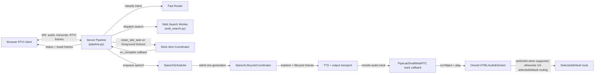

# Task: v0.1.3 — Early Acknowledgement and Background-Delivery Policy

**Status**: Not Started
**Component**: Pipecat subagents
**Assigned to**: Unassigned
**Priority**: High
**Branch**: feature/early-ack-background-delivery-v0.1.3 (create from, or synchronize with, `main` after PR #3, PR #4, and PR #5 merge; Phase 0 must re-verify the same boundaries on the implementation `HEAD`)
**Created**: 2026-07-28
**Review Gates**: full

## Objective

Ship a deterministic acknowledgement fired immediately when routing confirms a delegated search — not gated on the foreground timeout, though not guaranteed sub-timeout if routing itself runs long — then use newly collected v0.1.2-compatible `PERF_METRIC` evidence plus the dated historical baseline to tune background-delivery policy (autoplay vs. display-only, cancellation/reconnect/newer-turn handling), expand RTVI status to coarse truthful progressive states, and — only if the data supports it — narrow the search worker's conversational context window. Phase 0 must establish the new evidence artifact before any policy decision.

## Context

v0.1.1 shipped the core background-delivery mechanism: late results are retained, committed exactly once, and queued for same-epoch speech (see the v0.1.1 entry in `CHANGELOG.md`'s history — its exact line numbers have since shifted; the invariant is independently verifiable via `SessionState`'s exactly-once commit and `WorkItemCoordinator`'s retention). It did not change when the user first hears anything — the current acknowledgement is still gated on the 15-second `foreground_search_timeout_seconds` timeout path in `server/pipeline.py`, so a user gets silence until either the search finishes or the foreground timeout fires a fixed "taking longer than expected" utterance. Phase 0 re-verifies the current symbols and records exact locations before implementation.

v0.1.2 is merged to `main` at PR #3 (`2951dd3`) and provides the performance-log contract and Pipecat observers (`server/perf_metrics.py`) needed to measure routing vs. search vs. delivery. PR #4 (`2dfe06c`, merged through `2a73a71`) adds the transport-aware speech lifecycle that now governs scheduler admission, timeout-notice supersession, and connection teardown. PR #5 (`ce14d37`, merged through `c5ac273`) adds the browser audio-sink owner, connection-generation cleanup, and the marker/flush frame bus exclusions that protect TTS routability. This plan depends on all three release boundaries because it touches the same server and browser seams; Phase 0 verifies their live ancestry and re-reads all line references before implementation.

Transport-aware speech ownership is specified separately in `docs/dev_plans/20260728-bug-transport-aware-speech-supersession.md`. That release-neutral precursor is now reviewed and merged; v0.1.3 must preserve its scheduler/transport invariant from Phase 1 onward. Queue-only discard is not sufficient once synthesized audio has entered the output transport.

This plan operationalizes four prior recommendations, in priority order: early acknowledgement (P0), background-delivery policy tuning (P1), progressive RTVI status (P1/P2), and query-context narrowing as a measured experiment (P2), gated on collected evidence rather than assumed.

## Requirements

- Early acknowledgement must fire exactly once per delegated semantic turn across direct, pending-dialogue, and multi-intent paths — not on a timeout — and must not claim false progress (no "found it" before a result exists). It is an ephemeral speech item, not a `GroundedResult`, transcript entry, or result-history record.
- Background-delivery policy changes must preserve the existing invariants from 0.1.1: `SessionHost`/`SessionState` own idempotent late-result commit and epoch fencing, and the coordinator remains responsible for task ownership/cancellation. Phase 0 records the current call sites by symbol rather than relying on brittle line numbers.
- New RTVI status states must be truthful (reflect actual pipeline state, not simulated progress), have an explicit wire contract and legal transition rules, preserve their original `origin_epoch` across reconnect snapshots for the five-minute TTL, and must not introduce word-level progress — `shared/protocol.md:80` explicitly reserves that for a future Phase-3 extension.
- Query-context narrowing (`server/workers/web_search.py`, `_contextual_input`, `history[-4:]`) is not to be implemented speculatively — it requires a dated data-collection artifact with query/context dimensions, provider/model controls, and a defined latency/quality comparison. No change is a valid result.
- Any accepted TTS generation must have an end-to-end routability contract: the server may suppress only stale or unaccepted lifecycle frames; accepted audio frames must be forwarded through the connection transport, while the generation's remote track must reach the active browser track callback, the owned `HTMLAudioElement`, and an attempted `play()` using the selected sink when `setSinkId` succeeds or user-agent-selected/default routing otherwise. Track callbacks are generation/track events, not per-audio-frame callbacks. Server transport completion is not browser audibility, and the credential-free route gate makes no physical-audibility claim.
- This plan does not start implementation until PR #3 (`2951dd3`), the PR #4 merge (`2a73a71`), and the PR #5 merge (`ce14d37`) are ancestors of both `main` and the implementation `HEAD`; Files-to-Modify symbol references below must be re-verified against that merged state before Phase 1 begins.

## Architecture & Call Flow

This plan touches 4 independently-executing components: the browser RTVI client, the server pipeline (router + turn orchestration), the web-search worker (coordinated via `WorkItemCoordinator`), and the connection-scoped speech/transport lifecycle.



```mermaid
sequenceDiagram
    participant U as User
    participant B as Browser Client
    participant P as Server Pipeline
    participant R as Router
    participant W as Web Search Worker
    participant C as Work Item Coordinator
    participant S as SpeechScheduler
    participant L as SpeechLifecycleCoordinator
    participant O as TTS/output transport
    participant T as Browser track callback
    participant A as HTMLAudioElement/output sink

    U->>B: utterance
    B->>P: audio/transcript
    P->>R: classify intent
    R-->>P: delegate to web_search
    P->>S: enqueue ephemeral ack (no result claim)
    S->>L: admit ack (interruptible, non-canonical)
    L->>O: marker, TTS, and transport lifecycle
    O-->>T: remote ack audio track for active connection generation
    T->>A: attach track to srcObject and attempt play
    A-->>B: ack route/play attempt, or local playback-blocked diagnostic; no audibility claim
    P->>W: dispatch search (foreground window)
    alt completes within foreground_search_timeout_seconds
        W-->>P: result
        P->>B: result_ready + spoken result
    else foreground timeout exceeded
        P->>C: retain_late_task(work_item_id, origin_epoch)
        P-->>B: Phase 3 work_status "background" (no second spoken timeout notice)
        W-->>C: late result on_complete
        C->>P: commit_late_result (epoch-gated, exactly once)
        P->>S: enqueue final result / replace queued same-work timeout notice
        S->>L: admit only if connection-scoped transport slot is free
        L->>O: marker, TTS, and transport lifecycle
        O-->>T: remote audio track for active connection generation
        T->>A: attach track to srcObject and attempt play
        A-->>B: audio route/play attempt, or local playback-blocked diagnostic; no audibility claim
        P->>B: result_ready (server commit/display state only)
    end
```

| Step | Trigger | Enters context | Cleared/persisted | Turn boundary |
|---|---|---|---|---|
| Early ack emission | Router confirms delegated search | ephemeral ack item (`ack_id`, turn/work identity) | dropped, admitted, or completed; never canonical | same turn |
| Foreground search window | Worker dispatched | search execution state, `origin_epoch` | cleared on completion or timeout | same turn |
| Retain late task | Foreground timeout exceeded | `work_item_id`, `origin_epoch` in coordinator | persisted until complete/cancelled | crosses turn boundary |
| Commit late result | Worker completes after timeout | late result payload | delivered exactly once, then cleared | may land in a later turn; epoch-gated |
| Progressive status frames | Each state transition (routing/searching/background/result_ready) | capability-gated RTVI status kind | latest keyed status retained for snapshot TTL | same turn per frame |

The early acknowledgement is a logical delegation-confirmed operation shared by all delegated paths. It schedules an ephemeral item through the connection's `SpeechScheduler`; it never enters canonical result state. Status messages are server-authored and flow through the existing session-state/observer boundary as the strict `work_status` contract described below. Speech admission and transport completion remain owned by the merged connection-scoped `SpeechLifecycleCoordinator`; v0.1.3 must reuse that boundary rather than create parallel lifecycle state.

## Implementation Checklist

### Phase 0: Prerequisite — merge gate and re-verification
**Impl files:** `server/perf_metrics.py`, `shared/schemas/v013-evidence.json`, `scripts/validate_v013_evidence.py`, `tests/test_perf_metrics.py`, `tests/test_v013_perf_scenarios.py` (evidence-contract preparation only; no user-facing behavior change — Phase 0A does land a benign log-schema addition to `perf_metrics.py`)
**Test files:** `tests/test_speech_lifecycle.py`, `tests/test_pipeline.py`, `tests/test_speech_scheduler.py`, `tests/test_app.py`, `tests/test_config.py`, `tests/test_perf_metrics.py`, `tests/test_v013_perf_scenarios.py`, `web/test/app.test.js`, `web/test/protocol.test.js`
**Test command (0-preflight, before any Phase 0A edit):** `git merge-base --is-ancestor 2951dd3 main && git merge-base --is-ancestor 2a73a71 main && git merge-base --is-ancestor ce14d37 main && git merge-base --is-ancestor 2951dd3 HEAD && git merge-base --is-ancestor 2a73a71 HEAD && git merge-base --is-ancestor ce14d37 HEAD`
**Test command (0A, after the zero-edit preflight and Phase 0A instrumentation/fixture commit — schema/fixture gate):** `uv run pytest tests/test_perf_metrics.py tests/test_v013_perf_scenarios.py -k 'schema or fixture' -v`
**Test command (0B, run after 0A passes — ancestry/lifecycle gate):** `git merge-base --is-ancestor 2951dd3 main && git merge-base --is-ancestor 2a73a71 main && git merge-base --is-ancestor ce14d37 main && git merge-base --is-ancestor 2951dd3 HEAD && git merge-base --is-ancestor 2a73a71 HEAD && git merge-base --is-ancestor ce14d37 HEAD && uv run pytest tests/test_speech_lifecycle.py tests/test_pipeline.py tests/test_speech_scheduler.py tests/test_app.py tests/test_config.py tests/test_perf_metrics.py -v && (cd web && bun test app.test.js protocol.test.js)`
**Test command (0C, run after 0B passes — artifact production and validation gate):** `uv run pytest tests/test_v013_perf_scenarios.py -v && uv run python scripts/validate_v013_evidence.py --phase phase0 --input docs/benchmarks/v0.1.3-phase0-transport-baseline.jsonl`
**Goal:** Confirm all three merged release boundaries, prepare the credential-free evidence schema/fixture, and verify the transport-aware lifecycle and browser-media contracts before 0.1.3 behavior changes begin; re-verify all Files-to-Modify symbols against the verified checkout.

- Confirm PR #3 (`2951dd3`), the PR #4 merge (`2a73a71`, containing the transport lifecycle fixes through `2dfe06c`), and the PR #5 merge (`ce14d37`, containing the browser audio-sink/generation fixes through `c5ac273`) are ancestors of both `main` and `HEAD`; record the verified base/branch commit in the dated Phase 0 artifact and do not begin Phase 1 against a branch that lacks any boundary.
- The implementation branch must satisfy the ancestry gate above before Phase 0A changes land. If any `git merge-base --is-ancestor` check fails, synchronize or recreate the implementation branch from the verified `main` ancestry, then re-run the preflight and the `createAudioSink` symbol/source check against that `HEAD`; do not infer missing PR #5 symbols from the review checkout. The merge-base preflight is the sole authority for whether this gate is red.
- The 0-preflight command is a zero-edit gate: run it on the synchronized implementation branch before changing `server/perf_metrics.py`, tests, or any other production file. If it fails, rebase or recreate the feature branch from the verified `main` ancestry and rerun the gate; do not land Phase 0A instrumentation on the incomplete base.
- Re-run the transport precursor's focused lifecycle, app-wiring, configuration, pipeline, and scheduler tests plus the merged PR #5 browser tests. The gate must cover marker-before-TTS ordering, marker/flush exclusion from the worker bus, synthesis-end non-terminal behavior, stale-frame suppression, provider-error attribution, queued-vs-admitted notice behavior, teardown completion before next admission, remote-track attachment, speaker-sink failure handling, and connection-generation cleanup.
- Re-run `rg -n "foreground_search_timeout_seconds|retain_late_task|history\[-4:\]" server/` against the verified checkout and record symbol/file matches in the Phase 0 artifact; do not preserve stale line references in this plan.
- Separately record the `SessionHost`/`SessionState` exactly-once-commit and epoch-fencing call sites Requirements calls out: re-run `rg -n "commit_late_result|_commit_late_result|def accepts\b|origin_epoch" server/session_state.py server/pipeline.py` against the verified checkout and record the matched symbols/files in the same Phase 0 artifact. The artifact contains a machine-checked `call_site_evidence` object with the source commit, query, expected symbols, file paths, and non-empty match list; `validate_v013_evidence.py --phase phase0 --repo-root .` re-runs these checks and rejects a hand-edited or stale call-site record. Line numbers are informational only.
- Produce the credential-free Phase 0 artifact with `uv run pytest tests/test_v013_perf_scenarios.py -v`; it must cover direct, delegated-complete, retained-late, cancellation, reconnect, and same-epoch newer-turn fixtures and validate `phase`, scenario, turn/work-item ID, provider/model (or `unavailable`), query/context lengths, outcome, disposition, a per-run monotonic sample timestamp in integer milliseconds from the run's monotonic origin, optional UTC wall-clock recording time, `run_id`, `sample_index`, and sample count. Monotonic values are comparable only within one run; never compare them across independently generated artifacts. The Phase 0 minimum is one record for each named scenario, one record for each outcome exercised by the fixture matrix, and one record in every provider/model stratum (the credential-free stratum is explicitly `unavailable`/`unavailable`); the validator rejects a missing scenario, outcome, stratum, or declared minimum. A paid-provider supplement may use `uv run python scripts/smoke_conversation.py --query 'What is the latest stable Pipecat release?' --timeout 120`, but missing credentials/provider availability records `blocked` or `not-run` and does not fail the credential-free gate. Store dated JSONL/summary output under `docs/benchmarks/`; preserve pre-precursor data only as a baseline.
- Verify whether 0.1.2 emits safe `query_chars`, `context_chars`, provider/model, acknowledgement, scenario, delivery-disposition, and routing-phase-latency dimensions (the last needed to evaluate Phase 1's conditional pre-routing-marker bullet). If not, Phase 0A adds those fields and tests before collection; Phase 4 remains blocked until the schema-valid artifact exists. Each JSONL record validates against `shared/schemas/v013-evidence.json`; record the observed schema, per-scenario/outcome/provider-model minimums, and validator result in the artifact summary.
- Phase 0A is an explicit instrumentation/fixture commit and gate after the zero-edit preflight: land the metric fields, schema validator, and deterministic scenario fixture only after the prerequisites pass; then run 0A, 0B, and 0C in order. Phase 0 is complete only after the scenario fixture has produced the dated artifact and `validate_v013_evidence.py` has passed; Phase 1 cannot start before that completion gate.

### Phase 1: Early acknowledgement (P0)
**Impl files:** `server/pipeline.py`, `server/speech_scheduler.py`, `server/speech_lifecycle.py`, `server/perf_metrics.py`, `server/config.py`, `server/app.py` (adds the `enable_early_ack` kill switch)
**Test files:** `tests/test_pipeline.py`, `tests/test_speech_scheduler.py`, `tests/test_speech_lifecycle.py`, `tests/test_app.py`, `tests/test_config.py`, `tests/test_perf_metrics.py`, `tests/test_v013_perf_scenarios.py`
**Test command:** `git merge-base --is-ancestor 2951dd3 main && git merge-base --is-ancestor 2a73a71 main && git merge-base --is-ancestor ce14d37 main && git merge-base --is-ancestor 2951dd3 HEAD && git merge-base --is-ancestor 2a73a71 HEAD && git merge-base --is-ancestor ce14d37 HEAD && uv run python scripts/validate_v013_evidence.py --phase phase0 --input docs/benchmarks/v0.1.3-phase0-transport-baseline.jsonl && uv run pytest tests/test_speech_lifecycle.py tests/test_pipeline.py tests/test_speech_scheduler.py tests/test_app.py tests/test_config.py tests/test_perf_metrics.py tests/test_v013_perf_scenarios.py -v && (cd web && bun test app.test.js protocol.test.js)` (re-runs the Phase 0B ancestry/lifecycle gate and validated Phase 0 artifact before this phase's ack-path tests; there is no separate trailing pytest invocation).
**Goal:** Replace timeout-gated silence with a deterministic ack emitted the instant routing confirms delegation, without claiming progress that hasn't happened.

- Add a shared delegation-confirmed operation with semantic-turn/work-item identity and invoke it from direct, pending-dialogue, and multi-intent delegated paths (the latter currently branch at `_handle_pending`/`_handle_multi_intent`). Define one ephemeral ack per semantic turn, including mixed multi-intent turns: emit one parent ack when at least one child is delegated, never one ack per child, and do not ack a turn containing only direct/unsupported/clarification work. Enforce this with a turn-scoped acknowledgement latch in `SessionHost`: invoke it immediately after the first eligible multi-intent child decision, carry the parent turn identity, and make subsequent eligible children no-ops for acknowledgement emission. Clear the latch in the turn's normal completion/cancellation/failure cleanup; do not retain an unbounded process-lifetime set. This latch is the single enforcement mechanism for the exactly-once invariant — it must land in this phase, not be deferred or duplicated by a later phase.
- Disambiguate route names in the implementation matrix: this plan's “direct” means a direct web-search delegation (`existing_worker`/`new_worker`), not `RoutingDecision.action=direct`, which is the non-delegated main-responder path and remains ack-free. Pending continuation is eligible only after it confirms delegated search; a mixed multi-intent turn gets one parent ack when any child is eligible.
- Schedule the ack through a scheduler/lifecycle-internal ephemeral type with a distinct identity (`turn_id`, optional parent `work_item_id`, `ack_id`). `SpeechScheduler` owns the ack item, `ack_id` index, queued discard, and local selection/serialization bookkeeping; `SpeechLifecycleCoordinator` is the sole authority for connection-scoped generation admission, transport occupancy, release, and media-generation state; `SessionHost` owns the turn latch and acknowledgement metrics. `SpeechScheduler._active` is only a local lease mirror/serialization guard: it may be set only after `lifecycle.try_admit()` succeeds, never admits or releases transport independently, and is cleared only from the lifecycle terminal callback after the lifecycle has released or fenced the generation. Synthesis end, provider callbacks, interruption, teardown, and terminal callbacks must use that one lifecycle path; stale callbacks are no-ops. It must be interruptible, must not create canonical result/transcript/history state, and must be dropped atomically via an explicit `discard_queued_ack(ack_id)` operation if the real result is ready before admission; an admitted ack may finish but never blocks a result from being committed. Concretely: extend `SpeechItem` (`server/speech_scheduler.py`) with `role="ack"`, `ack_id: str | None`, and `result_id: str | None` (result items require `result_id`; ack items require `ack_id` and no `result_id`); maintain an explicit `ack_id` index to the same `work_item_id`-keyed queues `SpeechScheduler` already uses for results; and make every `speech_progress` call site role-conditional, including enqueue, admission, interruption, cancellation, pause/resume, reconnect, provider failure, and terminalization. Ack items are wire-invisible in `speech_progress` and remain server-log/observability-only, keyed by `ack_id`; they never call `SessionState.speech_progress()` or `RTVIMessagePublisher.speech_progress()`, so result-shaped wire state remains result-only. `discard_queued_ack(ack_id)` removes only that still-queued ack and atomically clears the index; it must not affect admitted speech or another queued item. This does not create result-oriented `speech_progress` and does not introduce a parallel lifecycle pipe.
- Make the migration boundary executable before adding ack role conditionals: all provider, transport, interruption, pause, reconnect, and teardown paths issue lifecycle commands; `SpeechLifecycleCoordinator` performs the one terminal transition and invokes `SpeechScheduler.on_lifecycle_terminal(generation_id)` exactly once; only that callback clears `_active` and advances the next queue item. A scheduler-side `_active = None` or lifecycle-slot release is forbidden when a lifecycle exists. Add an invariant test that instruments every release path and proves one lifecycle release, one scheduler mirror clear, and no admission before the teardown barrier.
- Extend `GenerationIdentity` with explicit `role`, `turn_id`, and nullable `ack_id` fields so pre-admission terminal records derive `ack_id`, `turn_id`, and `origin_epoch` from typed data; result identities carry `role="result"`/`result_id`, while ack identities carry `role="ack"`/`ack_id`. Synthetic `ack_work_item_id` remains only the queue key and is never parsed to recover identity.
- Define the ack's queue key explicitly, including for mixed multi-intent turns where the ack has no single child `work_item_id`: use a synthetic `ack_work_item_id = f"ack-{turn_id}"` as both the `SpeechScheduler` queue key and the `GenerationIdentity.work_item_id` for admission, distinct from any real child `work_item_id`. `cancel(work_item_id)` therefore only ever removes the ack when called with `ack_work_item_id` (i.e. a whole-turn cancel); cancelling a single delegated child's `work_item_id` does not touch the parent ack, unless that child was the turn's only delegated child, in which case the turn-level cancellation path cancels both under their respective keys in the same operation.
- Enforce ack wire-invisibility through one choke point rather than per-call-site discipline: route every `speech_progress`-shaped emission in `SpeechScheduler` through a single internal `_emit_progress(item, state)` helper that no-ops for `item.role == "ack"` before it would call `SessionState.speech_progress()` / `RTVIMessagePublisher.speech_progress()`; no call site invokes those methods directly. Add one sweep test that drives an ack item through every `DeliveryState` transition (enqueue, admission, interruption, cancellation, pause/resume, reconnect, provider failure, terminalization) and asserts zero `SessionState`/`RTVIMessagePublisher` speech-progress events are recorded.
- Define the no-TTS and unavailable-transport cases explicitly: construct one `SpeechLifecycleCoordinator` for every connection, including connections whose `connection_tts` is `None`, and inject a transport-acceptance predicate. The scheduler creates a `GenerationIdentity` from the ack identity before queue pop or `_active` assignment, then calls an idempotent lifecycle `pre_admission_disposition(identity) -> Admit | Terminal(reason)` under the same per-item lock used by `discard_queued_ack()`. `PreAdmissionTerminalReason` is a closed enum containing `no_tts` and `unavailable_transport`; each terminal record carries `ack_id`, `turn_id`, `origin_epoch`, reason, and terminal timestamp, and invokes no admitted-generation callback. A `Terminal` result records the reason in the lifecycle terminal ledger but does not allocate a transport token; the scheduler removes only the queued item/`ack_id` index and emits the bounded observability record, while an idempotent `SessionHost.on_ack_terminal(identity, reason)` callback remains the sole turn-latch mutator. An `Admit` result is the only path allowed to pop the queue, call `try_admit()`, or set `_active`; the lifecycle terminal callback is admitted-generation-only. Result-ready/discard versus admission races resolve under that lock, and reconnect cancels any pending pre-admission identity exactly once. Wire the unconditional lifecycle through the app processor chain and test identity allocation, no-slot occupancy, terminal reason, exactly-once scheduler cleanup plus host latch callback, and both no-TTS/unavailable-transport construction paths. `work_status_v1` gates the Phase 3 wire status only; it does not gate the internal ack or its TTS/media route when TTS is available.
- The pre-admission identity/lock contract is normative: `GenerationIdentity` carries explicit `role`, `turn_id`, and nullable `ack_id` fields; `PreAdmissionTerminalReason` is a closed `no_tts|unavailable_transport` enum; the lock hierarchy is host turn-cancellation lock → scheduler per-item lock → lifecycle admission lock; the critical section covers the pre-admission decision, queue/index mutation, `try_admit`, and `_active` assignment, and lifecycle/host callbacks run only after scheduler/lifecycle locks are released. Result-ready/discard, cancellation, and reconnect interleavings must deliver one terminal event, one scheduler cleanup, and one host latch callback with no transport-slot occupancy.
- Define acknowledgement timing as the first scheduler enqueue after an observable delegation-confirmed event and record `ack_enqueued` with `ack_id`, turn/work identity, and monotonic timestamp; the acknowledgement is queued immediately upon that delegation-confirmed event, subject to transport availability. Do not claim the ack is queued "before the configured foreground timeout" as a guarantee: nothing in this codebase bounds routing latency (the OpenAI Responses-API router call carries its own client timeout, independent of `foreground_search_timeout_seconds`), so a slow or degraded router can delay delegation confirmation. The foreground search timer starts only after search dispatch inside `_search_with_timeout`; a routing stall does not fire the legacy search-timeout notice. v0.1.3 does not add a second turn-level routing deadline: the existing router timeout, explicit cancellation, or routing failure ends the turn as `failed`/`cancelled`, clears the latch, and retains no search task. Phase 0's routing-phase-latency dimension measures this; if routing-phase median latency exceeds 15% of the foreground budget, Phase 1's conditional pre-routing marker bullet below applies. Test both the no-timeout-notice-before-dispatch rule and routing failure/cancellation cleanup. This timing claim does not claim browser audibility; the end-to-end media route is covered by the Phase 2 routability gate below.
- Add a test matrix for exactly-once delegated acknowledgement, no acknowledgement for direct/unsupported/clarification/rejected routes, no false result claim, interruption, cancellation, reconnect, normal completion cleanup, failure cleanup, post-cleanup reuse, and result-ready-before-ack. For direct, pending-dialogue, and mixed multi-intent paths, assert canonical results, transcript/history, snapshots, and RTVI `speech_progress` remain unchanged by the ack. Include explicit multi-intent cancellation cases: cancelling one child leaves `ack_work_item_id` queued, cancelling the whole turn removes the parent ack and all child queues under their respective keys, and cancelling the sole delegated child removes both keys atomically. The no-TTS and unavailable-transport cases must assert terminal observability, zero media/TTS calls, zero retained queue entries, cleared index/latch state, and bounded ledger eviction.
- Add explicit timing tests with deterministic barriers/fake clock, including result completion before ack enqueue, queued-ack discard, admitted-ack completion, same-parent multi-intent identity, and the invariant that a later semantic turn can acquire one fresh latch after each cleanup path.
- Add a routing-barrier test proving that a router held beyond `foreground_search_timeout_seconds` does not emit the search timeout notice before dispatch, plus routing-time failure and cancellation tests proving the legal terminal outcome and latch cleanup.
- Make cancellation a host-owned turn operation: implement `SessionHost.cancel_turn_or_child(turn_id, child_work_item_id | None)` under the turn's cancellation lock. It computes the delegated-child set and sole-child condition, updates the parent acknowledgement latch, cancels retained coordinator work, and calls one scheduler bulk mutation for the parent `ack_work_item_id` and affected child keys before releasing the lock. A child cancel never accidentally removes a parent ack; whole-turn and sole-child cancellation remove both under the same operation. Test cancellation at the boundary where a child completion and cancellation race.
- Add fake no-TTS and unavailable-transport tests covering retained ack identity/observability, absence of TTS and media output, latch cleanup, zero queue retention, bounded terminal-ledger eviction, and compatibility with the legacy timeout behavior.
- Before any Phase 1 behavior change, add all three `Config` fields and their immutable `FeaturePolicy` (`enable_early_ack`, `enable_background_status`, `enable_autoplay_policy`), the environment/TOML mappings below, `FeaturePolicy.from_config()`, and the constructor/injection contract: preserve the existing `SessionHost` constructor shape with `registry` remaining the first positional/keyword parameter; add `config` and `feature_policy` as keyword-only inputs, with `_default_session_host(config)` constructing one policy and injecting it into `SessionHost`; `create_app()` and `SessionHost.connect()` use that same object; a custom injected `SessionHost` is authoritative and a conflicting registry `Config` fails fast rather than creating a second policy. Add a compatibility test for existing `SessionHost(registry)` callers. Later phases consume these fields and do not reconstruct or extend the policy.
- Add the `enable_early_ack` kill switch (`server/config.py`, wired in `server/app.py`), defaulting on. When disabled, this phase's entire ack path (delegation-confirmed ack scheduling, `discard_queued_ack`, and ack media output) must not fire, reproducing pre-v0.1.3 timeout-gated behavior exactly. Parameterize flag-off regression coverage across direct delegated search, pending continuation, and mixed multi-intent turns, asserting no ack scheduling, ack metrics, latch residue, queue/index entries, or media output and unchanged timeout-notice behavior. Keep a separate timeout assertion for each path so the test does not only prove that the ack disappeared. All three switches are read from the one immutable `FeaturePolicy` described above; browser behavior changes only through the server contract and its negotiated capability path. `create_app()` must not resolve a second policy from `WorkerRegistry.config`.
- Close this phase with a dated Phase 1 evidence artifact: re-run `tests/test_v013_perf_scenarios.py` with ack-path scenarios included (`ack_enqueued` timing, exactly-once/discard/admitted-completion/no-TTS cases) and store the dated JSONL/summary at `docs/benchmarks/v0.1.3-phase1-ack-evidence.jsonl` alongside Phase 0's artifact. Every JSONL line must validate against `shared/schemas/v013-evidence.json` with `phase=phase1` and require `scenario`, `turn_id`, nullable `work_item_id`, nullable `ack_id`, `ack_enqueued`, nullable `ack_enqueued_ms`, `ack_terminal_state`, `outcome`, `disposition`, `provider`, `model`, `run_id`, `sample_index`, and the per-run monotonic timestamp contract from Phase 0. The minimum is one record per named ack matrix scenario and terminal outcome, one record per provider/model stratum, and two records each for the queued-discard and admitted-completion race scenarios. Run `uv run python scripts/validate_v013_evidence.py --phase phase1 --input docs/benchmarks/v0.1.3-phase1-ack-evidence.jsonl`; a failing validator blocks Phase 2 autoplay activation.
- Preserve the merged control-ack lifecycle: pause/cancel/stop disposition is recorded before interruption, control acknowledgements cannot reuse the interrupted transport generation, and explicit resume or a newly accepted turn waits for the stop or teardown barrier before scheduling speech. Cover applied and unknown-target control requests.
- If 0.1.2 data (from Phase 0) shows routing itself is a significant latency contributor — defined as routing-phase median latency exceeding 15% of the `foreground_search_timeout_seconds` budget — add an internal-only pre-routing `working` marker or fast classification path — it must not become a client-visible status until Phase 3 extends the wire enum. Test exactly 15%, just below, and just above the threshold; the marker is absent at or below the boundary, present only above it, and remains internal-only (no `work_status`/RTVI frame). This requires a routing-phase timing dimension in the Phase 0 evidence schema (see Phase 0's schema-verification bullet); without it, this conditional cannot be evaluated and defaults to "no change".
- Phase 1 has no capability handshake yet (that lands in Phase 3), so foreground-timeout handling in this phase is capability-blind: every client retains the legacy timeout notice on foreground-timeout, defined separately for single, pending, and multi-intent work items. The merged PR's queued timeout-notice supersession remains required for these notice paths and must not interrupt an already-admitted notice. Test the no-duplicate behavior when the early ack is queued, active, or already complete.

### Phase 2: Background-delivery policy tuning (P1)
**Impl files:** `server/pipeline.py`, `server/speech_scheduler.py`, `server/speech_lifecycle.py`, `server/app.py`, `server/config.py`, `web/src/app.js`, `shared/protocol.md` (amend the autoplay rule described below in the same commit as the policy change)
**Test files:** `tests/test_pipeline.py`, `tests/test_work_item_coordinator.py`, `tests/test_speech_scheduler.py`, `tests/test_speech_lifecycle.py`, `tests/test_app.py`, `tests/test_config.py`, `tests/test_v013_perf_scenarios.py`, `tests/test_phase2_transport_browser_contract.py`, `tests/integration/test_browser_session.py`, `web/test/app.test.js`
**Test command:** `uv run python scripts/validate_v013_evidence.py --phase phase0 --input docs/benchmarks/v0.1.3-phase0-transport-baseline.jsonl && uv run python scripts/validate_v013_evidence.py --phase phase1 --input docs/benchmarks/v0.1.3-phase1-ack-evidence.jsonl && uv run python scripts/validate_phase2_transport_browser_contract.py --input docs/benchmarks/v0.1.3-phase2-transport-browser-contract.json && uv run pytest tests/test_phase2_transport_browser_contract.py tests/test_pipeline.py tests/test_work_item_coordinator.py tests/test_speech_scheduler.py tests/test_speech_lifecycle.py tests/test_app.py tests/test_config.py tests/test_v013_perf_scenarios.py tests/integration/test_browser_session.py -v && (cd web && bun test app.test.js)`
**Goal:** Tune autoplay-vs-display-only policy for late results without breaking the existing exactly-once/epoch-gated commit invariant. Phase 2 code may land behind `enable_autoplay_policy=false`, but autoplay activation is a machine-checked gate with two separate outcomes: schema validity proves that an artifact is structurally trustworthy, while `promotion_eligible` proves that the required evidence is suitable for an autoplay decision. The credential-free `unavailable`/`unavailable` stratum may pass schema validation and validate lifecycle correctness, but it can never make autoplay promotion-eligible. Promotion additionally requires complete, real provider/model strata declared by the artifact's release manifest, no `blocked`, `not-run`, `unavailable`, malformed, contaminated, or uncontrolled samples, the transport/browser contract gate, and the explicit predicate tests below. If evidence is missing, blocked, unavailable-only, contaminated, or malformed, the policy evaluator records `evidence_unavailable` (or the precise eligibility reason), commits valid results exactly once, and forces `commit_display_only`; it never claims a data-driven tuning result or enables autoplay.

- Phase 2 starts with the transport/browser contract spike, before finalizing or implementing the policy's media-routability tests and ownership changes. Run `uv run python scripts/validate_phase2_transport_browser_contract.py --input docs/benchmarks/v0.1.3-phase2-transport-browser-contract.json`; it must verify the landed `createAudioSink` owner and pinned Small WebRTC track-callback source/docs plus the fake transport/audio-element route. A real-browser check may be recorded as `not-done`, but an unverified source contract or fake route is a blocking `blocked` result and leaves the policy disabled.
- The Phase 2 validator test matrix must cover missing, malformed, blocked, unavailable-only, real-stratum-missing, contaminated, unverified-source, and invalid-fake-route artifacts. Each negative case asserts `promotion_eligible=false`, the policy remains disabled, and valid results are display-only. A schema-valid artifact with only `unavailable` provider/model values is valid evidence for credential-free lifecycle tests but is not a promotion input. Only a schema-valid source-and-fake-route artifact plus complete real provider/model strata and the eligibility predicates can pass the activation gate. These tests are separate from optional real-browser audibility evidence.

- Add an immutable `LateDeliveryContext` containing semantic turn, work item, origin epoch, acknowledgement timestamp/sequence, and the latest accepted same-epoch turn sequence. Default to closure capture: `retain_late_task`'s `on_complete` is already a caller-supplied closure (`server/work_item_coordinator.py:282-288`, invoked directly at `:357`), so the pipeline captures the immutable context in that closure rather than threading it through the coordinator's callback signature — this avoids adding `LateDeliveryContext` transport to `WorkItemCoordinator`'s contract. Only change the coordinator's callback boundary if Phase 0 investigation demonstrates closure capture cannot work. The policy evaluator runs after idempotent commit and before speech scheduling, and duplicate/cancelled completion paths release the context exactly once.
- Reuse the merged ownership boundary: `SpeechLifecycleCoordinator` is authoritative for admitted generations and one transport slot per connection-scoped output lane (global within that lane, released only by same-lane transport stop or completed connection-lane teardown), timers, tombstones, teardown barriers, and exactly-once speech terminalization; `SpeechScheduler` owns per-work queues/selection plus the `_active` lease mirror, but never independently admits or releases a transport generation; `WorkItemCoordinator` owns retained-task cancellation/completion callbacks; `SessionHost` (policy evaluator) and `SessionState` (canonical commit/projection) own result disposition without conflating those roles. The scheduler/lifecycle synchronization contract from Phase 1 remains in force for late results, timeout notices, ack items, interruption, teardown, and terminal callbacks.
- Preserve the transport invariants: synthesis/TTS end is non-terminal; only normal transport stop or completed output teardown releases the lane; stale marker/context frames cannot bind to a replacement generation; reconnect creates a fresh lane and old-lane speech cannot be admitted. An acknowledged no-audio/flush path may release a generation only after the merged `SpeechGenerationFlushAckFrame` contract says no output remains; it must not be treated as synthesis completion.
- Apply the accepted deterministic policy: commit every valid late result exactly once; when `enable_autoplay_policy` is enabled, autoplay only when the evidence is both schema-valid and promotion-eligible (including complete real provider/model strata and the Phase 2 transport contract), the originating epoch is active, no newer semantic turn has been accepted, the work is not cancelled, and the user has not explicitly paused or stopped output. Otherwise commit the result display-only. Cancellation before callback, while queued, or while admitted suppresses/reclassifies speech delivery but does not suppress a valid canonical commit. For a stale-origin result, snapshot active worker pointers and relevant state immediately before callback delivery; assert they are byte-for-byte/state-equivalent afterward, with no speech admission and exactly one canonical commit. Malformed results, internally mismatched origin metadata (for example, callback context versus result origin), and duplicate result IDs are rejected without commit; a valid result whose origin epoch is historical/inactive is committed exactly once as display-only. Refactor the current cancellation-before-commit branch into an explicit commit-once outcome before delivery disposition. Do not introduce an arbitrary elapsed-time threshold in v0.1.3. This adds predicates (newer-accepted-turn, explicit-pause/stop) beyond `shared/protocol.md:150-154`'s narrower current autoplay rule — amend that section in `shared/protocol.md` in the same commit (see impl files above) so the spec and runtime never diverge.
- Add the `enable_autoplay_policy` kill switch (`server/config.py`, wired in `server/app.py`), defaulting on. When disabled, skip the new policy predicates and preserve the pre-v0.1.3 late-result behavior for a valid result on its still-active originating connection: commit once and enqueue/start speech. This is the strict rollback path; the display-only fallback applies only when the policy is enabled but its predicates or evidence gate reject autoplay. Add a flag-off regression test.
- Consume the reviewed transport-aware invariant from `docs/dev_plans/20260728-bug-transport-aware-speech-supersession.md`: supersede a timeout notice when its retained final result becomes ready while the notice is still work-queued behind a transport-active generation. Do not interrupt a notice that occupies the connection-scoped transport slot, and do not discard any other work item's queued speech. After pause or barge-in cleanup, do not auto-admit pre-existing queued speech; only explicit resume or a newly accepted turn may open admission.
- Define the outcome for a `commit_and_autoplay`-disposed, still-queued (not yet admitted) result that barge-in cleanup interrupts before admission: barge-in cleanup reclassifies it to `commit_display_only` in place (the result was already committed exactly once; only the delivery disposition changes) and removes it from the queue — it is not held for a later explicit resume, since resume reopens admission for pre-existing queued speech only when the newer-turn/cancellation/pause predicates are re-evaluated at that later point, and a barged-in turn has by definition made this result's originating turn no longer the newest. Add this case to the Phase 2 test matrix below.
- Verify cancellation, reconnect (`interrupted_by_reconnect` in `shared/protocol.md`), and newer-turn arrival correctly suppress or supersede pending late-result delivery — extend existing epoch/turn fencing rather than introducing a parallel mechanism. Capture the host-owned accepted-turn sequence at callback registration and compare it at callback delivery; define the increment point as acceptance of a new semantic turn by `SessionHost`.
- Test the cancellation matrix explicitly: before callback = commit display-only/no speech; queued = commit display-only and remove only that work item's queued speech; admitted = commit display-only and let transport lifecycle finish unless an explicit stop interrupts it; malformed/origin-metadata-invalid/duplicate = no commit. Test the same matrix for no-TTS and reconnect.
- Add the ordinary active-speech case explicitly: hold an unrelated lifecycle-owned generation token in the connection-scoped slot through synthesis-ended/cleanup-pending and until transport stop or teardown completes, deliver a valid late result, and assert exactly-once commit, no interruption or queue jump while the coordinator token is occupied, the specified queued/display-only disposition, and post-release re-evaluation when a newer turn, pause, cancellation, or reconnect occurs while queued. The test oracle must consult coordinator occupancy, not scheduler or connection convenience flags.
- Add the media routability gate: for an accepted generation, verify marker binding, accepted `TTSStartedFrame`/`TTSAudioRawFrame`/`TTSStoppedFrame`, forwarding of audio frames through `transport.output()`, delivery of the generation's remote track to the active browser track callback, attachment to the owned `HTMLAudioElement.srcObject`, and an attempted `audio.play()`. Stale or rejected generations must not reach transport or the browser element; tests separately assert frame forwarding and track-event delivery.
- Make browser output ownership explicit: one connection-generation-fenced audio element owns the remote track; disconnect, failed reconnect, and replacement connection clear the old `srcObject`, ignore late callbacks, and attach only the new generation's track. When speaker selection is supported, the same owner applies `setSinkId` only after success; when unsupported, the browser may perform its user-agent-selected/default routing, but the plan makes no audibility claim without named-browser/device evidence. The spike records `audibility_verified` or `audibility_unverified`; the credential-free gate accepts only transport → track callback → element attachment → playback attempt. Test track replacement, stale `onTrackStopped`, `play()` rejection, sink-switch failure, and reconnect cleanup.
- The spike records findings in a separate `docs/benchmarks/v0.1.3-phase2-transport-browser-contract.json` artifact linked to, but not written into, the completed Phase 0 baseline; do not mutate the completed Phase 0 artifact. PR #5's `createAudioSink` is the sole browser output owner: verify `setSinkId` support detection, the success-promise commit point, reset-on-disconnect, and rejection behavior against the landed `main` implementation. No browser/driver is pinned anywhere in this repo, and the mandatory credential-free media gate exercises fake transport tracks and a fake audio element — those fakes encode a test double contract, not a real-browser claim. Record real-browser verification as `done` or `not-done` against a named browser/version when available, and record `audibility_unverified` whenever no named browser/device check exists. Also verify `@pipecat-ai/small-webrtc-transport`'s track-callback semantics on disconnect/reconnect — whether stale `onTrackStopped` callbacks are identifiable, whether a replacement connection yields a distinguishable new track object, and whether callback ordering permits generation-fencing — from the pinned package source/docs and record the result before proceeding.
- Before any policy test can enable autoplay, run the Phase 0/Phase 1 evidence validators against fixtures for missing input, `blocked` input, unavailable-only input, malformed JSONL/schema, schema-valid credential-free input, and schema-valid real-stratum input. Missing, blocked, unavailable-only, or malformed evidence must produce `evidence_unavailable` or the precise eligibility reason, `commit_display_only`, `promotion_eligible=false`, and an explicit recorded reason; schema validity alone never enables autoplay. Add these fixtures to `tests/test_v013_perf_scenarios.py` and `tests/test_config.py`.
- Add a deterministic same-epoch newer-turn test: register callback at sequence `n`, accept sequence `n+1`, deliver the callback, and assert exactly-once display-only commit with no autoplay.
- Consume the Phase 1 turn-level acknowledgement latch's identity (parent `turn_id`) in `LateDeliveryContext`; Phase 2 does not re-implement or duplicate the latch.
- Keep commit ownership in `SessionHost`/`SessionState`; the coordinator only owns task retention/cancellation and callback delivery. Assert exactly-once commit separately from autoplay/display-only disposition.

### Phase 3: Progressive RTVI status (P1/P2)
**Impl files:** `shared/protocol.md`, `shared/schemas/rtvi-message.json`, `shared/schemas/snapshot-handshake.json`, `shared/schemas/work-status.json`, `shared/schemas/runtime-snapshot.json`, `server/contracts.py`, `server/app.py`, `server/config.py` (adds the `enable_background_status` kill switch), `server/connection_arbiter.py`, `server/session_state.py`, `server/observers.py`, `server/rtvi_messages.py`, `server/pipeline.py`, `web/src/app.js`, `web/src/protocol.js`, `web/src/state.js`, `web/src/render.js`
**Test files:** `tests/test_app.py`, `tests/test_config.py`, `tests/test_connection_arbiter.py`, `tests/test_contracts.py`, `tests/test_rtvi_messages.py`, `tests/test_session_state.py`, `tests/test_work_status.py`, `tests/integration/test_browser_session.py`, `web/test/protocol.test.js`, `web/test/state.test.js`, `web/test/render.test.js`, `web/test/app.test.js`
**Test command:** `uv run pytest tests/test_app.py tests/test_config.py tests/test_connection_arbiter.py tests/test_pipeline.py tests/test_rtvi_messages.py tests/test_session_state.py tests/test_work_status.py tests/test_contracts.py tests/integration/test_browser_session.py -v && (cd web && bun test && bun run lint)`
**Goal:** Add coarse, truthful status states (`routing`, `searching`, `background`, `result_ready`, `failed`, `cancelled`) to the RTVI contract without introducing word-level progress.

- Implement the accepted capability-gated `work_status` contract in this order: (1) add the strict `capabilities` field and canonical URL decoding to `SnapshotHandshake` and `_handshake_from_query` (`server/contracts.py`, `server/app.py`) for both `POST /api/rtc` offers and `PATCH /api/rtc` ICE-candidate requests; this browser→server carrier is distinct from `SessionHost.session_handshake()` (`server/pipeline.py:1801`), which serves the separate `GET /api/session` discovery response and does not carry client-declared capabilities; (2) have `SessionHost.connect()` pass the validated `SnapshotHandshake` through the live `ConnectionArbiter.promote()` path (`server/pipeline.py:465-473`, `server/connection_arbiter.py:33-43`), store the normalized capability set on the promoted `Connection`, and construct `RuntimeObserver` with that connection capability set; `ConnectionEpochArbiter.activate()` is only a client-tracking facade over `promote()` and is not an alternative production capability path; (3) land and test the capability-aware observer/publisher adapter and server filtering; (4) advertise `work_status_v1` from the browser only after the server carrier/storage/observer path is live; (5) add status producers, reducer, and rendering. Absent/unknown means unsupported. Preserve existing result/control frames and retain the legacy timeout notice for unsupported clients during rollout. Define the handshake schema, canonical query encoding, capability name, timing, and legacy-client behavior in the versioned contract; no capability state may be inferred from browser rendering or an unknown-kind fallback.
- Canonical capability encoding is one URL-encoded JSON array of strings in a single `capabilities` query parameter on both POST and PATCH, emitted by `URLSearchParams` as `JSON.stringify([...])`. The server decodes one array, requires each entry to be a non-empty capability-name string, rejects malformed JSON/non-string entries with the existing 400 handshake error, removes duplicates, sorts retained names lexicographically, and ignores well-formed unknown future names as unsupported. Absent, empty, or all-unknown arrays normalize to an empty set. Before reading framework-decoded `request.query_params`, the handshake parser validates the raw ASGI `scope["query_string"]` bytes and rejects a percent sign not followed by two ASCII hex digits with the same 400 handshake error; this prevents FastAPI/Starlette decoding behavior from hiding malformed input. Tests must cover direct ASGI raw-query cases on the pinned FastAPI/Starlette versions as well as TestClient round-trip encoding, ordering, duplicates, empty arrays, malformed percent/JSON input, non-string entries, and unknown future capabilities.
- Once the handshake above lands, extend Phase 1's capability-blind foreground-timeout handling: capable clients advertising `work_status_v1` switch to status-only handling — retain the work item and emit the `background` wire event instead of a second canonical timeout result or transcript/history entry — while unsupported clients keep the Phase 1 legacy timeout notice. Define this separately for single, pending, and multi-intent work items, and re-run Phase 1's queued/active/complete no-duplicate matrix against both capability branches now that real negotiation exists.
- **Contract-versioning decision (required before touching `shared/schemas/rtvi-message.json`):** all touched wire schemas are strict (`additionalProperties: false`, closed `kind` enum, `contract_version: {"const": "v1.0"}`), and `shared/protocol.md`'s v1.0 kind list is closed by name. Extend v1.0 in place by adding `work_status` to the closed kind list as a capability-conditional kind (legacy/non-advertising clients simply never receive it and the browser's existing unknown-kind-drop behavior at `web/src/protocol.js:131` is not relied upon as the safety net) — do not mint v1.1 or introduce dual-accept, since that would require also versioning every other v1.0 kind. State this rule explicitly in the schema/protocol.md update. Because `runtime-snapshot.json` is strict (`additionalProperties: false`, `shared/protocol.md:12`), pin `tests/fixtures/runtime-snapshot-v1.0-as-shipped.json` as an immutable copy of the verified pre-Phase-3 schema, including its source commit and checksum in the fixture metadata. Snapshot projection for non-`work_status_v1`-capable connections must omit the status section entirely (field absent, not an empty array/object). Test both that non-capable projection validates against this frozen schema and that a status-bearing snapshot is rejected by it; also test that a legacy (non-advertising) client's snapshot under the extended schema carries zero `work_status` frames.
- Add `tests/test_contracts.py` cases for the new handshake `capabilities` field itself — absent, empty, unknown-entry, malformed JSON, duplicate, and malformed `capabilities` arrays — asserting the existing strict-validation behavior (`shared/protocol.md:12`, "JSON objects reject unknown fields") holds for the new optional field on the new server. Add `tests/test_app.py` and `web/test/app.test.js` coverage that the canonical capability query encoding is present on both the POST offer and PATCH ICE-candidate request, including the normalization/error matrix above, and add `tests/test_connection_arbiter.py` coverage proving normalized capabilities survive `promote()` on the same client/epoch. A pre-Phase-3 server parses only its known query fields, so an otherwise valid new-browser request is accepted with the capability parameter ignored and treated as unsupported; test that mixed-version request fixture explicitly rather than claiming strict rejection.
- Pin the mixed-version fallback instead of relying on deployment folklore: archive the pre-Phase-3 browser protocol/reducer bundle and the pre-Phase-3 runtime-snapshot schema under `tests/fixtures/legacy-v0.1.2/`, recording the source commit and checksum. Run an ASGI/TestClient compatibility fixture against the old request parser and the current app through a query-preserving deployment/ingress adapter: a new browser's unknown `capabilities` parameter must be ignored by the old server, while the old browser must receive a snapshot with no status field. A proxy that strips, duplicates, or rewrites the query is a separate failing fixture. Co-deployment remains the normal release mode, but this pinned client/server/ingress test is the compatibility fallback.
- Add the `enable_background_status` kill switch (`server/config.py`, wired in `server/app.py`), defaulting on. When disabled, no `work_status` frames are emitted regardless of client capability, and the Phase 1 legacy timeout notice applies universally, reproducing pre-Phase-3 behavior. Add a flag-off regression test. Add one combined test exercising the documented rollback order (disable `enable_background_status` first, then `enable_autoplay_policy`, then `enable_early_ack`) and asserting each preceding phase's disabled-switch path remains operational at every step; add a matching Acceptance Criteria bullet.
- Define `WorkStatusKey = (origin_epoch, turn_id, work_item_id-or-parent)` and make the `SessionState` work-status ledger allocate `event_sequence` per key while `_emit()` owns the global state sequence. This per-`WorkStatusKey` `event_sequence` is independent of the reserved `WorkItemEvent.event_sequence` seam (`shared/protocol.md:109-115`, states `started`/`progress`/`cancelled`/`completed`/`failed`) — the reservation stands unchanged and this plan does not consume or extend it. Only delegated children participate in the client-visible parent work-status ledger; direct, unsupported, clarify, and declined multi-intent children remain in the existing internal turn join and do not hold a delegated parent status open. For delegated children, parent aggregation is exhaustive: `routing` while any child is routing; `searching` while any child is searching and none is routing; `background` when no child is active and at least one remains retained; after all delegated children are terminal, `failed` wins if any child is `failed`, `missing_worker`, or `retention_rejected`; otherwise `cancelled` applies only when every delegated child is `cancelled`; otherwise `result_ready` applies when at least one child completed successfully and every remaining child is `completed` or `cancelled`. Thus completed-plus-cancelled is `result_ready`, delegated-plus-clarification is aggregated from the delegated child set, and no parent remains non-terminal. Child statuses never overwrite the parent ledger. Reducers reject stale/duplicate sequences and terminal states never regress. Terminal records preserve their original `origin_epoch` and remain in capable-client snapshots for a fixed 5-minute session-clock TTL. `SessionState` is synchronous with no timer source, so pruning is lazy: a terminal record older than the TTL is excluded at snapshot-projection time (not removed by a background timer), meaning an idle session's ledger may still hold expired records in memory but never serves them past the TTL.
- Keep sequence ownership explicit and complete the observer migration: `SessionState._emit()`'s global sequence is the authoritative `runtime_snapshot.snapshot_sequence` watermark. `RuntimeObserver` owns one connection-local projected sequence for every client-visible incremental RTVI event, seeded from the snapshot watermark, filters unauthorized/invisible events before incrementing it, and emits a typed projected event containing `kind`, `data`, `origin_epoch`, and the assigned envelope sequence. Reconnect/startup uses an explicit snapshot barrier: subscribe the observer in a paused state, assemble the entitled snapshot, and under one observer/publisher lock atomically install the snapshot watermark in both components before enabling incremental delivery. Events observed while paused are held for a fresh snapshot or replayed only after the baseline with a sequence greater than the installed watermark; none may increment the projected sequence before baseline installation. Refactor `RuntimeObserver.subscribe()` to deliver only that typed event; it must no longer construct or emit `RTVIServerMessageFrame` objects. `server/app.py` passes the event to `RTVIMessagePublisher.incremental(...)`, which validates/serializes the supplied sequence without allocating a second counter, wraps it in `RTVIServerMessageFrame`, and queues it on the worker; no direct observer-to-worker frame bypass remains. `frame()` is removed or made a private test-only compatibility helper, and `messages()` either becomes an explicitly diagnostic projected-event API with the same filtering/sequence rules or is removed; neither path may be a network serializer. A reconnect snapshot resets both the publisher serializer and observer projection to the same global watermark. Add a startup/reconnect race test that emits an event between subscription and snapshot delivery and proves the first post-baseline incremental is contiguous. Update all current consumers and observer/RTVI tests in the same Phase 3 commit. The per-`WorkStatusKey` payload `event_sequence`, the connection-projected envelope `sequence`, and the global snapshot watermark are distinct fields with separate tests.
- Define explicit child status producers: `SessionHost`/`server/pipeline.py` emits parent and child `routing`/`searching` records when each delegated child is admitted, `WorkItemCoordinator` callbacks feed retained/background and terminal outcomes through the pipeline, and `SessionState` aggregates child records into the parent `WorkStatusKey`. Every child carries its parent `turn_id`, child `work_item_id`, and `origin_epoch`; child terminal records update the parent only through the aggregation rules above and never overwrite it directly. Test child creation, out-of-order completion, retention, failure, and cancellation for mixed multi-intent turns.
- Keep the wire state enum coarse: `missing_worker` and `retention_rejected` are `terminal_reason` values carried with a `failed` child state, while `clarify`, `declined`, and unsupported/direct outcomes remain internal non-delegated join outcomes; none becomes an undocumented extra `work_status` state. The parent join must apply the precedence above to these reasons and expose the winning terminal reason in the strict payload when applicable.
- **Reconciling two existing invariants with cross-epoch terminal-status preservation:** keep the RTVI envelope and the top-level `RuntimeSnapshot.origin_epoch` equal to the current connection epoch; only embedded terminal `work_status` records inside that snapshot may retain their historical `origin_epoch`. Do not use the migrated observer subscription, or any retained private/diagnostic `frame()`/`messages()` compatibility helper, as a network serializer or as a source of historical incremental events; all such incremental paths remain strictly epoch-fenced. Instead, assemble the entitled historical terminal records in the explicit snapshot projection, and validate that projection separately. Add tests for: a post-reconnect old-epoch terminal status reaching a capable client's snapshot; a snapshot containing mixed-epoch terminal statuses validating correctly; and confirmation that non-status kinds and incremental status events remain strictly epoch-fenced.
- Define legal transitions: `routing -> searching|failed|cancelled`; `searching -> background|result_ready|failed|cancelled`; `background -> result_ready|failed|cancelled`; `result_ready|failed|cancelled` are terminal. Routing-time cancellation/failure is legal because routing may end before search dispatch; it does not create a retained search task or a foreground timeout notice. A no-TTS result may still reach `result_ready`; that state describes canonical commit, not audio.
- Define `result_ready` as “the canonical result is committed and display-ready”; it does not claim that speech is queued, delivered, audible, or complete. The latest status for each `turn_id`/`work_item_id` is included in reconnect snapshots, and stale or duplicate events cannot regress a higher `event_sequence`.
- Wire emission through the existing `SessionState._emit()` → capability-aware `RuntimeObserver` → explicit `server/app.py` adapter → `RTVIMessagePublisher.incremental(...)` → RTVI frame boundary; do not introduce a parallel status pipe or emit raw `WorkItemEvent` as an undocumented RTVI kind. The observer is the single owner of entitlement filtering and projected sequence assignment, while the publisher is the sole serializer of that assigned sequence for incremental frames. No direct observer-to-worker bypass is permitted.
- Update Python and browser validators/reducers/rendering for the chosen contract. Test valid/invalid transitions, routing-time failure/cancellation, fast success without `background`, duplicate/stale transitions, overlapping turns, mixed multi-intent parent aggregation including completed-plus-cancelled, failed, missing-worker, retention-rejected, and delegated-plus-clarification cases, out-of-order child completion, TTL expiry, reconnect snapshots preserving old `origin_epoch`, capability-supported/unsupported/absent clients, POST/PATCH capability query propagation and normalization/error cases, `ConnectionArbiter.promote()` storage, typed observer subscription with no direct frame bypass, diagnostic `messages()`/frame compatibility semantics or their removal, unknown fields/kinds, invalid sequence/epoch relationships, projected sequence monotonicity through invisible/visible interleavings, and terminal-state non-regression. Reject word-level-progress fields and kinds.
- Separate credential-free contract/browser tests from optional live local-media and paid-provider acceptance; record live-session evidence only when the required environment is available.
- The credential-free browser/media route is mandatory with fake transport tracks and a fake audio element. Optional live local-media and paid-provider acceptance remains separate evidence and is not required for the deterministic route gate.

### Phase 4: Query-context narrowing experiment (P2, conditional)
**Impl files:** `server/perf_metrics.py` (instrumentation only if absent), `server/workers/web_search.py` (conditional narrowing), `scripts/run_query_context_experiment.py` (bounded experiment-only condition runner; production defaults remain unchanged), `scripts/collect_query_context_latency.py` (new collector, exports the JSONL Phase 4B consumes), `scripts/analyze_query_context_latency.py` (new analysis artifact)
**Test files:** `tests/test_perf_metrics.py`, `tests/test_web_search_worker.py`, `tests/test_pipeline.py`, `tests/test_query_context_latency.py`
**Test command:** `uv run python scripts/validate_v013_evidence.py --phase phase0 --input docs/benchmarks/v0.1.3-phase0-transport-baseline.jsonl && uv run python scripts/validate_v013_evidence.py --phase phase1 --input docs/benchmarks/v0.1.3-phase1-ack-evidence.jsonl && uv run python scripts/validate_phase2_transport_browser_contract.py --input docs/benchmarks/v0.1.3-phase2-transport-browser-contract.json && uv run pytest tests/test_work_status.py tests/test_contracts.py tests/test_connection_arbiter.py -v && (cd web && bun test protocol.test.js state.test.js render.test.js app.test.js) && uv run pytest tests/test_perf_metrics.py tests/test_web_search_worker.py tests/test_pipeline.py tests/test_query_context_latency.py -v` (validates Phase 0/1 evidence, the Phase 2 transport gate, the Phase 3 Python/browser contract boundary, and the unfiltered Phase 4 module suite before collection; if narrowing is promoted, `web_search.py` behavior changed and the full regression suite in these modules must gate the phase)
**Goal:** Only narrow `_contextual_input`'s `history[-4:]` window if 0.1.2 data shows context size correlates with search latency after controlling for provider variance — this phase may resolve to "no change" and that is a valid outcome.

- Check whether 0.1.2's `perf_metrics.py` already records `query_chars`, `context_chars`, and provider/model dimensions; if not, add instrumentation and stop before narrowing.
- Phase 4A must produce the input through the bounded experiment runner rather than assume that the collector can discover it: select exactly one candidate history-count or answer-character limit per named condition, leave production defaults unchanged, and record the selected dimension/value. Run the fixed versioned provider/model fixture for at least 10 repeated baseline-quality samples and every narrowed/un-narrowed context cell, capturing only fields from a strict raw-record allowlist (`run_id`, `run_block`, `run_order`, `fixture_version`, `fixture_turn_id`, `condition`, `selected_dimension`, `selected_value`, `context_chars`, `query_chars`, `provider`, `model`, `latency_ms`, `outcome`, `quality_score`, `matched_fact_ids`, `matched_citation_ids`, `matched_disallowed_claim_ids`, `scorer_version`, `scorer_hash`, `attempt_count`, `retry_count`, `rate_limit_count`, `cache_status`, `retrieval_snapshot_id`, and `recorded_at_utc`) to `docs/benchmarks/v0.1.3-query-context-raw.jsonl`. `additionalProperties: false` is mandatory; collector tests inject `prompt`, `transcript`, `context`, free-form response, secret-like, and unknown fields and require rejection before analysis. The raw capture must contain at least 30 paired fixture-turn identities per provider/model/context cell before 4B may run. Keep transcript and prompt content out of logs; only safe lengths, normalized match IDs, and identifiers are recorded. A missing paid sample produces a blocked/not-run artifact rather than fabricated evidence.
- Use a fixed versioned multi-turn fixture with explicit fact IDs, canonical citation identities, and a disallowed-claim list in `tests/fixtures/query-context-quality-v1.json`. The scorer, not collector input, derives normalized fact/citation/disallowed-claim IDs from the fixture and provider response, binds them to the fixture version and scorer version/hash, and rejects caller-supplied, unknown, duplicate, mismatched, or forged IDs/hash before emitting `quality_score`. A fact is present only when its normalized fact ID is matched; a citation is valid only when its canonical URL/domain and fixture-expected fact mapping match; a disallowed claim is a matched claim ID from the versioned list, not arbitrary free text. Score quality deterministically as `(required_facts_present + valid_citations - disallowed_claims) / (required_facts + expected_citations)`, clamped to `[0,1]`, with quality floor `0.90`; reject a denominator of zero and record all scorer-derived matched IDs. Treat one fixture turn under one provider/model and one context-window condition as the sample unit; pair narrowed and un-narrowed runs by fixture-turn identity where both exist. Within each provider/model stratum, report Spearman's rank correlation between `context_chars` and search latency as descriptive evidence, then compute the promotion statistic as the equal-weight median of paired relative latency improvements across strata. Bootstrap paired fixture-turn identities within each stratum 10,000 times with seed 0, recompute that same equal-weight median, and use the 2.5th percentile as the one-sided 95% lower bound. Require at least 30 paired samples per provider/model/context cell; promote only when the median latency improves by at least 10% and the bootstrap lower bound is at least 5%, while no quality cell falls below 0.90 or drops by more than 0.02 from baseline. Record the correlation, pairing unit, aggregation, resampling rule, seed, scorer version/hash, score matches, thresholds, bootstrap result, and sample counts in JSONL; otherwise record "not promoted — data did not support it".
- **Named assumptions this promotion rule depends on, each requiring a Phase 4A pre-step before the thresholds above are treated as meaningful:** (a) live search-provider responses are stable/machine-checkable enough that the quality score measures the context-window effect rather than provider run-to-run variance — the existing `_response_citations` extractor (`server/workers/web_search.py:233-260`) is an explicitly heuristic tree-walk over an undocumented response shape, so this is not yet verified; measure baseline variance (same query/context, N repeats, minimum 10) first and record it alongside the promotion result. Give this the same halt shape as (b)/(c): if the standard deviation of repeated-run quality scores exceeds 0.05 (half the promotion rubric's 0.10 quality-drop-from-baseline budget), halt with an explicit "baseline too noisy — not promoted" outcome rather than letting the 10%/5%/0.02 promotion thresholds be applied against unmeasured provider noise. (b) the un-narrowed baseline configuration already scores >= 0.90 on the fixture — record baseline quality in Phase 4A before evaluating any narrowed cell, and if baseline is < 0.90, halt with an explicit "baseline below quality floor" outcome rather than letting the rubric silently predetermine "not promoted". (c) paid-provider quota/cost/rate limits permit >= 30 samples per cell — an undersized (partially collected) run resolves to a distinct `blocked` artifact with `reason=undersized_cell`, `promotion_eligible=false`, and `analysis=null`; a fully missing paid sample resolves to `not-run` with `reason=no_paid_samples`, `promotion_eligible=false`, and `analysis=null`; missing credentials/provider availability resolves to `blocked` with `reason=provider_unavailable`. None of these may be classified as ordinary `not promoted`. (d) provider run order, retries, cache state, rate limits, and retrieval drift do not confound the comparison — randomize a seeded `run_order`, interleave baseline and narrowed conditions within balanced `run_block`s, record all control fields above, and exclude any sample with `attempt_count > 1`, `retry_count > 0`, `rate_limit_count > 0`, unknown cache state, or missing retrieval snapshot when the provider exposes one. If the provider cannot expose the required cache/retrieval control, resolve to `blocked` with `reason=provider_effect_uncontrolled`; require balanced blocks per provider/model/context cell before 4B.
- Split this phase into 4A instrumentation/collection, 4B analysis/decision, and 4C conditional runtime change/regression. 4A first implements the strict raw schema, versioned fixture, bounded experiment runner, scorer, and collector; runs `uv run pytest tests/test_query_context_latency.py -v` on synthetic data, including exactly one selected dimension/value, deterministic seeded run blocks/order, paired baseline/narrowed cells, invalid or multiple-condition rejection, scorer-derived ID/hash provenance, and unchanged production `_contextual_input` defaults; then runs `uv run python scripts/run_query_context_experiment.py --dry-run --fixture tests/fixtures/query-context-quality-v1.json` and validates the generated paired-condition schema before collecting at least 10 baseline-quality repeats and every narrowed/un-narrowed context cell, requiring at least 30 paired fixture-turn identities per provider/model/context cell. After collection, run `uv run python scripts/collect_query_context_latency.py --input docs/benchmarks/v0.1.3-query-context-raw.jsonl --output docs/benchmarks/v0.1.3-query-context.jsonl` and reject scalar-only quality records or any score whose normalized match IDs/scorer identity cannot be validated. 4B runs `uv run python scripts/analyze_query_context_latency.py --input docs/benchmarks/v0.1.3-query-context.jsonl --output docs/benchmarks/v0.1.3-query-context-analysis.json`. 4B is blocked until 4A produces a schema-valid artifact, and analyzer tests cover missing dimensions, forbidden raw fields, fully missing paid samples, partially collected/undersized cells, exact `blocked`/`not-run`/`provider_effect_uncontrolled` status and reason fields, no promotion or ordinary `not promoted` classification for blocked shapes, mixed strata, threshold boundaries including exactly/below/above 10% and 5%, deterministic not-promoted output, Spearman correlation calculation, paired-stratum aggregation, exact 10,000-resample/seed-0 bootstrap reproducibility, rejection of duplicate or unpaired fixture-turn identities before the median, score formula/clamping, fact/citation/disallowed-claim golden cases including forged IDs and hashes, baseline-below-floor, baseline-variance failure, quality-drop rejection, and exact promotion eligibility. If 4B promotes narrowing, 4C first adds the runtime guard and changes only the selected dimension (`history[-4:]` or the 1200-character truncation), then runs the full Phase 4 module command plus the relevant pipeline/search integration tests and regenerates a distinct post-change latency/quality artifact with the same fixture, controls, and scorer. If 4B is blocked, not-run, or not promoted, 4C makes no runtime change and records that outcome.
- If and only if the evidence supports it, reduce `history[-4:]` or the 1200-character truncation, then re-run the same latency and quality comparison with the same fixture and controls. Blocked, not-run, or not-promoted evidence must be tested to prove the runtime still uses the existing `history[-4:]` and truncation behavior; a promoted fixture must prove only the explicitly selected dimension changes.

### New files to create

- `shared/schemas/work-status.json` — strict payload schema and capability-gated `work_status` kind.
- `shared/schemas/v013-evidence.json` — strict JSONL record schema shared by the Phase 0 baseline and Phase 1 acknowledgement evidence; `validate_v013_evidence.py` owns cross-record minimums and blocked/not-run-safe outcomes.
- `tests/test_work_status.py` — Python state machine, identity, sequence, snapshot, and transition tests.
- `scripts/validate_v013_evidence.py` — deterministic Phase 0/Phase 1 JSONL schema and minimum-sample validator used as the Phase 2 autoplay activation gate.
- `scripts/validate_phase2_transport_browser_contract.py` — validator for the blocking Phase 2 source/fake-route contract spike artifact.
- `tests/test_phase2_transport_browser_contract.py` — negative and blocked-artifact tests for the Phase 2 transport/browser gate.
- `scripts/collect_query_context_latency.py` — Phase 4A collector: transforms `perf_metrics.py` logs into the schema-valid `docs/benchmarks/v0.1.3-query-context.jsonl` artifact Phase 4B consumes.
- `scripts/analyze_query_context_latency.py` — deterministic, credential-free JSONL validator/analyser with explicit promotion thresholds, versioned scorer/hash, and blocked/not-run eligibility outcomes.
- `scripts/run_query_context_experiment.py` — bounded Phase 4A runner that selects one explicitly named history-count or answer-character condition, injects it only into experiment runs, and records the selected dimension/value without changing production defaults.
- `scripts/check_release_metadata.py` — release-finalization check that `pyproject.toml` and `CHANGELOG.md` both identify 0.1.3; implement this script and its tests as the first post-Phase-4 release-finalization task, before changing either version file.
- `tests/test_v013_perf_scenarios.py` — deterministic credential-free lifecycle/performance scenario fixture harness used by the Phase 0 evidence command.
- `tests/test_query_context_latency.py` — Phase 4A schema, fixture, and analyzer rejection/promotion-boundary tests.
- `tests/test_release_metadata.py` — release-check tests for matching 0.1.3 metadata, mismatched versions, missing changelog section, and malformed metadata.
- `tests/fixtures/runtime-snapshot-v1.0-as-shipped.json` — immutable pre-Phase-3 runtime-snapshot schema fixture with source commit/checksum metadata.
- `tests/fixtures/legacy-v0.1.2/` — pinned pre-Phase-3 browser bundle, request parser, and query-preserving ingress compatibility fixtures with source commit/checksum metadata.
- `tests/fixtures/query-context-quality-v1.json` — versioned fact/citation/disallowed-claim fixture and scorer input.
- `shared/schemas/v013-query-context-raw.json` — strict allowlist schema for credential-safe Phase 4A raw records, including normalized scorer match IDs and scorer version/hash; scalar-only quality records are invalid.
- `docs/benchmarks/v0.1.3-phase0-transport-baseline.jsonl` — dated Phase 0 scenario output and schema summary.
- `docs/benchmarks/v0.1.3-phase1-ack-evidence.jsonl` — dated Phase 1 ack-path evidence artifact; Phase 2's entry gate requires this alongside the Phase 0 baseline.
- `docs/benchmarks/v0.1.3-phase2-transport-browser-contract.json` — early Phase 2 verification artifact linked to, but not written into, the completed Phase 0 baseline.
- `docs/benchmarks/v0.1.3-query-context-raw.jsonl` — safe raw Phase 4A `PERF_METRIC` capture consumed by the collector; no transcript or prompt content.
- `docs/benchmarks/v0.1.3-query-context.jsonl` and `docs/benchmarks/v0.1.3-query-context-analysis.json` — generated artifacts, only when Phase 4A/4B evidence is collected; do not commit secrets or transcript content.

## Technical Specifications

### Files to Modify
- `server/pipeline.py` — shared delegation-confirmed ack, late-result policy, delivery metadata, and status emission points. Symbol references and call sites **must be re-verified post-merge (Phase 0).**
- `server/speech_scheduler.py` — ephemeral acknowledgement scheduling, interruption, drop-if-result-ready, and non-canonical delivery identity.
- `server/speech_lifecycle.py` — merged prerequisite owning speech-generation admission, transport slot, timers, tombstones, teardown barriers, and terminalization; preserve this ownership in Phase 1/2.
- `server/app.py`, `server/config.py` — merged lifecycle wiring, `speech_start_timeout_seconds`/`speech_transport_grace_seconds`, the three feature-switch loader mappings, and a `@dataclass(frozen=True) FeaturePolicy` (`enable_early_ack`, `enable_background_status`, `enable_autoplay_policy`) constructed once from `Config`, owned/injected by `SessionHost`, and shared by connection pipelines, observers, and policy evaluators; compatibility surfaces, not parallel policy owners. Preserve the existing `SessionHost` constructor shape with `registry` as the first positional/keyword parameter; add `config` and `feature_policy` as keyword-only inputs. `_default_session_host(config)` passes the policy explicitly, `create_app(session_host=...)` uses an injected host's policy as authoritative, and a conflicting registry config fails fast instead of resolving a second policy.
- `server/work_item_coordinator.py` — no change expected by default (`LateDeliveryContext` is closure-captured by the pipeline, not threaded through the coordinator); only touch this file if Phase 0 shows closure capture cannot work. Task ownership/cancellation remains its responsibility, not commit ownership.
- `server/session_state.py`, `server/observers.py` — authoritative status ledger plus the single capability-aware, connection-projected incremental RTVI emission boundary (Phase 3).
- `tests/test_contracts.py` — already exists on the current branch; extend it with schema/capability compatibility tests, including unsupported-client behavior and the new `capabilities` handshake field validation (Phase 3). Do not overwrite existing contract tests.
- `server/contracts.py`, `server/app.py`, `server/connection_arbiter.py`, `server/observers.py`, `server/rtvi_messages.py`, `shared/schemas/rtvi-message.json`, `shared/schemas/snapshot-handshake.json`, `shared/schemas/work-status.json`, `shared/schemas/runtime-snapshot.json` — strict `work_status` contract, `SnapshotHandshake.capabilities` carrier, connection capability ownership, projected incremental sequencing, and snapshot projection (Phase 3).
- `web/src/app.js`, `web/src/protocol.js`, `web/src/state.js`, `web/src/render.js` — browser capability advertisement, validation, transition reducer, and status rendering (Phase 3).
- `tests/test_connection_arbiter.py` — connection-owned capability normalization and handshake propagation tests (Phase 3).
- `server/workers/web_search.py` — `_contextual_input` and context-window narrowing only if Phase 4 evidence supports it.
- `server/perf_metrics.py`, `scripts/analyze_query_context_latency.py` — safe query/context dimensions and reproducible conditional analysis (Phase 4).
- `tests/` and `web/test/` — named contract, scheduler, lifecycle, observer-adapter, reducer, rendering, release-metadata, and analysis tests from the phase contracts.
- `CHANGELOG.md`, `pyproject.toml` — version bump to 0.1.3 on completion.

### Integration Seams
- The shared delegation-confirmed operation is called by direct, pending-dialogue, and multi-intent paths. It creates one ephemeral ack per semantic turn and hands it to `SpeechScheduler`; it does not call canonical-result commit.
- Ack ownership is explicit: `SpeechScheduler` owns queued ack identity/indexing and discard, `SpeechLifecycleCoordinator` owns admitted ack generation/media state, and `SessionHost` owns the turn latch and metrics. Ack roles never call `SessionState.speech_progress()` or `RTVIMessagePublisher.speech_progress()`; result-shaped snapshots and wire events remain result-only.
- No-TTS ownership is also single-source: every connection constructs one `SpeechLifecycleCoordinator`, including when `connection_tts` is `None`; the scheduler creates a `GenerationIdentity` before queue pop or `_active` assignment and calls the idempotent lifecycle `pre_admission_disposition(identity)`. The lifecycle owns the transport disposition and terminal reason, the scheduler owns queued item/index cleanup and bounded ack observability, and `SessionHost.on_ack_terminal(identity, reason)` remains the sole turn-latch mutator; the shared per-item lock makes result-ready/discard versus admission exactly once. A `Terminal(no_tts|unavailable_transport)` result allocates no transport token, and an `Admit` result is the only path to `try_admit()`/`_active`. The app processor chain must carry this lifecycle even when no TTS processor is installed.
- Generation ownership is single-source: `SpeechLifecycleCoordinator` owns transport admission/release; `SpeechScheduler._active` is only a local lease mirror set after lifecycle admission and cleared from the lifecycle terminal callback. No scheduler, provider, interruption, teardown, or stale callback may release the lifecycle slot independently; lifecycle terminalization invokes the scheduler mirror-clear/advance callback exactly once.
- The ack and status paths share the semantic turn/work-item identity but have separate state machines: ack speech is ephemeral delivery, while status is server-authored runtime projection.
- Media delivery is a separate connection-local path: `SpeechLifecycleCoordinator` owns server generation admission and terminalization; `transport.output()` owns server-to-client media production; the browser app owns the generation-fenced audio element and sink/playback attempt. No server status event claims that the browser played audio.
- Feature policy is a single immutable host-owned object resolved from the shared `Config` during `_default_session_host()` construction; `registry` remains the existing first `SessionHost` constructor parameter while `config` and `feature_policy` are keyword-only. `create_app()`, `ConnectionPipeline`, `RuntimeObserver`, and late-result evaluators receive that same object and never resolve independent switch values. A custom `SessionHost` supplied to `create_app()` is authoritative for both policy and lifecycle; the app must not read a second policy from `WorkerRegistry.config`, and it must fail fast if a separately supplied registry config conflicts with the injected host config. Add identity tests plus a legacy `SessionHost(registry)` compatibility test.
- Late-result delivery policy runs after idempotent `SessionHost`/`SessionState` commit and before speech scheduling. It consumes immutable delivery context and existing epoch fencing; it does not make the coordinator the commit owner.
- Turn cancellation is a host-owned atomic boundary: `SessionHost.cancel_turn_or_child(...)` computes child ownership, updates the acknowledgement latch, cancels coordinator tasks, and performs one scheduler bulk mutation under the turn cancellation lock. Child cancellation, whole-turn cancellation, and sole-child cancellation therefore cannot leave a parent ack, child queue, or latch residue behind.
- Phase 2 reuses the merged transport-aware boundary: per-work queues feed one `SpeechLifecycleCoordinator`-owned slot per connection-scoped output lane (global within that lane), released only by same-lane transport stop or completed connection-lane teardown; synthesis end does not clear that slot; final-result readiness can replace only a same-work-item timeout notice that remains work-queued behind the transport-active generation.
- A timeout notice already admitted to the transport is never interrupted by late-result readiness. Output teardown must complete before the old lane releases, and a fresh connection lane is the only place where replacement speech may be admitted after reconnect.
- The accepted late-result policy is a server delivery disposition only: with `enable_autoplay_policy` on, use `commit_and_autoplay` only when the Phase 0/Phase 1/Phase 2 evidence gate is schema-valid, promotion-eligible with complete real provider/model strata, and all active-epoch/newer-turn/cancellation/pause predicates hold, meaning schedule server speech and let the browser attempt playback; otherwise use `commit_display_only` and record the gate/predicate reason. Credential-free unavailable-only artifacts can prove lifecycle correctness but always record `promotion_eligible=false`. With the switch off, preserve the pre-v0.1.3 active-origin enqueue/start behavior for rollback. Neither path claims browser audibility. Both paths commit a valid result exactly once. `SessionHost` evaluates disposition; `SessionState` performs the idempotent commit/projection.
- The lifecycle release invariant includes the merged `SpeechGenerationFlushAckFrame`: synthesis end alone is never release; normal transport stop, completed teardown, or a validated no-audio flush acknowledgement are the only release paths. Pause/barge-in cleanup never auto-admits older queued speech.
- Status emission uses the capability-aware `SessionState` ledger → `RuntimeObserver` → explicit `server/app.py` adapter → `RTVIMessagePublisher.incremental(...)` frame construction. `SessionState._emit()` remains the global snapshot watermark; `RuntimeObserver` is the sole owner of entitlement filtering and connection-local projected incremental sequencing, seeded from each snapshot watermark; the publisher serializes that supplied sequence and never reads the global state sequence for incremental frames. The chosen payload/message kind, `SnapshotHandshake.capabilities` carrier, and snapshot projection must be updated in Python, JSON Schema, browser validation, reducer, snapshot, and tests as one contract change.
- Phase 0 live samples precede any Phase 4 narrowing decision; the accepted Phase 2 policy has no elapsed-time threshold. Phase 4 may be marked "not promoted — data did not support it" with its analysis artifact.
- Rollout safety: `enable_early_ack`, `enable_background_status`, and `enable_autoplay_policy` are independent kill switches with the following precedence matrix:

  | `enable_early_ack` | `enable_background_status` | capable client | acknowledgement | foreground timeout | late-result policy |
  |---|---|---|---|---|---|
  | off | either | either | no ack | legacy timeout notice | controlled by `enable_autoplay_policy` |
  | on | off | either | early ack | legacy timeout notice | controlled by `enable_autoplay_policy` |
  | on | on | no | early ack | legacy timeout notice | controlled by `enable_autoplay_policy` |
  | on | on | yes | early ack | status-only `background` | controlled by `enable_autoplay_policy` |

  Thus disabling early ack always forces the legacy timeout path even if background status remains configured on; disabling background status does not disable the ack or late-result policy; disabling autoplay policy only selects the pre-v0.1.3 active-origin enqueue/start behavior. The documented rollback order is status, then autoplay, then ack, and each preceding disabled-switch path remains operational. The switches have explicit config names `WEBSEARCH_ENABLE_EARLY_ACK`, `WEBSEARCH_ENABLE_BACKGROUND_STATUS`, and `WEBSEARCH_ENABLE_AUTOPLAY_POLICY`, with matching `[features]` TOML keys `enable_early_ack`, `enable_background_status`, and `enable_autoplay_policy`; TOML defaults load first, env-file values override TOML, and process environment overrides both, with strict boolean parsing and defaults `true`. Add loader/precedence/invalid-value tests before wiring each phase. Unsupported clients always retain the legacy timeout notice. A new server treats absent/unknown capability as unsupported. The pre-Phase-3 parser compatibility behavior is an assumption until the pinned old-parser/current-app/query-preserving-ingress fixture in Phase 3 passes; do not treat unknown-capability handling as verified deployment behavior before that gate.

### Architecture Decisions

- **Late-result delivery:** Always commit a valid late result exactly once. With `enable_autoplay_policy` enabled, autoplay only when the Phase 0/Phase 1/Phase 2 evidence is schema-valid and promotion-eligible with complete real provider/model strata, the originating epoch is still active, no newer semantic turn has been accepted, the work is not cancelled, and the user has not explicitly paused or stopped output; unavailable-only, blocked, not-run, malformed, contaminated, or uncontrolled evidence always produces display-only delivery with a recorded reason. With the switch disabled, preserve the pre-v0.1.3 active-origin enqueue/start behavior for rollback; neither path claims browser audibility.
- **Foreground timeout after early ack:** For `work_status_v1` clients the timeout is status-only; it retains the delegated work and emits truthful `background` status without creating or speaking a second canonical timeout result or transcript/history entry. Unsupported clients retain the legacy timeout notice during rollout. Legacy/pre-ack timeout notices remain selectively supersedable while queued, but an admitted notice is never interrupted.
- **Status wire contract:** Progressive state uses a capability-gated strict `work_status` RTVI kind with `turn_id`, nullable `work_item_id`/`worker_id`, a state enum, per-entity `event_sequence`, and `origin_epoch`. The optional snapshot-handshake capability is `work_status_v1`; absent/unknown means unsupported. `WorkStatusKey`, parent aggregation, legal transitions, terminal precedence, five-minute snapshot TTL, and unsupported-client behavior are normative. Latest eligible statuses appear in runtime snapshots. `result_ready` means the canonical result is committed and display-ready, not that speech has been queued, delivered, or heard.
- Terminal `work_status` payloads may carry a strict `terminal_reason` field that is nullable only when no reason applies; it must be non-null for `failed` children when the failure is `missing_worker` or `retention_rejected`, and it is never used to smuggle `clarify`, `declined`, direct, or unsupported outcomes into the delegated status state enum. Parent payloads expose the deterministic winning terminal reason when one exists.
- **Sequence namespaces:** The global `SessionState` sequence is used only as the runtime snapshot watermark; every connection-visible incremental RTVI frame receives a contiguous observer-projected envelope sequence seeded at the snapshot watermark. Invisible events do not advance that projected sequence. `work_status.event_sequence` remains per `WorkStatusKey` and is not interchangeable with either envelope sequence.

## Testing Notes

- Phase 0 must leave a dated, credential-safe ancestry/test/metrics artifact. Phase 1 must pass its expanded focused command plus the Phase 0 gate after the status-independent ack changes. Phase 3 must run the exact Python and Bun command above, including `tests/test_work_status.py` and `tests/test_contracts.py`.
- Phase 1's matrix must prove ack latch cleanup on normal completion, cancellation, and failure; later-turn reuse; no canonical/snapshot/RTVI speech-progress mutation; and no-TTS/unavailable-transport behavior.
- Phase 3 must interleave invisible and visible events to prove projected sequences remain contiguous while `snapshot_sequence` remains the global watermark, and must exercise explicit parent/child status producers and aggregation.
- Phase 4A validates the strict raw-record allowlist, minimum samples, safe dimensions, provider/model controls, seeded/interleaved run blocks, retry/rate-limit/cache/retrieval contamination rules, and call-site/scorer metadata. Phase 4B runs the analysis script against a fixed fixture and records the Spearman correlation, paired-stratum estimator, seeded bootstrap method, fact/citation/disallowed-claim matches, rubric/baseline gates, and deterministic promoted/not-promoted or blocked/not-run result. If promoted, Phase 4C reruns the full affected regression suite and produces a distinct post-change artifact; otherwise the runtime context window remains unchanged.
- The lifecycle matrix must include queued, admitted, synthesis-ended, normal-stop, teardown-complete, flush-ack/no-audio, pause, barge-in, reconnect, and stale-frame cases.
- The routability matrix must include accepted audio-frame forwarding through the transport, generation/remote-track delivery to the browser track callback, audio element attachment/play attempt; play rejection; stale/rejected audio suppression; track stop; failed reconnect; old-generation callback fencing; replacement-track attachment; and supported/unsupported speaker sink behavior. `delivery_completed` remains server transport completion, never proof of browser audibility.
- Release finalization is a separate post-Phase-4 task: first implement and test `scripts/check_release_metadata.py`, run it against the pre-release tree, then update `CHANGELOG.md` and `pyproject.toml` for 0.1.3 and run the check again. Record the no-change/not-promoted outcome when applicable; the final CI command cannot reference an unimplemented script.
- Every phase has a reversible commit boundary and uses the kill switches above; rollback verification keeps legacy timeout behavior and old-client compatibility intact.

## Issues & Solutions

_To be filled during implementation._

## Acceptance Criteria

- [ ] Early ack fires exactly once per delegated semantic turn across direct, pending, and multi-intent paths; it is ephemeral, interruptible, non-canonical, and tested against non-delegated routes, cancellation, reconnect, and result-ready-before-ack.
- [ ] Background-delivery policy implements the accepted commit-and-autoplay/display-only matrix across newer turns, an unrelated active generation, cancellation, reconnect, stale epoch, duplicate callback, and no-TTS; an active generation is never interrupted or bypassed, queued late delivery is re-evaluated after release, autoplay is impossible until schema-valid evidence is also promotion-eligible with complete real provider/model strata and the transport gate, unavailable-only/blocked/not-run/malformed/contaminated evidence records its reason and forces display-only, and commit remains exactly once and epoch-gated.
- [ ] Every accepted TTS generation has a tested end-to-end route for audio-frame forwarding through `transport.output()` plus generation/remote-track delivery to the active browser track callback, the generation-owned `HTMLAudioElement`, and an attempted `play()` through a successfully selected sink or UA-selected/default routing; stale, rejected, disconnected, or failed-reconnect generations cannot attach audio, and missing named browser/device evidence is recorded as `audibility_unverified` rather than physical-audibility success.
- [ ] Transport-aware delivery preserves ownership and lifecycle invariants: synthesis end does not release the connection-scoped slot; validated no-audio flush acknowledgement is covered as a separate release path; queued same-work timeout notices can be superseded; admitted notices are not interrupted; unrelated queues remain unchanged; and pause/barge-in does not auto-admit older queued speech.
- [ ] Ownership boundaries remain explicit and tested: `SessionHost`/`SessionState` commit canonical results, `WorkItemCoordinator` retains/cancels work, `SpeechScheduler` owns per-work queues and only mirrors an admitted lifecycle lease, and `SpeechLifecycleCoordinator` alone owns generation/transport admission, release, and terminalization.
- [ ] Ack ownership is explicit and tested: `SpeechScheduler` owns ack queue/index/discard and bounded pre-admission queue cleanup, every connection has a lifecycle owner even without TTS, `SpeechLifecycleCoordinator` owns the transport disposition/reason and admitted ack generation/media state, `SessionHost` owns the turn latch/metrics through the idempotent `on_ack_terminal(identity, reason)` callback, the shared per-item lock makes admission/discard/pre-admission terminalization exactly once with no slot occupancy for terminal results, and no ack path mutates `SpeechProgress`, canonical results, transcript/history, or runtime snapshots.
- [ ] After an early acknowledgement, capable clients receive status-only `background` state while unsupported clients retain the legacy timeout notice; neither path creates a duplicate canonical timeout result, and queued/active/completed races are covered.
- [ ] Existing pause/cancel/stop/resume and unknown-target control acknowledgements preserve the transport lifecycle ordering: disposition precedes interruption, no old generation is reused, and replacement speech waits for stop or teardown.
- [ ] The chosen capability-gated RTVI status contract defines the single URL-encoded JSON-array handshake carrier on POST/PATCH, advertisement, payload identity, producer, entity-keyed sequence ownership, parent aggregation, legal transitions including fast success, terminal meaning, five-minute snapshot/reconnect TTL, unsupported-client behavior, Python/JSON/browser validation, reducer behavior, typed observer-to-publisher adapter, and rendering tests; word-level progress is rejected.
- [ ] Status sequencing is tested across invisible/visible interleavings: global `snapshot_sequence` remains the watermark, connection-projected incremental envelope sequences remain contiguous, and per-`WorkStatusKey` `event_sequence` remains independent.
- [ ] Capability/legacy compatibility is tested against the immutable pre-Phase-3 runtime-snapshot schema and pinned legacy browser/server/ingress fixtures; malformed raw percent encoding is rejected at the ASGI query boundary.
- [ ] The feature-policy loader has explicit TOML/env precedence and invalid-value tests; existing `SessionHost(registry)` construction remains compatible while injected hosts, app wiring, connections, observers, and evaluators share one `FeaturePolicy`, and the switch precedence/rollback matrix is tested.
- [ ] Credential-free server and browser media-route tests pass; optional live local-media and paid-provider acceptance is reported separately, with `audibility_verified` only for a named browser/device check and `audibility_unverified` otherwise, and neither redefines server transport completion as browser audibility.
- [ ] Query-context narrowing is either implemented with reproducible latency and deterministic answer-quality evidence under provider/model controls, or explicitly marked "not promoted — data did not support it" with the analysis artifact; absent paid evidence is recorded as blocked/not-run.
- [ ] Phase 4 records the exact Spearman statistic, paired sample unit, equal-weight stratum aggregation, seeded 10,000-resample bootstrap, confidence-bound calculation, versioned fact/citation/disallowed-claim scorer, strict raw allowlist, run-order/retry/cache/rate-limit/retrieval controls, baseline variance/floor, and quality-drop gates, with fixtures covering each promotion and blocked/not-run decision boundary; any promoted narrowing has a distinct post-change artifact and full affected regression run.
- [ ] Each kill switch (`enable_early_ack`, `enable_background_status`, `enable_autoplay_policy`) has a flag-off regression test reproducing pre-phase behavior; the early-ack-off test is parameterized across direct delegated, pending continuation, and mixed multi-intent paths and asserts no ack scheduling/metrics/latch/index/media residue; the documented rollback order (status, then autoplay, then ack) is covered by a test asserting each preceding disabled-switch path stays operational.
- [ ] The post-Phase-4 release task implements and tests `scripts/check_release_metadata.py` before updating `CHANGELOG.md` and `pyproject.toml` to 0.1.3, then passes the check against the final tree.
- [ ] Final CI-equivalent verification passes after release metadata changes: `uv run ruff format --check . && uv run ruff check . && uv run mypy && uv run pytest && (cd web && bun run build && bun test && bun run lint) && uv run python scripts/smoke_server.py && uv run python scripts/check_release_metadata.py --version 0.1.3`; repository secret scanning runs with the CI-pinned gitleaks command, and any paid-provider/live-media evidence is reported separately.

## Review Focus

- The shared delegation-confirmed ack must cover direct, pending-dialogue, and multi-intent paths exactly once without entering canonical result state.
- Epoch-gating and exactly-once commit invariants are owned by `SessionHost`/`SessionState`; coordinator task ownership must remain separate. Phase 0 records the concrete call sites by symbol.
- Late-delivery policy must be deterministic for same-epoch newer turns, active speech, cancellation, reconnect, stale epoch, duplicate callback, and missing TTS.
- RTVI protocol changes (Phase 3) must define the complete handshake/Python/JSON/browser contract and must not conflict with the reserved word-level-progress seam at `shared/protocol.md:80`.
- Phase 4 must show provider/model-controlled correlation evidence, answer-quality comparison, and reproducible analysis—or explicitly record that narrowing was not promoted.
- Phase 4A must validate the strict raw schema, scorer, fixture, and bounded experiment runner before paid/provider collection; every sample must carry normalized score-match IDs and scorer version/hash, and narrowed/un-narrowed conditions must be produced by the experiment runner without changing production defaults.
- No-TTS and unavailable-transport acknowledgement cleanup must have one lifecycle owner and an explicit pre-admission terminalization path, including the no-TTS app processor-chain construction.
- Active-speech delivery tests must use the lifecycle coordinator's occupied-generation token as the oracle through synthesis end, cleanup, transport stop, and teardown; scheduler mirrors and connection flags are not authoritative.
- The Phase 4 scorer must derive and bind match IDs and quality to the versioned fixture/response, rejecting forged IDs or hashes before analysis.

<!-- reviewed: 2026-08-02 @ c1dcf1283eecf7f6f854b8463873900bf7406597 -->

<!-- /review-plan writes the marker line above. Everything below is the workspace: edits here do not invalidate the marker. -->

## Final Results

_To be filled on completion._
