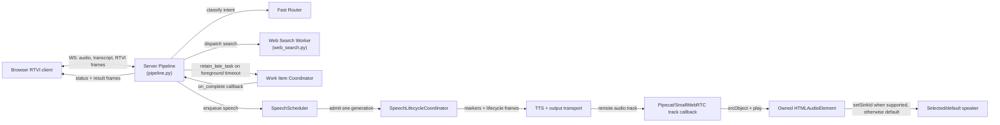
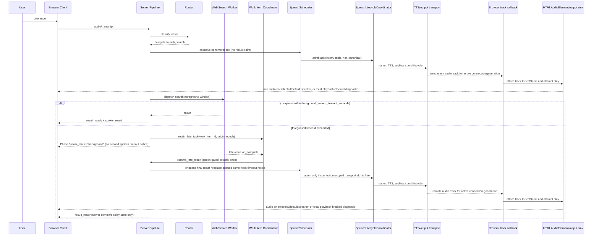

# Task: v0.1.3 — Early Acknowledgement and Background-Delivery Policy

**Status**: Not Started
**Component**: Pipecat subagents
**Assigned to**: Unassigned
**Priority**: High
**Branch**: feature/early-ack-background-delivery-v0.1.3 (create after PR #3 and PR #4 merge to `main`)
**Created**: 2026-07-28
**Review Gates**: full

## Objective

Ship a deterministic, sub-timeout acknowledgement the moment routing confirms a delegated search, then use v0.1.2's latency benchmark data to tune background-delivery policy (autoplay vs. display-only, cancellation/reconnect/newer-turn handling), expand RTVI status to coarse truthful progressive states, and — only if the data supports it — narrow the search worker's conversational context window.

## Context

v0.1.1 shipped the core background-delivery mechanism: late results are retained, committed exactly once, and queued for same-epoch speech (see the v0.1.1 entry in `CHANGELOG.md`'s history — its exact line numbers have since shifted; the invariant is independently verifiable via `SessionState`'s exactly-once commit and `WorkItemCoordinator`'s retention). It did not change when the user first hears anything — the current acknowledgement is still gated on the 15-second `foreground_search_timeout_seconds` timeout path in `server/pipeline.py`, so a user gets silence until either the search finishes or the foreground timeout fires a fixed "taking longer than expected" utterance. Phase 0 re-verifies the current symbols and records exact locations before implementation.

v0.1.2 is merged to `main` at PR #3 (`2951dd3`) and provides the performance-log contract and Pipecat observers (`server/perf_metrics.py`) needed to measure routing vs. search vs. delivery. PR #4 (`2dfe06c`, merged through `2a73a71`) adds the transport-aware speech lifecycle that now governs scheduler admission, timeout-notice supersession, and connection teardown. PR #5 (`ce14d37`, merged through `c5ac273`) adds the browser audio-sink owner, connection-generation cleanup, and the marker/flush frame bus exclusions that protect TTS routability. This plan depends on all three release boundaries because it touches the same server and browser seams; Phase 0 verifies their live ancestry and re-reads all line references before implementation.

Transport-aware speech ownership is specified separately in `docs/dev_plans/20260728-bug-transport-aware-speech-supersession.md`. That release-neutral precursor is now reviewed and merged; v0.1.3 must preserve its scheduler/transport invariant from Phase 1 onward. Queue-only discard is not sufficient once synthesized audio has entered the output transport.

This plan operationalizes four prior recommendations, in priority order: early acknowledgement (P0), background-delivery policy tuning (P1), progressive RTVI status (P1/P2), and query-context narrowing as a measured experiment (P2), gated on 0.1.2's data rather than assumed.

## Requirements

- Early acknowledgement must fire exactly once per delegated semantic turn across direct, pending-dialogue, and multi-intent paths — not on a timeout — and must not claim false progress (no "found it" before a result exists). It is an ephemeral speech item, not a `GroundedResult`, transcript entry, or result-history record.
- Background-delivery policy changes must preserve the existing invariants from 0.1.1: `SessionHost`/`SessionState` own idempotent late-result commit and epoch fencing, and the coordinator remains responsible for task ownership/cancellation. Phase 0 records the current call sites by symbol rather than relying on brittle line numbers.
- New RTVI status states must be truthful (reflect actual pipeline state, not simulated progress), have an explicit wire contract and legal transition rules, preserve their original `origin_epoch` across reconnect snapshots for the five-minute TTL, and must not introduce word-level progress — `shared/protocol.md:80` explicitly reserves that for a future Phase-3 extension.
- Query-context narrowing (`server/workers/web_search.py`, `_contextual_input`, `history[-4:]`) is not to be implemented speculatively — it requires a dated data-collection artifact with query/context dimensions, provider/model controls, and a defined latency/quality comparison. No change is a valid result.
- Any accepted TTS generation must have an end-to-end routability contract: the server may suppress only stale or unaccepted lifecycle frames; an accepted audio frame must reach the connection transport, the active browser track callback, the owned `HTMLAudioElement`, and the browser's selected/default output device. Server transport completion is not browser audibility.
- This plan does not start implementation until PR #3 (`2951dd3`), the PR #4 merge (`2a73a71`), and the PR #5 merge (`ce14d37`) are ancestors of both `main` and the implementation `HEAD`; Files-to-Modify symbol references below must be re-verified against that merged state before Phase 1 begins.

## Architecture & Call Flow

This plan touches 4 independently-executing components: the browser RTVI client, the server pipeline (router + turn orchestration), the web-search worker (coordinated via `WorkItemCoordinator`), and the connection-scoped speech/transport lifecycle.

| Step | Trigger | Enters context | Cleared/persisted | Turn boundary |
|---|---|---|---|---|
| Early ack emission | Router confirms delegated search | ephemeral ack item (`ack_id`, turn/work identity) | dropped, admitted, or completed; never canonical | same turn |
| Foreground search window | Worker dispatched | search execution state, `origin_epoch` | cleared on completion or timeout | same turn |
| Retain late task | Foreground timeout exceeded | `work_item_id`, `origin_epoch` in coordinator | persisted until complete/cancelled | crosses turn boundary |
| Commit late result | Worker completes after timeout | late result payload | delivered exactly once, then cleared | may land in a later turn; epoch-gated |
| Progressive status frames | Each state transition (routing/searching/background/result_ready) | capability-gated RTVI status kind | latest keyed status retained for snapshot TTL | same turn per frame |

The early acknowledgement is a logical delegation-confirmed operation shared by all delegated paths. It schedules an ephemeral item through the connection's `SpeechScheduler`; it never enters canonical result state. Status messages are server-authored and flow through the existing session-state/observer boundary as the strict `work_status` contract described below. Speech admission and transport completion remain owned by the merged connection-scoped `SpeechLifecycleCoordinator`; v0.1.3 must reuse that boundary rather than create parallel lifecycle state.

## Implementation Checklist

### Phase 0: Prerequisite — merge gate and re-verification
**Impl files:** `server/perf_metrics.py`, `tests/test_perf_metrics.py`, `tests/test_v013_perf_scenarios.py` (evidence-contract preparation only; no runtime behavior change)
**Test files:** `tests/test_speech_lifecycle.py`, `tests/test_pipeline.py`, `tests/test_speech_scheduler.py`, `tests/test_app.py`, `tests/test_config.py`, `tests/test_perf_metrics.py`, `tests/test_v013_perf_scenarios.py`, `web/test/app.test.js`, `web/test/protocol.test.js`
**Test command (0A, run first — instrumentation/fixture commit):** `uv run pytest tests/test_perf_metrics.py tests/test_v013_perf_scenarios.py -k 'schema or fixture' -v` (this is what lands `tests/test_v013_perf_scenarios.py`; it must exist before the 0B command below can run).
**Test command (0B, run after 0A lands — ancestry/lifecycle gate + full artifact collection):** `git merge-base --is-ancestor 2951dd3 main && git merge-base --is-ancestor 2a73a71 main && git merge-base --is-ancestor ce14d37 main && git merge-base --is-ancestor 2951dd3 HEAD && git merge-base --is-ancestor 2a73a71 HEAD && git merge-base --is-ancestor ce14d37 HEAD && uv run pytest tests/test_speech_lifecycle.py tests/test_pipeline.py tests/test_speech_scheduler.py tests/test_app.py tests/test_config.py tests/test_perf_metrics.py tests/test_v013_perf_scenarios.py -v && (cd web && bun test app.test.js protocol.test.js)`
**Goal:** Confirm all three merged release boundaries, prepare the credential-free evidence schema/fixture, and verify the transport-aware lifecycle and browser-media contracts before 0.1.3 behavior changes begin; re-verify all Files-to-Modify symbols against the verified checkout.

- Confirm PR #3 (`2951dd3`), the PR #4 merge (`2a73a71`, containing the transport lifecycle fixes through `2dfe06c`), and the PR #5 merge (`ce14d37`, containing the browser audio-sink/generation fixes through `c5ac273`) are ancestors of both `main` and `HEAD`; record the verified base/branch commit in the dated Phase 0 artifact and do not begin Phase 1 against a branch that lacks any boundary.
- Re-run the transport precursor's focused lifecycle, app-wiring, configuration, pipeline, and scheduler tests plus the merged PR #5 browser tests. The gate must cover marker-before-TTS ordering, marker/flush exclusion from the worker bus, synthesis-end non-terminal behavior, stale-frame suppression, provider-error attribution, queued-vs-admitted notice behavior, teardown completion before next admission, remote-track attachment, speaker-sink failure handling, and connection-generation cleanup.
- Re-run `rg -n "foreground_search_timeout_seconds|retain_late_task|history\[-4:\]" server/` against the verified checkout and record symbol/file matches in the Phase 0 artifact; do not preserve stale line references in this plan.
- Produce the credential-free Phase 0 artifact with `uv run pytest tests/test_v013_perf_scenarios.py -v`; it must cover direct, delegated-complete, retained-late, cancellation, reconnect, and same-epoch newer-turn fixtures and validate scenario, turn/work-item ID, provider/model (or `unavailable`), query/context lengths, outcome, disposition, and sample count. A paid-provider supplement may use `uv run python scripts/smoke_conversation.py --query 'What is the latest stable Pipecat release?' --timeout 120`, but missing credentials/provider availability records `blocked` or `not-run` and does not fail the credential-free gate. Store dated JSONL/summary output under `docs/benchmarks/`; preserve pre-precursor data only as a baseline.
- Verify whether 0.1.2 emits safe `query_chars`, `context_chars`, provider/model, acknowledgement, scenario, delivery-disposition, and routing-phase-latency dimensions (the last needed to evaluate Phase 1's conditional pre-routing-marker bullet). If not, Phase 0A adds those fields and tests before collection; Phase 4 remains blocked until the schema-valid artifact exists. Record the observed schema and minimum sample requirement in the artifact.
- Phase 0A is an explicit instrumentation/fixture commit and gate: land the metric fields, schema validator, and deterministic scenario fixture first; then run the ancestry/lifecycle gate and collect the Phase 0 artifact. Phase 1 cannot start until the Phase 0A commit and artifact validation pass.

### Phase 1: Early acknowledgement (P0)
**Impl files:** `server/pipeline.py`, `server/speech_scheduler.py`, `server/perf_metrics.py`, `server/config.py`, `server/app.py` (adds the `enable_early_ack` kill switch)
**Test files:** `tests/test_pipeline.py`, `tests/test_speech_scheduler.py`, `tests/test_speech_lifecycle.py`, `tests/test_app.py`, `tests/test_config.py`, `tests/test_perf_metrics.py`
**Test command:** `uv run pytest tests/test_pipeline.py tests/test_speech_scheduler.py tests/test_speech_lifecycle.py tests/test_app.py tests/test_config.py tests/test_perf_metrics.py -v`
**Goal:** Replace timeout-gated silence with a deterministic ack emitted the instant routing confirms delegation, without claiming progress that hasn't happened.

- Add a shared delegation-confirmed operation with semantic-turn/work-item identity and invoke it from direct, pending-dialogue, and multi-intent delegated paths (the latter currently branch at `_handle_pending`/`_handle_multi_intent`). Define one ephemeral ack per semantic turn, including mixed multi-intent turns: emit one parent ack when at least one child is delegated, never one ack per child, and do not ack a turn containing only direct/unsupported/clarification work. Enforce this with a turn-scoped acknowledgement latch in `SessionHost`: invoke it immediately after the first eligible multi-intent child decision, carry the parent turn identity, and make subsequent eligible children no-ops for acknowledgement emission. Clear the latch in the turn's normal completion/cancellation/failure cleanup; do not retain an unbounded process-lifetime set. This latch is the single enforcement mechanism for the exactly-once invariant — it must land in this phase, not be deferred or duplicated by a later phase.
- Disambiguate route names in the implementation matrix: this plan's “direct” means a direct web-search delegation (`existing_worker`/`new_worker`), not `RoutingDecision.action=direct`, which is the non-delegated main-responder path and remains ack-free. Pending continuation is eligible only after it confirms delegated search; a mixed multi-intent turn gets one parent ack when any child is eligible.
- Schedule the ack through a scheduler/lifecycle-internal ephemeral type with a distinct identity (`turn_id`, optional parent `work_item_id`, `ack_id`). It must be interruptible, must not create canonical result/transcript/history state, and must be dropped atomically via an explicit `discard_queued_ack(ack_id)` operation if the real result is ready before admission; an admitted ack may finish but never blocks a result from being committed. Concretely: extend `SpeechItem` (`server/speech_scheduler.py`) with `role="ack"`, `ack_id: str | None`, and `result_id: str | None` (result items require `result_id`; ack items require `ack_id` and no `result_id`); maintain an explicit `ack_id` index to the same `work_item_id`-keyed queues `SpeechScheduler` already uses for results; and make every `speech_progress` call site role-conditional, including enqueue, admission, interruption, cancellation, pause/resume, reconnect, provider failure, and terminalization. Ack items are wire-invisible in `speech_progress` and remain server-log/observability-only, keyed by `ack_id`. `discard_queued_ack(ack_id)` removes only that still-queued ack and atomically clears the index; it must not affect admitted speech or another queued item. This does not create result-oriented `speech_progress` and does not introduce a parallel lifecycle pipe.
- Define the no-TTS case explicitly: retain the internal ack transition and ack identity for observability, but do not synthesize or fabricate an audio acknowledgement. `work_status_v1` gates the Phase 3 wire status only; it does not gate the internal ack or its TTS/media route when TTS is available.
- Define acknowledgement timing as the first scheduler enqueue after an observable delegation-confirmed event and record `ack_enqueued` with `ack_id`, turn/work identity, and monotonic timestamp; the acknowledgement must be queued before the configured foreground timeout, subject to transport availability. This timing claim does not claim browser audibility; the end-to-end media route is covered by the Phase 2 routability gate below.
- Add a test matrix for exactly-once delegated acknowledgement, no acknowledgement for direct/unsupported/clarification/rejected routes, no false result claim, interruption, cancellation, reconnect, and result-ready-before-ack.
- Add explicit timing tests with deterministic barriers/fake clock, including result completion before ack enqueue, queued-ack discard, admitted-ack completion, and same-parent multi-intent identity.
- Add the `enable_early_ack` kill switch (`server/config.py`, wired in `server/app.py`), defaulting on. When disabled, this phase's entire ack path (delegation-confirmed ack scheduling, `discard_queued_ack`, and ack media output) must not fire, reproducing pre-v0.1.3 timeout-gated behavior exactly. Add a flag-off regression test asserting no ack is scheduled or routed and the existing timeout notice behavior is unchanged.
- Close this phase with a dated Phase 1 evidence artifact: re-run `tests/test_v013_perf_scenarios.py` with ack-path scenarios included (`ack_enqueued` timing, exactly-once/discard/admitted-completion cases) and store a dated JSONL/summary under `docs/benchmarks/` alongside Phase 0's artifact. This is the artifact Phase 2's entry gate below requires.
- Preserve the merged control-ack lifecycle: pause/cancel/stop disposition is recorded before interruption, control acknowledgements cannot reuse the interrupted transport generation, and explicit resume or a newly accepted turn waits for the stop or teardown barrier before scheduling speech. Cover applied and unknown-target control requests.
- If 0.1.2 data (from Phase 0) shows routing itself is a significant latency contributor — defined as routing-phase median latency exceeding 15% of the `foreground_search_timeout_seconds` budget — add an internal-only pre-routing `working` marker or fast classification path — it must not become a client-visible status until Phase 3 extends the wire enum. This requires a routing-phase timing dimension in the Phase 0 evidence schema (see Phase 0's schema-verification bullet); without it, this conditional cannot be evaluated and defaults to "no change".
- Phase 1 has no capability handshake yet (that lands in Phase 3), so foreground-timeout handling in this phase is capability-blind: every client retains the legacy timeout notice on foreground-timeout, defined separately for single, pending, and multi-intent work items. The merged PR's queued timeout-notice supersession remains required for these notice paths and must not interrupt an already-admitted notice. Test the no-duplicate behavior when the early ack is queued, active, or already complete.

### Phase 2: Background-delivery policy tuning (P1)
**Impl files:** `server/pipeline.py`, `server/speech_scheduler.py`, `server/speech_lifecycle.py`, `server/app.py`, `server/config.py`, `web/src/app.js`, `shared/protocol.md` (amend the autoplay rule described below in the same commit as the policy change)
**Test files:** `tests/test_pipeline.py`, `tests/test_work_item_coordinator.py`, `tests/test_speech_scheduler.py`, `tests/test_speech_lifecycle.py`, `tests/test_app.py`, `tests/test_config.py`, `tests/integration/test_browser_session.py`, `web/test/app.test.js`
**Test command:** `uv run pytest tests/test_pipeline.py tests/test_work_item_coordinator.py tests/test_speech_scheduler.py tests/test_speech_lifecycle.py tests/test_app.py tests/test_config.py tests/integration/test_browser_session.py -v && (cd web && bun test app.test.js)
**Goal:** Tune autoplay-vs-display-only policy for late results only after a schema-valid Phase 0/Phase 1 evidence artifact exists, without breaking the existing exactly-once/epoch-gated commit invariant. If the artifact is absent or blocked, retain the deterministic display-only fallback and do not claim a data-driven tuning result.

- Add an immutable `LateDeliveryContext` containing semantic turn, work item, origin epoch, acknowledgement timestamp/sequence, and the latest accepted same-epoch turn sequence. Default to closure capture: `retain_late_task`'s `on_complete` is already a caller-supplied closure (`server/work_item_coordinator.py:282-288`, invoked directly at `:357`), so the pipeline captures the immutable context in that closure rather than threading it through the coordinator's callback signature — this avoids adding `LateDeliveryContext` transport to `WorkItemCoordinator`'s contract. Only change the coordinator's callback boundary if Phase 0 investigation demonstrates closure capture cannot work. The policy evaluator runs after idempotent commit and before speech scheduling, and duplicate/cancelled completion paths release the context exactly once.
- Reuse the merged ownership boundary: `SpeechLifecycleCoordinator` owns admitted generations and one transport slot per connection-scoped output lane (global within that lane, released only by same-lane transport stop or completed connection-lane teardown), timers, tombstones, teardown barriers, and exactly-once speech terminalization; `SpeechScheduler` owns only per-work queues/selection; `WorkItemCoordinator` owns retained-task cancellation/completion callbacks; `SessionHost` (policy evaluator) and `SessionState` (canonical commit/projection) own result disposition without conflating those roles.
- Preserve the transport invariants: synthesis/TTS end is non-terminal; only normal transport stop or completed output teardown releases the lane; stale marker/context frames cannot bind to a replacement generation; reconnect creates a fresh lane and old-lane speech cannot be admitted. An acknowledged no-audio/flush path may release a generation only after the merged `SpeechGenerationFlushAckFrame` contract says no output remains; it must not be treated as synthesis completion.
- Apply the accepted deterministic policy: commit every valid late result exactly once; autoplay only when the originating epoch is active, no newer semantic turn has been accepted, the work is not cancelled, and the user has not explicitly paused or stopped output. Otherwise commit the result display-only. Cancellation before callback, while queued, or while admitted suppresses/reclassifies speech delivery but does not suppress a valid canonical commit; stale, invalid, and duplicate results are not committed. Refactor the current cancellation-before-commit branch into an explicit commit-once outcome before delivery disposition. Do not introduce an arbitrary elapsed-time threshold in v0.1.3. This adds predicates (newer-accepted-turn, explicit-pause/stop) beyond `shared/protocol.md:150-154`'s narrower current autoplay rule — amend that section in `shared/protocol.md` in the same commit (see impl files above) so the spec and runtime never diverge.
- Add the `enable_autoplay_policy` kill switch (`server/config.py`, wired in `server/app.py`), defaulting on. When disabled, skip the new policy predicates and preserve the pre-v0.1.3 late-result behavior for a valid result on its still-active originating connection: commit once and enqueue/start speech. This is the strict rollback path; the display-only fallback applies only when the policy is enabled but its predicates or evidence gate reject autoplay. Add a flag-off regression test.
- Consume the reviewed transport-aware invariant from `docs/dev_plans/20260728-bug-transport-aware-speech-supersession.md`: supersede a timeout notice when its retained final result becomes ready while the notice is still work-queued behind a transport-active generation. Do not interrupt a notice that occupies the connection-scoped transport slot, and do not discard any other work item's queued speech. After pause or barge-in cleanup, do not auto-admit pre-existing queued speech; only explicit resume or a newly accepted turn may open admission.
- Verify cancellation, reconnect (`interrupted_by_reconnect` in `shared/protocol.md`), and newer-turn arrival correctly suppress or supersede pending late-result delivery — extend existing epoch/turn fencing rather than introducing a parallel mechanism. Capture the host-owned accepted-turn sequence at callback registration and compare it at callback delivery; define the increment point as acceptance of a new semantic turn by `SessionHost`.
- Test the cancellation matrix explicitly: before callback = commit display-only/no speech; queued = commit display-only and remove only that work item's queued speech; admitted = commit display-only and let transport lifecycle finish unless an explicit stop interrupts it; stale/invalid/duplicate = no commit. Test the same matrix for no-TTS and reconnect.
- Add the media routability gate: for an accepted generation, verify marker binding, accepted `TTSStartedFrame`/`TTSAudioRawFrame`/`TTSStoppedFrame`, forwarding through `transport.output()`, delivery to the active browser track callback, attachment to the owned `HTMLAudioElement.srcObject`, and an attempted `audio.play()`. Stale or rejected generations must not reach transport or the browser element.
- Make browser output ownership explicit: one connection-generation-fenced audio element owns the remote track; disconnect, failed reconnect, and replacement connection clear the old `srcObject`, ignore late callbacks, and attach only the new generation's track. When speaker selection is supported, the same owner applies `setSinkId` only after success; otherwise playback uses the browser default device. Test track replacement, stale `onTrackStopped`, `play()` rejection, sink-switch failure, and reconnect cleanup.
- **Named assumptions requiring verification before finalizing the above test matrix (add as an early Phase 2 spike, record findings in the Phase 0 artifact):** (a) PR #5's `createAudioSink` is the sole browser output owner: verify `setSinkId` support detection, the success-promise commit point, reset-on-disconnect, and rejection behavior against the landed `main` implementation and pinned browser behavior; do not introduce a second sink owner. (b) Verify `@pipecat-ai/small-webrtc-transport`'s track-callback semantics on disconnect/reconnect — whether stale `onTrackStopped` callbacks are identifiable, whether a replacement connection yields a distinguishable new track object, and whether callback ordering permits generation-fencing. Read the pinned transport package's source/docs for its track-callback lifecycle contract and record the confirmed behavior before finalizing the fencing test matrix; do not assume the contract beyond PR #5's tests and the live transport behavior.
- Add a deterministic same-epoch newer-turn test: register callback at sequence `n`, accept sequence `n+1`, deliver the callback, and assert exactly-once display-only commit with no autoplay.
- Consume the Phase 1 turn-level acknowledgement latch's identity (parent `turn_id`) in `LateDeliveryContext`; Phase 2 does not re-implement or duplicate the latch.
- Keep commit ownership in `SessionHost`/`SessionState`; the coordinator only owns task retention/cancellation and callback delivery. Assert exactly-once commit separately from autoplay/display-only disposition.

### Phase 3: Progressive RTVI status (P1/P2)
**Impl files:** `shared/protocol.md`, `shared/schemas/rtvi-message.json`, `shared/schemas/snapshot-handshake.json`, `shared/schemas/work-status.json`, `shared/schemas/runtime-snapshot.json`, `server/contracts.py`, `server/app.py`, `server/session_state.py`, `server/observers.py`, `server/rtvi_messages.py`, `server/pipeline.py`, `web/src/app.js`, `web/src/protocol.js`, `web/src/state.js`, `web/src/render.js`
**Test files:** `tests/test_app.py`, `tests/test_contracts.py`, `tests/test_rtvi_messages.py`, `tests/test_session_state.py`, `tests/test_work_status.py`, `tests/integration/test_browser_session.py`, `web/test/protocol.test.js`, `web/test/state.test.js`, `web/test/render.test.js`, `web/test/app.test.js`
**Test command:** `uv run pytest tests/test_app.py tests/test_rtvi_messages.py tests/test_session_state.py tests/test_work_status.py tests/test_contracts.py tests/integration/test_browser_session.py -v && (cd web && bun test && bun run lint)`
**Goal:** Add coarse, truthful status states (`routing`, `searching`, `background`, `result_ready`, `failed`, `cancelled`) to the RTVI contract without introducing word-level progress.

- Implement the accepted capability-gated `work_status` contract in this order: (1) server accepts an optional `capabilities` array in snapshot handshake/session discovery and stores it on the connection with absent/unknown = unsupported; (2) browser advertises `work_status_v1`; (3) observer subscription captures capabilities; (4) only capable connections receive incremental status and status snapshot projection. Preserve existing result/control frames and retain the legacy timeout notice for unsupported clients during rollout. Define the handshake schema, capability name, timing, and legacy-client behavior in the versioned contract.
- Once the handshake above lands, extend Phase 1's capability-blind foreground-timeout handling: capable clients advertising `work_status_v1` switch to status-only handling — retain the work item and emit the `background` wire event instead of a second canonical timeout result or transcript/history entry — while unsupported clients keep the Phase 1 legacy timeout notice. Define this separately for single, pending, and multi-intent work items, and re-run Phase 1's queued/active/complete no-duplicate matrix against both capability branches now that real negotiation exists.
- **Contract-versioning decision (required before touching `shared/schemas/rtvi-message.json`):** all touched wire schemas are strict (`additionalProperties: false`, closed `kind` enum, `contract_version: {"const": "v1.0"}`), and `shared/protocol.md`'s v1.0 kind list is closed by name. Extend v1.0 in place by adding `work_status` to the closed kind list as a capability-conditional kind (legacy/non-advertising clients simply never receive it and the browser's existing unknown-kind-drop behavior at `web/src/protocol.js:131` is not relied upon as the safety net) — do not mint v1.1 or introduce dual-accept, since that would require also versioning every other v1.0 kind. State this rule explicitly in the schema/protocol.md update. Add a test asserting a legacy (non-advertising) client's snapshot validates with zero `work_status` frames.
- Add `tests/test_contracts.py` cases for the new handshake `capabilities` field itself — absent, empty, unknown-entry, and malformed `capabilities` arrays — asserting the existing strict-validation behavior (`shared/protocol.md:12`, "JSON objects reject unknown fields") holds for the new optional field in both directions.
- Add the `enable_background_status` kill switch (`server/config.py`, wired in `server/app.py`), defaulting on. When disabled, no `work_status` frames are emitted regardless of client capability, and the Phase 1 legacy timeout notice applies universally, reproducing pre-Phase-3 behavior. Add a flag-off regression test. Add one combined test exercising the documented rollback order (disable `enable_background_status` first, then `enable_autoplay_policy`, then `enable_early_ack`) and asserting each preceding phase's disabled-switch path remains operational at every step; add a matching Acceptance Criteria bullet.
- Define `WorkStatusKey = (origin_epoch, turn_id, work_item_id-or-parent)` and make the `SessionState` work-status ledger allocate `event_sequence` per key while `_emit()` owns the global state sequence. This per-`WorkStatusKey` `event_sequence` is independent of the reserved `WorkItemEvent.event_sequence` seam (`shared/protocol.md:109-115`, states `started`/`progress`/`cancelled`/`completed`/`failed`) — the reservation stands unchanged and this plan does not consume or extend it. The connection observer projects only events the client is entitled to see, maintains a projected monotonic sequence, and does not treat invisible events as gaps; `snapshot_sequence` remains the global watermark. Parent statuses summarize children; child statuses never overwrite the parent ledger. Reducers reject stale/duplicate sequences and terminal states never regress. Parent aggregation is: `routing`/`searching` while any child is active; `background` when no child is active and at least one remains retained; `result_ready` when all children succeed; `failed` when all children are terminal and any failed; `cancelled` when all children are cancelled. Terminal records preserve their original `origin_epoch` and remain in capable-client snapshots for a fixed 5-minute session-clock TTL, then the ledger prunes them.
- **Reconciling two existing invariants with cross-epoch terminal-status preservation:** keep the RTVI envelope and the top-level `RuntimeSnapshot.origin_epoch` equal to the current connection epoch; only embedded terminal `work_status` records inside that snapshot may retain their historical `origin_epoch`. Do not relax `RuntimeObserver.frame()`/`messages()` (`server/observers.py:57-68`) or permit historical incremental events: those paths remain strictly epoch-fenced. Instead, assemble the entitled historical terminal records in the explicit snapshot projection, and validate that projection separately. Add tests for: a post-reconnect old-epoch terminal status reaching a capable client's snapshot; a snapshot containing mixed-epoch terminal statuses validating correctly; and confirmation that non-status kinds and incremental status events remain strictly epoch-fenced.
- Define legal transitions: `routing -> searching`; `searching -> background|result_ready|failed|cancelled`; `background -> result_ready|failed|cancelled`; `result_ready|failed|cancelled` are terminal. A no-TTS result may still reach `result_ready`; that state describes canonical commit, not audio.
- Define `result_ready` as “the canonical result is committed and display-ready”; it does not claim that speech is queued, delivered, audible, or complete. The latest status for each `turn_id`/`work_item_id` is included in reconnect snapshots, and stale or duplicate events cannot regress a higher `event_sequence`.
- Wire emission through the existing `SessionState._emit()` → `RuntimeObserver` → RTVI frame boundary; do not introduce a parallel status pipe or emit raw `WorkItemEvent` as an undocumented RTVI kind.
- Update Python and browser validators/reducers/rendering for the chosen contract. Test valid/invalid transitions, fast success without `background`, duplicate/stale transitions, overlapping turns, mixed multi-intent parent aggregation, out-of-order child completion, TTL expiry, reconnect snapshots preserving old `origin_epoch`, capability-supported/unsupported/absent clients, unknown fields/kinds, invalid sequence/epoch relationships, projected sequence monotonicity, and terminal-state non-regression. Reject word-level-progress fields and kinds.
- Separate credential-free contract/browser tests from optional live local-media and paid-provider acceptance; record live-session evidence only when the required environment is available.
- The credential-free browser/media route is mandatory with fake transport tracks and a fake audio element. Optional live local-media and paid-provider acceptance remains separate evidence and is not required for the deterministic route gate.

### Phase 4: Query-context narrowing experiment (P2, conditional)
**Impl files:** `server/perf_metrics.py` (instrumentation only if absent), `server/workers/web_search.py` (conditional narrowing), `scripts/collect_query_context_latency.py` (new collector, exports the JSONL Phase 4B consumes), `scripts/analyze_query_context_latency.py` (new analysis artifact)
**Test files:** `tests/test_perf_metrics.py`, `tests/test_web_search_worker.py`, `tests/test_pipeline.py`
**Test command:** `uv run pytest tests/test_perf_metrics.py tests/test_web_search_worker.py tests/test_pipeline.py tests/test_query_context_latency.py -k 'web_search or context or query or analysis' -v`
**Goal:** Only narrow `_contextual_input`'s `history[-4:]` window if 0.1.2 data shows context size correlates with search latency after controlling for provider variance — this phase may resolve to "no change" and that is a valid outcome.

- Check whether 0.1.2's `perf_metrics.py` already records `query_chars`, `context_chars`, and provider/model dimensions; if not, add instrumentation and stop before narrowing.
- Collect a dated, minimum-size sample with a single provider/model or an explicit provider/model stratification. Keep transcript and prompt content out of logs; only safe lengths and identifiers are recorded. The sample validator must fail on missing dimensions, mixed provider/model strata without controls, or fewer than the declared minimum per comparison cell. A missing paid sample produces a blocked/not-run artifact rather than fabricated evidence.
- Use a fixed versioned multi-turn fixture with expected answer facts and citations. Score quality deterministically as `(required_facts_present + valid_citations - disallowed_claims) / (required_facts + expected_citations)`, clamped to `[0,1]`, with quality floor `0.90`. Require at least 30 samples per provider/model/context cell; promote only when median latency improves by at least 10% and a 10,000-resample bootstrap with seed 0 has a 95% lower bound of at least 5%, while no quality cell falls below 0.90 or drops by more than 0.02 from baseline. Record the score, thresholds, bootstrap result, and sample counts in JSONL; otherwise record "not promoted — data did not support it".
- **Named assumptions this promotion rule depends on, each requiring a Phase 4A pre-step before the thresholds above are treated as meaningful:** (a) live search-provider responses are stable/machine-checkable enough that the quality score measures the context-window effect rather than provider run-to-run variance — the existing `_response_citations` extractor (`server/workers/web_search.py:233-260`) is an explicitly heuristic tree-walk over an undocumented response shape, so this is not yet verified; measure baseline variance (same query/context, N repeats) first and record it alongside the promotion result. (b) the un-narrowed baseline configuration already scores >= 0.90 on the fixture — record baseline quality in Phase 4A before evaluating any narrowed cell, and if baseline is < 0.90, halt with an explicit "baseline below quality floor" outcome rather than letting the rubric silently predetermine "not promoted". (c) paid-provider quota/cost/rate limits permit >= 30 samples per cell — an undersized (partially collected) run resolves to the same `blocked`/`not-run` artifact as a fully missing one, not a lowered threshold.
- Split this phase into 4A instrumentation/collection and 4B analysis/experiment. 4A command: `uv run pytest tests/test_query_context_latency.py -k 'schema or fixture' -v` plus `uv run python scripts/collect_query_context_latency.py --output docs/benchmarks/v0.1.3-query-context.jsonl` (new script — transforms `perf_metrics.py` logs into the schema-valid JSONL Phase 4B consumes; covered by `tests/test_query_context_latency.py`); 4B command: `uv run python scripts/analyze_query_context_latency.py --input docs/benchmarks/v0.1.3-query-context.jsonl --output docs/benchmarks/v0.1.3-query-context-analysis.json`. 4B is blocked until 4A produces a schema-valid artifact, and analyzer tests cover missing dimensions, undersized cells, mixed strata, threshold boundaries, and deterministic not-promoted output.
- If and only if the evidence supports it, reduce `history[-4:]` or the 1200-character truncation, then re-run the same latency and quality comparison with the same fixture and controls.

### New files to create

- `shared/schemas/work-status.json` — strict payload schema and capability-gated `work_status` kind.
- `tests/test_work_status.py` — Python state machine, identity, sequence, snapshot, and transition tests.
- `scripts/collect_query_context_latency.py` — Phase 4A collector: transforms `perf_metrics.py` logs into the schema-valid `docs/benchmarks/v0.1.3-query-context.jsonl` artifact Phase 4B consumes.
- `scripts/analyze_query_context_latency.py` — deterministic, credential-free JSONL validator/analyser with explicit promotion thresholds.
- `tests/test_v013_perf_scenarios.py` — deterministic credential-free lifecycle/performance scenario fixture harness used by the Phase 0 evidence command.
- `tests/test_query_context_latency.py` — Phase 4A schema, fixture, and analyzer rejection/promotion-boundary tests.
- `docs/benchmarks/v0.1.3-phase0-transport-baseline.jsonl` — dated Phase 0 scenario output and schema summary.
- `docs/benchmarks/v0.1.3-query-context.jsonl` and `docs/benchmarks/v0.1.3-query-context-analysis.json` — generated artifacts, only when Phase 4A/4B evidence is collected; do not commit secrets or transcript content.

## Technical Specifications

### Files to Modify
- `server/pipeline.py` — shared delegation-confirmed ack, late-result policy, delivery metadata, and status emission points. Symbol references and call sites **must be re-verified post-merge (Phase 0).**
- `server/speech_scheduler.py` — ephemeral acknowledgement scheduling, interruption, drop-if-result-ready, and non-canonical delivery identity.
- `server/speech_lifecycle.py` — merged prerequisite owning speech-generation admission, transport slot, timers, tombstones, teardown barriers, and terminalization; preserve this ownership in Phase 1/2.
- `server/app.py`, `server/config.py` — merged lifecycle wiring and `speech_start_timeout_seconds`/`speech_transport_grace_seconds` configuration; compatibility surfaces, not parallel policy owners.
- `server/work_item_coordinator.py` — no change expected by default (`LateDeliveryContext` is closure-captured by the pipeline, not threaded through the coordinator); only touch this file if Phase 0 shows closure capture cannot work. Task ownership/cancellation remains its responsibility, not commit ownership.
- `server/session_state.py`, `server/observers.py` — authoritative status projection and existing incremental RTVI emission boundary (Phase 3).
- `tests/test_contracts.py` — already exists on the current branch; extend it with schema/capability compatibility tests, including unsupported-client behavior and the new `capabilities` handshake field validation (Phase 3). Do not overwrite existing contract tests.
- `server/contracts.py`, `server/app.py`, `server/observers.py`, `server/rtvi_messages.py`, `shared/schemas/rtvi-message.json`, `shared/schemas/snapshot-handshake.json`, `shared/schemas/work-status.json`, `shared/schemas/runtime-snapshot.json` — strict `work_status` contract, capability negotiation, and snapshot projection (Phase 3).
- `web/src/app.js`, `web/src/protocol.js`, `web/src/state.js`, `web/src/render.js` — browser capability advertisement, validation, transition reducer, and status rendering (Phase 3).
- `server/workers/web_search.py` — `_contextual_input` and context-window narrowing only if Phase 4 evidence supports it.
- `server/perf_metrics.py`, `scripts/analyze_query_context_latency.py` — safe query/context dimensions and reproducible conditional analysis (Phase 4).
- `tests/` and `web/test/` — named contract, scheduler, lifecycle, reducer, rendering, and analysis tests from the phase contracts.
- `CHANGELOG.md`, `pyproject.toml` — version bump to 0.1.3 on completion.

### Integration Seams
- The shared delegation-confirmed operation is called by direct, pending-dialogue, and multi-intent paths. It creates one ephemeral ack per semantic turn and hands it to `SpeechScheduler`; it does not call canonical-result commit.
- The ack and status paths share the semantic turn/work-item identity but have separate state machines: ack speech is ephemeral delivery, while status is server-authored runtime projection.
- Media delivery is a separate connection-local path: `SpeechLifecycleCoordinator` owns server generation admission and terminalization; `transport.output()` owns server-to-client media production; the browser app owns the generation-fenced audio element and sink/playback attempt. No server status event claims that the browser played audio.
- Late-result delivery policy runs after idempotent `SessionHost`/`SessionState` commit and before speech scheduling. It consumes immutable delivery context and existing epoch fencing; it does not make the coordinator the commit owner.
- Phase 2 reuses the merged transport-aware boundary: per-work queues feed one `SpeechLifecycleCoordinator`-owned slot per connection-scoped output lane (global within that lane), released only by same-lane transport stop or completed connection-lane teardown; synthesis end does not clear that slot; final-result readiness can replace only a same-work-item timeout notice that remains work-queued behind the transport-active generation.
- A timeout notice already admitted to the transport is never interrupted by late-result readiness. Output teardown must complete before the old lane releases, and a fresh connection lane is the only place where replacement speech may be admitted after reconnect.
- The accepted late-result policy is a server delivery disposition only: with `enable_autoplay_policy` on, use `commit_and_autoplay` when all active-epoch/newer-turn/cancellation/pause predicates hold, meaning schedule server speech and let the browser attempt playback; otherwise use `commit_display_only`. With the switch off, preserve the pre-v0.1.3 active-origin enqueue/start behavior for rollback. Neither path claims browser audibility. Both paths commit a valid result exactly once. `SessionHost` evaluates disposition; `SessionState` performs the idempotent commit/projection.
- The lifecycle release invariant includes the merged `SpeechGenerationFlushAckFrame`: synthesis end alone is never release; normal transport stop, completed teardown, or a validated no-audio flush acknowledgement are the only release paths. Pause/barge-in cleanup never auto-admits older queued speech.
- Status emission uses the capability-aware `SessionState` ledger → `RuntimeObserver` → RTVI frame construction. The chosen payload/message kind, optional handshake capability, and snapshot projection must be updated in Python, JSON Schema, browser validation, reducer, snapshot, and tests as one contract change.
- Phase 0 live samples precede any Phase 4 narrowing decision; the accepted Phase 2 policy has no elapsed-time threshold. Phase 4 may be marked "not promoted — data did not support it" with its analysis artifact.
- Rollout safety: `enable_early_ack`, `enable_background_status`, and `enable_autoplay_policy` are independent kill switches. Disable status first for rollback, then autoplay policy, then early ack; unsupported clients always retain the legacy timeout notice. Each phase must leave the preceding disabled-switch path operational.

### Architecture Decisions

- **Late-result delivery:** Always commit a valid late result exactly once. With `enable_autoplay_policy` enabled, autoplay only when the originating epoch is still active, no newer semantic turn has been accepted, the work is not cancelled, and the user has not explicitly paused or stopped output; otherwise deliver display-only. With the switch disabled, preserve the pre-v0.1.3 active-origin enqueue/start behavior for rollback; neither path claims browser audibility.
- **Foreground timeout after early ack:** For `work_status_v1` clients the timeout is status-only; it retains the delegated work and emits truthful `background` status without creating or speaking a second canonical timeout result or transcript/history entry. Unsupported clients retain the legacy timeout notice during rollout. Legacy/pre-ack timeout notices remain selectively supersedable while queued, but an admitted notice is never interrupted.
- **Status wire contract:** Progressive state uses a capability-gated strict `work_status` RTVI kind with `turn_id`, nullable `work_item_id`/`worker_id`, a state enum, per-entity `event_sequence`, and `origin_epoch`. The optional snapshot-handshake capability is `work_status_v1`; absent/unknown means unsupported. `WorkStatusKey`, parent aggregation, legal transitions, terminal precedence, five-minute snapshot TTL, and unsupported-client behavior are normative. Latest eligible statuses appear in runtime snapshots. `result_ready` means the canonical result is committed and display-ready, not that speech has been queued, delivered, or heard.

## Testing Notes

- Phase 0 must leave a dated, credential-safe ancestry/test/metrics artifact. Phase 1 must pass its expanded focused command plus the Phase 0 gate after the status-independent ack changes. Phase 3 must run the exact Python and Bun command above, including `tests/test_work_status.py` and `tests/test_contracts.py`.
- Phase 4A validates the JSONL schema, minimum samples, safe dimensions, and provider/model controls. Phase 4B runs the analysis script against a fixed fixture and records thresholds and a deterministic promoted/not-promoted result.
- The lifecycle matrix must include queued, admitted, synthesis-ended, normal-stop, teardown-complete, flush-ack/no-audio, pause, barge-in, reconnect, and stale-frame cases.
- The routability matrix must include accepted audio reaching the transport and browser track callback; audio element attachment/play attempt; play rejection; stale/rejected audio suppression; track stop; failed reconnect; old-generation callback fencing; replacement-track attachment; and supported/unsupported speaker sink behavior. `delivery_completed` remains server transport completion, never proof of browser audibility.
- Release finalization is a separate post-Phase-4 task: update `CHANGELOG.md` and `pyproject.toml` for 0.1.3, recording the no-change/not-promoted outcome when applicable.
- Every phase has a reversible commit boundary and uses the kill switches above; rollback verification keeps legacy timeout behavior and old-client compatibility intact.

## Issues & Solutions

_To be filled during implementation._

## Acceptance Criteria

- [ ] Early ack fires exactly once per delegated semantic turn across direct, pending, and multi-intent paths; it is ephemeral, interruptible, non-canonical, and tested against non-delegated routes, cancellation, reconnect, and result-ready-before-ack.
- [ ] Background-delivery policy implements the accepted commit-and-autoplay/display-only matrix across newer turns, active speech, cancellation, reconnect, stale epoch, duplicate callback, and no-TTS; commit remains exactly once and epoch-gated.
- [ ] Every accepted TTS generation has a tested end-to-end route from lifecycle-approved audio through `transport.output()`, the active browser track callback, the generation-owned `HTMLAudioElement`, and attempted playback on the selected/default speaker; stale, rejected, disconnected, or failed-reconnect generations cannot attach audio.
- [ ] Transport-aware delivery preserves ownership and lifecycle invariants: synthesis end does not release the connection-scoped slot; validated no-audio flush acknowledgement is covered as a separate release path; queued same-work timeout notices can be superseded; admitted notices are not interrupted; unrelated queues remain unchanged; and pause/barge-in does not auto-admit older queued speech.
- [ ] Ownership boundaries remain explicit and tested: `SessionHost`/`SessionState` commit canonical results, `WorkItemCoordinator` retains/cancels work, `SpeechScheduler` owns per-work queues, and `SpeechLifecycleCoordinator` owns generation/transport admission and terminalization.
- [ ] After an early acknowledgement, capable clients receive status-only `background` state while unsupported clients retain the legacy timeout notice; neither path creates a duplicate canonical timeout result, and queued/active/completed races are covered.
- [ ] Existing pause/cancel/stop/resume and unknown-target control acknowledgements preserve the transport lifecycle ordering: disposition precedes interruption, no old generation is reused, and replacement speech waits for stop or teardown.
- [ ] The chosen capability-gated RTVI status contract defines handshake carrier/advertisement, payload identity, producer, entity-keyed sequence ownership, parent aggregation, legal transitions including fast success, terminal meaning, five-minute snapshot/reconnect TTL, unsupported-client behavior, Python/JSON/browser validation, reducer behavior, and rendering tests; word-level progress is rejected.
- [ ] Credential-free server and browser media-route tests pass; optional live local-media and paid-provider acceptance is reported separately and does not redefine server transport completion as browser audibility.
- [ ] Query-context narrowing is either implemented with reproducible latency and deterministic answer-quality evidence under provider/model controls, or explicitly marked "not promoted — data did not support it" with the analysis artifact; absent paid evidence is recorded as blocked/not-run.
- [ ] Each kill switch (`enable_early_ack`, `enable_background_status`, `enable_autoplay_policy`) has a flag-off regression test reproducing pre-phase behavior, and the documented rollback order (status, then autoplay, then ack) is covered by a test asserting each preceding disabled-switch path stays operational.
- [ ] The post-Phase-4 release task updates `CHANGELOG.md` and `pyproject.toml` to 0.1.3.
- [ ] Final CI-equivalent verification passes after release metadata changes: `uv run ruff format --check . && uv run ruff check . && uv run mypy && uv run pytest && (cd web && bun run build && bun test && bun run lint) && uv run python scripts/smoke_server.py`; repository secret scanning runs with the CI-pinned gitleaks command, and any paid-provider/live-media evidence is reported separately.

## Review Focus

- The shared delegation-confirmed ack must cover direct, pending-dialogue, and multi-intent paths exactly once without entering canonical result state.
- Epoch-gating and exactly-once commit invariants are owned by `SessionHost`/`SessionState`; coordinator task ownership must remain separate. Phase 0 records the concrete call sites by symbol.
- Late-delivery policy must be deterministic for same-epoch newer turns, active speech, cancellation, reconnect, stale epoch, duplicate callback, and missing TTS.
- RTVI protocol changes (Phase 3) must define the complete handshake/Python/JSON/browser contract and must not conflict with the reserved word-level-progress seam at `shared/protocol.md:80`.
- Phase 4 must show provider/model-controlled correlation evidence, answer-quality comparison, and reproducible analysis—or explicitly record that narrowing was not promoted.

## Final Results

_To be filled on completion._
