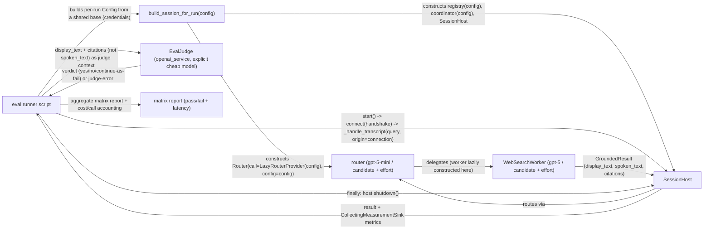

# Task: Reasoning-Effort Config Knob + Router/Worker Model Comparison Eval Suite

**Status**: Complete
**Component**: Pipecat subagents
**Assigned to**: Unassigned
**Priority**: Medium
**Branch**: feature/early-ack-background-delivery-v0.1.3
**Created**: 2026-08-17

## Objective

Give the router (`LazyRouterProvider`) and worker (`WebSearchWorker`) a configurable reasoning-effort knob — today the router hardcodes `reasoning.effort="minimal"` for any `gpt-5*` model and the worker never sets `reasoning` at all — then build a custom eval-suite runner that drives `SessionHost._handle_transcript()` directly (no live `pipecat eval` transport exists in this repo) to compare candidate OpenAI models/effort levels for both roles against the live paid provider, scoring semantic correctness via `pipecat.evals.judge.EvalJudge` and tracking per-run latency.

Candidate matrix (names as given by the user; **unverified** — `gpt-5.6-luna`/`gpt-5.6-terra`/`gpt-5.6-sol` appear nowhere in the codebase or in OpenAI's current public model list as of this plan's writing, so Phase 0 must confirm they're real, callable model IDs — and confirm the specific effort level each accepts, using production-equivalent request shapes — before running any paid comparison):
- Router: baseline `gpt-5-mini` (effort minimal, current) vs `gpt-5.6-luna` (effort high) vs `gpt-5.6-terra` (effort low)
- Worker: baseline `gpt-5` (no reasoning param, current) vs `gpt-5.6-terra` (effort medium) vs `gpt-5.6-sol` (effort low)

`reasoning.effort` values above are the four the user named; the OpenAI Responses API's `reasoning.effort` field is documented at https://platform.openai.com/docs/guides/reasoning as a `ReasoningEffort` enum that is broader than these four in the installed `openai` Python SDK (adds `none`, `xhigh`, `max` — see `.venv/lib/python3.12/site-packages/openai/types/shared/reasoning_effort.py`). Phase 1's config validation must accept the full documented enum, not hardcode only the four values named above.

## Context

This follows a round of live-smoke work on `feature/early-ack-background-delivery-v0.1.3` (see `20260728-feature-early-ack-background-delivery-v0.1.3.md`) where `scripts/smoke_conversation.py --ack-ordering`/`--routing-regression` were run live and hardened. A follow-up question ("what OpenAI model are we using for these tests?") led to a Codex consult on router/worker model choice, which recommended `gpt-5.6-terra` (router) and `gpt-5.6-sol` (worker) — the user wants to test that recommendation empirically, including at specific reasoning-effort levels, rather than take it on faith.

Investigation found Pipecat ships a real eval framework (`pipecat.evals` — scenario YAML, semantic LLM-judge assertions, latency budgets, `pipecat eval run`/`suite` CLI) but it requires the target agent to expose an **eval transport** (`bot.py -t eval`, RTVI-over-websocket) — `server/app.py` has no such entrypoint, only a `SmallWebRTCTransport`-based FastAPI app. Standing that up is a separate, larger integration (deferred; see Issues & Solutions). The user explicitly chose the lighter path: reuse `pipecat.evals.judge.EvalJudge` (confirmed transport-independent — works with any `LLMService`, one-shot `evaluate(criterion)`) inside a bespoke runner that calls `SessionHost._handle_transcript()` directly, the same pattern `scripts/smoke_conversation.py` already uses for its live scenarios.

Neither router nor worker currently exposes a reasoning-effort knob, so the comparison matrix as specified (`luna@high`, `terra@medium`, `terra@low`, `sol@low`) can't be run without a small config change first — that's Phase 1.

**Two independent reviews were run on this plan and folded into this revision:**
1. A Claude-side five-lens `/review-plan` pass (2026-08-17) found the runner's stated construction pattern couldn't vary the router's model/effort per run — fixed via an explicit per-run `Config` injection seam.
2. A Codex second-opinion review (2026-08-17/18) found that fix still didn't specify how to actually drive a turn (`_handle_transcript()` requires a live connection/handshake, not just a constructed host — the original draft never connected one, so it was a no-op), plus 12 High-severity gaps: Phase 0 has no enforceable artifact, the worker-model assertion has nothing to inspect at router-construction time (workers are lazily constructed post-routing), the routing-regression scenario is 3 turns not 2, the judge only scores the final reply in a multi-turn scenario, the citation criterion contradicts `spoken_text`'s no-citation-markers contract, judge-error classification is incomplete, provider failures aren't distinguished from semantic failures and cleanup isn't failure-safe, report-only latency budgets don't stop internal-timeout-induced fallbacks, there are no spend/rate-limit controls, and the credential path for the runner's per-run `Config` objects was never specified. All of these are addressed below.

## Requirements

- Router and worker reasoning effort must become configurable per model-policy label, without changing default behavior for existing callers. Current behavior is **model-conditional**, not unconditional: the router only sets `reasoning` `if model.startswith("gpt-5")` (`server/router.py:92-93`). The new default must preserve that conditional — an unconditional resolved `"minimal"` would send `reasoning` to a non-`gpt-5` model an operator overrode via `WEBSEARCH_ROUTER_MODEL`, which the current code never does and which the target model may reject. Concretely: the effort-policy default is unset/`None` for both roles; when unset, router falls back to today's `startswith("gpt-5")` conditional; an explicit override is applied unconditionally. An effort-policy lookup for a `model_policy` label that has no explicit effort entry must resolve to `None` (not raise), as long as the label itself is a valid, registered model-policy label — only a genuinely unknown model-policy label raises `ConfigError`. This matters because existing callers may configure custom worker model-policy labels beyond the built-in `"deep"`, and those must keep working with no `reasoning` key, unchanged, without needing a matching effort-policy entry.
- The eval runner must not require any change to `server/app.py` or a live transport — it drives `SessionHost` in-process. It reuses `scripts/smoke_conversation.py`'s pattern for actually driving a turn — `await host.start()`, then `connection = await host.connect({"session_id": host.state.session_id, "resume_token": host.state.resume_token, "proposed_epoch": 1, "snapshot_sequence": 0})`, then `await host._handle_transcript(query, origin=connection)` per turn, then `await host.shutdown()` in a `finally` block — because `_handle_transcript()` returns the input unchanged unless the host has an active connection whose identity and epoch match (`server/pipeline.py`); there is no shortcut that skips the connect/handshake step. It does **not** reuse `_run_child`'s post-hoc `host.config = tuned` idiom for varying the router (see Architecture & Call Flow "Injection seam" note — that idiom cannot vary the router's resolved model/effort because the router captures its `Config` reference at construction).
- Each eval run is a real, paid OpenAI call (router classification + potentially a worker web-search + a judge call). The runner must report the total call count, a worst-case call accounting (including the routing-regression scenario's 3 turns and the possibility of a worker call per weather turn), and a rough dollar-cost estimate before executing; it must support `--max-calls`/`--max-cost` flags that require explicit confirmation before exceeding them; and it must support running a single scenario/config pair (via explicit `--router`/`--worker`/`--scenario` selection flags) for a cheap smoke of the harness itself before a full matrix run.
- The default matrix is **not** the full (router × worker × scenario) cross product. It is baseline×baseline plus one-role-varied sweeps (vary router candidates against baseline worker; vary worker candidates against baseline router) — this is what "compare Codex's per-role recommendation" actually needs, and keeps the paid-call count and cost proportionate. The full cross product is available only behind an explicit `--full-matrix` flag.
- Judge model for `EvalJudge` must be explicit and cheap. `pipecat.evals.services.openai_service(config: dict)` (`.venv/lib/python3.12/site-packages/pipecat/evals/services.py:125-129`) is a factory function — call it as `openai_service({"model": "<cheap-model>"})` (e.g. `gpt-5-mini`) rather than relying on its own default (`gpt-4o`) or the library's Ollama default (`ollama_service`, used when no service is configured — no local Ollama is available in this repo). This service uses OpenAI's Chat Completions API, not the Responses API the router/worker use — the judge's credential and endpoint path is independent of the router/worker's.
- Candidate model IDs, **and the specific `reasoning.effort` value each candidate accepts together with the worker's `web_search` tool attached**, must be verified live before the paid comparison runs, using **production-equivalent request shapes** — model existence alone (`models.list`/`models.retrieve`) does not prove a given (model, effort, tools) combination is accepted by the API, and a probe with different kwargs than production (missing `text` structured-output format, `store=False`, `tool_choice`, `include`, instructions) does not prove production will accept it either. This verification is **Phase 0**, a gate that runs before Phase 1 implementation begins, covers every baseline **and** candidate tuple (not just the three new model IDs), separately verifies the judge's Chat Completions path, produces a **versioned machine-readable manifest** (model, effort, tools, exact request shape used, result, source revision, verification timestamp), and must fail loudly per-config — Phase 2 refuses to run any (model, effort) combination absent from, or stale relative to, that manifest.
- Latency tracking must reuse the existing `_latest_turn_stage_metrics`/`CollectingMeasurementSink` pattern from `scripts/smoke_conversation.py`, not a new metrics mechanism. Comparison latency budgets are **per-scenario defaults inherited from the existing smoke CLI** (`--max-routing-seconds 15`, `--max-latency-seconds 60` — see `scripts/smoke_conversation.py:500-501`) and are **report-only (non-blocking) for non-baseline candidates** for the purpose of pass/fail scoring: higher reasoning effort structurally increases latency, so a budget calibrated at the baseline's `effort="minimal"` is not a fair pass/fail gate for `effort="high"` candidates. This is distinct from the runner's **internal provider timeouts** (`router_timeout_seconds` default 12s, `foreground_search_timeout_seconds` default 15s — `server/config.py:73-76`), which are NOT report-only: each per-run `Config` must set these high enough (e.g. derived from `max_latency_seconds` with headroom) that a slow-but-successful high-effort candidate is not truncated into a safe-fallback response and then scored as a semantic failure for a timeout that was actually a config artifact. The runner reports measured provider timeout separately from measured latency. There is currently no budget flag for `search_ms`; the runner tracks it for reporting only, with no enforced threshold.
- Output must be a single aggregate report (pass/fail per semantic assertion, `judge-error`/`provider-error`/`timeout`/`setup-error` distinguished from a genuine semantic fail, and latency numbers, explicitly labeled with the per-cell repetition count — n=1 per cell in v1, called out as exploratory/noise-dominated given cost constraints) across the full model×effort×scenario matrix, not per-run scattered output.

## Architecture & Call Flow



**Injection seam (load-bearing — corrects the original draft, twice now).**

*Router config capture (Claude-review fix, retained).* `scripts/smoke_conversation.py`'s `_run_child` pattern builds a `SessionHost` via `_default_session_host()`, which internally calls `load_config()` from the environment (`server/app.py:654`) and constructs `LazyRouterProvider(config, ...)` (`app.py:657`); the router provider captures that `Config` reference at construction and resolves its model from it at call time (`server/router.py:84`: `self._config.resolve_router_model("fast")`). `_run_child`'s post-hoc reassignment (`host.config = tuned; host.registry.config = tuned; host.coordinator.config = tuned`, `scripts/smoke_conversation.py:86-88`) never touches the router provider's own `self._config` reference. The eval runner instead builds each run's `Router`/`LazyRouterProvider`/`WorkerRegistry` from an explicit, per-run `Config` at construction time — never via `_default_session_host()`.

*Credentials for per-run `Config` objects (Codex-review fix, new).* The runner is not credential-free just because it avoids `_default_session_host()`. It loads one **base** `Config` once via `load_config()` from the environment (for `openai_api_key`/`deepgram_api_key`/`cartesia_api_key` — the runner needs only the OpenAI key, since scenarios run with `host.stt = None`/`host.tts = None` disabled the same way `_run_child` disables them), then derives each per-run `Config` via `dataclasses.replace(base_config, router_model_policy=..., worker_model_policy=..., router_reasoning_effort_policy=..., worker_reasoning_effort_policy=..., router_timeout_seconds=..., foreground_search_timeout_seconds=...)`. Credentials are never printed, logged, or persisted in the report. A missing `OPENAI_API_KEY` must fail before any matrix cell runs, not surface as a confusing per-cell `provider-error`.

*Worker model/effort assertion has nothing to inspect at construction time (Codex-review fix, new).* `WorkerRegistry` starts with an empty `_workers` dict (`server/registry.py:67`) — the actual `WebSearchWorker` instance is constructed lazily, during `register()`, only after the router has routed a turn to `new_worker`/`existing_worker`. There is no worker object to assert against before the first routed call. The runner instead: (1) asserts the **router's** resolved model/effort immediately after constructing `LazyRouterProvider` (this can be checked pre-call, since the provider resolves model/effort from its captured `Config` deterministically); (2) after the first turn that routes to the worker, asserts the **constructed worker's** `model`/effort attributes (via `host.registry.workers[0].worker.model` and the resolved effort) match the run's candidate before any subsequent turn in the same scenario proceeds — if they don't match, abort the cell with a `setup-error`, not a silent fallthrough.

*Driving a turn requires a live connection (Codex-review fix, new — this was the Critical gap).* `_handle_transcript()` returns the input unchanged (a no-op) unless the host has an active connection whose identity and epoch match (`server/pipeline.py`) — a constructed-but-unstarted `SessionHost` cannot answer. Every matrix cell follows: `await host.start()` → `connection = await host.connect({"session_id": host.state.session_id, "resume_token": host.state.resume_token, "proposed_epoch": 1, "snapshot_sequence": 0})` → for each turn in the scenario, `await host._handle_transcript(turn.query, origin=connection)` → `await host.shutdown()` in a `finally` block so a mid-scenario exception still tears the host down. `host.stt = None`/`host.tts = None` before `start()`, matching `_run_child`'s pattern for non-speech scenarios.

The worker side does not have the router's config-capture defect: `registry.config` reassignment happens before lazy worker construction in `_run_child`'s pattern, so worker candidates would already vary correctly under it — but since the runner now builds its own `WorkerRegistry(config=per_run_config)` directly (for the credential/router-injection reasons above), this is moot; both router and worker are bound to the same per-run `Config` from construction.

```mermaid
sequenceDiagram
    participant R as eval runner
    participant B as build_session_for_run
    participant H as SessionHost
    participant Rt as Router
    participant W as WebSearchWorker
    participant J as EvalJudge

    loop for each (router_config, worker_config) pair in the default sweep set [baseline×baseline, router-candidates×baseline, baseline×worker-candidates] (or the full cross product under --full-matrix)
        loop for each scenario (ordered list of turns; routing-regression is the 3 turns in ROUTING_REGRESSION_QUERIES, not 2)
            R->>B: dataclasses.replace(base_config, router/worker model+effort, generous per-run timeouts)
            B->>Rt: construct Router(call=LazyRouterProvider(config), config=config)
            B->>H: construct fresh SessionHost + WorkerRegistry(config) + coordinator, all bound to this run's config
            R->>H: await host.start()
            R->>H: connection = await host.connect(handshake)
            R->>R: assert Router's resolved model/effort matches candidate (pre-call)
            loop for each turn in scenario
                R->>H: await host._handle_transcript(turn.query, origin=connection)
                H->>Rt: classify intent (real OpenAI call, production kwargs)
                Rt-->>H: route decision
                alt delegated
                    H->>W: web-search (real OpenAI call, production kwargs) -- worker constructed lazily here on first delegation
                    W-->>H: GroundedResult (display_text, spoken_text, citations)
                    R->>R: after first delegated turn, assert constructed worker's model/effort matches candidate; abort cell as setup-error on mismatch
                end
                H-->>R: result + turn_id (or a caught provider exception -> provider-error/timeout)
                R->>R: _latest_turn_stage_metrics(sink, elapsed_ms, turn_id)
                R->>J: add_user_message(turn.query) / add_assistant_message(result.display_text)
                opt turn has its own judge criterion (e.g. greeting turn, each weather turn)
                    R->>J: evaluate(turn.criterion) -- judged per-turn, since EvalJudge.evaluate() only scores the *most recent* reply
                    J-->>R: JudgeVerdict (yes/no/continue-as-fail) or judge-error (transport, empty, unparsable, or invalid verdict)
                end
                R->>R: deterministic citation-count assertion (citations non-empty) -- NOT a judge criterion, since spoken_text forbids citation markers/URLs
                R->>R: check latency budget (baseline: blocking; candidates: report-only), record pass/fail
            end
            R->>H: finally: await host.shutdown()
        end
    end
    R->>R: aggregate matrix report + total cost/call accounting
```

| Step | Trigger | Enters context | Cleared/persisted | Turn boundary |
|------|---------|-----------------|--------------------|-----------------|
| 1 | Runner starts a (router_config, worker_config, scenario) run | Per-run `Config` (derived from the base credential config via `dataclasses.replace`), scenario turn list/criteria | Persists for the run's duration | New turn boundary per (config, scenario) pair |
| 2 | `build_session_for_run` construction | Router/worker model+effort resolved from this run's `Config` at construction time — never from env `load_config()` inside `_default_session_host()` | Cleared when this run's `SessionHost`/registry/coordinator are torn down in a `finally: await host.shutdown()` at the end of the loop iteration | Same turn |
| 3 | `host.start()` / `host.connect(handshake)` | A live connection with a session ID, resume token, and epoch — required before any `_handle_transcript()` call can do anything but no-op | Cleared at `host.shutdown()` | Same turn |
| 4 | Router/worker real API calls, one call per turn, production-equivalent kwargs | Live OpenAI request/response, or a caught provider exception (`provider-error`/`timeout`) | Not persisted beyond the run's captured `GroundedResult`/metrics/error classification | Same turn |
| 5 | `EvalJudge.evaluate`, called once per turn that has its own criterion | That turn's full accumulated transcript (all turns' `display_text`, fed via `add_user_message`/`add_assistant_message`) fed as judge's `LLMContext`; `evaluate()` scores only the most recent reply, so a turn without its own criterion is context-only for a later turn's judgment | Judge's own context is disposable per-run (`EvalJudge` instantiated fresh per run, not reused) | Same turn |
| 6 | Runner aggregates | All prior runs' verdicts (including `judge-error`/`provider-error`/`timeout`/`setup-error`) + metrics + cost | Persists to the final report file | New turn boundary — report is a separate action after the full matrix completes |

## Implementation Checklist

### Phase 0: Candidate & Effort Verification Gate
**Impl files:** scripts/verify_eval_candidates.py (new — standalone verification script; not part of the application, but IS committed code so its manifest output is reproducible and reviewable)
**Test files:** none (this phase's correctness is judged by its live manifest output, not unit tests — see Validation cmd)
**Test command:** n/a
**Validation cmd:** `uv run python scripts/verify_eval_candidates.py --out .review-plan/eval-candidates-manifest.json` (probes every unique baseline+candidate (model, effort, tools) tuple named in the Objective's candidate matrix, plus the judge's Chat Completions path, with production-equivalent request shapes, and writes a versioned manifest)
**Goal:** Confirm every candidate model ID is real and callable, and confirm each candidate's specific `reasoning.effort` value is accepted together with the worker's real request shape (the `web_search` tool, `tool_choice="required"`, `include`, instructions, `store=False`) — not a stripped-down probe — before any implementation work depends on those assumptions. This gate produces a machine-readable artifact Phase 2 can consult and refuse to bypass.

- [ ] For each of `gpt-5.6-luna`, `gpt-5.6-terra`, `gpt-5.6-sol`, **and** the baselines `gpt-5-mini`/`gpt-5`: confirm existence via `models.retrieve` (or `models.list`).
- [ ] For each (model, effort) pair from the Objective's matrix — including the baselines at their current effort (`gpt-5-mini`@minimal, `gpt-5`@unset) — issue one minimal live call using the **same kwargs shape production uses**: for router candidates, the same `text` structured-output format and `store=False` the router sends (`server/router.py:85-94`); for worker candidates, the same `tool_choice="required"`, `include`, instructions, and `store=False` the worker sends (`server/workers/web_search.py:367-375`), with the `web_search` tool attached. Record accept/reject per (model, effort, tools) tuple.
- [ ] Separately verify the judge's path: construct `openai_service({"model": "<candidate cheap judge model>"})` and confirm a minimal Chat Completions call succeeds.
- [ ] Write a versioned manifest (JSON) recording, per tuple: model, effort, tools, exact request kwargs used, accept/reject result, the source commit this plan is being validated against, and a verification timestamp.
- [ ] If any model ID or (model, effort, tools) combination is rejected, stop and report it — do not proceed to Phase 1 assuming a substitute or a different effort level.
- [ ] Record the manifest path and a summary of confirmed model IDs/effort levels in this plan's Testing Notes before Phase 1 begins.

### Phase 1: Reasoning-effort config knob
**Impl files:** server/config.py, server/router.py, server/workers/web_search.py, server/registry.py
**Test files:** tests/test_config.py (existing — add cases here, do not create a new file), tests/test_registry.py (existing — add cases here), tests/test_router.py (existing — add a request-kwargs assertion for the new effort resolution path), tests/test_web_search_worker.py (existing — add a request-kwargs assertion for `reasoning` presence/absence)
**Test command:** `uv run pytest tests/ -k "config or router or registry or web_search" -q`
**Goal:** Router and worker reasoning effort become resolvable per model-policy label the same way models already are, with zero behavior change for existing callers who don't set an override — "zero behavior change" specifically means preserving the current *model-conditional* `startswith("gpt-5")` guard, not replacing it with an unconditional default, and it means a valid model-policy label with no matching effort entry resolves to `None` rather than raising.

- [ ] Add an effort-policy field, **appended after the existing diagnostic fields** (`deployed_at_utc` etc., at the end of the `Config` dataclass — not inserted alongside `router_model_policy`/`worker_model_policy`) so no positional caller's argument order silently shifts. Mirror the existing `Mapping[str, str]` shape and `resolve_router_model`/`resolve_worker_model` pattern at lines 184-194. Both router's `"fast"` label and worker's `"deep"` label default to unset/`None` (preserving current behavior for both). Validate any explicitly-configured effort value against the OpenAI SDK's full `ReasoningEffort` literal (`none`/`minimal`/`low`/`medium`/`high`/`xhigh`/`max`), not just the four values named in this plan's Objective.
- [ ] Add `resolve_router_reasoning_effort`/`resolve_worker_reasoning_effort` methods following the existing `resolve_*_model` pattern: raise `ConfigError` only if the `model_policy` label is not a registered label at all (i.e. not in `router_model_policy`/`worker_model_policy`); a registered label with no matching effort-policy entry returns `None`.
- [ ] Update `server/router.py`'s `LazyRouterProvider.__call__` (lines 83-94) to resolve effort via the new method: if the resolved effort is `None`, keep today's `if model.startswith("gpt-5"): kwargs["reasoning"] = {"effort": "minimal"}` conditional unchanged; if the resolved effort is explicitly set, apply it unconditionally (`kwargs["reasoning"] = {"effort": resolved}`) regardless of model name.
- [ ] Update `server/workers/web_search.py`'s request-kwargs construction (around line 368) to set `reasoning` only when the resolved effort is non-`None`, threading the resolved value through from wherever `WebSearchWorker` is constructed in `server/registry.py` (mirroring how `model`/`model_policy` already flow at registry.py:151,167). Add the new parameter as **keyword-only with a `None` default** on `WebSearchWorker.__init__` so existing direct-construction call sites (including in tests) remain valid without modification.
- [ ] Add env-var override support analogous to `WEBSEARCH_ROUTER_MODEL`/`WEBSEARCH_WORKER_MODEL` (`server/config.py:849,851` — note: not `WEBSEACH_*`, and not lines 798-801) for the new effort fields (e.g. `WEBSEARCH_ROUTER_REASONING_EFFORT`/`WEBSEARCH_WORKER_REASONING_EFFORT`), defining absent vs. empty vs. explicit `"none"` precedence consistent with the existing TOML → env-file → process-environment loading order (`server/config.py:707-735`). This is a convenience for manual testing and parity with the model-override pattern; Phase 2's runner constructs `Config` objects directly in-process via `dataclasses.replace` and does not depend on it.
- [ ] Unit tests: unknown model-policy label raises `ConfigError`; a registered label with no effort entry resolves to `None` (covering a custom worker model-policy label beyond `"deep"`); default behavior unchanged (router still gets `minimal` for `gpt-5*` and omits `reasoning` for non-`gpt-5*` models, worker still omits `reasoning`) when no override given; explicit override is honored unconditionally end-to-end through `resolve_*_reasoning_effort`, including for a non-`gpt-5` router model; effort value outside the SDK's documented literal raises `ConfigError`; a `Config()` constructed positionally with pre-existing field order still works (regression test for the append-only field placement).

### Phase 2: Eval-suite runner
**Impl files:** scripts/eval_model_comparison.py (new), scripts/_eval_common.py (new — shared `build_session_for_run`/metric helpers), scripts/smoke_conversation.py (modify — replace its local `_latest_turn_stage_metrics`/`CollectingMeasurementSink`-import definitions with a re-export from `scripts/_eval_common.py`, so `tests/test_smoke_conversation.py`'s existing `from scripts.smoke_conversation import ...` imports keep working unchanged), evals/__init__.py (new), evals/scenarios.py (new)
**Test files:** tests/test_eval_model_comparison.py (new, offline-only — mock the router/worker/judge, no live calls; also mock `host.start`/`host.connect`/`host.shutdown` so no real connection lifecycle is required for the matrix-building/budget/report unit tests)
**Test command:** `uv run pytest tests/test_eval_model_comparison.py tests/test_smoke_conversation.py -q`
**Validation cmd:** `uv run python scripts/eval_model_comparison.py --dry-run` (prints the full run matrix, total call count, worst-case call accounting, and a rough dollar-cost estimate without making any live calls)
**Goal:** A single command runs the default sweep matrix (or the full cross product under `--full-matrix`) against the live provider, refuses to run any (model, effort) combination Phase 0's manifest didn't confirm (or that manifest is stale relative to), drives each turn through a real connected `SessionHost`, and produces one aggregate pass/fail + latency report distinguishing semantic failure from infrastructure failure — no live call happens without the operator seeing the total call count, cost estimate, and (if `--max-calls`/`--max-cost` would be exceeded) an explicit confirmation prompt.

- [ ] Confirm Phase 0's manifest (`.review-plan/eval-candidates-manifest.json` or wherever it's checked in) exists and is not stale (source commit matches, or the runner warns and requires `--i-know-the-manifest-is-stale`) before Phase 2 begins; the runner refuses to run any (model, effort) combination absent from the manifest.
- [ ] Define 2 in-scope scenarios in `evals/scenarios.py` (a 3rd candidate — ack-ordering — is considered and explicitly excluded below, not defined), each as an **ordered list of turns** with **per-turn** judge criteria where applicable (not one criterion for the whole scenario): the default single-turn query; the routing-regression sequence reusing `ROUTING_REGRESSION_QUERIES` from `scripts/smoke_conversation.py` verbatim (`"Hi."`, `"Tell me the weather in Riga. For today."`, `"Could you tell me the weather in Helsinki today?"` — 3 turns, not 2) with a deterministic (non-judge) assertion on turn 1 (`action == "direct"`, no worker created) and a time-robust judge criterion on turns 2 and 3 (e.g. "response names a specific weather condition or temperature for the named city" rather than "gives the correct current weather"); the ack-ordering query is **excluded** from this semantic-comparison matrix — the existing `_run_ack_ordering` scenario requires TTS recording, scheduler admission, and lifecycle-driving assertions the generic sequential transcript loop above cannot reproduce, and it tests structural ack/result ordering, not model quality, so it stays out of scope here. Write the judge criteria verbatim into `evals/scenarios.py` — not left as a placeholder.
- [ ] Build `build_session_for_run(config)` in `scripts/_eval_common.py`: constructs `Router(call=LazyRouterProvider(config), config=config)`, a `WorkerRegistry(config=config)`, and a coordinator, all bound to the same per-run `Config` — never via `_default_session_host()`/env `load_config()` (see Architecture & Call Flow "Injection seam" note). Assert the constructed router's resolved model/effort matches the run's candidate before any paid call. Per-run `Config` objects are derived via `dataclasses.replace(base_config, ...)` from one base `Config` loaded once via `load_config()` for credentials, with `router_timeout_seconds`/`foreground_search_timeout_seconds` set generously (derived from the scenario's `max_latency_seconds`, not left at production defaults) so a slow-but-successful high-effort candidate isn't truncated into a safe fallback.
- [ ] Build the runner: for each (router_config, worker_config) pair in the default sweep set (baseline×baseline, router-candidates×baseline, baseline×worker-candidates — full cross product under `--full-matrix`) × each scenario: call `build_session_for_run`, `await host.start()`, `connection = await host.connect(handshake)`, then for every turn in the scenario in order `await host._handle_transcript(turn.query, origin=connection)`, capturing results via `CollectingMeasurementSink`/`_latest_turn_stage_metrics`. Wrap the whole cell in `try/finally: await host.shutdown()` so a mid-scenario exception still tears the host down and releases cached provider clients. Catch router/worker provider exceptions and classify as `provider-error`/`timeout` (distinct from `judge-error` and a semantic fail) rather than letting the host's safe-fallback conversion (`server/pipeline.py`) silently present them as an ordinary (bad) result.
- [ ] After the first turn in a scenario that delegates to the worker, assert the lazily-constructed worker's `model`/effort match the run's candidate (via `host.registry.workers[0].worker`); abort the cell as `setup-error` on mismatch rather than continuing with an unverified worker.
- [ ] Wire `EvalJudge`: construct a fresh judge per run backed by `pipecat.evals.services.openai_service({"model": "<cheap-model>"})` (e.g. `gpt-5-mini`) — never the library's Ollama default or `openai_service`'s own `gpt-4o` default. Feed each turn's query and **`result.display_text`** (not `spoken_text`, which by contract forbids URLs/citation markers/source lists — see `server/workers/web_search.py:192-200`) via `add_user_message`/`add_assistant_message` as the scenario progresses. Call `await evaluate(criterion)` once per turn that has its own criterion (immediately after that turn's messages are added — `EvalJudge.evaluate()` scores only the *most recent* reply, so a scenario-wide single evaluate-at-the-end call would silently ignore earlier turns' quality). Treat a `"continue"` verdict as fail. Classify as `judge-error` (not a semantic fail) any of: a raised exception, a verdict whose `reason` carries the "judge call failed" prefix (`pipecat/evals/judge.py:255-266`), an empty/malformed judge response, or a verdict value outside `{yes, no, continue}`.
- [ ] Separately, assert citations deterministically (not via the judge): `result.citations` is non-empty for any turn that delegated to the worker — this replaces an earlier draft's "judge criterion asks for a citation," which was incompatible with `spoken_text`'s no-citation-markers contract.
- [ ] Check latency budgets against captured `routing_ms`/`search_ms`/`total_ms`: enforce (blocking) only for the baseline config; report-only for all candidate configs. `search_ms` has no enforced budget in v1 (tracked/reported only). Report the per-run provider timeout (`router_timeout_seconds`/`foreground_search_timeout_seconds` actually used) alongside measured latency so a truncated-by-timeout result is visibly distinguishable from a genuinely fast/slow one.
- [ ] `--dry-run` flag: print the full matrix (config × scenario, with resolved model/effort), total call count with worst-case accounting (including retry/tool-call multiplicity where the worker's `tool_choice="required"` may itself invoke multiple search calls), and a rough dollar-cost estimate; make zero live calls. Add `--router`/`--worker`/`--scenario` selection flags so a single (config, scenario) pair can be run as a cheap smoke of the harness before a full matrix run. Add `--full-matrix` to opt into the full cross product instead of the default sweep set. Add `--max-calls`/`--max-cost`, prompting for explicit confirmation before a run that would exceed either.
- [ ] Aggregate report: one table (or JSON) covering every (config, scenario) run's per-turn judge verdicts (yes/no/judge-error), the deterministic citation assertion, `provider-error`/`timeout`/`setup-error` classification where applicable, and latency numbers (including the provider timeout actually used), explicitly labeled with the n=1-per-cell repetition count, written to a file plus printed summary.
- [ ] Offline unit tests for the runner's matrix-building (default sweep set vs `--full-matrix`), budget-checking (blocking-for-baseline vs report-only-for-candidates), report-aggregation logic, the dry-run zero-live-calls invariant (mock the OpenAI client / `SessionHost.start`/`connect`/`_handle_transcript` construction to raise if invoked under `--dry-run`, so a live call sneaking into dry-run fails CI), the `--max-calls`/`--max-cost` confirmation gate, and the manifest-staleness refusal path, with router/worker/judge/host mocked — no live calls in CI.

## Technical Specifications

### Files to Modify
- `server/config.py` — new effort-policy fields (appended at the end of the dataclass) + resolver methods (label-registered-but-no-effort-entry returns `None`), validated against the OpenAI SDK's full `ReasoningEffort` literal (Phase 1)
- `server/router.py` — resolve effort via the new method, preserving the model-conditional fallback when unset (Phase 1)
- `server/workers/web_search.py` — set `reasoning` only when resolved effort is non-`None`; new constructor param is keyword-only with a `None` default (Phase 1)
- `server/registry.py` — thread resolved worker effort through worker construction (Phase 1)
- `scripts/eval_model_comparison.py` (new) — the eval runner (Phase 2)
- `scripts/_eval_common.py` (new) — shared `build_session_for_run` + metric helpers (Phase 2)
- `scripts/smoke_conversation.py` (modify) — re-export the hoisted helpers from `scripts/_eval_common.py` so existing imports (including `tests/test_smoke_conversation.py`) keep working (Phase 2)
- `evals/__init__.py`, `evals/scenarios.py` (new) — scenario definitions with per-turn criteria (Phase 2)
- `scripts/verify_eval_candidates.py` (new) — Phase 0's manifest-producing verification script

### Integration Seams
- `Config.resolve_router_reasoning_effort`/`resolve_worker_reasoning_effort` — new seam Phase 2's runner depends on to build per-run `Config` objects; must exist and be stable before Phase 2 starts.
- `pipecat.evals.judge.EvalJudge`, backed by `pipecat.evals.services.openai_service({"model": "<cheap-model>"})` — external, already-installed (`pipecat-ai==1.6.0`) dependency; Phase 2 is the first in-repo call site. This service talks Chat Completions, independently of the router/worker's Responses-API credential path.
- `scripts/_eval_common.py`'s `build_session_for_run` — the injection seam that replaces `_default_session_host()`/env `load_config()` for this runner; see Architecture & Call Flow "Injection seam" note for why the `_run_child` pattern's post-hoc reassignment cannot be reused verbatim.
- `.review-plan/eval-candidates-manifest.json` (Phase 0's output) — Phase 2's runner reads and enforces against this manifest before spending any paid call on a given (model, effort, tools) combination.
- `scripts/_eval_common.py`'s hoisted `CollectingMeasurementSink`/`_latest_turn_stage_metrics` helpers, re-exported from `scripts/smoke_conversation.py` for backward compatibility with existing imports.

## Testing Notes

_Phase 0's confirmed candidate model IDs, effort levels, and the manifest path will be recorded here once that gate runs._

## Issues & Solutions

- **No live eval-transport entrypoint in `server/app.py`.** The stock `pipecat eval run`/`suite` CLI needs a `bot.py -t eval` websocket entrypoint this repo doesn't have. Deferred as a separate, larger integration; this plan uses a custom in-process runner against `SessionHost._handle_transcript()` instead, per explicit user choice.
- **`_run_child`'s construction pattern cannot vary the router's resolved model/effort.** Found during Claude-side `/review-plan` (2026-08-17): `_default_session_host()` loads `Config` from the environment and the router provider captures that reference at construction; post-hoc reassignment of `host.config` never reaches it. Resolved by having the Phase 2 runner construct `Router`/`LazyRouterProvider`/`WorkerRegistry` directly from an explicit per-run `Config`, never via `_default_session_host()`.
- **The runner's original draft never actually drove a turn.** Found during Codex second-opinion review (2026-08-17/18): `_handle_transcript()` is a no-op without a live, connected, epoch-matched connection; the original draft constructed a host and called `_handle_transcript()` directly with no `start()`/`connect()`. Resolved by adopting `scripts/smoke_conversation.py`'s exact `start() -> connect(handshake) -> _handle_transcript(..., origin=connection) -> finally shutdown()` sequence for every matrix cell.
- **Worker-model assertion had nothing to inspect at the time the plan originally proposed checking it.** Found during Codex review: `WorkerRegistry` starts empty; the worker is constructed lazily on first delegation. Resolved by asserting the router's resolved model/effort pre-call (checkable immediately) and the worker's resolved model/effort post-first-delegation (checkable only then), aborting as `setup-error` on mismatch.
- **Judge/citation/latency/credential/spend gaps.** Found during Codex review: judge only scores the most-recent reply (fixed by per-turn `evaluate()` calls), the citation criterion was incompatible with `spoken_text`'s contract (fixed by a deterministic citation-count assertion against `display_text`/`citations` instead), report-only latency budgets could still let internal provider timeouts truncate a candidate into a fallback (fixed by deriving generous per-run provider timeouts, reported separately from measured latency), the credential path for per-run `Config` objects was unspecified (fixed by a base credential `Config` + `dataclasses.replace` per cell), and there were no spend controls (fixed by `--max-calls`/`--max-cost` with confirmation).

## Acceptance Criteria

- [ ] Router and worker reasoning effort configurable via `Config`, appended at the end of the dataclass, default behavior unchanged (including the model-conditional fallback and the registered-label-with-no-effort-entry → `None` case) for existing callers, unit-tested including the non-`gpt-5`-override and custom-model-policy-label cases.
- [ ] Phase 0 has confirmed every candidate model ID and (model, effort, tools) combination live, using production-equivalent request shapes, and produced a versioned manifest, before Phase 1 implementation begins; results recorded in Testing Notes.
- [ ] `scripts/eval_model_comparison.py --dry-run` prints the full default-sweep matrix, worst-case call accounting, and a dollar-cost estimate with zero live calls; a mocked test asserts zero live calls under `--dry-run`.
- [ ] `scripts/eval_model_comparison.py --router X --worker Y --scenario N` runs a single cheap smoke pair, using the real `start -> connect -> _handle_transcript -> shutdown` lifecycle.
- [ ] `--max-calls`/`--max-cost` block a run that would exceed them without explicit confirmation.
- [ ] A full live matrix run (default sweep, or `--full-matrix`) produces one aggregate report (per-turn judge verdicts including `judge-error`, deterministic citation assertions, `provider-error`/`timeout`/`setup-error` classification, and latency per config×scenario, n=1 repetition labeled).
- [ ] `uv run pytest` passes; `ruff check`/`ruff format --check` clean on all touched files.

## Final Results

All 3 phases complete (`/conduct`, 2026-08-18):

- **Phase 0** (`d5ea38a`): `scripts/verify_eval_candidates.py` live-verified all 12 (model, effort, tools) tuples in the candidate matrix against the live paid OpenAI API using production-equivalent request shapes — 12/12 accepted, confirming `gpt-5.6-luna`/`gpt-5.6-terra`/`gpt-5.6-sol` are real, callable model IDs that accept their named effort levels. Manifest: `docs/dev_plans/artifacts/eval-candidates-manifest.json` (tracked).
- **Phase 1** (`f74a7d6`): Added `router_reasoning_effort_policy`/`worker_reasoning_effort_policy` to `Config`, `resolve_router_reasoning_effort`/`resolve_worker_reasoning_effort`, effort validated against the OpenAI SDK's full `ReasoningEffort` literal, `LazyRouterProvider`/`WebSearchWorker` wired through, `WEBSEARCH_ROUTER_REASONING_EFFORT`/`WEBSEARCH_WORKER_REASONING_EFFORT` env overrides. Zero behavior change confirmed; 235 tests pass.
- **Phase 2** (`d2a3f91`): `evals/scenarios.py`, `scripts/_eval_common.py`, `scripts/eval_model_comparison.py` — the eval-suite CLI runner (manifest gate, spend-confirmation gate, per-cell driver against `SessionHost._handle_transcript()`, judge scoring, aggregate `overall_status`/`failure_reasons` pass/fail report). 44 tests pass.

Bugs found and fixed during implementation (not just what was planned): a plan self-contradiction (Phase 2 scenario count), incomplete judge-error classification (2 of 3 pipecat `EvalJudge` infra-failure reason prefixes were unhandled), and the eval runner returning exit 0 unconditionally regardless of outcome. Full detail in `## Findings` above.

Deferred, not blocking: manifest staleness heuristic (has a working `--i-know-the-manifest-is-stale` override), 3 Minor findings from Phase 1 (env-var test coverage, effort-label cross-validation, README env-var docs) and Phase 2 (policy-dict replacement semantics, effort-display-vs-effective-value, truncated-cell status reporting) mid-phase reviewers.

Review gates (`/code-review`, Codex adversarial review, `/deep-review`, `/security-review`) not yet run — plan has no `**Review Gates:**` header so `/conduct` did not auto-chain them; run before merge.

<!-- reviewed: 2026-08-18 @ 07ef1ced3c347b8c3129c94c20be58d55d4414c2 -->

<!-- /review-plan writes the marker line above. Everything below is the workspace: edits here do NOT invalidate the marker. -->

## Progress

Per-phase completion tracked here so ticking a box during a run does not bust the review marker. `/conduct` reads this section to skip already-done phases.

- [x] Phase 0: Candidate & Effort Verification Gate
- [x] Phase 1: Reasoning-effort config knob
- [x] Phase 2: Eval-suite runner

## Findings

Durable notes that survive after the run: diagnostic query results, decision rationale, "checked / accepted behaviour" outcomes.

- 2026-08-17: Claude-side `/review-plan` five-lens pass — 30 findings (1 Critical structural: router config-capture defect), all addressed in-plan.
- 2026-08-18: Codex second-opinion review — 1 Critical (`_handle_transcript()` no-op without a connected host) + 12 High + 3 Medium + 2 Low findings, all addressed in-plan.
- 2026-08-18: Phase 0 complete (commit `d5ea38a`). `scripts/verify_eval_candidates.py` live-probed all 12 (model, effort, tools) tuples named in the Objective's candidate matrix, using production-equivalent request kwargs cross-checked against `server/router.py`/`server/workers/web_search.py` by an advisory mid-phase reviewer. **12/12 accepted** — `gpt-5.6-luna`@high, `gpt-5.6-terra`@low(router)/medium(worker), and `gpt-5.6-sol`@low are all real, callable model IDs that accept their named effort level with the `web_search` tool attached where applicable. Manifest: `docs/dev_plans/artifacts/eval-candidates-manifest.json` (tracked in git, not `.review-plan/` — the mid-phase reviewer caught that the original default path was gitignored, which would have made Phase 2's manifest-presence gate unsatisfiable on a fresh checkout). The reviewer also caught the script reading `OPENAI_API_KEY` directly from `os.environ` instead of going through `load_config()`'s TOML → env-file → process-env precedence and `WEBSEARCH_OPENAI_API_KEY` override — fixed before commit. Judge path (`gpt-5-mini` via `openai_service`) also confirmed live.
- 2026-08-18: Phase 1 complete (commit `f74a7d6`). Added `router_reasoning_effort_policy`/`worker_reasoning_effort_policy` to `Config` (appended after `deployed_at_utc`), `resolve_router_reasoning_effort`/`resolve_worker_reasoning_effort` (raise `ConfigError` only for an unregistered model-policy label, else `None`), effort validated against the OpenAI SDK's full `ReasoningEffort` literal, `LazyRouterProvider.__call__`'s `startswith("gpt-5")` conditional preserved verbatim when unset with override applied unconditionally otherwise, `WebSearchWorker`'s new `reasoning_effort` param keyword-only/`None`-default, `WEBSEARCH_ROUTER_REASONING_EFFORT`/`WEBSEARCH_WORKER_REASONING_EFFORT` env overrides. Mid-phase reviewer independently re-verified all five invariants against the actual code (not just green tests) — implementation sound, zero behavior change confirmed. `235 passed` (`uv run pytest tests/ -k "config or router or registry or web_search" -q`, 50.51s). 3 Minor findings logged, not blocking: (1) the two new env vars have no test coverage, and their `in values` presence-check (vs. the sibling `WEBSEARCH_*_MODEL` walrus pattern) means an empty-string override hard-errors rather than being treated as absent — intentional or not is unconfirmed; (2) effort-policy labels aren't cross-validated against registered model-policy labels, so a typo'd label (e.g. `"fastt"`) is silently accepted and never read; (3) README's env-var docs (`README.md:139`) weren't updated for the two new vars. Follow-up before merge, not before Phase 2.
- 2026-08-18: Phase 2 complete (commit `d2a3f91`). Built `evals/scenarios.py` (2 in-scope scenarios: `SINGLE_TURN_DEFAULT`, `ROUTING_REGRESSION`; a 3rd candidate — ack-ordering — considered and explicitly excluded), `scripts/_eval_common.py` (`build_session_for_run(config)`, binding Router/WorkerRegistry/coordinator/SessionHost to one per-run `Config` at construction time — required because `LazyRouterProvider` captures its own `Config` reference, so a post-hoc `host.config = tuned` reassignment cannot vary the resolved router model/effort), and `scripts/eval_model_comparison.py` (the CLI runner: manifest gate, `CallAccounting`/spend-confirmation gate, per-cell driver, report aggregation). Implementer and test-writer were spawned in parallel against the same not-yet-written interface; the test-writer's 32 initial failures were pre-implementation naming guesses (self-flagged in advance) — reconciled via a test-writer respawn against the already-verified implementer code (29/32 fixed that way) rather than the default fix-loop's implementer respawn, since the implementer's code was independently correct. Caught and fixed two real bugs along the way: (1) a plan self-contradiction (Phase 2 checklist said "3 scenarios", body described 2 in-scope + 1 excluded) — fixed above the marker, marker hash refreshed via `write-review-marker.py`; (2) incomplete judge-error classification — `run_cell()` only matched pipecat `EvalJudge`'s `"judge call failed"` infra-failure reason prefix, missing `"judge returned empty response"` (flagged by the test-writer's fix-loop pass, which correctly encoded the gap as `xfail(strict=True)` rather than weakening the assertion) and `"could not parse judge response"` (found independently by re-reading `EvalJudge._parse_verdict`'s fallback path) — both now covered via `_JUDGE_INFRA_ERROR_REASON_PREFIXES`. Mid-phase reviewer found 2 Important + 3 Minor: fixed the "always exits 0" Important finding directly (`main()` now computes an aggregate `overall_status`/`failure_reasons` via `compute_pass_fail()` and returns non-zero on any enforced-latency-budget breach, semantic judge/assertion failure, or infra failure — previously it returned 0 unconditionally regardless of outcome); deferred the manifest-staleness-heuristic Important finding (exact `source_commit` equality trips after every subsequent commit — already has a working `--i-know-the-manifest-is-stale` override, flagged independently by both Phase 0's and Phase 2's reviewers) and the 3 Minor findings (policy-dict wholesale replacement, effort-display-vs-effective-value, truncated-cell status reporting) to a future pass. `44 passed` (`uv run pytest tests/test_eval_model_comparison.py tests/test_smoke_conversation.py -q`, 1.73s). Also self-caught and self-corrected a commit-hygiene mistake mid-phase: a plain `git commit` for the plan-fix picked up Phase 2's still-staged implementation files from the shared git index; fixed via `git reset --soft` (verified nothing had been pushed beyond that point first) before any further commits landed. All 3 phases of the plan are now complete.
